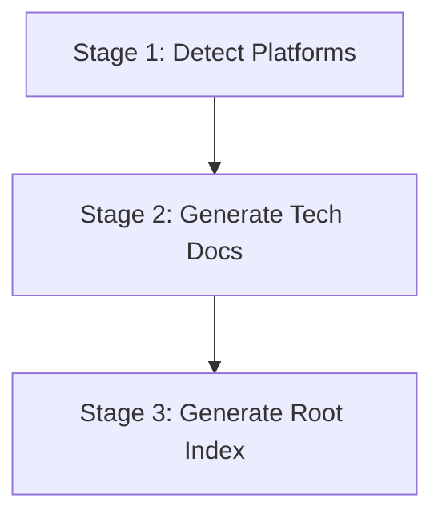

# Techs Knowledge Dispatch

Orchestrate **techs knowledge base generation** with a 3-stage pipeline: Platform Detection → Tech Doc Generation → Root Index.

## Language Adaptation

**CRITICAL**: All generated documents must match the user's language. Detect the language from the user's input and pass it to all downstream Worker Agents.

- User writes in 中文 → Generate Chinese documents, pass `language: "zh"` to workers
- User writes in English → Generate English documents, pass `language: "en"` to workers
- User writes in other languages → Use appropriate language code

**All downstream skills must receive the `language` parameter and generate content in that language only.**

## Trigger Scenarios

- "Initialize techs knowledge base"
- "Generate technology knowledge from source code"
- "Dispatch techs knowledge generation"

## User

Leader Agent (speccrew-team-leader)

## Platform Naming Convention

Read `speccrew-workspace/docs/configs/platform-mapping.json` for standardized platform mapping rules.

| Concept | techs-init (techs-manifest.json) | Example (UniApp) |
|---------|----------------------------------|------------------|
| **Category** | `platform_type` | `mobile` |
| **Technology** | `framework` | `uniapp` |
| **Identifier** | `platform_id` | `mobile-uniapp` |

## Input

| Variable | Description | Default |
|----------|-------------|---------|
| `source_path` | Source code root path | project root |
| `language` | User's language code (e.g., "zh", "en") | **REQUIRED** |

## Output

- Platform manifest: `speccrew-workspace/knowledges/base/sync-state/knowledge-techs/techs-manifest.json`
- Tech docs: `speccrew-workspace/knowledges/techs/{platform_id}/`
- Root index: `speccrew-workspace/knowledges/techs/INDEX.md`
- Status files: `speccrew-workspace/knowledges/base/sync-state/knowledge-techs/stage{N}-status.json`

## Workflow Overview



---

## Stage 1: Detect Platform Manifest (Single Task)

**Goal**: Scan source code and identify all technology platforms.

**Step 1a: Read Configuration**
- Read `speccrew-workspace/docs/configs/platform-mapping.json` for standardized platform mapping rules

**Step 1b: Invoke Worker**
- Invoke 1 Worker Agent (`speccrew-task-worker.md`) with skill `speccrew-knowledge-techs-init/SKILL.md`
- Task: Analyze project structure, detect technology platforms
- Parameters to pass to skill:
  - `source_path`: Source code directory path
  - `output_path`: Output directory (default: `speccrew-workspace/knowledges/base/sync-state/knowledge-techs/`)
  - `language`: User's language — **REQUIRED**

**Output**:
- `speccrew-workspace/knowledges/base/sync-state/knowledge-techs/techs-manifest.json`

See [templates/techs-manifest-EXAMPLE.json](templates/techs-manifest-EXAMPLE.json) for complete example.

See [Platform Status Tracking Fields](#platform-status-tracking-fields) for status field definitions.

---

## Stage 2: Generate Platform Documents (Parallel)

**Goal**: Generate technology documentation for each platform in parallel.

**Action**:
- Read `speccrew-workspace/knowledges/base/sync-state/knowledge-techs/techs-manifest.json`
- For each platform in `platforms` array, invoke 2 Worker Agents in PARALLEL:
  - Worker 1: `speccrew-knowledge-techs-generate-conventions/SKILL.md` (ALL platforms)
  - Worker 2: `speccrew-knowledge-techs-generate-ui-style/SKILL.md` (frontend platforms ONLY: web, mobile, desktop)
- Parameters to pass to each skill:
  - `platform_id`: Platform identifier from manifest
  - `platform_type`: Platform type (web, mobile, backend, desktop)
  - `framework`: Primary framework
  - `source_path`: Platform source directory
  - `config_files`: List of configuration file paths (conventions worker only)
  - `convention_files`: List of convention file paths (conventions worker only)
  - `output_path`: Output directory for platform docs (e.g., `speccrew-workspace/knowledges/techs/{platform_id}/`)
  - `completed_dir`: Directory for Worker output markers (e.g., `speccrew-workspace/knowledges/techs/.sync-status/`)
  - `language`: User's language — **REQUIRED**

When launching each platform Worker, the Workers will output:
- `{completed_dir}/{platform_id}.done-conventions.json` — conventions worker completion marker
- `{completed_dir}/{platform_id}.done-ui-style.json` — ui-style worker completion marker (frontend only)
- `{completed_dir}/{platform_id}.analysis-conventions.json` — conventions coverage report
- `{completed_dir}/{platform_id}.analysis-ui-style.json` — ui-style coverage report (frontend only)

**Step 2a: Prepare Environment and Update Manifest**

1. Ensure completed_dir exists: `speccrew-workspace/knowledges/techs/.sync-status/`
2. For each platform in manifest:
   - SET `platform.status = "processing"`
   - SET `platform.startedAt = "{current_timestamp}"`
   - SET `platform.workers.conventions.status = "processing"`
   - IF platform.platform_type IN ["web", "mobile", "desktop"]: SET `platform.workers.ui_style.status = "processing"`
   - WRITE manifest to techs-manifest.json

**Step 2b: Launch Conventions Worker (ALL Platforms)**

For each platform, invoke `speccrew-task-worker` with:
- skill_path: `speccrew-knowledge-techs-generate-conventions/SKILL.md`
- context:
  - platform_id: platform.platform_id
  - platform_type: platform.platform_type
  - framework: platform.framework
  - source_path: platform.source_path
  - config_files: platform.config_files
  - convention_files: platform.convention_files
  - output_path: `speccrew-workspace/knowledges/techs/{platform.platform_id}/`
  - completed_dir: completed_dir
  - language: language

**Step 2c: Launch UI-Style Worker (Frontend Platforms ONLY)**

IF platform.platform_type IN ["web", "mobile", "desktop"]:
1. Invoke `speccrew-task-worker` with:
   - skill_path: `speccrew-knowledge-techs-generate-ui-style/SKILL.md`
   - context:
     - platform_id: platform.platform_id
     - platform_type: platform.platform_type
     - framework: platform.framework
     - source_path: platform.source_path
     - output_path: `speccrew-workspace/knowledges/techs/{platform.platform_id}/`
     - completed_dir: completed_dir
     - language: language

**Step 2d: Wait for All Workers**
- WAIT_ALL workers complete
- Both workers run in PARALLEL for the same platform

### Worker Completion Marker (MANDATORY)

Each Worker MUST create a completion marker file after generating documents. See [Worker Completion Marker Format](#worker-completion-marker-format) for details.

- Conventions Worker: `{completed_dir}/{platform_id}.done-conventions.json`
- UI-Style Worker: `{completed_dir}/{platform_id}.done-ui-style.json` (frontend only)

**Status values**: `completed` | `failed`

**Output per Platform**:
```
speccrew-workspace/knowledges/techs/{platform_id}/
├── INDEX.md                    # Required
├── tech-stack.md              # Required
├── architecture.md            # Required
├── conventions-design.md      # Required
├── conventions-dev.md         # Required
├── conventions-unit-test.md        # Required
├── conventions-system-test.md      # Required
├── conventions-build.md       # Required
├── conventions-data.md        # Optional — platform-specific
└── ui-style/                  # Optional — frontend only (web/mobile/desktop)
    ├── ui-style-guide.md      # Generated by techs Stage 2
    ├── page-types/            # Populated by bizs pipeline Stage 3.5 (ui-style-extract)
    ├── components/            # Populated by bizs pipeline Stage 3.5 (ui-style-extract)
    ├── layouts/               # Populated by bizs pipeline Stage 3.5 (ui-style-extract)
    └── styles/                # Generated by techs Stage 2
```

**Cross-Pipeline Note for `ui-style/`**:
- `ui-style-guide.md` and `styles/` are generated by techs pipeline Stage 2 (technical framework-level style specs)
- `page-types/`, `components/`, and `layouts/` are populated by bizs pipeline Stage 3.5 (`speccrew-knowledge-bizs-ui-style-extract` skill), which aggregates patterns from analyzed feature documents
- These two sources are complementary: techs provides framework-level conventions, bizs adds real-page-derived design patterns
- If bizs pipeline has not been executed, these three subdirectories will be empty

**Optional file `conventions-data.md` rules**:

| Platform Type | Required? | Notes |
|----------|-----------|-------|
| `backend` | Required | ORM specs, data modeling, caching |
| `web` | Depends | Only if using ORM/data layer (Prisma, TypeORM, etc.) |
| `mobile` | Optional | Based on tech stack |
| `desktop` | Optional | Based on tech stack |

**Generation rules**:
1. `speccrew-knowledge-techs-generate` decides per platform whether `conventions-data.md` is needed
2. `speccrew-knowledge-techs-index` must check actual existing documents per platform and dynamically generate links

**Status Tracking**:
- **Get timestamp** using `speccrew-get-timestamp` skill
- **Generate `stage2-status.json`** at `speccrew-workspace/knowledges/base/sync-state/knowledge-techs/stage2-status.json`

**Stage 2 status tracks**:
- `total_platforms`, `completed`, `failed` counts
- Per-platform: `documents_generated` list

**Step 2e: Scan Completion Markers**

For each platform in the manifest:
1. Check for `{platform_id}.done-conventions.json` (REQUIRED for all platforms)
2. If platform_type IN ["web", "mobile", "desktop"], also check for `{platform_id}.done-ui-style.json`
3. A platform is "fully completed" only when ALL expected done files are present
4. If any expected done file is missing → mark platform as `failed` (Worker crashed without creating marker)

**Step 2f: Verify Document Output**

For each platform:
- **Conventions**: Check that INDEX.md, tech-stack.md, architecture.md, conventions-*.md exist
- **UI-Style** (frontend platforms only): Check that ui-style/ directory and required files exist
- If any required document is missing → downgrade status accordingly

**Step 2g: Read Coverage Reports**

For each platform:
1. Read `{platform_id}.analysis-conventions.json`
2. If frontend platform, also read `{platform_id}.analysis-ui-style.json`
3. Merge coverage data from both reports for manifest update

**Step 2h: Update Manifest Status**

Update `techs-manifest.json` for each platform:
- Set `status` based on worker results:
  - `"completed"` — ALL workers succeeded
  - `"partial"` — conventions succeeded but ui-style failed (frontend only)
  - `"failed"` — conventions worker failed
- Set `completedAt` to current timestamp
- Set `workers.conventions.status` from done-conventions.json
- Set `workers.ui_style.status` from done-ui-style.json (or `"skipped"` for backend platforms)
- Set `analysisLevel` based on:
  - `"full"` if coverage_percent >= 60 and all required docs exist
  - `"minimal"` if coverage_percent < 60 or some optional docs missing
  - `"reference_only"` if critical docs missing or Worker failed
- Set `topicsCoverage` from analysis-conventions.json coverage_percent

**Step 2i: Handle Failures**

For platforms with conventions worker `status: "failed"`:
- Mark platform as `failed`
- PRESERVE the done files and analysis files (do NOT delete them)
- Log a warning with the failure details
- The platform can be retried in a subsequent run by resetting its manifest status to `pending`

For frontend platforms with ui-style worker `status: "failed"` but conventions succeeded:
- Mark platform as `partial`
- Conventions docs are still usable
- Log a warning that UI-style analysis failed

---

## Stage 2.5: Quality Synchronization

**Trigger**: After ALL Stage 2 Workers have completed (all platforms processed)
**Purpose**: Verify cross-platform consistency and document completeness before indexing

**Steps**:

#### Step 1: Collect Worker Results
For each platform, verify the following required documents exist:
- INDEX.md
- tech-stack.md
- architecture.md
- conventions-design.md
- conventions-dev.md
- conventions-unit-test.md
- conventions-system-test.md
- conventions-build.md
- conventions-data.md (optional - only for backend or platforms with detected data layer)

#### Step 2: Document Completeness Check
For each platform directory at `speccrew-workspace/knowledges/techs/{platform_id}/`:
1. List all .md files present
2. Check against required document list
3. Record status per platform:
   - "complete": all 8 required documents present
   - "incomplete": one or more required documents missing (list which)
   - "failed": INDEX.md missing (platform will be skipped in Stage 3)

#### Step 3: Language Consistency Spot-Check
Read the first 5 lines of each platform's INDEX.md:
- Verify content language matches the `language` parameter
- If mismatch detected, log warning: "Platform {platform_id}: language mismatch detected"

#### Step 4: Source Traceability Spot-Check
For each platform, check ONE document (conventions-dev.md recommended):
- Verify it contains `<cite>` block near the top
- If missing, log warning: "Platform {platform_id}: source traceability missing in conventions-dev.md"

#### Step 5: UI Style Analysis Level Recording
For each frontend platform (platform_type = web/mobile/desktop):
- Check if `speccrew-workspace/knowledges/techs/{platform_id}/ui-style/ui-style-guide.md` exists
- If exists, read first 20 lines to detect analysis level:
  - Contains "Automated and manual UI analysis were not possible" → level = "reference_only"
  - Contains "manual source code inspection" → level = "minimal"
  - Otherwise → level = "full"
- Record per platform

### Enhanced Quality Checks (using analysis.json data)

In addition to the basic document existence and language checks above, Stage 2.5 MUST perform the following enhanced quality checks for each platform:

#### Check 4: Document Content Non-Empty Verification

For each generated .md file in the platform directory:
1. Count the number of lines in the file
2. If any document has fewer than 20 lines → flag as `content_warning`
3. Record the minimum line count across all documents as `min_doc_lines`

```
THRESHOLD: 20 lines minimum per document
SEVERITY: warning (does not block pipeline, but recorded in quality report)
```

#### Check 5: Topic Coverage Verification

Read `{completed_dir}/{platform_id}.analysis.json` (if it exists):
1. Extract `coverage_summary.coverage_percent`
2. If `coverage_percent` < 60 → flag as `coverage_warning`
3. Extract list of topics with `status: "not_found"` → record as `topics_missing`
4. If `coverage_percent` < 30 → flag as `coverage_critical` (pipeline should warn but continue)

```
THRESHOLD: 60% minimum topic coverage
SEVERITY: 
  - >= 60%: good
  - 30-59%: warning
  - < 30%: critical
```

#### Check 6: UI Style Completeness (Frontend Platforms Only, After UI-Style Worker)

For platforms with `platform_type` in ["web", "mobile", "desktop"]:
- ONLY check after ui-style Worker has completed
- Check that ALL 5 required ui-style files exist:
  - `ui-style/ui-style-guide.md`
  - `ui-style/page-types/page-type-summary.md`
  - `ui-style/components/component-library.md`
  - `ui-style/layouts/page-layouts.md`
  - `ui-style/styles/color-system.md`
- If any file is missing → flag as `ui_style_incomplete`
- Read the `ui_analysis_level` from done-ui-style.json to classify:
  - `full` — all 5 files present with substantial content
  - `minimal` — ui-style-guide.md present but subdirectories incomplete
  - `reference_only` — only reference documentation, no actual analysis

#### Check 7: Cross-Platform Comparison (when multiple frontend platforms exist)

If the manifest contains 2+ frontend platforms:
1. Compare their `coverage_percent` values
2. If the difference exceeds 30 percentage points → flag as `coverage_imbalance`
3. Compare their `documents_generated` lists
4. Report any platform that has significantly fewer documents than others

```
THRESHOLD: 30 percentage points maximum difference between frontend platforms
SEVERITY: warning
```

#### Check 8: Cross-Worker Completion Consistency

For each frontend platform:
- Verify both `{platform_id}.done-conventions.json` AND `{platform_id}.done-ui-style.json` exist
- Verify both workers report `status: "completed"`
- If one worker failed, mark platform quality as "warning" (conventions docs are still usable)

For each backend platform:
- Verify `{platform_id}.done-conventions.json` exists
- UI-style check is skipped (not applicable)

### Quality Classification

Based on the checks above, classify each platform's overall content quality:

| Classification | Criteria |
|---------------|----------|
| `good` | All docs exist, min_doc_lines >= 20, coverage_percent >= 60, ui_style complete (if frontend) |
| `warning` | Some docs below 20 lines OR coverage_percent 30-59% OR ui_style incomplete |
| `poor` | Any doc missing OR coverage_percent < 30% OR critical issues found |

#### Step 6: Generate stage2-status.json
Write to `speccrew-workspace/knowledges/base/sync-state/knowledge-techs/stage2-status.json`:
```json
{
  "generated_at": "{timestamp}",
  "stage": "platform-doc-generation",
  "total_platforms": {N},
  "completed": {count of complete platforms},
  "incomplete": {count of incomplete platforms},
  "failed": {count of failed platforms},
  "language": "{language}",
  "quality_checks": {
    "all_required_docs_present": {true/false},
    "language_consistent": {true/false},
    "traceability_verified": {true/false},
    "ui_analyzer_results": {
      "full": [{platform_ids}],
      "minimal": [{platform_ids}],
      "reference_only": [{platform_ids}],
      "not_applicable": [{platform_ids for backend}]
    }
  },
  "platforms": [
    {
      "platform_id": "{id}",
      "platform_type": "{platform_type}",
      "framework": "{framework}",
      "status": "complete | incomplete | failed",
      "content_quality": "good | warning | poor",
      "documents_generated": ["INDEX.md", "tech-stack.md", ...],
      "documents_missing": [],
      "ui_style_level": "full | minimal | reference_only | not_applicable",
      "ui_style_complete": true | false,
      "ui_analysis_level": "full | minimal | reference_only | none",
      "topics_coverage": 0-100,
      "topics_missing": ["topic1", "topic2"],
      "min_doc_lines": 45,
      "checks": {
        "doc_existence": "pass | warning | fail",
        "language_check": "pass | warning | fail",
        "source_traceability": "pass | warning | fail",
        "content_non_empty": "pass | warning | fail",
        "topic_coverage": "pass | warning | fail",
        "ui_style_completeness": "pass | warning | fail"
      },
      "output_path": "speccrew-workspace/knowledges/techs/{platform_id}/"
    }
  ],
  "cross_platform_checks": {
    "coverage_imbalance": true | false,
    "max_coverage_diff": 31,
    "details": "web-vue (83%) vs mobile-uniapp (52%) - difference exceeds 30% threshold"
  },
  "overall_quality": "good | warning | poor",
  "summary": "2 platforms analyzed. 1 good, 1 warning. mobile-uniapp needs attention: low topic coverage and incomplete ui-style."
}
```

#### Decision Point
- If ANY platform has status "failed" (no INDEX.md): log error but continue to Stage 3 (Stage 3 will skip those platforms)
- If ALL platforms failed: ABORT pipeline, report error
- Otherwise: proceed to Stage 3

---

## Stage 3: Generate Root Index (Single Task)

**Goal**: Generate root INDEX.md aggregating all platform documentation.

**Prerequisite**: All Stage 2 tasks completed.

**Action**:
- Read `speccrew-workspace/knowledges/base/sync-state/knowledge-techs/techs-manifest.json`
- Invoke 1 Worker Agent (`speccrew-task-worker.md`) with skill `speccrew-knowledge-techs-index/SKILL.md`
- Parameters to pass to skill:
  - `manifest_path`: Path to techs-manifest.json
  - `techs_base_path`: Base path for techs documentation (e.g., `speccrew-workspace/knowledges/techs/`)
  - `output_path`: Output path for root INDEX.md (e.g., `speccrew-workspace/knowledges/techs/`)
  - `language`: User's language — **REQUIRED**

**Critical Requirements for Techs Index Generation**:

1. **Dynamic Document Detection**: 
   - Must scan each platform directory to detect which documents actually exist
   - Do NOT assume all platforms have the same document set
   - `conventions-data.md` may not exist for all platforms

2. **Dynamic Link Generation**:
   - Only include links to documents that actually exist
   - For missing optional documents, either omit the link or mark as "N/A"

3. **Platform-Specific Document Recommendations**:
   - Adjust "Agent 重点文档" recommendations based on actual available documents

**Output**:
- `speccrew-workspace/knowledges/techs/INDEX.md` (complete with platform index and Agent mapping, dynamically generated)

**Status Tracking**:
- **Get timestamp** using `speccrew-get-timestamp` skill
- **Generate `stage3-status.json`** at `speccrew-workspace/knowledges/base/sync-state/knowledge-techs/stage3-status.json`

**Stage 3 status tracks**:
- `platforms_indexed` count
- `index_file` path

---

## Execution Flow

```
1. Run Stage 1 (Platform Detection)
   └─ Wait for completion

2. Run Stage 2 (Tech Doc Generation)
   ├─ Read techs-manifest.json
   ├─ Launch ALL platform Workers in parallel
   └─ Wait for ALL Workers → generate stage2-status.json

3. Run Stage 3 (Root Index)
   └─ Wait for completion → generate stage3-status.json
```

---

## Error Handling

### Error Handling Strategy

```
ON Worker Failure:
  1. Capture error message from worker_result.error
  2. Mark platform status as "failed" in stage2-status.json
  3. Record failed platform_id and error details
  4. Continue processing other platforms (no retry, fail fast)
  5. After all workers complete, evaluate overall status:
     - IF all platforms failed → ABORT pipeline
     - IF some platforms succeeded → CONTINUE to Stage 3 with successful platforms only
```

### Stage-Level Failure Handling

| Stage | Failure Handling |
|-------|-----------------|
| Stage 1 | Abort pipeline, report error |
| Stage 2 | Continue with successful platforms, report failed ones |
| Stage 3 | Abort if Stage 2 had critical failures |

### Worker Failure Details

**When a Worker Agent fails:**
- **No automatic retry**: Worker failures are recorded as-is
- **Partial success accepted**: Pipeline continues if at least one platform succeeds
- **Error propagation**: Failed platform details are included in stage2-status.json
- **Stage 3 decision**: Only platforms with status "complete" are included in root INDEX.md

---

## Checklist

- [ ] Stage 1: Platform manifest generated with techs-manifest.json
- [ ] Stage 2: All platforms processed in parallel
- [ ] Stage 2: `stage2-status.json` generated with all platform results
- [ ] Stage 3: Root INDEX.md generated with Agent mapping
- [ ] Stage 3: `stage3-status.json` generated with index info

### Document Completeness Verification
- [ ] Each platform directory contains required documents: INDEX.md, tech-stack.md, architecture.md, conventions-design.md, conventions-dev.md, conventions-unit-test.md, conventions-system-test.md, conventions-build.md
- [ ] `conventions-data.md` exists only for appropriate platforms (backend required, others optional)
- [ ] All documents include `<cite>` reference blocks
- [ ] All documents include AI-TAG and AI-CONTEXT comments
- [ ] techs/INDEX.md links only to existing documents

## Return

After all 3 stages complete, return a summary object to the caller:

```json
{
  "status": "completed",
  "pipeline": "techs",
  "stages": {
    "stage1": { "status": "completed", "platforms": 3 },
    "stage2": { "status": "completed", "completed": 3, "failed": 0 },
    "stage3": { "status": "completed" }
  },
  "output": {
    "index": "speccrew-workspace/knowledges/techs/INDEX.md",
    "manifest": "speccrew-workspace/knowledges/base/sync-state/knowledge-techs/techs-manifest.json"
  }
}
```

---

## Reference Guides

### Worker Completion Marker Format

Each Worker MUST create a completion marker file after generating documents.

#### Conventions Worker Done File

**File**: `{completed_dir}/{platform_id}.done-conventions.json`

**Format**:
```json
{
  "platform_id": "web-vue",
  "worker_type": "conventions",
  "status": "completed",
  "documents_generated": [
    "INDEX.md", "tech-stack.md", "architecture.md",
    "conventions-dev.md", "conventions-design.md",
    "conventions-unit-test.md", "conventions-build.md"
  ],
  "analysis_file": "web-vue.analysis-conventions.json",
  "completed_at": "2024-01-15T10:45:00Z"
}
```

#### UI-Style Worker Done File

**File**: `{completed_dir}/{platform_id}.done-ui-style.json`

**Format**:
```json
{
  "platform_id": "web-vue",
  "worker_type": "ui-style",
  "status": "completed",
  "ui_analysis_level": "full",
  "documents_generated": [
    "ui-style/ui-style-guide.md"
  ],
  "analysis_file": "web-vue.analysis-ui-style.json",
  "completed_at": "2024-01-15T10:45:00Z"
}
```

**Status values**:
- `completed` — All required documents generated successfully
- `failed` — Critical failure, required documents not generated

If a Worker encounters a fatal error, it should still attempt to create the done file with `status: "failed"` and include error details in an `"error"` field.

### Platform Status Tracking Fields

Each platform entry in techs-manifest.json includes status tracking fields for monitoring the analysis pipeline progress:

| Field | Type | Values | Description |
|-------|------|--------|-------------|
| `status` | string | `pending` / `processing` / `completed` / `partial` / `failed` | Current analysis status |
| `startedAt` | string \| null | ISO 8601 timestamp | When the Worker started analyzing this platform |
| `completedAt` | string \| null | ISO 8601 timestamp | When the Worker finished analyzing this platform |
| `analysisLevel` | string \| null | `full` / `minimal` / `reference_only` | Depth of analysis achieved |
| `topicsCoverage` | number \| null | 0-100 | Percentage of domain topics covered (from analysis.json) |
| `workers` | object | See below | Per-worker status tracking |

**Workers Object Structure:**
```json
{
  "platform_id": "web-vue",
  "status": "completed",
  "workers": {
    "conventions": {
      "status": "completed",
      "skill": "speccrew-knowledge-techs-generate-conventions",
      "done_file": "web-vue.done-conventions.json"
    },
    "ui_style": {
      "status": "completed",
      "skill": "speccrew-knowledge-techs-generate-ui-style",
      "done_file": "web-vue.done-ui-style.json"
    }
  }
}
```

For backend platforms, `ui_style.status` is set to `"skipped"`.

**Status Lifecycle:**
```
pending → processing → completed
                    → partial (conventions OK, ui-style failed)
                    → failed
```
