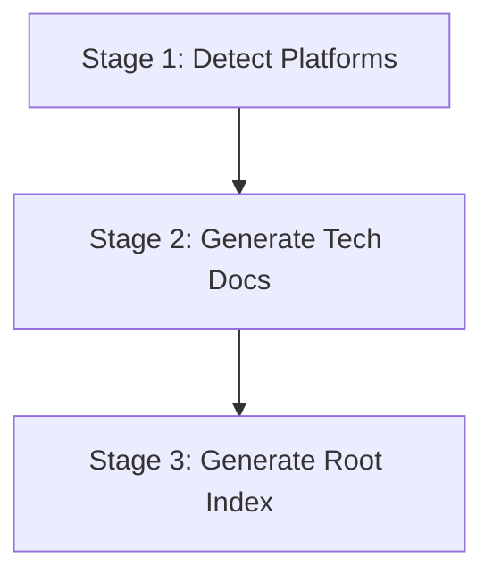

# Techs Knowledge Dispatch

Orchestrate **techs knowledge base generation** with a 3-stage pipeline: Platform Detection → Tech Doc Generation → Root Index.

## Language Adaptation

**CRITICAL**: All generated documents must match the user's language. Detect the language from the user's input and pass it to all downstream Worker Agents.

- User writes in 中文 → Generate Chinese documents, pass `language: "zh"` to workers
- User writes in English → Generate English documents, pass `language: "en"` to workers
- User writes in other languages → Use appropriate language code

**All downstream skills must receive the `language` parameter and generate content in that language only.**

## Trigger Scenarios

- "Initialize techs knowledge base"
- "Generate technology knowledge from source code"
- "Dispatch techs knowledge generation"

## User

Leader Agent (speccrew-team-leader)

## Platform Naming Convention

Read `speccrew-workspace/docs/configs/platform-mapping.json` for standardized platform mapping rules.

| Concept | techs-init (techs-manifest.json) | Example (UniApp) |
|---------|----------------------------------|------------------|
| **Category** | `platform_type` | `mobile` |
| **Technology** | `framework` | `uniapp` |
| **Identifier** | `platform_id` | `mobile-uniapp` |

## Input

| Variable | Description | Default |
|----------|-------------|---------|
| `source_path` | Source code root path | project root |
| `language` | User's language code (e.g., "zh", "en") | **REQUIRED** |

## Output

- Platform manifest: `speccrew-workspace/knowledges/base/sync-state/knowledge-techs/techs-manifest.json`
- Tech docs: `speccrew-workspace/knowledges/techs/{platform_id}/`
- Root index: `speccrew-workspace/knowledges/techs/INDEX.md`
- Status files: `speccrew-workspace/knowledges/base/sync-state/knowledge-techs/stage{N}-status.json`

## Workflow Overview



---

## Stage 1: Detect Platform Manifest (Single Task)

**Goal**: Scan source code and identify all technology platforms.

**Action**:
- Invoke 1 Worker Agent (`speccrew-task-worker.md`) with skill `speccrew-knowledge-techs-init/SKILL.md`
- Task: Analyze project structure, detect technology platforms
- Parameters to pass to skill:
  - `source_path`: Source code directory path
  - `output_path`: Output directory (default: `speccrew-workspace/knowledges/base/sync-state/knowledge-techs/`)
  - `language`: User's language — **REQUIRED**

**Output**:
- `speccrew-workspace/knowledges/base/sync-state/knowledge-techs/techs-manifest.json`

See [templates/techs-manifest-EXAMPLE.json](templates/techs-manifest-EXAMPLE.json) for complete example.

---

## Stage 2: Generate Platform Documents (Parallel)

**Goal**: Generate technology documentation for each platform in parallel.

**Action**:
- Read `speccrew-workspace/knowledges/base/sync-state/knowledge-techs/techs-manifest.json`
- For each platform in `platforms` array, invoke 1 Worker Agent (`speccrew-task-worker.md`) with skill `speccrew-knowledge-techs-generate/SKILL.md`
- Parameters to pass to skill:
  - `platform_id`: Platform identifier from manifest
  - `platform_type`: Platform type (web, mobile, backend, desktop)
  - `framework`: Primary framework
  - `source_path`: Platform source directory
  - `config_files`: List of configuration file paths
  - `convention_files`: List of convention file paths
  - `output_path`: Output directory for platform docs (e.g., `speccrew-workspace/knowledges/techs/{platform_id}/`)
  - `language`: User's language — **REQUIRED**

**Parallel Execution Logic**:

```
FOR each platform IN manifest.platforms:
  worker_id = "worker-" + platform.platform_id
  
  INVOKE speccrew-task-worker WITH:
    - skill_path: "speccrew-knowledge-techs-generate/SKILL.md"
    - context:
        platform_id: platform.platform_id
        platform_type: platform.platform_type
        framework: platform.framework
        source_path: platform.source_path
        config_files: platform.config_files
        convention_files: platform.convention_files
        output_path: "speccrew-workspace/knowledges/techs/{platform.platform_id}/"
        language: language
    
  WAIT_ALL workers complete
  
  FOR each worker_result IN worker_results:
    IF worker_result.status == "success":
      Mark platform as "completed"
      Record generated documents
    ELSE IF worker_result.status == "failed":
      Mark platform as "failed"
      Log error: "Platform {platform_id} failed: {worker_result.error}"
      NO RETRY (fail fast, record in stage2-status.json)
```

**Output per Platform**:
```
speccrew-workspace/knowledges/techs/{platform_id}/
├── INDEX.md                    # Required
├── tech-stack.md              # Required
├── architecture.md            # Required
├── conventions-design.md      # Required
├── conventions-dev.md         # Required
├── conventions-test.md        # Required
├── conventions-build.md       # Required
├── conventions-data.md        # Optional — platform-specific
└── ui-style/                  # Optional — frontend only (web/mobile/desktop)
    ├── ui-style-guide.md      # Generated by techs Stage 2
    ├── page-types/            # Populated by bizs pipeline Stage 3.5 (ui-style-extract)
    ├── components/            # Populated by bizs pipeline Stage 3.5 (ui-style-extract)
    ├── layouts/               # Populated by bizs pipeline Stage 3.5 (ui-style-extract)
    └── styles/                # Generated by techs Stage 2
```

**Cross-Pipeline Note for `ui-style/`**:
- `ui-style-guide.md` and `styles/` are generated by techs pipeline Stage 2 (technical framework-level style specs)
- `page-types/`, `components/`, and `layouts/` are populated by bizs pipeline Stage 3.5 (`speccrew-knowledge-bizs-ui-style-extract` skill), which aggregates patterns from analyzed feature documents
- These two sources are complementary: techs provides framework-level conventions, bizs adds real-page-derived design patterns
- If bizs pipeline has not been executed, these three subdirectories will be empty

**Optional file `conventions-data.md` rules**:

| Platform Type | Required? | Notes |
|----------|-----------|-------|
| `backend` | Required | ORM specs, data modeling, caching |
| `web` | Depends | Only if using ORM/data layer (Prisma, TypeORM, etc.) |
| `mobile` | Optional | Based on tech stack |
| `desktop` | Optional | Based on tech stack |

**Generation rules**:
1. `speccrew-knowledge-techs-generate` decides per platform whether `conventions-data.md` is needed
2. `speccrew-knowledge-techs-index` must check actual existing documents per platform and dynamically generate links

**Status Tracking**:
- **Get timestamp** using `speccrew-get-timestamp` skill
- **Generate `stage2-status.json`** at `speccrew-workspace/knowledges/base/sync-state/knowledge-techs/stage2-status.json`

**Stage 2 status tracks**:
- `total_platforms`, `completed`, `failed` counts
- Per-platform: `documents_generated` list

---

## Stage 2.5: Quality Synchronization

**Trigger**: After ALL Stage 2 Workers have completed (all platforms processed)
**Purpose**: Verify cross-platform consistency and document completeness before indexing

**Steps**:

#### Step 1: Collect Worker Results
For each platform, verify the following required documents exist:
- INDEX.md
- tech-stack.md
- architecture.md
- conventions-design.md
- conventions-dev.md
- conventions-test.md
- conventions-build.md
- conventions-data.md (optional - only for backend or platforms with detected data layer)

#### Step 2: Document Completeness Check
For each platform directory at `speccrew-workspace/knowledges/techs/{platform_id}/`:
1. List all .md files present
2. Check against required document list
3. Record status per platform:
   - "complete": all 7 required documents present
   - "incomplete": one or more required documents missing (list which)
   - "failed": INDEX.md missing (platform will be skipped in Stage 3)

#### Step 3: Language Consistency Spot-Check
Read the first 5 lines of each platform's INDEX.md:
- Verify content language matches the `language` parameter
- If mismatch detected, log warning: "Platform {platform_id}: language mismatch detected"

#### Step 4: Source Traceability Spot-Check
For each platform, check ONE document (conventions-dev.md recommended):
- Verify it contains `<cite>` block near the top
- If missing, log warning: "Platform {platform_id}: source traceability missing in conventions-dev.md"

#### Step 5: UI Style Analysis Level Recording
For each frontend platform (platform_type = web/mobile/desktop):
- Check if `speccrew-workspace/knowledges/techs/{platform_id}/ui-style/ui-style-guide.md` exists
- If exists, read first 20 lines to detect analysis level:
  - Contains "Automated and manual UI analysis were not possible" → level = "reference_only"
  - Contains "manual source code inspection" → level = "minimal"
  - Otherwise → level = "full"
- Record per platform

#### Step 6: Generate stage2-status.json
Write to `speccrew-workspace/knowledges/base/sync-state/knowledge-techs/stage2-status.json`:
```json
{
  "generated_at": "{timestamp}",
  "stage": "platform-doc-generation",
  "total_platforms": {N},
  "completed": {count of complete platforms},
  "incomplete": {count of incomplete platforms},
  "failed": {count of failed platforms},
  "language": "{language}",
  "quality_checks": {
    "all_required_docs_present": {true/false},
    "language_consistent": {true/false},
    "traceability_verified": {true/false},
    "ui_analyzer_results": {
      "full": [{platform_ids}],
      "minimal": [{platform_ids}],
      "reference_only": [{platform_ids}],
      "not_applicable": [{platform_ids for backend}]
    }
  },
  "platforms": [
    {
      "platform_id": "{id}",
      "platform_type": "{platform_type}",
      "framework": "{framework}",
      "status": "complete | incomplete | failed",
      "documents_generated": ["INDEX.md", "tech-stack.md", ...],
      "documents_missing": [],
      "ui_style_level": "full | minimal | reference_only | not_applicable",
      "output_path": "speccrew-workspace/knowledges/techs/{platform_id}/"
    }
  ]
}
```

#### Decision Point
- If ANY platform has status "failed" (no INDEX.md): log error but continue to Stage 3 (Stage 3 will skip those platforms)
- If ALL platforms failed: ABORT pipeline, report error
- Otherwise: proceed to Stage 3

---

## Stage 3: Generate Root Index (Single Task)

**Goal**: Generate root INDEX.md aggregating all platform documentation.

**Prerequisite**: All Stage 2 tasks completed.

**Action**:
- Read `speccrew-workspace/knowledges/base/sync-state/knowledge-techs/techs-manifest.json`
- Invoke 1 Worker Agent (`speccrew-task-worker.md`) with skill `speccrew-knowledge-techs-index/SKILL.md`
- Parameters to pass to skill:
  - `manifest_path`: Path to techs-manifest.json
  - `techs_base_path`: Base path for techs documentation (e.g., `speccrew-workspace/knowledges/techs/`)
  - `output_path`: Output path for root INDEX.md (e.g., `speccrew-workspace/knowledges/techs/`)
  - `language`: User's language — **REQUIRED**

**Critical Requirements for Techs Index Generation**:

1. **Dynamic Document Detection**: 
   - Must scan each platform directory to detect which documents actually exist
   - Do NOT assume all platforms have the same document set
   - `conventions-data.md` may not exist for all platforms

2. **Dynamic Link Generation**:
   - Only include links to documents that actually exist
   - For missing optional documents, either omit the link or mark as "N/A"

3. **Platform-Specific Document Recommendations**:
   - Adjust "Agent 重点文档" recommendations based on actual available documents

**Output**:
- `speccrew-workspace/knowledges/techs/INDEX.md` (complete with platform index and Agent mapping, dynamically generated)

**Status Tracking**:
- **Get timestamp** using `speccrew-get-timestamp` skill
- **Generate `stage3-status.json`** at `speccrew-workspace/knowledges/base/sync-state/knowledge-techs/stage3-status.json`

**Stage 3 status tracks**:
- `platforms_indexed` count
- `index_file` path

---

## Execution Flow

```
1. Run Stage 1 (Platform Detection)
   └─ Wait for completion

2. Run Stage 2 (Tech Doc Generation)
   ├─ Read techs-manifest.json
   ├─ Launch ALL platform Workers in parallel
   └─ Wait for ALL Workers → generate stage2-status.json

3. Run Stage 3 (Root Index)
   └─ Wait for completion → generate stage3-status.json
```

---

## Error Handling

### Error Handling Strategy

```
ON Worker Failure:
  1. Capture error message from worker_result.error
  2. Mark platform status as "failed" in stage2-status.json
  3. Record failed platform_id and error details
  4. Continue processing other platforms (no retry, fail fast)
  5. After all workers complete, evaluate overall status:
     - IF all platforms failed → ABORT pipeline
     - IF some platforms succeeded → CONTINUE to Stage 3 with successful platforms only
```

### Stage-Level Failure Handling

| Stage | Failure Handling |
|-------|-----------------|
| Stage 1 | Abort pipeline, report error |
| Stage 2 | Continue with successful platforms, report failed ones |
| Stage 3 | Abort if Stage 2 had critical failures |

### Worker Failure Details

**When a Worker Agent fails:**
- **No automatic retry**: Worker failures are recorded as-is
- **Partial success accepted**: Pipeline continues if at least one platform succeeds
- **Error propagation**: Failed platform details are included in stage2-status.json
- **Stage 3 decision**: Only platforms with status "complete" are included in root INDEX.md

---

## Checklist

- [ ] Stage 1: Platform manifest generated with techs-manifest.json
- [ ] Stage 2: All platforms processed in parallel
- [ ] Stage 2: `stage2-status.json` generated with all platform results
- [ ] Stage 3: Root INDEX.md generated with Agent mapping
- [ ] Stage 3: `stage3-status.json` generated with index info

### Document Completeness Verification
- [ ] Each platform directory contains required documents: INDEX.md, tech-stack.md, architecture.md, conventions-design.md, conventions-dev.md, conventions-test.md, conventions-build.md
- [ ] `conventions-data.md` exists only for appropriate platforms (backend required, others optional)
- [ ] All documents include `<cite>` reference blocks
- [ ] All documents include AI-TAG and AI-CONTEXT comments
- [ ] techs/INDEX.md links only to existing documents

## Return

After all 3 stages complete, return a summary object to the caller:

```json
{
  "status": "completed",
  "pipeline": "techs",
  "stages": {
    "stage1": { "status": "completed", "platforms": 3 },
    "stage2": { "status": "completed", "completed": 3, "failed": 0 },
    "stage3": { "status": "completed" }
  },
  "output": {
    "index": "speccrew-workspace/knowledges/techs/INDEX.md",
    "manifest": "speccrew-workspace/knowledges/base/sync-state/knowledge-techs/techs-manifest.json"
  }
}
```
