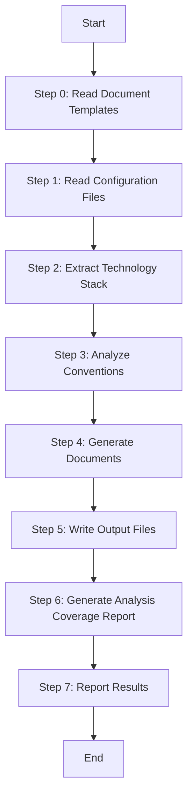

# Stage 2: Generate Platform Convention Documents

Generate comprehensive convention documentation for a specific platform by analyzing its configuration files and source code structure. This skill focuses on conventions documents only; UI style analysis is handled by the separate techs-generate-ui-style worker.

## Language Adaptation

**CRITICAL**: Generate all content in the language specified by the `language` parameter.

- `language: "zh"` → Generate all content in 中文
- `language: "en"` → Generate all content in English
- Other languages → Use the specified language

## Trigger Scenarios

- "Generate convention documents for {platform}"
- "Create tech stack and architecture documentation"
- "Extract development conventions from {platform}"
- "Generate platform conventions docs"
- "Create INDEX, tech-stack, and conventions-* files"

## User

Worker Agent (speccrew-task-worker)

## Input

- `platform_id`: Platform identifier (e.g., "web-react", "backend-nestjs")
- `platform_type`: Platform type (web, mobile, backend, desktop)
- `framework`: Primary framework (react, nestjs, flutter, etc.)
- `source_path`: Platform source directory
- `config_files`: List of configuration file paths
- `convention_files`: List of convention file paths (eslint, prettier, etc.)
- `output_path`: Output directory for generated documents (e.g., `speccrew-workspace/knowledges/techs/{platform_id}/`)
- `language`: Target language (e.g., "zh", "en") - **REQUIRED**
- `completed_dir`: (Optional) Directory for analysis coverage report output. If provided, the analysis JSON will be written here instead of the knowledges directory

## Output

Generate the following documents in `{output_path}/`:

```
{output_path}/
├── INDEX.md                    # Platform technology index (Required)
├── tech-stack.md              # Technology stack details (Required)
├── architecture.md            # Architecture conventions (Required)
├── conventions-design.md      # Design conventions (Required)
├── conventions-dev.md         # Development conventions (Required)
├── conventions-unit-test.md        # Unit testing conventions (Required)
├── conventions-system-test.md      # System testing conventions (Required)
├── conventions-build.md       # Build & Deployment conventions (Required)
└── conventions-data.md        # Data conventions (Optional)
```

### Platform Type to Document Mapping

| Platform Type | Required Documents | Optional Documents | Generate conventions-data.md? |
|---------------|-------------------|-------------------|------------------------------|
| `backend` | All 8 docs | - | **Must Generate** - Contains ORM, data modeling, caching strategy |
| `web` | All 8 docs | conventions-data.md | **Conditional** - Only when using ORM/data layer (Prisma, TypeORM, Sequelize, etc.) |
| `mobile` | All 8 docs | conventions-data.md | **Default No** - Based on actual tech stack |
| `desktop` | All 8 docs | conventions-data.md | **Default No** - Based on actual tech stack |
| `api` | All 8 docs | conventions-data.md | **Conditional** - Based on whether data layer exists |

### Decision Logic for conventions-data.md

**Step 1: Check Platform Type**
- If `backend` → **Generate** (always)
- If `web`/`mobile`/`desktop`/`api` → Proceed to Step 2

**Step 2: Detect Data Layer (for non-backend platforms)**

Check configuration files for data layer indicators:

| Indicator | Technology | Action |
|-----------|------------|--------|
| `prisma` in package.json dependencies | Prisma ORM | Generate conventions-data.md |
| `typeorm` in package.json dependencies | TypeORM | Generate conventions-data.md |
| `sequelize` in package.json dependencies | Sequelize | Generate conventions-data.md |
| `mongoose` in package.json dependencies | Mongoose | Generate conventions-data.md |
| `drizzle-orm` in package.json dependencies | Drizzle ORM | Generate conventions-data.md |
| `firebase` / `@react-native-firebase` | Firebase | Generate conventions-data.md (lightweight) |
| `sqlite` / `realm` / `@realm/react` | SQLite/Realm | Generate conventions-data.md (lightweight) |
| `core-data` in iOS project | Core Data | Generate conventions-data.md |
| `room` in Android project | Room Persistence | Generate conventions-data.md |
| None detected | - | **Skip** conventions-data.md |

**Step 3: Report Decision**
```
Platform: {platform_id}
Type: {platform_type}
Framework: {framework}
Data Layer Detected: {yes/no/technology}
Generate conventions-data.md: {yes/no}
```

## Workflow



### Step 0: Read Document Templates

Before processing, read all template files to understand the required content structure for each document type:
- **Read**: `../speccrew-knowledge-techs-generate/templates/INDEX-TEMPLATE.md` - Platform overview and navigation hub structure
- **Read**: `../speccrew-knowledge-techs-generate/templates/TECH-STACK-TEMPLATE.md` - Technology stack details structure
- **Read**: `../speccrew-knowledge-techs-generate/templates/ARCHITECTURE-TEMPLATE.md` - Architecture patterns and conventions structure
- **Read**: `../speccrew-knowledge-techs-generate/templates/CONVENTIONS-DESIGN-TEMPLATE.md` - Design principles and patterns structure
- **Read**: `../speccrew-knowledge-techs-generate/templates/CONVENTIONS-DEV-TEMPLATE.md` - Development conventions structure
- **Read**: `../speccrew-knowledge-techs-generate/templates/CONVENTIONS-UNIT-TEST-TEMPLATE.md` - Unit testing conventions structure
- **Read**: `../speccrew-knowledge-techs-generate/templates/CONVENTIONS-SYSTEM-TEST-TEMPLATE.md` - System testing conventions structure
- **Read**: `../speccrew-knowledge-techs-generate/templates/CONVENTIONS-BUILD-TEMPLATE.md` - Build and deployment conventions structure
- **Read**: `../speccrew-knowledge-techs-generate/templates/CONVENTIONS-DATA-TEMPLATE.md` - Data layer conventions structure (if applicable)
- **Purpose**: Understand each template's chapters and example content requirements
- **Key principle**: Extract information from source code according to template section requirements

### Step 1: Read Configuration Files

Read and parse all configuration files for the platform:

**Primary Config Files:**
- package.json / pom.xml / requirements.txt / pubspec.yaml / go.mod
- tsconfig.json / jsconfig.json
- Build config: vite.config.* / webpack.config.* / next.config.* / nest-cli.json

**Convention Files:**
- ESLint: .eslintrc.* / eslint.config.*
- Prettier: .prettierrc.* / prettier.config.*
- Testing: jest.config.* / vitest.config.* / pytest.ini
- Git: .gitignore, .gitattributes

### Step 2: Extract Technology Stack

Parse configuration files to extract:

**Core Framework:**
- Name and version from dependencies
- Primary language (TypeScript, JavaScript, Dart, etc.)

**Dependencies:**
- Production dependencies (grouped by purpose)
- Development dependencies
- Key library versions

**Build Tools:**
- Bundler (Vite, Webpack, Rollup)
- Transpiler (TypeScript, Babel)
- Task runner (npm scripts, Gradle, Maven)

**Example Extraction:**
```json
{
  "framework": "React",
  "framework_version": "18.2.0",
  "language": "TypeScript",
  "language_version": "5.3.0",
  "build_tool": "Vite 5.0.0",
  "key_dependencies": [
    { "name": "react-router-dom", "version": "6.20.0", "purpose": "Routing" },
    { "name": "zustand", "version": "4.4.0", "purpose": "State Management" }
  ]
}
```

### Step 3: Analyze Conventions

1. **Read Configuration**:
   - Read `speccrew-workspace/docs/rules/mermaid-rule.md` - Get Mermaid diagram compatibility guidelines

2. **Extract conventions from configuration files:**

**From ESLint Config:**
- Enabled rules
- Code style preferences
- Import/export patterns

**From Prettier Config:**
- Formatting rules (semi, quotes, tabWidth)
- Print width

**From Project Structure:**
- Directory conventions (src/, components/, utils/)
- File naming patterns
- Module organization

3. **Apply Mermaid Rules**:
   - Follow compatibility guidelines from `mermaid-rule.md`
   - See: [Mermaid Diagram Guide](#mermaid-diagram-guide)

### Domain-Specific Convention Extraction (MANDATORY)

In addition to the general conventions above, you MUST actively search for and extract the following domain-specific topics. These are critical for downstream Agents (solution, design, development, testing).

**For Frontend Platforms (web-vue, mobile-uniapp, etc.):**

| Topic | What to Search For | Where to Look |
|-------|-------------------|---------------|
| **i18n/Internationalization** | i18n framework config, locale files, translation key patterns | `locales/`, `i18n/`, `lang/`, package.json deps |
| **Authorization & Permissions** | Permission directives (`v-hasPermi`), route guards, permission stores | `permission/`, `router/`, `store/`, `utils/auth` |
| **Menu Registration** | Menu config, dynamic menu loading, menu-to-route mapping | `router/`, `store/`, `layout/`, API calls for menus |
| **Data Dictionary** | Dict components (`DictTag`), dict stores, dict API calls | `components/Dict`, `utils/dict`, `store/` |
| **Logging** | Error reporting service, console policy, error boundaries | `utils/log`, `plugins/sentry`, error handling config |
| **API Request Layer** | Axios/fetch instance, interceptors, token refresh, base URL config | `utils/request`, `api/`, `config/`, `interceptors/` |
| **Data Validation** | Form validation rules, custom validators, validation timing | `utils/validate`, form schemas, component props validation |
| **File Upload** | Upload components, upload API calls, file size limits | `components/Upload`, `api/file`, `utils/upload` |

**For Backend Platforms (backend-spring, etc.):**

| Topic | What to Search For | Where to Look |
|-------|-------------------|---------------|
| **Authorization & Permissions** | `@PreAuthorize`, `@DataPermission`, security config, permission enums | Security config, controller annotations, framework modules |
| **Data Dictionary** | Dict entity, dict service, dict cache, dict enum patterns | `dict/`, `system/` module, enum classes |
| **Multi-tenancy** | Tenant interceptor/plugin, tenant column, tenant context, `@TenantIgnore` | MyBatis plugins, framework config, base entity |
| **Backend i18n** | messages.properties, MessageSource, i18n config, ValidationMessages | `resources/i18n/`, `messages*.properties`, i18n config beans |
| **Logging** | Logger usage, log config (logback.xml/log4j2), operation log annotation, audit trail | `logback*.xml`, `log4j2*.xml`, `@OperateLog`, `operatelog/` module |
| **Exception Handling** | GlobalExceptionHandler, business exceptions, error codes, error response format | `handler/`, `exception/`, `enums/ErrorCode`, `GlobalExceptionHandler` |
| **Caching** | @Cacheable, RedisTemplate, cache key patterns, cache config | `cache/`, `redis/`, `CacheConfig`, `@Cacheable` annotations |
| **Data Validation** | @Valid, @Validated, custom validators, validation groups | DTO classes, `validator/`, `@NotNull/@Size` patterns |
| **Scheduled Jobs** | @Scheduled, Quartz config, XXL-Job handler, cron expressions | `job/`, `task/`, `schedule/`, `@Scheduled` methods |
| **File Storage** | FileService, upload API, OSS/S3 config, file path patterns | `file/`, `infra/file/`, `FileClient`, storage config |

**If a topic is not found in the source code**, explicitly state "Not applicable" in the corresponding template section. Do NOT leave the section empty or skip it silently.

### Analysis Tracking (MANDATORY)

During Step 3, you MUST maintain an internal tracking record for each topic you search. For every topic in the tables above:

1. **Search** the source code using the "Where to Look" paths
2. **Record** the result:
   - `found` — Topic implementation found, relevant files identified
   - `not_found` — Searched all suggested paths, no implementation exists
   - `partial` — Some aspects found but incomplete
3. **List** all files you actually read/analyzed for that topic

This tracking data will be used in Step 6 to generate the analysis coverage report. Do NOT skip any topic — if a topic is not applicable to this platform type, record it as `not_found` with a note.

**Topic Checklist by Platform Type:**

**Frontend Topics (web, mobile, desktop):**
1. i18n / Internationalization
2. Authorization & Permissions
3. Menu Registration & Routing
4. Data Dictionary Usage
5. Logging & Error Reporting
6. API Request Layer (Axios/fetch)
7. Data Validation
8. File Upload & Storage
9. UI Style System is handled by the separate techs-generate-ui-style worker

**Backend Topics (backend):**
1. Backend Internationalization
2. Authorization & Permissions (annotations, data permission)
3. Data Dictionary Management
4. Logging & Audit Trail
5. Exception Handling & Error Codes
6. Caching Strategy
7. Data Validation (JSR 380, custom validators)
8. Scheduled Jobs & Task Scheduling
9. File Storage
10. Multi-tenancy

### Step 4: Generate Documents (MANDATORY: Copy Template + Fill)

**CRITICAL**: This step MUST follow the template fill workflow - copy template first, then fill sections.

1. **For Each Document, Follow This Workflow**:

   **Step 4.1: Copy Template File**
   - Copy the corresponding template file to the output path:
     - `../speccrew-knowledge-techs-generate/templates/INDEX-TEMPLATE.md` → `{output_path}/INDEX.md`
     - `../speccrew-knowledge-techs-generate/templates/TECH-STACK-TEMPLATE.md` → `{output_path}/tech-stack.md`
     - `../speccrew-knowledge-techs-generate/templates/ARCHITECTURE-TEMPLATE.md` → `{output_path}/architecture.md`
     - `../speccrew-knowledge-techs-generate/templates/CONVENTIONS-DESIGN-TEMPLATE.md` → `{output_path}/conventions-design.md`
     - `../speccrew-knowledge-techs-generate/templates/CONVENTIONS-DEV-TEMPLATE.md` → `{output_path}/conventions-dev.md`
     - `../speccrew-knowledge-techs-generate/templates/CONVENTIONS-UNIT-TEST-TEMPLATE.md` → `{output_path}/conventions-unit-test.md`
     - `../speccrew-knowledge-techs-generate/templates/CONVENTIONS-SYSTEM-TEST-TEMPLATE.md` → `{output_path}/conventions-system-test.md`
     - `../speccrew-knowledge-techs-generate/templates/CONVENTIONS-BUILD-TEMPLATE.md` → `{output_path}/conventions-build.md`
     - `../speccrew-knowledge-techs-generate/templates/CONVENTIONS-DATA-TEMPLATE.md` → `{output_path}/conventions-data.md` (if applicable)

   **Step 4.2: Fill Template Sections with search_replace**
   - Use `search_replace` tool to fill each section of the template
   - Replace placeholder content with actual analyzed data
     - Follow [Document Structure Standard](#document-structure-standard)
   - Apply [Source Traceability Requirements](#source-traceability-requirements)

   **MANDATORY RULES**:
   - **Do NOT use create_file to rewrite the entire document**
   - **Do NOT delete or skip any template section**
   - Only replace the placeholder content within each section
   - Preserve all template section headers and structure

2. **Document Generation Order**:
   - Generate: INDEX.md, tech-stack.md, architecture.md, conventions-design.md, conventions-dev.md, conventions-unit-test.md, conventions-system-test.md, conventions-build.md, conventions-data.md (if applicable)

3. **UI Design Conventions Reference in conventions-design.md**:
   In conventions-design.md, ALWAYS include UI reference section:
   ```markdown
   ## UI Design Conventions

   Refer to [UI Style Guide](ui-style/ui-style-guide.md) for design system details.
   Note: UI style documents are generated by the separate ui-style worker.
   ```

### Step 5: Write Output Files

Create output directory if not exists, then write all generated documents.

### Step 6: Generate Analysis Coverage Report (MANDATORY)

After completing all document generation, you MUST create an analysis coverage report as a JSON file.

**Output file**: `{completed_dir}/{platform_id}.analysis-conventions.json`

Where `{completed_dir}` is the directory passed via the `completed_dir` parameter (if provided). If `completed_dir` is not provided, output to the platform's knowledges directory.

**Report Format**:

```json
{
  "platform_id": "{platform_id}",
  "platform_type": "{platform_type}",
  "worker_type": "conventions",
  "analyzed_at": "{ISO 8601 timestamp}",
  "topics": {
    "i18n": {
      "status": "found",
      "files_analyzed": ["src/i18n/index.ts", "locales/zh-CN.ts"],
      "notes": "Vue I18n with 2 locale files"
    },
    "authorization": {
      "status": "found",
      "files_analyzed": ["src/permission/index.ts", "src/router/guard.ts"],
      "notes": "RBAC with route guards and v-hasPermi directive"
    },
    "data_dictionary": {
      "status": "not_found",
      "files_analyzed": [],
      "notes": "No dictionary implementation found in suggested paths"
    }
  },
  "config_files_analyzed": [
    "package.json",
    "vite.config.ts",
    "tsconfig.json"
  ],
  "source_dirs_scanned": [
    "src/components/",
    "src/views/",
    "src/utils/",
    "src/store/"
  ],
  "documents_generated": [
    "INDEX.md",
    "tech-stack.md",
    "architecture.md",
    "conventions-dev.md",
    "conventions-design.md",
    "conventions-unit-test.md",
    "conventions-build.md"
  ],
  "coverage_summary": {
    "topics_found": 7,
    "topics_partial": 1,
    "topics_not_found": 1,
    "topics_total": 9,
    "coverage_percent": 78
  }
}
```

**Rules**:
- Every topic from the Topic Checklist in Step 3 MUST appear in the `topics` object
- `files_analyzed` MUST list the actual file paths you read (relative to source_path)
- `status` MUST be one of: `found`, `not_found`, `partial`
- `coverage_percent` = (topics_found + topics_partial) / topics_total * 100, rounded to integer
- `documents_generated` MUST list all .md files actually created
- Use `create_file` to write this JSON file (this is the ONE exception where create_file is allowed — for JSON output files)

### Step 7: Report Results

```
Platform Convention Documents Generated: {{platform_id}}
- INDEX.md: ✓
- tech-stack.md: ✓
- architecture.md: ✓
- conventions-design.md: ✓
- conventions-dev.md: ✓
- conventions-unit-test.md: ✓
- conventions-system-test.md: ✓
- conventions-build.md: ✓
- conventions-data.md: ✓ (or skipped if not applicable)
- {{platform_id}}.analysis-conventions.json: ✓ (analysis coverage report)
- Output Directory: {{output_path}}
- Analysis Report: {{completed_dir}}/{{platform_id}}.analysis-conventions.json (or knowledges dir if completed_dir not provided)
```

**Completion Marker File**:

Create a done file to signal completion:
```json
{
  "platform_id": "{platform_id}",
  "worker_type": "conventions",
  "status": "completed",
  "documents_generated": ["INDEX.md", "tech-stack.md", "architecture.md", "conventions-design.md", "conventions-dev.md", "conventions-unit-test.md", "conventions-system-test.md", "conventions-build.md"],
  "analysis_file": "{platform_id}.analysis-conventions.json",
  "completed_at": "{ISO timestamp}"
}
```

---

## Reference Guides

### Document Structure Standard

All generated documents must follow this structure:

```markdown
# {{platform_name}} {{document_type}}

<cite>
**Files Referenced in This Document**
{{source_files}}
</cite>

> **Target Audience**: devcrew-designer-{{platform_id}}, devcrew-dev-{{platform_id}}, devcrew-test-{{platform_id}}

## Table of Contents
1. [Introduction](#introduction)
2. [Project Structure](#project-structure)
3. [Core Components](#core-components)
4. [Architecture Overview](#architecture-overview)
5. [Detailed Component Analysis](#detailed-component-analysis)
6. [Dependency Analysis](#dependency-analysis)
7. [Performance Considerations](#performance-considerations)
8. [Troubleshooting Guide](#troubleshooting-guide)
9. [Conclusion](#conclusion)
10. [Appendix](#appendix)

... content sections ...

**Section Source**
- [file.ext](../../../../path/to/file#Lstart-Lend)
```

### Source Traceability Requirements

**CRITICAL: All source file links MUST use RELATIVE PATHS. Absolute paths and `file://` protocol are STRICTLY FORBIDDEN.**

**FORBIDDEN:**
- Do NOT use absolute paths (e.g., `d:/dev/ruoyi-vue-pro/...`)
- Do NOT use `file://` protocol (e.g., `file://d:/dev/...`)
- Do NOT hardcode machine-specific paths
- ALWAYS use relative paths calculated from the document's location

**Dynamic Relative Path Calculation:**

Documents are located at: `speccrew-workspace/knowledges/techs/{platform_id}/{document}.md`
This is 4 levels deep from the project root:
  - speccrew-workspace (1)
  - knowledges (2)
  - techs (3)
  - {platform_id} (4)

Therefore, to reference a source file from the project root, use `../../../../` as the prefix.

Example calculation:
  - Document: `speccrew-workspace/knowledges/techs/backend-spring/architecture.md`
  - Source file: `yudao-server/src/main/java/.../YudaoServerApplication.java`
  - Relative path: `../../../../yudao-server/src/main/java/.../YudaoServerApplication.java`

For root INDEX.md (one level less deep):
  - Document: `speccrew-workspace/knowledges/techs/INDEX.md`
  - Prefix: `../../../` (3 levels)

**1. File Reference Block (`<cite>`)**

Place at the beginning of each document:

```markdown
<cite>
**Files Referenced in This Document**
- [package.json](../../../../yudao-ui/yudao-ui-admin-vue3/package.json)
- [tsconfig.json](../../../../yudao-ui/yudao-ui-admin-vue3/tsconfig.json)
</cite>
```

**2. Diagram Source Annotation**

After each Mermaid diagram:

```markdown
**Diagram Source**
- [file-name.ext](../../../../yudao-server/src/main/java/...#L10-L50)
```

**3. Section Source Annotation**

At the end of each major section:

```markdown
**Section Source**
- [file-name.ext](../../../../yudao-server/src/main/java/...#L10-L50)
```

For generic guidance sections without specific file references:

```markdown
[This section provides general guidance, no specific file reference required]
```

### Mermaid Diagram Guide

When generating Mermaid diagrams, follow these compatibility guidelines:

**Key Requirements:**
- Use only basic node definitions: `A[text content]`
- No HTML tags (e.g., `<br/>`)
- No nested subgraphs
- No `direction` keyword
- No `style` definitions
- Use standard `graph TB/LR` syntax only

**Diagram Types:**

| Diagram Type | Use Case | Example Scenario |
|--------------|----------|------------------|
| `graph TB/LR` | Structure & Dependency | Module relationships, component hierarchy |
| `flowchart TD` | Business Logic Flow | Request processing, decision trees |
| `sequenceDiagram` | Interaction Flow | API calls, service communication |
| `classDiagram` | Class Structure | Entity relationships, inheritance |
| `erDiagram` | Database Schema | Table relationships, data model |
| `stateDiagram-v2` | State Machine | Order status, workflow states |

### Quality Requirements

#### Be Specific

Extract actual values from config files:
- ✓ "React 18.2.0" (from package.json)
- ✗ "React (version varies)"

#### Be Concise

Focus on actionable conventions:
- ✓ "Use PascalCase for component files: UserProfile.tsx"
- ✗ "There are many naming conventions to consider..."

#### Include Examples

Wherever possible, include concrete examples:
```markdown
### Component Naming
- ✓ UserProfile.tsx
- ✓ OrderList.tsx
- ✗ userProfile.tsx
- ✗ order-list.tsx
```

### Error Handling

**Template Not Found:**
- If a template file is missing, report error and skip that document
- Continue with other documents

**Configuration File Missing:**
- If expected config file not found, note in analysis report
- Use defaults or skip related sections

**Source Code Not Found:**
- If source directory structure doesn't match expectations
- Document actual structure found
- Mark topics as "not_found" in analysis report

---

## Checklist

### Pre-Generation
- [ ] All configuration files read and parsed
- [ ] Technology stack extracted accurately
- [ ] Conventions analyzed from config files

### Document Generation Decision
- [ ] Platform type identified (web/mobile/backend/desktop/api)
- [ ] Data layer detection completed for non-backend platforms
- [ ] Decision made on whether to generate conventions-data.md
  - [ ] Backend platform → Always generate
  - [ ] Other platforms → Generate only if data layer detected

### Required Documents (All Platforms)
- [ ] INDEX.md generated with navigation
- [ ] tech-stack.md generated with dependency tables
- [ ] architecture.md generated with platform-specific patterns
- [ ] conventions-design.md generated with design principles
- [ ] conventions-dev.md generated with naming and style rules
- [ ] conventions-unit-test.md generated with unit testing requirements
- [ ] conventions-system-test.md generated with system testing requirements
- [ ] conventions-build.md generated with build and deployment conventions

### Optional Document
- [ ] conventions-data.md generated (only if applicable per platform type mapping)

### Quality Checks
- [ ] All files written to output_path
- [ ] **Source traceability**: `<cite>` block added to each document
- [ ] **Source traceability**: Diagram Source annotations added after each Mermaid diagram
- [ ] **Source traceability**: Section Source annotations added at end of major sections
- [ ] **Mermaid compatibility**: No `style`, `direction`, `<br/>`, or nested subgraphs
- [ ] **Document completeness**: Verify all 8 required documents exist (INDEX.md, tech-stack.md, architecture.md, conventions-design.md, conventions-dev.md, conventions-unit-test.md, conventions-system-test.md, conventions-build.md)
- [ ] **Analysis Coverage Report**: `{platform_id}.analysis-conventions.json` generated with all topics tracked
- [ ] Results reported with conventions-data.md generation status
