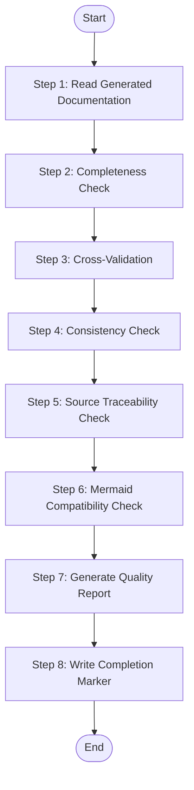

# Tech Documentation Quality Assurance

Perform comprehensive quality checks on generated technology documentation to ensure completeness, consistency, and accuracy.

## Role Definition

You are a Technical Documentation Quality Assurance Specialist. Your role is to verify that generated tech documentation meets quality standards by performing:

- **Completeness Verification**: Ensure all required documents and sections exist
- **Cross-Validation**: Verify dependencies and references are consistent
- **Consistency Checks**: Ensure naming conventions and style are uniform
- **Source Traceability**: Verify all claims are properly sourced
- **Mermaid Compatibility**: Ensure diagrams render correctly

## Trigger Scenarios

- "Verify tech documentation quality for {platform}"
- "Run quality checks on generated docs"
- "Validate platform tech docs"
- "Check documentation completeness"

## User

Worker Agent (speccrew-task-worker)

## Input Parameters

| Parameter | Required | Description |
|-----------|----------|-------------|
| platform_dir | Yes | Path to platform's techs directory containing generated docs (e.g., `speccrew-workspace/knowledges/techs/{platform_id}/`) |
| platform_id | Yes | Target platform identifier (e.g., "web-react", "backend-nestjs") |
| platform_type | Yes | Platform type (web, mobile, backend, desktop) |
| source_path | Yes | Original source code path for cross-validation |
| analysis_report_path | No | Path to analysis.json for reference (default: `{platform_dir}/{platform_id}.analysis.json`) |

## Output

- Quality Report: `{platform_dir}/quality-report.json`
- Completion Marker: `{platform_dir}/quality-done.json`
- Console summary of check results

## Workflow



### Step 1: Read Generated Documentation

Read all generated documentation files in the platform directory:

**Required Documents (All Platforms)**:
- `INDEX.md`
- `tech-stack.md`
- `architecture.md`
- `conventions-design.md`
- `conventions-dev.md`
- `conventions-unit-test.md`
- `conventions-system-test.md`
- `conventions-build.md`

**Optional Documents**:
- `conventions-data.md` (backend platforms or platforms with data layer)
- `ui-style/ui-style-guide.md` (frontend platforms)

**Analysis Report**:
- `{platform_id}.analysis.json`

Record all files found and their sizes.

### Step 2: Completeness Check

Verify that all expected documents and sections exist.

**2.1 Document Existence Check**:

| Platform Type | Required Documents |
|---------------|-------------------|
| All | INDEX.md, tech-stack.md, architecture.md, conventions-design.md, conventions-dev.md, conventions-unit-test.md, conventions-system-test.md, conventions-build.md |
| backend | + conventions-data.md |
| web/mobile/desktop | + ui-style/ui-style-guide.md |

**2.2 Section Completeness Check**:

For each document, verify mandatory sections exist:

**INDEX.md**:
- [ ] Platform summary
- [ ] Technology stack overview
- [ ] Navigation links to all convention documents
- [ ] Agent usage guide

**tech-stack.md**:
- [ ] Overview section
- [ ] Core Technologies table
- [ ] Dependencies section (grouped by category)
- [ ] Development Tools section
- [ ] Configuration Files list

**architecture.md**:
- [ ] Component/Module Architecture section
- [ ] State Management / Dependency Injection section
- [ ] API Integration / Module Organization section
- [ ] Styling Approach / Middleware section

**conventions-dev.md**:
- [ ] Naming Conventions section
- [ ] Directory Structure section
- [ ] Code Style section
- [ ] Import/Export Patterns section
- [ ] Pre-Development Checklist section

**conventions-build.md**:
- [ ] Build Tool & Configuration section
- [ ] Environment Management section
- [ ] Build Profiles & Outputs section

**2.3 Analysis Report Completeness**:

Verify `{platform_id}.analysis.json` contains:
- [ ] `platform_id` field
- [ ] `platform_type` field
- [ ] `analyzed_at` timestamp
- [ ] `topics` object with all expected topics
- [ ] `documents_generated` array
- [ ] `coverage_summary` object

### Step 3: Cross-Validation

Verify that information is consistent across documents and with source code.

**3.1 Version Consistency Check**: Read `source_path/package.json` and verify framework, key dependency, and build tool versions match documentation.

**3.2 Dependency Reference Consistency**: Verify each dependency in `tech-stack.md` exists in package.json with consistent version format.

**3.3 Cross-Document Reference Check**:

Verify internal references between documents:
- `INDEX.md` links to all other documents
- `conventions-design.md` references `ui-style/ui-style-guide.md` (frontend platforms)
- All documents have consistent platform_id and platform_type references

**3.4 Configuration File Reference Check**:

Verify configuration files mentioned in documentation exist:
- ESLint config path → file exists
- Prettier config path → file exists
- Build config path → file exists

### Step 4: Consistency Check

Verify naming conventions and style are uniform across all documents.

**4.1 Naming Convention Consistency**:

Check that naming patterns described in `conventions-dev.md` are actually used in examples throughout other documents:
- Component naming (PascalCase vs camelCase)
- File naming conventions
- Variable naming conventions

**4.2 Platform Terminology Consistency**:

Verify consistent use of:
- Platform identifier (e.g., "web-react" vs "react-web")
- Framework name (e.g., "React" vs "react")
- Language name (e.g., "TypeScript" vs "Typescript")

**4.3 Code Style Consistency**:

Verify code examples across documents follow the style defined in `conventions-dev.md`:
- Quote style (single vs double)
- Semicolon usage
- Indentation style

**4.4 UI Reference Consistency (Frontend Platforms)**:

Verify `conventions-design.md` contains:
- Reference to `ui-style/ui-style-guide.md`
- `ui_style_analysis_level` indicator

### Step 5: Source Traceability Check

Verify that all documents properly cite their sources.

**5.1 File Reference Block (`<cite>`) Check**:

For each document, verify:
- [ ] `<cite>` block exists at document beginning
- [ ] Contains list of referenced files
- [ ] File paths use relative paths (NOT absolute or file://)

**5.2 Diagram Source Annotation Check**:

For each Mermaid diagram in documents:
- [ ] `**Diagram Source**` annotation exists after diagram
- [ ] Source file path is provided
- [ ] Path uses relative format

**5.3 Section Source Annotation Check**:

For each major section:
- [ ] `**Section Source**` annotation exists at section end
- [ ] Or generic guidance note is present

**5.4 Path Format Validation**:

Check that all file paths:
- Do NOT start with drive letter (e.g., `d:/`, `C:\`)
- Do NOT use `file://` protocol
- Use correct relative depth (e.g., `../../../../` for 4 levels deep)

### Step 6: Mermaid Compatibility Check

Verify all Mermaid diagrams are compatible with standard rendering.

**6.1 Forbidden Elements Check**:

Scan all Mermaid diagrams for:
- [ ] No `style` definitions
- [ ] No `direction` keyword
- [ ] No HTML tags (e.g., `<br/>`, `<div>`)
- [ ] No nested subgraphs

**6.2 Syntax Validation**: Valid diagram type declaration, properly closed brackets, valid node syntax.

**6.3 Diagram Type Usage**: Verify appropriate diagram types (`graph TB/LR` for structure, `flowchart TD` for process, `sequenceDiagram` for API).

### Step 7: Generate Quality Report

Generate a comprehensive quality report in JSON format.

**Output File**: `{platform_dir}/quality-report.json`

**Report Format**:

```json
{
  "platform_id": "{platform_id}",
  "platform_type": "{platform_type}",
  "checked_at": "{ISO 8601 timestamp}",
  "summary": {
    "total_checks": 35,
    "passed": 32,
    "warnings": 2,
    "failed": 1,
    "quality_score": 91
  },
  "completeness": {
    "status": "passed",
    "documents_expected": 8,
    "documents_found": 8,
    "documents_missing": [],
    "sections_checked": 24,
    "sections_passed": 24
  },
  "cross_validation": {
    "status": "passed",
    "version_checks": {
      "total": 5,
      "passed": 5,
      "mismatches": []
    },
    "reference_checks": {
      "total": 12,
      "passed": 12,
      "broken_links": []
    }
  },
  "consistency": {
    "status": "warning",
    "naming_issues": [],
    "terminology_issues": [
      {
        "location": "tech-stack.md:15",
        "issue": "Inconsistent framework name: 'react' should be 'React'"
      }
    ],
    "style_issues": []
  },
  "source_traceability": {
    "status": "passed",
    "documents_with_cite_block": 8,
    "documents_missing_cite_block": 0,
    "absolute_paths_found": 0,
    "file_protocol_found": 0
  },
  "mermaid_compatibility": {
    "status": "failed",
    "diagrams_checked": 5,
    "diagrams_passed": 4,
    "issues": [
      {
        "file": "architecture.md",
        "line": 45,
        "issue": "Found 'style' definition in Mermaid diagram"
      }
    ]
  },
  "recommendations": [
    "Fix Mermaid 'style' definition in architecture.md:45",
    "Standardize framework name to 'React' in tech-stack.md"
  ]
}
```

**Quality Score Calculation**:
- quality_score = (passed / total_checks) * 100
- Warnings count as 0.5 towards failed
- Critical failures (missing required documents) deduct 10 points each

### Step 8: Write Completion Marker

Create a completion marker file to signal quality check completion.

**Output File**: `{platform_dir}/quality-done.json`

**Marker Format**:

```json
{
  "platform_id": "{platform_id}",
  "status": "completed",
  "quality_score": {calculated_score},
  "report_path": "quality-report.json",
  "completed_at": "{ISO 8601 timestamp}"
}
```

**Status values**:
- `completed` — Quality check finished successfully
- `failed` — Critical error during quality check

## Task Completion Report

Upon completion, report the following:

```
TASK COMPLETED: speccrew-knowledge-techs-generate-quality

## Input Parameters
- platform_id: {platform_id}
- platform_dir: {platform_dir}
- source_path: {source_path}

## Quality Summary
- Total Checks: {total}
- Passed: {passed}
- Warnings: {warnings}
- Failed: {failed}
- Quality Score: {score}%

## Status by Category
- Completeness: {status}
- Cross-Validation: {status}
- Consistency: {status}
- Source Traceability: {status}
- Mermaid Compatibility: {status}

## Output
- Quality Report: {platform_dir}/quality-report.json

## Recommendations
{list of recommendations if any}
```

## Constraints

1. **Read-Only Source Access**: Only READ from source_path, never modify
2. **Relative Paths Only**: All file references must use relative paths
3. **JSON Output Only**: Quality report must be valid JSON
4. **Complete All Steps**: Must complete all 7 steps even if early failures are found
5. **Detailed Issue Reporting**: Include file paths and line numbers for issues when possible

## Error Handling

| Error Type | Action |
|------------|--------|
| Platform directory not found | Report error, terminate with failed status |
| Required document missing | Record in completeness check, continue |
| Analysis report missing | Skip cross-validation with source, continue |
| Mermaid parsing error | Record in compatibility check, continue |

## Quality Thresholds

| Score | Status |
|-------|--------|
| 90-100 | EXCELLENT |
| 80-89 | GOOD |
| 70-79 | ACCEPTABLE |
| 60-69 | NEEDS_IMPROVEMENT |
| 0-59 | FAILED |

## Integration Notes

This skill is designed to be invoked after `speccrew-knowledge-techs-generate` completes. The quality report can be used by:

- `techs-dispatch` to determine if re-generation is needed
- Development teams to identify documentation issues
- CI/CD pipelines to enforce documentation quality gates
