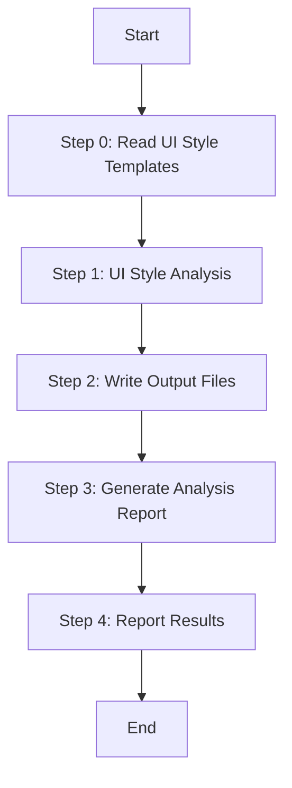

# Stage 2: Generate Platform UI Style Documents

Generate comprehensive UI style documentation for a specific frontend platform by analyzing its source code structure, components, and styling patterns.

## Language Adaptation

**CRITICAL**: Generate all content in the language specified by the `language` parameter.

- `language: "zh"` → Generate all content in 中文
- `language: "en"` → Generate all content in English
- Other languages → Use the specified language

## Prerequisite

This skill ONLY applies to frontend platforms. The dispatcher MUST check platform_type before invoking:
- `web` → Execute this skill
- `mobile` → Execute this skill
- `desktop` → Execute this skill
- `backend` → DO NOT invoke this skill
- `api` → DO NOT invoke this skill

## Trigger Scenarios

- "Generate UI style documents for {platform}"
- "Analyze UI components and layouts"
- "Extract design system from {platform}"

## User

Worker Agent (speccrew-task-worker)

## Input

- `platform_id`: Platform identifier (e.g., "web-react", "mobile-uniapp")
- `platform_type`: Platform type (web, mobile, desktop)
- `framework`: Primary framework (react, vue, angular, uniapp, flutter, etc.)
- `source_path`: Platform source directory
- `output_path`: Output directory (e.g., speccrew-workspace/knowledges/techs/{platform_id}/)
- `language`: Target language ("zh", "en") - **REQUIRED**
- `completed_dir`: (Optional) Directory for completion marker and analysis report

## Output

```
{output_path}/
└── ui-style/
    ├── ui-style-guide.md              # Main UI style guide (Required)
    ├── page-types/
    │   ├── page-type-summary.md       # Page type overview (Required)
    │   └── [type]-pages.md            # Per-type detail (Dynamic)
    ├── components/
    │   ├── component-library.md       # Component catalog (Required)
    │   ├── common-components.md       # Common components (Required)
    │   ├── business-components.md     # Business components (Required)
    │   └── {component-name}.md        # Per-component detail (Dynamic)
    ├── layouts/
    │   ├── page-layouts.md            # Layout patterns (Required)
    │   ├── navigation-patterns.md     # Navigation patterns (Required)
    │   └── {layout-name}-layout.md    # Per-layout detail (Dynamic)
    └── styles/
        ├── color-system.md            # Color system (Required)
        ├── typography.md              # Typography (Required)
        └── spacing-system.md          # Spacing system (Required)
```

## Directory Ownership

- `ui-style/` — Fully managed by this skill (techs pipeline)
  - Contains: ui-style-guide.md, styles/, page-types/, components/, layouts/
  - Source: Framework-level design system analysis from source code
- `ui-style-patterns/` — Managed by bizs pipeline (Stage 3.5: bizs-ui-style-extract)
  - Contains: Business pattern aggregation from feature documents
  - NOT created or written by this skill
  - May not exist if bizs pipeline has not been executed

## Workflow



### Step 0: Read UI Style Templates

Before processing, read all UI style template files to understand the required content structure:

- **Read**: `../speccrew-knowledge-techs-generate/templates/COMPONENT-LIBRARY-TEMPLATE.md` - Component catalog structure
- **Read**: `../speccrew-knowledge-techs-generate/templates/PAGE-LAYOUTS-TEMPLATE.md` - Layout patterns structure
- **Read**: `../speccrew-knowledge-techs-generate/templates/PAGE-TYPE-SUMMARY-TEMPLATE.md` - Page type classification structure
- **Read**: `../speccrew-knowledge-techs-generate/templates/COLOR-SYSTEM-TEMPLATE.md` - Color and typography system structure
- **Purpose**: Understand template structure for fallback path copy+fill workflow

### Step 1: UI Style Analysis

**Directory Ownership**:
- `ui-style/` — Fully managed by techs pipeline (this skill)
  - Contains: ui-style-guide.md, styles/, page-types/, components/, layouts/
  - Source: Framework-level design system analysis from source code
- `ui-style-patterns/` — Managed by bizs pipeline (Stage 3.5: bizs-ui-style-extract)
  - Contains: Business pattern aggregation from feature documents
  - NOT created or written by this skill
  - May not exist if bizs pipeline has not been executed

**Primary Path (UI Analyzer Available and Succeeds)**:

1. **CRITICAL**: Use the Skill tool to invoke `speccrew-knowledge-techs-ui-analyze` with these exact parameters:
   ```
   skill: "speccrew-knowledge-techs-ui-analyze"
   args: "source_path={source_path};platform_id={platform_id};platform_type={platform_type};framework={framework};output_path={output_path}/ui-style/;language={language}"
   ```

2. **Wait for completion** and verify output files exist:
   - `{output_path}/ui-style/ui-style-guide.md` ✓
   - `{output_path}/ui-style/page-types/page-type-summary.md` ✓
   - `{output_path}/ui-style/page-types/[type]-pages.md` (one per discovered type) ✓
   - `{output_path}/ui-style/components/component-library.md` ✓
   - `{output_path}/ui-style/components/common-components.md` ✓
   - `{output_path}/ui-style/components/business-components.md` ✓
   - `{output_path}/ui-style/layouts/page-layouts.md` ✓
   - `{output_path}/ui-style/layouts/navigation-patterns.md` ✓
   - `{output_path}/ui-style/styles/color-system.md` ✓
   - `{output_path}/ui-style/styles/typography.md` ✓
   - `{output_path}/ui-style/styles/spacing-system.md` ✓

3. If all outputs verified → proceed to next step
4. Record: `ui_analysis_level = "full"`

**Secondary Path (UI Analyzer Fails or Partial Output)**:

**MANDATORY: UI Style Fallback Path - Complete Directory Structure**

When UI Style Analyzer fails or produces incomplete output, you MUST create ALL of the following directories and files. Skipping ANY item is FORBIDDEN.

**Required Directory Structure (MANDATORY - ALL items must be created):**
```
ui-style/
├── ui-style-guide.md              ← MANDATORY
├── page-types/
│   └── page-type-summary.md       ← MANDATORY
├── components/
│   └── component-library.md       ← MANDATORY
├── layouts/
│   └── page-layouts.md            ← MANDATORY
└── styles/
    └── color-system.md            ← MANDATORY
```

**Self-Verification Checklist (MUST complete before reporting success):**
- [ ] ui-style/ui-style-guide.md exists and has content
- [ ] ui-style/page-types/page-type-summary.md exists and has content
- [ ] ui-style/components/component-library.md exists and has content
- [ ] ui-style/layouts/page-layouts.md exists and has content
- [ ] ui-style/styles/color-system.md exists and has content

If ANY file in the checklist is missing, you MUST create it before proceeding to the next step. Do NOT report "completed" with missing files.

**Execution Steps:**

1. Create ui-style directory structure:
   `{output_path}/ui-style/`, `{output_path}/ui-style/page-types/`, `{output_path}/ui-style/components/`, `{output_path}/ui-style/layouts/`, `{output_path}/ui-style/styles/`

2. Generate minimal ui-style-guide.md by manually scanning source code:
   - Design system: identify UI framework from dependencies (Material UI, Ant Design, Tailwind, etc.)
   - Color system: scan for CSS variables, theme files, or color constants in `{source_path}/src/styles/` or `{source_path}/src/theme/`
   - Typography: scan for font-family declarations
   - Component library: list directories under `{source_path}/src/components/`
   - Page types: list directories/files under `{source_path}/src/pages/` or `{source_path}/src/views/`

3. Content structure for minimal ui-style-guide.md:
   ```markdown
   # UI Style Guide - {platform_id}
   
   > Note: Generated from manual source code inspection. Automated UI analysis was unavailable.
   
   ## Design System
   - UI Framework: {detected from package.json}
   - CSS Approach: {CSS Modules / Tailwind / styled-components / SCSS - detected from config}
   
   ## Component Library Overview
   {list component directories found}
   
   ## Page Types Identified
   {list page directories/files found}
   
   ## Styling Configuration
   {extract from tailwind.config / theme file / CSS variables file}
   ```

4. **MANDATORY: UI Style Fallback - Copy Template + Fill Workflow**

   For each ui-style sub-document, copy the template and use search_replace to fill:

   **4.1 component-library.md**:
   - Copy `templates/COMPONENT-LIBRARY-TEMPLATE.md` to `{output_path}/ui-style/components/component-library.md`
   - Use search_replace to fill each AI-TAG section with data extracted from source code
   - MUST include props tables for at least the top 5 most-used components
   - Fill: COMPONENT_CATEGORIES, API_REFERENCE, COMPOSITION_PATTERNS, AGENT_GUIDE sections

   **4.2 page-layouts.md**:
   - Copy `templates/PAGE-LAYOUTS-TEMPLATE.md` to `{output_path}/ui-style/layouts/page-layouts.md`
   - Fill layout types, slots, responsive behavior from source analysis
   - Fill: LAYOUT_TYPES, LAYOUT_DETAILS, NAVIGATION sections

   **4.3 page-type-summary.md**:
   - Copy `templates/PAGE-TYPE-SUMMARY-TEMPLATE.md` to `{output_path}/ui-style/page-types/page-type-summary.md`
   - Fill page classifications and routing conventions
   - Fill: PAGE_TYPES, PAGE_TYPE_DETAILS, ROUTING sections

   **4.4 color-system.md**:
   - Copy `templates/COLOR-SYSTEM-TEMPLATE.md` to `{output_path}/ui-style/styles/color-system.md`
   - Fill theme colors, functional colors, typography from CSS/SCSS variables
   - Fill: THEME_COLORS, FUNCTIONAL_COLORS, SEMANTIC_TOKENS, TYPOGRAPHY, SPACING sections

5. Record: `ui_analysis_level = "minimal"`

**Tertiary Path (No UI Analysis Possible)**:

If source code scanning also fails (e.g., non-standard structure):

1. Create `{output_path}/ui-style/ui-style-guide.md` with references only:
   ```markdown
   # UI Style Guide - {platform_id}
   
   > Note: Automated and manual UI analysis were not possible for this platform.
   > Manual inspection of source code is required.
   
   ## References
   - Source components: {source_path}/src/components/ (if exists)
   - Source pages: {source_path}/src/pages/ (if exists)
   - Style files: {source_path}/src/styles/ (if exists)
   - Package dependencies: {source_path}/package.json
   ```

2. Record: `ui_analysis_level = "reference_only"`

**Note**: The conventions-design.md reference to ui-style is maintained by the conventions worker.

### Step 2: Write Output Files

Create output directory structure if not exists:

1. **Create directories**:
   - `{output_path}/ui-style/`
   - `{output_path}/ui-style/page-types/`
   - `{output_path}/ui-style/components/`
   - `{output_path}/ui-style/layouts/`
   - `{output_path}/ui-style/styles/`

2. **Write all generated ui-style documents** to their respective directories.

### Step 3: Generate Analysis Report

**Output file**: `{completed_dir}/{platform_id}.analysis-ui-style.json`

**Report Format**:

```json
{
  "platform_id": "{platform_id}",
  "platform_type": "{platform_type}",
  "worker_type": "ui-style",
  "analyzed_at": "{ISO 8601 timestamp}",
  "ui_analysis_level": "full | minimal | reference_only",
  "topics": {
    "page_types": {
      "status": "found | not_found | partial",
      "count": N,
      "files_analyzed": ["src/views/..."],
      "notes": "..."
    },
    "components": {
      "status": "found | not_found | partial",
      "common_count": N,
      "business_count": N,
      "files_analyzed": ["src/components/..."],
      "notes": "..."
    },
    "layouts": {
      "status": "found | not_found | partial",
      "count": N,
      "files_analyzed": ["src/layouts/..."],
      "notes": "..."
    },
    "styles": {
      "status": "found | not_found | partial",
      "files_analyzed": ["src/styles/..."],
      "notes": "..."
    }
  },
  "documents_generated": ["ui-style-guide.md", "page-types/page-type-summary.md", ...],
  "source_dirs_scanned": ["src/views/", "src/components/", "src/styles/", "src/layouts/"],
  "coverage_summary": {
    "total_topics": 4,
    "found": N,
    "not_found": N,
    "partial": N,
    "coverage_percent": N
  }
}
```

**Rules**:
- Every topic from the analysis MUST appear in the `topics` object
- `files_analyzed` MUST list the actual file paths you read (relative to source_path)
- `status` MUST be one of: `found`, `not_found`, `partial`
- `coverage_percent` = (topics_found + topics_partial) / topics_total * 100, rounded to integer
- `documents_generated` MUST list all .md files actually created
- Use `create_file` to write this JSON file (this is the ONE exception where create_file is allowed — for JSON output files)

### Step 4: Report Results

**Completion marker file**: `{completed_dir}/{platform_id}.done-ui-style.json`

**Format**:

```json
{
  "platform_id": "{platform_id}",
  "worker_type": "ui-style",
  "status": "completed",
  "ui_analysis_level": "full | minimal | reference_only",
  "documents_generated": [...],
  "analysis_file": "{platform_id}.analysis-ui-style.json",
  "completed_at": "{ISO timestamp}"
}
```

**Console output**:

```
Platform UI Style Documents Generated: {platform_id}
- ui-style-guide.md: ✓ (analysis level: {ui_analysis_level})
- page-types/page-type-summary.md: ✓
- components/component-library.md: ✓
- layouts/page-layouts.md: ✓
- styles/color-system.md: ✓
- Output Directory: {output_path}/ui-style/
- Analysis Report: {completed_dir}/{platform_id}.analysis-ui-style.json
- Completion Marker: {completed_dir}/{platform_id}.done-ui-style.json
```

---

## Quality Requirements

- ui-style-guide.md MUST have substantial content (not just template placeholders)
- At least 5 mandatory files MUST exist (see Self-Verification Checklist)
- Analysis report MUST honestly reflect coverage level
- All paths in documents MUST be relative (never absolute or file:// protocol)

## Error Handling

- If ui-analyze skill invocation fails → Execute Secondary Path (template fill)
- If source code structure is non-standard and cannot be analyzed → Execute Tertiary Path (reference only)
- Any path MUST output the done file and analysis file
- Never report "completed" with missing mandatory files

---

## Task Completion Report

Upon completion, output the following structured report:

```json
{
  "status": "success | partial | failed",
  "skill": "speccrew-knowledge-techs-generate-ui-style",
  "output_files": [
    "{output_path}/ui-style/ui-style-guide.md",
    "{output_path}/ui-style/page-types/page-type-summary.md",
    "{output_path}/ui-style/components/component-library.md",
    "{output_path}/ui-style/layouts/page-layouts.md",
    "{output_path}/ui-style/styles/color-system.md",
    "{completed_dir}/{platform_id}.analysis-ui-style.json",
    "{completed_dir}/{platform_id}.done-ui-style.json"
  ],
  "summary": "UI style documents generated for {platform_id} at {ui_analysis_level} analysis level",
  "metrics": {
    "components_documented": 0,
    "style_patterns_captured": 0,
    "design_tokens_extracted": 0
  },
  "errors": [],
  "next_steps": [
    "Review ui-style-guide.md for design system completeness",
    "Coordinate with bizs-ui-style-extract for business pattern integration"
  ]
}
```

---

## Checklist

### Pre-Generation
- [ ] Platform type verified (web/mobile/desktop only)
- [ ] Template files read and understood
- [ ] Source directory structure scanned

### UI Style Analysis
- [ ] `speccrew-knowledge-techs-ui-analyze` skill invoked (Primary Path)
- [ ] If Primary Path failed → Secondary Path executed
- [ ] If Secondary Path failed → Tertiary Path executed
- [ ] All mandatory files created per Self-Verification Checklist

### Output Verification
- [ ] ui-style/ui-style-guide.md exists and has content
- [ ] ui-style/page-types/page-type-summary.md exists and has content
- [ ] ui-style/components/component-library.md exists and has content
- [ ] ui-style/layouts/page-layouts.md exists and has content
- [ ] ui-style/styles/color-system.md exists and has content

### Reporting
- [ ] Analysis report generated: `{platform_id}.analysis-ui-style.json`
- [ ] Completion marker generated: `{platform_id}.done-ui-style.json`
- [ ] Console output reported with correct status
