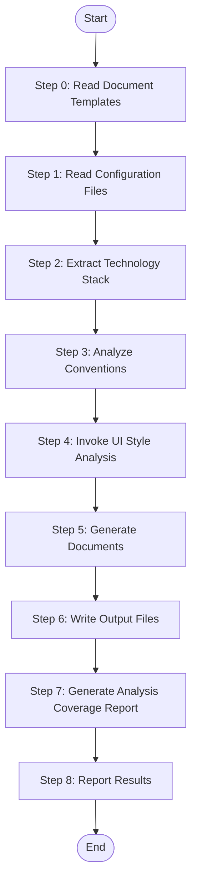

> **⚠️ DEPRECATED**: This skill has been superseded by `speccrew-knowledge-techs-generate-conventions` and `speccrew-knowledge-techs-generate-ui-style`. Use those skills for new requests. This file is kept for backward compatibility only.
>
> **Do NOT invoke this skill directly.** Use the specialized skills via `speccrew-knowledge-techs-dispatch` Stage 2 dual-worker orchestration.

# Stage 2: Generate Platform Technology Documents

Generate comprehensive technology documentation for a specific platform by analyzing its configuration files and source code structure.

## Language Adaptation

**CRITICAL**: Generate all content in the language specified by the `language` parameter.

## Input

- `platform_id`: Platform identifier (e.g., "web-react", "backend-nestjs")
- `platform_type`: Platform type (web, mobile, backend, desktop)
- `framework`: Primary framework (react, nestjs, flutter, etc.)
- `source_path`: Platform source directory
- `config_files`: List of configuration file paths
- `convention_files`: List of convention file paths (eslint, prettier, etc.)
- `output_path`: Output directory for generated documents
- `language`: Target language (e.g., "zh", "en") - **REQUIRED**
- `completed_dir`: (Optional) Directory for analysis coverage report output

## Output

**Required Documents (All Platforms)**: INDEX.md, tech-stack.md, architecture.md, conventions-design.md, conventions-dev.md, conventions-unit-test.md, conventions-system-test.md, conventions-build.md

**Optional Documents**: conventions-data.md (backend required), ui-style/ (frontend only)

**Quality Assurance**: After document generation, quality checks are performed by `speccrew-knowledge-techs-generate-quality` skill.

## Workflow



### Step 0: Read Document Templates

Read all template files from `templates/` directory to understand required content structure for each document type.

### Step 1: Read Configuration Files

**Primary Config Files:** package.json / pom.xml / requirements.txt / pubspec.yaml / go.mod, tsconfig.json, build configs

**Convention Files:** ESLint (.eslintrc.* / eslint.config.*), Prettier (.prettierrc.*), Testing configs, Git files

### Step 2: Extract Technology Stack

Parse configuration files to extract: Core Framework (name, version, language), Dependencies (production, dev, key versions), Build Tools (bundler, transpiler, task runner)

### Step 3: Analyze Conventions

1. Read `speccrew-workspace/docs/rules/mermaid-rule.md` for Mermaid compatibility guidelines
2. Extract conventions from ESLint/Prettier configs
3. Analyze project structure for directory conventions

#### Domain-Specific Convention Extraction (MANDATORY)

**For Frontend Platforms (web-vue, mobile-uniapp, etc.):**

| Topic | Where to Look |
|-------|---------------|
| i18n/Internationalization | `locales/`, `i18n/`, `lang/` |
| Authorization & Permissions | `permission/`, `router/`, `store/`, `utils/auth` |
| Menu Registration | `router/`, `store/`, `layout/` |
| Data Dictionary | `components/Dict`, `utils/dict`, `store/` |
| Logging | `utils/log`, `plugins/sentry` |
| API Request Layer | `utils/request`, `api/`, `config/` |
| Data Validation | `utils/validate`, form schemas |
| File Upload | `components/Upload`, `api/file` |

**For Backend Platforms (backend-spring, etc.):**

| Topic | Where to Look |
|-------|---------------|
| Authorization & Permissions | Security config, controller annotations |
| Data Dictionary | `dict/`, `system/` module |
| Multi-tenancy | MyBatis plugins, framework config |
| Backend i18n | `resources/i18n/`, `messages*.properties` |
| Logging | `logback*.xml`, `@OperateLog` |
| Exception Handling | `handler/`, `exception/`, `GlobalExceptionHandler` |
| Caching | `cache/`, `redis/`, `@Cacheable` annotations |
| Data Validation | DTO classes, `validator/` |
| Scheduled Jobs | `job/`, `task/`, `@Scheduled` methods |
| File Storage | `file/`, `infra/file/` |

**If a topic is not found**, explicitly state "Not applicable" in the corresponding section.

#### Analysis Tracking (MANDATORY)

For every topic, record: `found` / `not_found` / `partial`, and list all files analyzed. This tracking data is used in Step 7.

### Step 4: UI Style Analysis (Frontend Platforms Only)

If `platform_type` is `web`, `mobile`, or `desktop`:

**Primary Path**: Invoke `speccrew-knowledge-techs-ui-analyze` skill:
```
skill: "speccrew-knowledge-techs-ui-analyze"
args: "source_path={source_path};platform_id={platform_id};platform_type={platform_type};framework={framework};output_path={output_path}/ui-style/;language={language}"
```

**Fallback Path** (if analyzer fails): Create minimal ui-style/ directory with:
- ui-style/ui-style-guide.md
- ui-style/page-types/page-type-summary.md
- ui-style/components/component-library.md
- ui-style/layouts/page-layouts.md
- ui-style/styles/color-system.md

Record: `ui_style_analysis_level = "full" | "minimal" | "reference_only"`

**In conventions-design.md, include UI reference section** linking to ui-style/ui-style-guide.md.

### Step 5: Generate Documents (MANDATORY: Copy Template + Fill)

**Decision Logic for conventions-data.md**:
- Backend → Always generate
- Other platforms → Generate only if data layer detected (prisma/typeorm/sequelize/mongoose/drizzle-orm/firebase)

**Workflow for Each Document**:
1. Copy template file to output path
2. Use `search_replace` to fill sections with analyzed data
3. Preserve all template section headers and structure

**MANDATORY RULES**:
- Do NOT use create_file to rewrite entire document
- Do NOT delete or skip any template section
- Apply Source Traceability Requirements (see below)

### Step 6: Write Output Files

Create output directory if not exists, write all generated documents.

### Step 7: Generate Analysis Coverage Report (MANDATORY)

**Output file**: `{completed_dir}/{platform_id}.analysis.json`

**Report Format**:
```json
{
  "platform_id": "{platform_id}",
  "platform_type": "{platform_type}",
  "analyzed_at": "{ISO 8601 timestamp}",
  "topics": {
    "i18n": { "status": "found|not_found|partial", "files_analyzed": [], "notes": "" }
  },
  "config_files_analyzed": [],
  "source_dirs_scanned": [],
  "documents_generated": [],
  "coverage_summary": { "topics_found": 0, "topics_partial": 0, "topics_not_found": 0, "topics_total": 0, "coverage_percent": 0 }
}
```

### Step 8: Report Results

```
Platform Technology Documents Generated: {{platform_id}}
- INDEX.md: ✓
- tech-stack.md: ✓
- architecture.md: ✓
- conventions-design.md: ✓
- conventions-dev.md: ✓
- conventions-unit-test.md: ✓
- conventions-system-test.md: ✓
- conventions-build.md: ✓
- conventions-data.md: ✓ (or skipped)
- ui-style-guide.md: ✓ (frontend only, level: {{ui_style_analysis_level}})
- Output Directory: {{output_path}}
```

---

## Reference Guides

### Mermaid Diagram Guide

**Key Requirements:** Use basic node definitions only. No HTML tags, no nested subgraphs, no `direction` keyword, no `style` definitions.

**Diagram Types**: `graph TB/LR` (structure), `flowchart TD` (logic), `sequenceDiagram` (interactions), `classDiagram` (classes), `erDiagram` (database), `stateDiagram-v2` (states)

### Source Traceability Requirements

**CRITICAL: All source file links MUST use RELATIVE PATHS.** No absolute paths, no `file://` protocol.

**Relative Path Calculation**: Documents at `speccrew-workspace/knowledges/techs/{platform_id}/` are 4 levels deep. Use `../../../../` prefix to reference project root files.

**Required Elements**:
1. `<cite>` block at document beginning listing referenced files
2. `**Diagram Source**` annotation after each Mermaid diagram
3. `**Section Source**` annotation at end of major sections

### Document Content Specifications

#### INDEX.md
Platform summary, technology stack overview, navigation links, agent usage guide.

#### tech-stack.md
Overview, Core Technologies table, Dependencies (grouped), Development Tools, Configuration Files.

#### architecture.md
**Web**: Component Architecture, State Management, Routing, API Integration, Styling. **Backend**: Layered Architecture, DI, Module Organization, API Design, Middleware. **Mobile**: Widget Structure, State Management, Navigation, Platform considerations.

#### conventions-design.md
Design Principles (SOLID, DRY), Design Patterns, UI Design Conventions (reference ui-style/), Data Flow, Error Handling, Security, Performance.

#### conventions-dev.md
Naming Conventions, Directory Structure, Code Style (from ESLint/Prettier), Import/Export Patterns, Git Commit Conventions, Pre-Development Checklist, Code Review Checklist.

**Source extraction**: Prettier (.prettierrc), ESLint (.eslintrc), EditorConfig (.editorconfig), Git hooks (.husky/), Commit conventions (.commitlintrc), Runtime version (.nvmrc), IDE config (.vscode/).

#### conventions-unit-test.md / conventions-system-test.md
Unit Testing (framework, naming, location, template, run command), Integration Testing, E2E Testing (frontend only), Database Testing (backend only), Performance Testing, Coverage Requirements, Troubleshooting.

#### conventions-build.md
Build Tool & Configuration, Environment Management, Build Profiles & Outputs, CI/CD (if detected), Docker (if detected), Dependency Management.

#### conventions-data.md (Optional)
ORM/Database Tool, Data Modeling, Migrations, Query Optimization, Caching.

---

## Template Usage

| Template File | Purpose |
|---------------|---------|
| INDEX-TEMPLATE.md | Platform overview |
| TECH-STACK-TEMPLATE.md | Technology stack |
| ARCHITECTURE-TEMPLATE.md | Architecture patterns |
| CONVENTIONS-DESIGN-TEMPLATE.md | Design principles |
| CONVENTIONS-DEV-TEMPLATE.md | Development conventions |
| CONVENTIONS-UNIT-TEST-TEMPLATE.md | Unit testing |
| CONVENTIONS-SYSTEM-TEST-TEMPLATE.md | System testing |
| CONVENTIONS-BUILD-TEMPLATE.md | Build/deployment |
| CONVENTIONS-DATA-TEMPLATE.md | Data layer |

## Checklist

### Pre-Generation
- [ ] All configuration files read and parsed
- [ ] Technology stack extracted accurately
- [ ] Conventions analyzed from config files
- [ ] Platform type identified
- [ ] Data layer detection completed for non-backend platforms

### Required Documents (All Platforms)
- [ ] INDEX.md, tech-stack.md, architecture.md
- [ ] conventions-design.md, conventions-dev.md
- [ ] conventions-unit-test.md, conventions-system-test.md, conventions-build.md

### Optional Document
- [ ] conventions-data.md (if applicable)

### UI Style Analysis (Frontend Platforms)
- [ ] ui-analyze skill invoked
- [ ] ui-style-guide.md generated
- [ ] UI conventions referenced in conventions-design.md

## Task Completion Report

Upon completion, output the following structured report:

```json
{
  "status": "success | partial | failed",
  "skill": "speccrew-knowledge-techs-generate",
  "output_files": [
    "{output_path}/INDEX.md",
    "{output_path}/tech-stack.md",
    "{output_path}/architecture.md"
  ],
  "summary": "Tech documentation generated for {platform_id}",
  "metrics": {
    "documents_generated": 0,
    "sections_filled": 0,
    "code_examples_included": 0
  },
  "errors": [],
  "next_steps": ["Run quality check via speccrew-knowledge-techs-generate-quality"]
}
```
