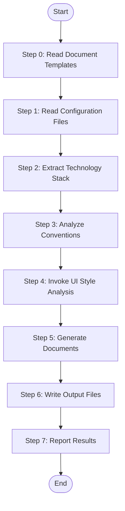

# Stage 2: Generate Platform Technology Documents

Generate comprehensive technology documentation for a specific platform by analyzing its configuration files and source code structure.

## Language Adaptation

**CRITICAL**: Generate all content in the language specified by the `language` parameter.

- `language: "zh"` → Generate all content in 中文
- `language: "en"` → Generate all content in English
- Other languages → Use the specified language

## Trigger Scenarios

- "Generate technology documents for {platform}"
- "Create tech stack documentation"
- "Extract conventions from {platform}"
- "Generate platform tech docs"

## User

Worker Agent (speccrew-task-worker)

## Input

- `platform_id`: Platform identifier (e.g., "web-react", "backend-nestjs")
- `platform_type`: Platform type (web, mobile, backend, desktop)
- `framework`: Primary framework (react, nestjs, flutter, etc.)
- `source_path`: Platform source directory
- `config_files`: List of configuration file paths
- `convention_files`: List of convention file paths (eslint, prettier, etc.)
- `output_path`: Output directory for generated documents (e.g., `speccrew-workspace/knowledges/techs/{platform_id}/`)
- `language`: Target language (e.g., "zh", "en") - **REQUIRED**

## Output

Generate the following documents in `{output_path}/`:

```
{output_path}/
├── INDEX.md                    # Platform technology index (Required)
├── tech-stack.md              # Technology stack details (Required)
├── architecture.md            # Architecture conventions (Required)
├── conventions-design.md      # Design conventions (Required)
├── conventions-dev.md         # Development conventions (Required)
├── conventions-test.md        # Testing conventions (Required)
├── conventions-data.md        # Data conventions (Optional)
└── ui-style/                  # UI style analysis (Optional, frontend platforms only)
    ├── ui-style-guide.md      # Main UI style guide
    ├── page-types/            # Page type analysis
    ├── components/            # Component analysis
    ├── layouts/               # Layout patterns
    └── styles/                # Styling conventions
```

### Platform Type to Document Mapping

| Platform Type | Required Documents | Optional Documents | Generate conventions-data.md? |
|---------------|-------------------|-------------------|------------------------------|
| `backend` | All 6 docs | - | ✅ **必须生成** - 包含 ORM、数据建模、缓存策略 |
| `web` | All 6 docs | conventions-data.md | ⚠️ **条件生成** - 仅当使用 ORM/数据层时（Prisma、TypeORM、Sequelize 等） |
| `mobile` | All 6 docs | conventions-data.md | ❌ **默认不生成** - 根据实际技术栈判断 |
| `desktop` | All 6 docs | conventions-data.md | ❌ **默认不生成** - 根据实际技术栈判断 |
| `api` | All 6 docs | conventions-data.md | ⚠️ **条件生成** - 根据是否有数据层 |

### Decision Logic for conventions-data.md

**Step 1: Check Platform Type**
- If `backend` → **Generate** (always)
- If `web`/`mobile`/`desktop`/`api` → Proceed to Step 2

**Step 2: Detect Data Layer (for non-backend platforms)**

Check configuration files for data layer indicators:

| Indicator | Technology | Action |
|-----------|------------|--------|
| `prisma` in package.json dependencies | Prisma ORM | Generate conventions-data.md |
| `typeorm` in package.json dependencies | TypeORM | Generate conventions-data.md |
| `sequelize` in package.json dependencies | Sequelize | Generate conventions-data.md |
| `mongoose` in package.json dependencies | Mongoose | Generate conventions-data.md |
| `drizzle-orm` in package.json dependencies | Drizzle ORM | Generate conventions-data.md |
| `firebase` / `@react-native-firebase` | Firebase | Generate conventions-data.md (lightweight) |
| `sqlite` / `realm` / `@realm/react` | SQLite/Realm | Generate conventions-data.md (lightweight) |
| `core-data` in iOS project | Core Data | Generate conventions-data.md |
| `room` in Android project | Room Persistence | Generate conventions-data.md |
| None detected | - | **Skip** conventions-data.md |

**Step 3: Report Decision**
```
Platform: {platform_id}
Type: {platform_type}
Framework: {framework}
Data Layer Detected: {yes/no/technology}
Generate conventions-data.md: {yes/no}
```

## Workflow



### Step 0: Read Document Templates

Before processing, read all template files to understand the required content structure for each document type:
- **Read**: `templates/INDEX-TEMPLATE.md` - Platform overview and navigation hub structure
- **Read**: `templates/TECH-STACK-TEMPLATE.md` - Technology stack details structure
- **Read**: `templates/ARCHITECTURE-TEMPLATE.md` - Architecture patterns and conventions structure
- **Read**: `templates/CONVENTIONS-DESIGN-TEMPLATE.md` - Design principles and patterns structure
- **Read**: `templates/CONVENTIONS-DEV-TEMPLATE.md` - Development conventions structure
- **Read**: `templates/CONVENTIONS-TEST-TEMPLATE.md` - Testing conventions structure
- **Read**: `templates/CONVENTIONS-DATA-TEMPLATE.md` - Data layer conventions structure (if applicable)
- **Purpose**: Understand each template's chapters and example content requirements
- **Key principle**: Extract information from source code according to template section requirements

### Step 1: Read Configuration Files

Read and parse all configuration files for the platform:

**Primary Config Files:**
- package.json / pom.xml / requirements.txt / pubspec.yaml / go.mod
- tsconfig.json / jsconfig.json
- Build config: vite.config.* / webpack.config.* / next.config.* / nest-cli.json

**Convention Files:**
- ESLint: .eslintrc.* / eslint.config.*
- Prettier: .prettierrc.* / prettier.config.*
- Testing: jest.config.* / vitest.config.* / pytest.ini
- Git: .gitignore, .gitattributes

### Step 2: Extract Technology Stack

Parse configuration files to extract:

**Core Framework:**
- Name and version from dependencies
- Primary language (TypeScript, JavaScript, Dart, etc.)

**Dependencies:**
- Production dependencies (grouped by purpose)
- Development dependencies
- Key library versions

**Build Tools:**
- Bundler (Vite, Webpack, Rollup)
- Transpiler (TypeScript, Babel)
- Task runner (npm scripts, Gradle, Maven)

**Example Extraction:**
```json
{
  "framework": "React",
  "framework_version": "18.2.0",
  "language": "TypeScript",
  "language_version": "5.3.0",
  "build_tool": "Vite 5.0.0",
  "key_dependencies": [
    { "name": "react-router-dom", "version": "6.20.0", "purpose": "Routing" },
    { "name": "zustand", "version": "4.4.0", "purpose": "State Management" }
  ]
}
```

### Step 3: Analyze Conventions

1. **Read Configuration**:
   - Read `speccrew-workspace/docs/rules/mermaid-rule.md` - Get Mermaid diagram compatibility guidelines

2. **Extract conventions from configuration files:**

**From ESLint Config:**
- Enabled rules
- Code style preferences
- Import/export patterns

**From Prettier Config:**
- Formatting rules (semi, quotes, tabWidth)
- Print width

**From Project Structure:**
- Directory conventions (src/, components/, utils/)
- File naming patterns
- Module organization

3. **Apply Mermaid Rules**:
   - Follow compatibility guidelines from `mermaid-rule.md`
   - See: [Mermaid Diagram Guide](#mermaid-diagram-guide)

### Step 4: Invoke UI Style Analysis (Frontend Platforms Only)

If `platform_type` is `web`, `mobile`, or `desktop`:

1. **CRITICAL**: Use the Skill tool to invoke `speccrew-ui-style-analyzer` with these exact parameters:
   ```
   skill: "speccrew-ui-style-analyzer"
   args: "source_path={source_path};platform_id={platform_id};platform_type={platform_type};framework={framework};output_path={output_path}/ui-style/;language={language}"
   ```

2. **Wait for completion** and verify output files exist:
   - `{output_path}/ui-style/ui-style-guide.md`
   - `{output_path}/ui-style/page-types/page-type-summary.md`
   - `{output_path}/ui-style/page-types/[type]-pages.md` (one per discovered type)
   - `{output_path}/ui-style/components/component-library.md`
   - `{output_path}/ui-style/components/common-components.md`
   - `{output_path}/ui-style/components/business-components.md`
   - `{output_path}/ui-style/layouts/page-layouts.md`
   - `{output_path}/ui-style/layouts/navigation-patterns.md`
   - `{output_path}/ui-style/styles/color-system.md`
   - `{output_path}/ui-style/styles/typography.md`
   - `{output_path}/ui-style/styles/spacing-system.md`

3. **If UI style analysis fails or is skipped**, generate a minimal placeholder in `conventions-design.md`:
   ```markdown
   ## UI Design Conventions
   
   > Note: UI style analysis was not completed. Refer to source code in `{{source_path}}` for UI patterns.
   ```

4. **If UI style analysis succeeds**, reference the generated docs in `conventions-design.md`:
   ```markdown
   ## UI Design Conventions
   
   This platform follows UI patterns documented in:
   - [UI Style Guide](ui-style/ui-style-guide.md)
   - [Page Type Summary](ui-style/page-types/page-type-summary.md)
   
   ### Page Type Selection Guide
   
   | Scenario | Recommended Page Type | Reference |
   |----------|----------------------|-----------|
   | [Business scenario] | [Page type] | [Reference] |
   ```

### Step 5: Generate Documents

1. **Load Templates**:
   - Use templates from `templates/` directory
   - See: [Template Reference](#template-reference)

2. **Generate Each Document**:
   - Follow [Document Structure Standard](#document-structure-standard)
   - Apply [Source Traceability Requirements](#source-traceability-requirements)
   - Generate: INDEX.md, tech-stack.md, architecture.md, conventions-*.md

### Step 6: Write Output Files

Create output directory if not exists, then write all generated documents.

### Step 7: Report Results

```
Platform Technology Documents Generated: {{platform_id}}
- INDEX.md: ✓
- tech-stack.md: ✓
- architecture.md: ✓
- conventions-design.md: ✓
- conventions-dev.md: ✓
- conventions-test.md: ✓
- conventions-data.md: ✓ (or skipped if not applicable)
- ui-style-guide.md: ✓ (frontend platforms only)
- Output Directory: {{output_path}}
```

---

## Reference Guides

### Mermaid Diagram Guide

When generating Mermaid diagrams, follow these compatibility guidelines:

**Key Requirements:**
- Use only basic node definitions: `A[text content]`
- No HTML tags (e.g., `<br/>`)
- No nested subgraphs
- No `direction` keyword
- No `style` definitions
- Use standard `graph TB/LR` syntax only

**Diagram Types:**

| Diagram Type | Use Case | Example Scenario |
|--------------|----------|------------------|
| `graph TB/LR` | Structure & Dependency | Module relationships, component hierarchy |
| `flowchart TD` | Business Logic Flow | Request processing, decision trees |
| `sequenceDiagram` | Interaction Flow | API calls, service communication |
| `classDiagram` | Class Structure | Entity relationships, inheritance |
| `erDiagram` | Database Schema | Table relationships, data model |
| `stateDiagram-v2` | State Machine | Order status, workflow states |

### Source Traceability Requirements

**CRITICAL**: All generated documents must include source traceability.

**1. File Reference Block (`<cite>`)**

Place at the beginning of each document:

```markdown
<cite>
**Files Referenced in This Document**
- [package.json](file://path/to/package.json)
- [tsconfig.json](file://path/to/tsconfig.json)
</cite>
```

**2. Diagram Source Annotation**

After each Mermaid diagram:

```markdown
**Diagram Source**
- [file-name.ext](file://path/to/file.ext#L10-L50)
```

**3. Section Source Annotation**

At the end of each major section:

```markdown
**Section Source**
- [file-name.ext](file://path/to/file.ext#L10-L50)
```

For generic guidance sections without specific file references:

```markdown
[This section provides general guidance, no specific file reference required]
```

### Document Structure Standard

All generated documents must follow this structure:

```markdown
# {{platform_name}} {{document_type}}

<cite>
**Files Referenced in This Document**
{{source_files}}
</cite>

> **Target Audience**: devcrew-designer-{{platform_id}}, devcrew-dev-{{platform_id}}, devcrew-test-{{platform_id}}

## Table of Contents
1. [Introduction](#introduction)
2. [Project Structure](#project-structure)
3. [Core Components](#core-components)
4. [Architecture Overview](#architecture-overview)
5. [Detailed Component Analysis](#detailed-component-analysis)
6. [Dependency Analysis](#dependency-analysis)
7. [Performance Considerations](#performance-considerations)
8. [Troubleshooting Guide](#troubleshooting-guide)
9. [Conclusion](#conclusion)
10. [Appendix](#appendix)

... content sections ...

**Section Source**
- [file.ext](file://path#Lstart-Lend)
```

### Document Content Specifications

#### INDEX.md

Platform overview and navigation hub.

**Content:**
- Platform summary (type, framework, language)
- Technology stack overview
- Quick links to all convention documents
- Agent usage guide

#### tech-stack.md

Detailed technology stack information.

**Sections:**
- Overview (framework, language, build tool)
- Core Technologies (table with versions)
- Dependencies (grouped by category)
  - UI/Framework
  - State Management
  - Routing
  - HTTP/API
  - Utilities
- Development Tools
- Configuration Files (list with paths)

#### architecture.md

Architecture patterns and conventions.

**Sections (Platform-Specific):**

**For Web (React/Vue/Angular):**
- Component Architecture (Atomic Design, Container/Presentational)
- State Management Patterns
- Routing Conventions
- API Integration Patterns
- Styling Approach

**For Backend (NestJS/Spring/Express):**
- Layered Architecture (Controller/Service/Repository)
- Dependency Injection
- Module Organization
- API Design Patterns
- Middleware/Interceptor Usage

**For Mobile (Flutter/React Native):**
- Widget/Component Structure
- State Management
- Navigation Patterns
- Platform-Specific Considerations

#### conventions-design.md

Design principles and patterns for detailed design.

**Sections:**
- Design Principles (SOLID, DRY, etc.)
- Component/Module Design Patterns
- **UI Design Conventions** (frontend platforms - reference ui-style analysis)
  - Link to `ui-style/ui-style-guide.md`
  - Link to `ui-style/page-types/page-type-summary.md`
- Data Flow Design
- Error Handling Patterns
- Security Considerations
- Performance Guidelines

#### conventions-dev.md

Development conventions for coding.

**Sections:**
- Naming Conventions (files, variables, classes, components)
- Directory Structure
- Code Style (from ESLint/Prettier)
- Import/Export Patterns
- Git Commit Conventions
- Code Review Checklist

#### conventions-test.md

Testing conventions and requirements.

**Sections:**
- Testing Framework
- Test File Naming and Location
- Coverage Requirements
- Unit Testing Patterns
- Integration Testing Patterns
- Mocking Strategies

#### conventions-data.md (Optional)

Data layer conventions (if applicable).

**Sections:**
- ORM/Database Tool
- Data Modeling Conventions
- Migration Patterns
- Query Optimization
- Caching Strategies

---

## Template Usage

### Template Reference

All templates are unified and located in `templates/` directory:

| Template File | Purpose |
|---------------|---------|
| `templates/INDEX-TEMPLATE.md` | Platform overview and navigation hub |
| `templates/TECH-STACK-TEMPLATE.md` | Technology stack details |
| `templates/ARCHITECTURE-TEMPLATE.md` | Architecture patterns and conventions |
| `templates/CONVENTIONS-DESIGN-TEMPLATE.md` | Design principles and patterns |
| `templates/CONVENTIONS-DEV-TEMPLATE.md` | Development conventions |
| `templates/CONVENTIONS-TEST-TEMPLATE.md` | Testing conventions |
| `templates/CONVENTIONS-DATA-TEMPLATE.md` | Data layer conventions |

Platform-specific content is generated dynamically based on:
- Platform type (web, mobile, backend, desktop)
- Framework (react, vue, springboot, etc.)
- Analyzed configuration files

## Document Generation Guidelines

### Be Specific

Extract actual values from config files:
- ✓ "React 18.2.0" (from package.json)
- ✗ "React (version varies)"

### Be Concise

Focus on actionable conventions:
- ✓ "Use PascalCase for component files: UserProfile.tsx"
- ✗ "There are many naming conventions to consider..."

### Include Examples

Wherever possible, include concrete examples:
```markdown
### Component Naming
- ✓ UserProfile.tsx
- ✓ OrderList.tsx
- ✗ userProfile.tsx
- ✗ order-list.tsx
```

## Checklist

### Pre-Generation
- [ ] All configuration files read and parsed
- [ ] Technology stack extracted accurately
- [ ] Conventions analyzed from config files

### Document Generation Decision
- [ ] Platform type identified (web/mobile/backend/desktop/api)
- [ ] Data layer detection completed for non-backend platforms
- [ ] Decision made on whether to generate conventions-data.md
  - [ ] Backend platform → Always generate
  - [ ] Other platforms → Generate only if data layer detected

### Required Documents (All Platforms)
- [ ] INDEX.md generated with navigation
- [ ] tech-stack.md generated with dependency tables
- [ ] architecture.md generated with platform-specific patterns
- [ ] conventions-design.md generated with design principles
- [ ] conventions-dev.md generated with naming and style rules
- [ ] conventions-test.md generated with testing requirements

### Optional Document
- [ ] conventions-data.md generated (only if applicable per platform type mapping)

### UI Style Analysis (Frontend Platforms - web/mobile/desktop)
- [ ] For web/mobile/desktop platforms: `speccrew-ui-style-analyzer` skill invoked with correct parameters
- [ ] `ui-style/ui-style-guide.md` generated
- [ ] `ui-style/page-types/page-type-summary.md` generated
- [ ] `ui-style/page-types/[type]-pages.md` generated (one per discovered page type)
- [ ] `ui-style/components/component-library.md` generated
- [ ] `ui-style/components/common-components.md` generated
- [ ] `ui-style/components/business-components.md` generated
- [ ] `ui-style/layouts/page-layouts.md` generated
- [ ] `ui-style/layouts/navigation-patterns.md` generated
- [ ] `ui-style/styles/color-system.md` generated
- [ ] `ui-style/styles/typography.md` generated
- [ ] `ui-style/styles/spacing-system.md` generated
- [ ] UI conventions properly referenced in `conventions-design.md`

### Quality Checks
- [ ] All files written to output_path
- [ ] **Source traceability**: `<cite>` block added to each document
- [ ] **Source traceability**: Diagram Source annotations added after each Mermaid diagram
- [ ] **Source traceability**: Section Source annotations added at end of major sections
- [ ] **Mermaid compatibility**: No `style`, `direction`, `<br/>`, or nested subgraphs
- [ ] **Document completeness**: Verify all required documents exist
- [ ] Results reported with conventions-data.md and ui-style-guide.md generation status

