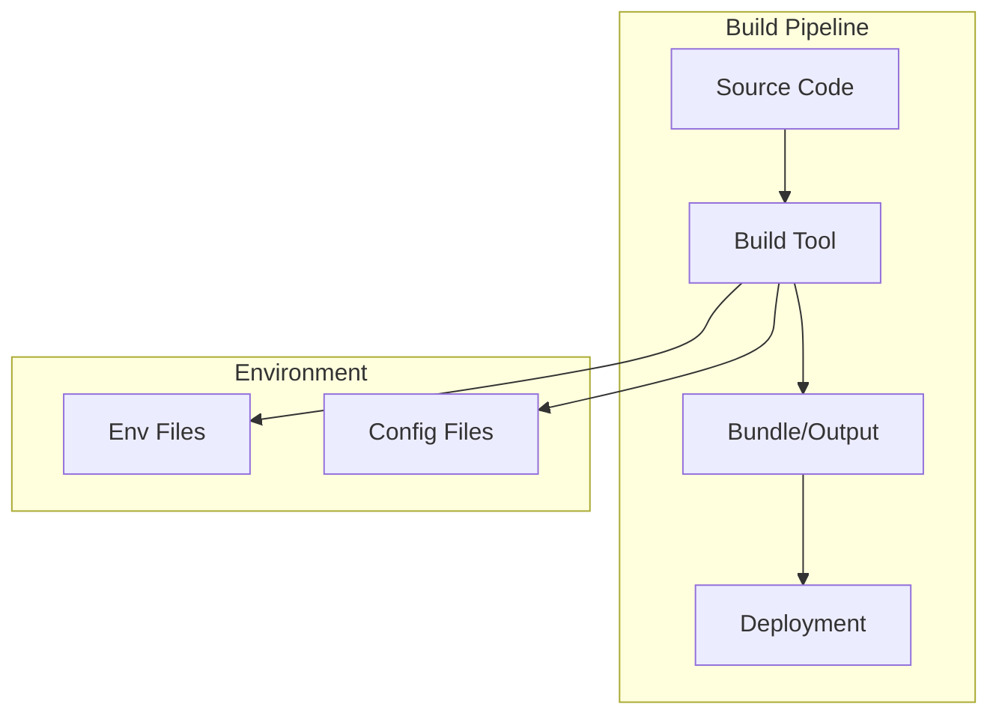
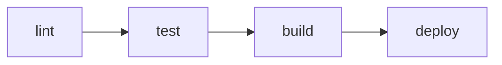

# {{platform_name}} Build & Deployment Conventions

**Files Referenced in This Document**

{{#each source_files}}
- [{{name}}](file://{{path}})
{{/each}}

> **Target Audience**: devcrew-designer-{{platform_id}}, devcrew-dev-{{platform_id}}, devcrew-test-{{platform_id}}

## Table of Contents

1. [Introduction](#introduction)
2. [Project Structure](#project-structure)
3. [Core Components](#core-components)
4. [Architecture Overview](#architecture-overview)
5. [Detailed Component Analysis](#detailed-component-analysis)
6. [Dependency Analysis](#dependency-analysis)
7. [Performance Considerations](#performance-considerations)
8. [Troubleshooting Guide](#troubleshooting-guide)
9. [Conclusion](#conclusion)
10. [Appendix](#appendix)

## Introduction

This build & deployment conventions document defines build tool configuration, environment management, build profiles & outputs, CI/CD pipeline conventions, Docker & container practices, and dependency management for the {{platform_name}} platform.

## Project Structure

### Build Directory Structure

```
{{build_directory_structure}}
```

```mermaid
graph TB
{{#each build_components}}
{{id}}["{{name}}"]
{{/each}}
{{#each build_relations}}
{{from}} --> {{to}}
{{/each}}
```

**Diagram Source**
{{#each structure_sources}}
- [{{name}}](file://{{path}}#L{{start}}-L{{end}})
{{/each}}

**Section Source**
{{#each project_structure_sources}}
- [{{name}}](file://{{path}}#L{{start}}-L{{end}})
{{/each}}

## Core Components

### Build Tool & Configuration

#### Primary Build Tool

| Tool | Version | Purpose |
|------|---------|---------|
{{#each build_tools}}
| {{name}} | {{version}} | {{purpose}} |
{{/each}}

#### Configuration Files

| Config File | Purpose | Key Settings |
|-------------|---------|--------------|
{{#each config_files}}
| `{{path}}` | {{purpose}} | {{key_settings}} |
{{/each}}

#### Build Commands Reference

| Command | Purpose | Example |
|---------|---------|---------|
{{#each build_commands}}
| `{{command}}` | {{purpose}} | `{{example}}` |
{{/each}}

**Section Source**
{{#each core_components_sources}}
- [{{name}}](file://{{path}}#L{{start}}-L{{end}})
{{/each}}

## Architecture Overview

### Build Architecture



**Diagram Source**
{{#each architecture_sources}}
- [{{name}}](file://{{path}}#L{{start}}-L{{end}})
{{/each}}

**Section Source**
{{#each architecture_overview_sources}}
- [{{name}}](file://{{path}}#L{{start}}-L{{end}})
{{/each}}

## Detailed Component Analysis

### Environment Management

#### Environment Files

| File | Purpose | Tracked in Git |
|------|---------|----------------|
{{#each env_files}}
| `{{path}}` | {{purpose}} | {{tracked}} |
{{/each}}

#### Environment Variable Naming Conventions

{{env_naming_conventions}}

#### Environment Differences

| Setting | Development | Staging | Production |
|---------|-------------|---------|------------|
{{#each env_settings}}
| {{setting}} | {{development}} | {{staging}} | {{production}} |
{{/each}}

#### Sensitive Configuration

{{sensitive_config_guidelines}}

**Section Source**
{{#each environment_sources}}
- [{{name}}](file://{{path}}#L{{start}}-L{{end}})
{{/each}}

### Build Profiles & Outputs

#### Build Modes

| Mode | Purpose | Output Directory |
|------|---------|------------------|
{{#each build_modes}}
| {{mode}} | {{purpose}} | `{{output_dir}}` |
{{/each}}

#### Output Directory & Structure

```
{{output_structure}}
```

#### Optimization Strategies

| Strategy | Enabled | Configuration |
|----------|---------|---------------|
{{#each optimization_strategies}}
| {{strategy}} | {{enabled}} | {{config}} |
{{/each}}

#### Bundle Size Considerations

{{#if is_frontend}}
| Metric | Target | Current |
|--------|--------|---------|
{{#each bundle_metrics}}
| {{metric}} | {{target}} | {{current}} |
{{/each}}
{{else}}
> Bundle size considerations apply to frontend platforms only.
{{/if}}

**Section Source**
{{#each build_profiles_sources}}
- [{{name}}](file://{{path}}#L{{start}}-L{{end}})
{{/each}}

### CI/CD Pipeline Conventions

{{#if ci_config_detected}}

#### CI Configuration

| Config File | Purpose |
|-------------|---------|
{{#each ci_configs}}
| `{{path}}` | {{purpose}} |
{{/each}}

#### Pipeline Stages



**Diagram Source**
{{#each pipeline_sources}}
- [{{name}}](file://{{path}}#L{{start}}-L{{end}})
{{/each}}

#### Deployment Targets & Triggers

| Branch | Target | Trigger |
|--------|--------|---------|
{{#each deployment_triggers}}
| `{{branch}}` | {{target}} | {{trigger}} |
{{/each}}

{{else}}

> CI/CD pipeline configuration not found in repository.

**Recommendation**: Consider setting up CI/CD pipeline using:
> - GitHub Actions: `.github/workflows/`
> - GitLab CI: `.gitlab-ci.yml`
> - Jenkins: `Jenkinsfile`
> - CircleCI: `.circleci/config.yml`

{{/if}}

**Section Source**
{{#each cicd_sources}}
- [{{name}}](file://{{path}}#L{{start}}-L{{end}})
{{/each}}

### Docker & Container

{{#if docker_detected}}

#### Dockerfile

| File | Purpose | Build Command |
|------|---------|---------------|
| `{{dockerfile_path}}` | {{purpose}} | `{{build_command}}` |

#### Image Naming Convention

{{image_naming_convention}}

#### Docker Compose Configuration

{{#if docker_compose_exists}}

| Service | Port | Purpose |
|---------|------|---------|
{{#each docker_services}}
| {{name}} | {{port}} | {{purpose}} |
{{/each}}

{{else}}
> No docker-compose configuration found.
{{/if}}

{{else}}

> Docker configuration not found in repository.

**Recommendation**: Consider containerizing the application for consistent deployment across environments.

{{/if}}

**Section Source**
{{#each docker_sources}}
- [{{name}}](file://{{path}}#L{{start}}-L{{end}})
{{/each}}

### Dependency Management

#### Package Manager

| Manager | Version | Lock File |
|---------|---------|-----------|
{{#each package_managers}}
| {{name}} | {{version}} | `{{lock_file}}` |
{{/each}}

#### Lock File Strategy

{{lock_file_strategy}}

#### Dependency Upgrade Workflow

{{#each upgrade_workflows}}
- {{this}}
{{/each}}

{{#if automation_detected}}

#### Dependency Automation

| Tool | Config File | Schedule |
|------|-------------|----------|
{{#each dependency_automation}}
| {{tool}} | `{{config}}` | {{schedule}} |
{{/each}}

{{/if}}

#### Compatibility Checking

| Requirement | Version | Source |
|-------------|---------|--------|
{{#each compatibility_requirements}}
| {{requirement}} | {{version}} | {{source}} |
{{/each}}

**Section Source**
{{#each dependency_sources}}
- [{{name}}](file://{{path}}#L{{start}}-L{{end}})
{{/each}}

## Dependency Analysis

### Build Dependencies

```mermaid
graph LR
{{#each build_deps}}
{{id}}["{{name}}"]
{{/each}}
{{#each build_dep_relations}}
{{from}} --> {{to}}
{{/each}}
```

**Diagram Source**
{{#each dependency_diagram_sources}}
- [{{name}}](file://{{path}}#L{{start}}-L{{end}})
{{/each}}

**Section Source**
{{#each dependency_analysis_sources}}
- [{{name}}](file://{{path}}#L{{start}}-L{{end}})
{{/each}}

## Performance Considerations

### Build Performance Guidelines

{{#each performance_guidelines}}
#### {{category}}

{{description}}

**Guidelines:**
{{#each items}}
- {{this}}
{{/each}}

{{/each}}

### Build Optimization Tips

{{build_optimization_tips}}

[This section provides general guidance, no specific file reference required]

## Troubleshooting Guide

### Common Build Issues

{{#each troubleshooting}}
#### {{issue}}

**Symptoms:**
{{#each symptoms}}
- {{this}}
{{/each}}

**Solutions:**
{{#each solutions}}
{{number}}. {{action}}
{{/each}}

{{/each}}

### Environment Issues

{{#each env_troubleshooting}}
#### {{issue}}

**Symptoms:**
{{#each symptoms}}
- {{this}}
{{/each}}

**Solutions:**
{{#each solutions}}
- {{this}}
{{/each}}

{{/each}}

**Section Source**
{{#each troubleshooting_sources}}
- [{{name}}](file://{{path}}#L{{start}}-L{{end}})
{{/each}}

## Conclusion

{{conclusion}}

[This section is a summary, no specific file reference required]

## Appendix

### Pre-Build Checklist

- [ ] Runtime version matches project requirements
- [ ] Dependencies installed (`{{install_command}}`)
- [ ] Environment variables configured
- [ ] No sensitive data in configuration files

### Build Checklist

- [ ] All tests pass
- [ ] Linting passes
- [ ] Build completes without errors
- [ ] Output artifacts generated correctly

### Deployment Checklist

- [ ] Environment variables set for target environment
- [ ] Database migrations applied (if applicable)
- [ ] Static assets uploaded (if applicable)
- [ ] Health check endpoint responding

### Common Build Commands

{{#each common_commands}}
#### {{name}}

```bash
{{command}}
```

{{description}}

{{/each}}

**Section Source**
{{#each appendix_sources}}
- [{{name}}](file://{{path}}#L{{start}}-L{{end}})
{{/each}}
