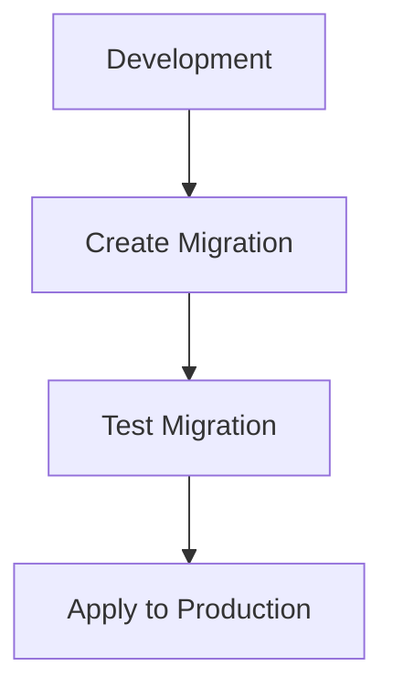

# {{platform_name}} Data Conventions

<cite>
**Files Referenced in This Document**
{{#each source_files}}
- [{{name}}](file://{{path}})
{{/each}}
</cite>

> **Target Audience**: devcrew-designer-{{platform_id}}, devcrew-dev-{{platform_id}}, devcrew-test-{{platform_id}}

## Table of Contents

1. [Introduction](#introduction)
2. [Project Structure](#project-structure)
3. [Core Components](#core-components)
4. [Architecture Overview](#architecture-overview)
5. [Detailed Component Analysis](#detailed-component-analysis)
6. [Dependency Analysis](#dependency-analysis)
7. [Performance Considerations](#performance-considerations)
8. [Troubleshooting Guide](#troubleshooting-guide)
9. [Conclusion](#conclusion)
10. [Appendix](#appendix)

## Introduction

This data conventions document defines ORM/database tools, data modeling conventions, migration patterns, query optimization, and caching strategies for the {{platform_name}} platform.

## Project Structure

### Data Layer Structure

```
{{data_directory_structure}}
```

```mermaid
graph TB
{{#each data_components}}
{{id}}["{{name}}"]
{{/each}}
{{#each data_relations}}
{{from}} --> {{to}}
{{/each}}
```

**Diagram Source**
{{#each structure_sources}}
- [{{name}}](file://{{path}}#L{{start}}-L{{end}})
{{/each}}

**Section Source**
{{#each project_structure_sources}}
- [{{name}}](file://{{path}}#L{{start}}-L{{end}})
{{/each}}

## Core Components

### ORM/Database Tool

| Tool | Version | Purpose |
|------|---------|---------|
{{#each orm_tools}}
| {{name}} | {{version}} | {{purpose}} |
{{/each}}

### Data Modeling Conventions

{{data_modeling_conventions}}

**Section Source**
{{#each core_components_sources}}
- [{{name}}](file://{{path}}#L{{start}}-L{{end}})
{{/each}}

## Architecture Overview

### Data Architecture

```mermaid
erDiagram
{{#each entities}}
{{name}} {
{{#each fields}}
{{type}} {{field_name}}
{{/each}}
}
{{/each}}
{{#each relationships}}
{{from}} ||--o{ {{to}} : "{{relation}}"
{{/each}}
```

**Diagram Source**
{{#each architecture_sources}}
- [{{name}}](file://{{path}}#L{{start}}-L{{end}})
{{/each}}

**Section Source**
{{#each architecture_overview_sources}}
- [{{name}}](file://{{path}}#L{{start}}-L{{end}})
{{/each}}

## Detailed Component Analysis

### Entity Design

{{entity_design}}

### Migration Patterns

{{migration_patterns}}



**Diagram Source**
{{#each migration_sources}}
- [{{name}}](file://{{path}}#L{{start}}-L{{end}})
{{/each}}

### Query Optimization

{{query_optimization}}

### Caching Strategies

{{caching_strategies}}

**Section Source**
{{#each component_analysis_sources}}
- [{{name}}](file://{{path}}#L{{start}}-L{{end}})
{{/each}}

## Dependency Analysis

### Data Layer Dependencies

```mermaid
graph LR
{{#each data_modules}}
{{id}}["{{name}}"]
{{/each}}
{{#each data_deps}}
{{from}} --> {{to}}
{{/each}}
```

**Diagram Source**
{{#each dependency_sources}}
- [{{name}}](file://{{path}}#L{{start}}-L{{end}})
{{/each}}

**Section Source**
{{#each dependency_analysis_sources}}
- [{{name}}](file://{{path}}#L{{start}}-L{{end}})
{{/each}}

## Performance Considerations

### Database Performance

{{#each performance_guidelines}}
#### {{category}}

{{description}}

**Guidelines:**
{{#each items}}
- {{this}}
{{/each}}

{{/each}}

### Indexing Strategy

{{indexing_strategy}}

[This section provides general guidance, no specific file reference required]

## Troubleshooting Guide

### Common Data Issues

{{#each troubleshooting}}
#### {{issue}}

**Symptoms:**
{{#each symptoms}}
- {{this}}
{{/each}}

**Solutions:**
{{#each solutions}}
- {{this}}
{{/each}}

{{/each}}

**Section Source**
{{#each troubleshooting_sources}}
- [{{name}}](file://{{path}}#L{{start}}-L{{end}})
{{/each}}

## Conclusion

{{conclusion}}

[This section is a summary, no specific file reference required]

## Appendix

### Data Conventions Checklist

{{#each data_checklist}}
- [ ] {{item}}
{{/each}}

### Common Data Scenarios

{{#each common_scenarios}}
#### {{name}}

{{description}}

**Recommended Approach:**
{{approach}}

{{/each}}

**Section Source**
{{#each appendix_sources}}
- [{{name}}](file://{{path}}#L{{start}}-L{{end}})
{{/each}}
