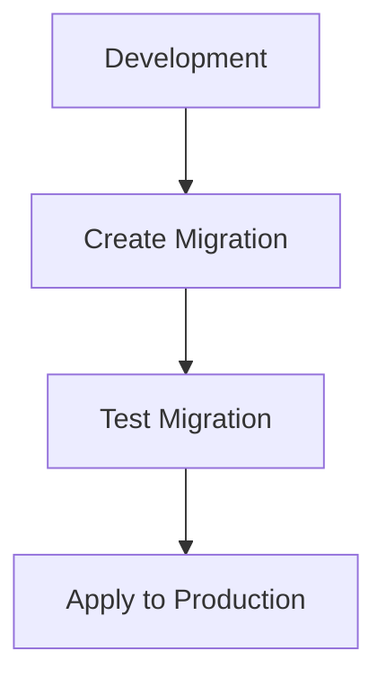

# {{platform_name}} Data Conventions

<cite>
**Files Referenced in This Document**
{{#each source_files}}
- [{{name}}](file://{{path}})
{{/each}}
</cite>

> **Target Audience**: devcrew-designer-{{platform_id}}, devcrew-dev-{{platform_id}}, devcrew-test-{{platform_id}}

## Table of Contents

1. [Introduction](#introduction)
2. [Project Structure](#project-structure)
3. [Core Components](#core-components)
4. [Architecture Overview](#architecture-overview)
5. [Detailed Component Analysis](#detailed-component-analysis)
6. [Dependency Analysis](#dependency-analysis)
7. [Performance Considerations](#performance-considerations)
8. [Troubleshooting Guide](#troubleshooting-guide)
9. [Conclusion](#conclusion)
10. [Appendix](#appendix)

## Introduction

This data conventions document defines ORM/database tools, data modeling conventions, migration patterns, query optimization, and caching strategies for the {{platform_name}} platform.

> **Platform Applicability**: This template primarily covers backend data layer conventions (ORM, database, migrations, queries). For frontend platforms, only the Dictionary Usage and Caching sections are typically applicable — fill other sections with "Not applicable - this is a frontend platform without direct database access."

## Project Structure

### Data Layer Structure

```
{{data_directory_structure}}
```

```mermaid
graph TB
{{#each data_components}}
{{id}}["{{name}}"]
{{/each}}
{{#each data_relations}}
{{from}} --> {{to}}
{{/each}}
```

**Diagram Source**
{{#each structure_sources}}
- [{{name}}](file://{{path}}#L{{start}}-L{{end}})
{{/each}}

**Section Source**
{{#each project_structure_sources}}
- [{{name}}](file://{{path}}#L{{start}}-L{{end}})
{{/each}}

## Core Components

### ORM/Database Tool

| Tool | Version | Purpose |
|------|---------|---------|
{{#each orm_tools}}
| {{name}} | {{version}} | {{purpose}} |
{{/each}}

### Data Modeling Conventions

{{data_modeling_conventions}}

**Section Source**
{{#each core_components_sources}}
- [{{name}}](file://{{path}}#L{{start}}-L{{end}})
{{/each}}

## Architecture Overview

### Data Architecture

```mermaid
erDiagram
{{#each entities}}
{{name}} {
{{#each fields}}
{{type}} {{field_name}}
{{/each}}
}
{{/each}}
{{#each relationships}}
{{from}} ||--o{ {{to}} : "{{relation}}"
{{/each}}
```

**Diagram Source**
{{#each architecture_sources}}
- [{{name}}](file://{{path}}#L{{start}}-L{{end}})
{{/each}}

**Section Source**
{{#each architecture_overview_sources}}
- [{{name}}](file://{{path}}#L{{start}}-L{{end}})
{{/each}}

## Detailed Component Analysis

### Entity Design

{{entity_design}}

### Migration Patterns

#### Migration Configuration

<!-- AI-TAG: MIGRATION_CONFIG -->
<!-- Backend only. Extract from project's actual migration setup. -->

| Config Item | Value |
|-------------|-------|
| Migration Tool | migration_tool (e.g., Flyway / Liquibase / Alembic / Prisma Migrate / TypeORM migrations / Knex migrations) |
| Script Language | script_language (e.g., SQL / XML / YAML / TypeScript / Python) |
| Script Directory | migration_script_dir (e.g., `src/main/resources/db/migration/`) |
| Naming Convention | migration_naming (e.g., `V{version}__{description}.sql` for Flyway) |
| Seed Data Directory | seed_data_dir (e.g., `src/main/resources/db/seed/`, or "N/A" if not used) |
| Seed Data Format | seed_data_format (e.g., SQL INSERT / JSON fixtures / CSV) |
| Execution Command | migration_run_cmd (e.g., `mvn flyway:migrate` / `npx prisma migrate dev`) |
| Validation Command | migration_validate_cmd (e.g., `mvn flyway:validate` / `npx prisma migrate diff`) |

#### Migration Workflow

<!-- AI-TAG: MIGRATION_PATTERNS -->
<!-- Backend only. If this platform is frontend or mobile, write 'Not applicable - database operations are handled at the backend layer.' -->

{{migration_patterns}}



**Diagram Source**
{{#each migration_sources}}
- [{{name}}](file://{{path}}#L{{start}}-L{{end}})
{{/each}}

#### Deployment Configuration

<!-- AI-TAG: DEPLOYMENT_CONFIG -->
<!-- Backend only. Extract from project's actual deployment/startup setup. -->

| Config Item | Value |
|-------------|-------|
| Build Command | build_cmd (e.g., `mvn package -DskipTests` / `npm run build`) |
| Start Command | start_cmd (e.g., `java -jar target/app.jar` / `npm start`) |
| Health Check URL | health_url (e.g., `http://localhost:8080/actuator/health`) |
| Health Check Timeout | health_timeout (e.g., 30s) |
| Stop Command | stop_cmd (e.g., `kill $PID` / Ctrl+C) |
| Verification Mode | verification_mode (e.g., `http` for server, `process` for desktop/mobile, `log` for log-based) |
| Process Name | process_name (e.g., `MyApp.exe` / `com.example.myapp`, for process mode. "N/A" for server) |
| Log File Path | log_file_path (e.g., `logs/app.log` / `~/Library/Logs/MyApp.log`, for log mode. "N/A" if not applicable) |
| Success Log Pattern | success_log_pattern (e.g., `"Application started"` / `"Ready"`, for log mode. "N/A" if not applicable) |

### Query Optimization

<!-- AI-TAG: QUERY_OPTIMIZATION -->
<!-- Backend only. If this platform is frontend or mobile, write 'Not applicable - database operations are handled at the backend layer.' -->

{{query_optimization}}

### Caching Strategies

{{caching_strategies}}

**Section Source**
{{#each component_analysis_sources}}
- [{{name}}](file://{{path}}#L{{start}}-L{{end}})
{{/each}}

## Dependency Analysis

### Data Layer Dependencies

```mermaid
graph LR
{{#each data_modules}}
{{id}}["{{name}}"]
{{/each}}
{{#each data_deps}}
{{from}} --> {{to}}
{{/each}}
```

**Diagram Source**
{{#each dependency_sources}}
- [{{name}}](file://{{path}}#L{{start}}-L{{end}})
{{/each}}

**Section Source**
{{#each dependency_analysis_sources}}
- [{{name}}](file://{{path}}#L{{start}}-L{{end}})
{{/each}}

## Performance Considerations

### Database Performance

{{#each performance_guidelines}}
#### {{category}}

{{description}}

**Guidelines:**
{{#each items}}
- {{this}}
{{/each}}

{{/each}}

### Indexing Strategy

<!-- AI-TAG: INDEXING_STRATEGY -->
<!-- Backend only. If this platform is frontend or mobile, write 'Not applicable - database operations are handled at the backend layer.' -->

{{indexing_strategy}}

[This section provides general guidance, no specific file reference required]

## Troubleshooting Guide

### Common Data Issues

{{#each troubleshooting}}
#### {{issue}}

**Symptoms:**
{{#each symptoms}}
- {{this}}
{{/each}}

**Solutions:**
{{#each solutions}}
- {{this}}
{{/each}}

{{/each}}

**Section Source**
{{#each troubleshooting_sources}}
- [{{name}}](file://{{path}}#L{{start}}-L{{end}})
{{/each}}

## Conclusion

{{conclusion}}

[This section is a summary, no specific file reference required]

## Appendix

### Data Conventions Checklist

{{#each data_checklist}}
- [ ] {{item}}
{{/each}}

### Common Data Scenarios

{{#each common_scenarios}}
#### {{name}}

{{description}}

**Recommended Approach:**
{{approach}}

{{/each}}

## Data Dictionary Management (Platform-Specific)

<!-- AI-TAG: DICTIONARY_MANAGEMENT -->
<!-- Fill with actual dictionary management patterns found in source code -->

### Backend Dictionary Management (if backend platform)

<!-- AI-TAG: BACKEND_DICTIONARY -->
<!-- Fill with backend dictionary management patterns. If frontend platform, skip this subsection. -->

#### Dictionary Entity Design

| Field | Type | Description |
|-------|------|-------------|
| field | type | description |

#### Dictionary CRUD Pattern

| Operation | Implementation | Cache Impact |
|-----------|---------------|-------------|
| Create | create_impl | cache_impact |
| Update | update_impl | cache_impact |
| Delete | delete_impl | cache_impact |

#### Dictionary Caching Strategy

| Item | Detail |
|------|--------|
| Cache Location | cache_location (e.g., Redis) |
| TTL | ttl |
| Invalidation | invalidation |

### Frontend Dictionary Usage (if frontend platform)

<!-- AI-TAG: FRONTEND_DICTIONARY -->
<!-- Fill with frontend dictionary consumption patterns. If backend platform, skip this subsection. -->

| Item | Detail |
|------|--------|
| Dictionary API | dict_api_endpoint |
| Local Cache | cache_location (e.g., Pinia store, localStorage, sessionStorage) |
| Cache TTL | cache_ttl |
| Refresh Strategy | refresh_strategy (e.g., on login, on demand, periodic) |

#### Dictionary Component Usage

```lang
// Example: Using dictionary values in frontend components
frontend_dict_example
```

#### Dictionary Helper/Utility

```lang
// Example: Dictionary lookup utility function
frontend_dict_utility_example
```

---

## Multi-tenancy Data Isolation (Platform-Specific)

<!-- AI-TAG: TENANT_DATA_ISOLATION -->
<!-- Fill if the platform implements multi-tenancy data isolation. If not applicable, write "Not applicable." -->

### Backend Tenant Data Isolation (if backend platform)

<!-- AI-TAG: BACKEND_TENANT_ISOLATION -->
<!-- Fill with backend tenant data isolation patterns. If frontend platform, skip this subsection. -->

#### Tenant Data Strategy

| Item | Detail |
|------|--------|
| Isolation Strategy | isolation_strategy |
| Tenant Column | tenant_column |
| Auto-Filter Plugin | auto_filter |

#### Tenant-Aware Repository Pattern

```lang
// Example showing how tenant isolation is enforced at the data layer
tenant_repo_example
```

#### Tables Excluded from Tenant Isolation

| Table | Reason |
|-------|--------|
| table | reason |

### Frontend Tenant Context (if frontend platform)

<!-- AI-TAG: FRONTEND_TENANT -->
<!-- Fill with frontend tenant context handling. If backend platform, skip this subsection. -->

| Item | Detail |
|------|--------|
| Tenant Identification | tenant_id_source (e.g., subdomain, URL path, login selection) |
| Tenant Header | tenant_header (e.g., X-Tenant-Id in request interceptor) |
| Tenant Storage | tenant_storage (e.g., localStorage, cookie, JWT claim) |
| UI Tenant Switching | tenant_switch_ui (e.g., dropdown, login page selection) |

```lang
// Example: Setting tenant context in request interceptor
frontend_tenant_example
```

---

## Caching Strategy (Platform-Specific)

<!-- AI-TAG: CACHING_STRATEGY -->
<!-- Fill with actual caching patterns found in source code. If not applicable, write "Not applicable." -->

### Backend Caching Strategy (if backend platform)

<!-- AI-TAG: BACKEND_CACHING_STRATEGY -->
<!-- Fill with backend caching patterns. If frontend platform, skip this subsection. -->

#### Cache Infrastructure

| Item | Detail |
|------|--------|
| Cache Provider | cache_provider (e.g., Redis, Caffeine, Ehcache) |
| Client Library | client_library |
| Configuration | cache_config |

#### Cache Key Naming Convention

| Convention | Pattern | Example |
|-----------|---------|---------|
| convention | pattern | example |

#### Cache Usage Patterns

| Pattern | Description | TTL | Example |
|---------|------------|-----|---------|
| pattern | description | ttl | example |

#### Cache Invalidation Strategy

| Trigger | Strategy | Implementation |
|---------|----------|---------------|
| trigger | strategy | implementation |

#### Cache Pitfall Prevention

| Pitfall | Prevention Strategy |
|---------|-------------------|
| Cache Penetration | prevention |
| Cache Avalanche | prevention |
| Cache Breakdown | prevention |

### Frontend Caching Strategy (if frontend platform)

<!-- AI-TAG: FRONTEND_CACHING_STRATEGY -->
<!-- Fill with frontend caching patterns. If backend platform, skip this subsection. -->

| Storage | Use Case | Max Size | Persistence | Example |
|---------|----------|----------|-------------|---------|
| localStorage | use_case | ~5MB | Permanent until cleared | example |
| sessionStorage | use_case | ~5MB | Browser tab session | example |
| IndexedDB | use_case | Large (50MB+) | Permanent until cleared | example |
| In-Memory (Store) | use_case | Runtime memory | Page session | example |

#### Cache Key Naming

| Convention | Pattern | Example |
|-----------|---------|---------|
| convention | pattern | example |

#### Cache Invalidation

| Trigger | Strategy | Example |
|---------|----------|---------|
| trigger | strategy | example |

```lang
// Example: Frontend caching utility
frontend_caching_example
```

**Section Source**
{{#each appendix_sources}}
- [{{name}}](file://{{path}}#L{{start}}-L{{end}})
{{/each}}
