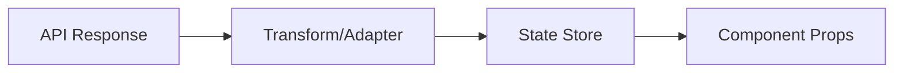
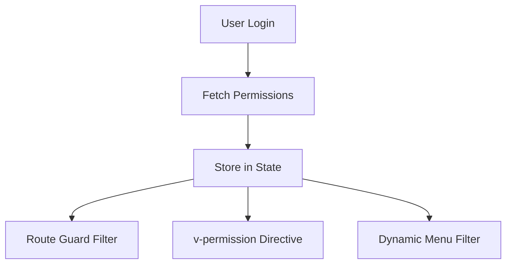

# {{platform_name}} Design Conventions

**Files Referenced in This Document**

| # | File | Source |
|---|------|--------|
{{#each source_files}}
| {{@index}} | {{name}} | [View]({{path}}) |
{{/each}}

> **Target Audience**: devcrew-designer-{{platform_id}}, devcrew-dev-{{platform_id}}, devcrew-test-{{platform_id}}

## Table of Contents

1. [Design Principles](#1-design-principles)
2. [Architecture Overview](#2-architecture-overview)
3. [API & Interface Design (Backend Only)](#3-api--interface-design-backend-only)
4. [Data Flow Design (Platform-Specific)](#4-data-flow-design-platform-specific)
5. [State & Session Design (Platform-Specific)](#5-state--session-design-platform-specific)
6. [Transaction Design (Backend Only)](#6-transaction-design-backend-only)
7. [Authorization & Permission Design (Platform-Specific)](#7-authorization--permission-design-platform-specific)
8. [Menu & Navigation Design (Frontend Only)](#8-menu--navigation-design-frontend-only)
9. [Multi-tenancy Design](#9-multi-tenancy-design)
10. [Exception Handling & Error Codes](#10-exception-handling--error-codes)
11. [Security Design](#11-security-design)
12. [Caching Design (Platform-Specific)](#12-caching-design-platform-specific)
13. [Logging Design (Architecture Level)](#13-logging-design-architecture-level)
14. [Distributed Design (Backend Only, if distributed)](#14-distributed-design-backend-only-if-distributed)
15. [Observability & Deployment Design (Platform-Specific)](#15-observability--deployment-design-platform-specific)
16. [Compliance & Governance](#16-compliance--governance)
17. [Performance Design](#17-performance-design)
18. [Anti-Patterns & Pitfalls](#18-anti-patterns--pitfalls)
19. [Appendix](#appendix)

---

## 1. Design Principles

<!-- AI-TAG: DESIGN_PRINCIPLES -->
<!-- Fill with SOLID principles, layered design principles, and design decision records found in source code -->

### 1.1 SOLID Principles

| Principle | Description | Application in {{platform_name}} |
|-----------|-------------|----------------------------------|
| SRP | Single Responsibility Principle | srp_application |
| OCP | Open/Closed Principle | ocp_application |
| LSP | Liskov Substitution Principle | lsp_application |
| ISP | Interface Segregation Principle | isp_application |
| DIP | Dependency Inversion Principle | dip_application |

**Good Example:**
```
good_solid_example
```

**Bad Example:**
```
bad_solid_example
```

### 1.2 Layered Design Principles

<!-- Fill with Controller/Service/Repository responsibility boundaries -->

| Layer | Responsibility | What to Do | What NOT to Do |
|-------|---------------|------------|----------------|
| Controller | controller_responsibility | controller_do | controller_not_do |
| Service | service_responsibility | service_do | service_not_do |
| Repository | repository_responsibility | repository_do | repository_not_do |

### 1.3 Design Decision Records

{{#each design_decisions}}
#### {{title}}

**Context:** {{context}}

**Decision:** {{decision}}

**Consequences:** {{consequences}}

{{/each}}

**Section Source**
{{#each design_principles_sources}}
- [{{name}}]({{path}}#L{{start}}-L{{end}})
{{/each}}

---

## 2. Architecture Overview

<!-- AI-TAG: ARCHITECTURE_OVERVIEW -->
<!-- Fill with overall architecture diagram, layered architecture details, and directory structure -->

### 2.1 Overall Architecture

```mermaid
graph TB
{{#each architecture_layers}}
{{id}}["{{name}}"]
{{/each}}
{{#each architecture_relations}}
{{from}} --> {{to}}
{{/each}}
```

**Diagram Source**
{{#each architecture_diagram_sources}}
- [{{name}}]({{path}}#L{{start}}-L{{end}})
{{/each}}

### 2.2 Layered Architecture Details

| Layer | Components | Key Responsibilities |
|-------|------------|---------------------|
{{#each layers}}
| {{name}} | {{components}} | {{responsibilities}} |
{{/each}}

### 2.3 Directory Structure Convention

```
{{directory_structure}}
```

**Section Source**
{{#each architecture_overview_sources}}
- [{{name}}]({{path}}#L{{start}}-L{{end}})
{{/each}}

---

## 3. API & Interface Design (Backend Only)

<!-- AI-TAG: API_DESIGN -->
<!-- Fill with RESTful API conventions, pagination standards, Swagger/OpenAPI specs, version management. If this platform is frontend or mobile, write 'Not applicable - API design is defined in the backend platform.' Frontend platforms should document their API consumption patterns in the DEV conventions instead. -->

### 3.1 RESTful Interface Specification

| Aspect | Convention | Example |
|--------|-----------|---------|
| HTTP Method Semantics | method_semantics | example |
| URL Naming | url_naming | example |
| Resource Naming | resource_naming | example |

### 3.2 Pagination Parameter Standardization

| Parameter | Type | Default | Description |
|-----------|------|---------|-------------|
| pageNum | int | 1 | Current page number |
| pageSize | int | 10 | Items per page |
| orderBy | string | null | Sort field |
| order | string | ASC | Sort direction (ASC/DESC) |

### 3.3 Interface Documentation Specification

{{#if has_swagger}}
**Swagger/OpenAPI Configuration:**
```
swagger_config
```
{{/if}}

### 3.4 Interface Compatibility & Version Management

| Version Strategy | Implementation | When to Use |
|-----------------|----------------|-------------|
| URL Versioning | /v1/, /v2/ | Major breaking changes |
| Header Versioning | X-API-Version | Minor changes |
| Query Parameter | ?version=1 | Legacy support |

### 3.5 Frontend Interface Integration (if frontend platform)

| Aspect | Convention |
|--------|-----------|
| API Client Pattern | api_client_pattern |
| Request Interceptor | request_interceptor |
| Response Handler | response_handler |

**Section Source**
{{#each api_design_sources}}
- [{{name}}]({{path}}#L{{start}}-L{{end}})
{{/each}}

---

## 4. Data Flow Design (Platform-Specific)

<!-- AI-TAG: DATA_FLOW -->
<!-- Fill with data flow patterns. For backend: DTO/VO/DO transformation rules. For frontend: Props/State/Model/API Response data flow. -->

### Backend Data Flow (if backend platform)

<!-- AI-TAG: BACKEND_DATA_FLOW -->
<!-- Fill with backend data flow patterns: DTO/VO/DO transformation rules. If frontend platform, skip this subsection. -->

#### 4.1 Data Flow Diagram

```mermaid
flowchart TD
{{#each data_flow_steps}}
{{id}}["{{action}}"]
{{/each}}
{{#each data_flow_relations}}
{{from}} --> {{to}}
{{/each}}
```

**Diagram Source**
{{#each data_flow_diagram_sources}}
- [{{name}}]({{path}}#L{{start}}-L{{end}})
{{/each}}

#### 4.2 DTO/VO/DO Transformation Specification

| Type | Purpose | Conversion Rules |
|------|---------|-----------------|
| DO (Data Object) | Database entity | do_rules |
| DTO (Data Transfer Object) | Inter-service transfer | dto_rules |
| VO (View Object) | Frontend response | vo_rules |
| BO (Business Object) | Business logic | bo_rules |

**Good Example:**
```
good_dto_conversion_example
```

**Bad Example:**
```
bad_dto_conversion_example
```

#### 4.3 Data Transfer Anti-Patterns

| Anti-Pattern | Problem | Solution |
|-------------|---------|----------|
| pattern_name | problem | solution |

**Section Source**
{{#each data_flow_sources}}
- [{{name}}]({{path}}#L{{start}}-L{{end}})
{{/each}}

### Frontend Data Flow (if frontend platform)

<!-- AI-TAG: FRONTEND_DATA_FLOW -->
<!-- Fill with frontend data flow patterns: Props, State, Computed, API Response mapping. If backend platform, skip this subsection. -->

| Layer | Data Type | Description | Example |
|-------|-----------|-------------|---------|
| API Response | response_type | description | example |
| State/Store | state_type | description | example |
| Component Props | props_type | description | example |
| Computed/Derived | derived_type | description | example |

#### Data Transformation Flow



**Good Example**
```lang
// Good: Clear data transformation from API to component
good_example
```

**Bad Example**
```lang
// Bad: Direct API response usage in component without transformation
bad_example
```

---

## 5. State & Session Design (Platform-Specific)

<!-- AI-TAG: STATE_DESIGN -->
<!-- Fill with state management patterns. For backend: Session/Token management, server-side state. For frontend: State management libraries like Vuex/Pinia/Redux/Zustand. -->

### Backend Session Design (if backend platform)

<!-- AI-TAG: BACKEND_SESSION_DESIGN -->
<!-- Fill with backend session management patterns: Session/Token management, server-side state. If frontend platform, skip this subsection. -->

#### 5.1 State Management Patterns

| Pattern | Use Case | Implementation |
|---------|----------|----------------|
| pattern_name | use_case | implementation |

#### 5.2 State Diagram

{{#if has_state_diagram}}
```mermaid
stateDiagram-v2
{{state_diagram_content}}
```

**Diagram Source**
{{#each state_diagram_sources}}
- [{{name}}]({{path}}#L{{start}}-L{{end}})
{{/each}}
{{/if}}

**Section Source**
{{#each state_design_sources}}
- [{{name}}]({{path}}#L{{start}}-L{{end}})
{{/each}}

### Frontend State Management Design (if frontend platform)

<!-- AI-TAG: FRONTEND_STATE_MANAGEMENT -->
<!-- Fill with frontend state management patterns. If backend platform, skip this subsection. -->

| Item | Detail |
|------|--------|
| State Library | state_library (e.g., Pinia, Vuex, Redux, Zustand, MobX) |
| Store Organization | store_organization (e.g., per-module, per-feature) |
| State Persistence | state_persistence (e.g., localStorage, sessionStorage) |

#### State Categories

| Category | Where to Store | Example |
|----------|---------------|---------|
| Server State | state_location | example |
| UI State | state_location | example |
| Form State | state_location | example |
| Auth State | state_location | example |

**Good Example**
```lang
good_state_example
```

**Bad Example**
```lang
bad_state_example
```

---

## 6. Transaction Design (Backend Only)

<!-- AI-TAG: TRANSACTION_DESIGN -->
<!-- Fill with transaction boundary rules, propagation mechanisms, isolation levels. If this platform is frontend or mobile, write 'Not applicable - transaction management is a backend concern.' -->

### 6.1 Transaction Boundary Rules

| Scenario | Transaction Scope | Justification |
|----------|------------------|---------------|
| scenario | scope | justification |

### 6.2 Propagation Mechanism Selection Guide

| Propagation | Use Case | Example Scenario |
|-------------|----------|-----------------|
| REQUIRED (Default) | Join existing or create new | Normal business operations |
| REQUIRES_NEW | Independent transaction | Audit logging, notification |
| NESTED | Sub-transaction with savepoint | Partial rollback scenarios |
| SUPPORTS | Optional participation | Read-only queries |
| NOT_SUPPORTED | Suspend current transaction | Non-transactional operations |
| MANDATORY | Must have existing transaction | Sub-service calls |
| NEVER | Must not have transaction | Pure query methods |

### 6.3 Isolation Level Selection

| Isolation Level | Use Case | Concurrency Issue Prevention |
|-----------------|----------|------------------------------|
| READ_UNCOMMITTED | Rarely used | None |
| READ_COMMITTED | Default for most cases | Dirty read |
| REPEATABLE_READ | Financial calculations | Dirty read, non-repeatable read |
| SERIALIZABLE | Critical operations | All concurrency issues |

### 6.4 Distributed Transaction Solution (if applicable)

| Solution | Use Case | Implementation |
|----------|----------|----------------|
| 2PC/3PC | Strong consistency required | implementation |
| TCC | Try-Confirm-Cancel pattern | implementation |
| Saga | Long-running transactions | implementation |
| Local Message Table | Eventually consistent | implementation |

### 6.5 Transaction Anti-Patterns

| Anti-Pattern | Problem | Solution |
|-------------|---------|----------|
| Transaction Abuse | Performance degradation | Minimize transaction scope |
| Long Transaction | Lock contention | Break into smaller transactions |
| Nested Service Calls | Unexpected rollback | Careful propagation selection |

**Good Example:**
```
good_transaction_example
```

**Bad Example:**
```
bad_transaction_example
```

**Section Source**
{{#each transaction_design_sources}}
- [{{name}}]({{path}}#L{{start}}-L{{end}})
{{/each}}

---

## 7. Authorization & Permission Design (Platform-Specific)

<!-- AI-TAG: PERMISSION_DESIGN -->
<!-- Fill with permission architecture. For backend: Permission framework, annotations, data scope. For frontend: Route guards, permission directives, menu filtering. -->

### Backend Permission Architecture (if backend platform)

<!-- AI-TAG: BACKEND_PERMISSION_ARCHITECTURE -->
<!-- Fill with backend permission framework content. If frontend platform, skip this subsection. -->

#### 7.1 Permission Architecture

```mermaid
graph TB
{{#each permission_components}}
{{id}}["{{name}}"]
{{/each}}
{{#each permission_relations}}
{{from}} --> {{to}}
{{/each}}
```

#### 7.2 Permission Check Flow

| Stage | Action | Implementation | Code Example |
|-------|--------|---------------|--------------|
| stage | action | implementation | `@PreAuthorize("hasRole('ADMIN')")` |

#### 7.3 Data Permission Strategy

| Strategy | Description | Example | Annotation |
|----------|-------------|---------|------------|
| strategy | description | example | `@DataPermission` |

#### 7.4 Permission Annotation Usage Examples

```java
// Role-based permission
@PreAuthorize("hasRole('ADMIN')")

// Permission-based
@PreAuthorize("hasPermission('system:user:create')")

// Data scope
@DataPermission(deptAlias = "d", userAlias = "u")
```

**Section Source**
{{#each permission_design_sources}}
- [{{name}}]({{path}}#L{{start}}-L{{end}})
{{/each}}

### Frontend Permission Design (if frontend platform)

<!-- AI-TAG: FRONTEND_PERMISSION_DESIGN -->
<!-- Fill with frontend permission UI design. If backend platform, skip this subsection. -->

| Item | Detail |
|------|--------|
| Permission Data Source | permission_source (e.g., login API response, user info API) |
| Permission Storage | permission_storage (e.g., Pinia store, Vuex, Redux) |
| Route Guard Strategy | route_guard_strategy |
| Button/Element Control | element_permission_strategy |

#### Permission Flow



**Good Example**
```lang
good_permission_example
```

**Bad Example**
```lang
bad_permission_example
```

---

## 8. Menu & Navigation Design (Frontend Only)

<!-- AI-TAG: MENU_DESIGN -->
<!-- Fill with menu/navigation design patterns. If this platform is backend, write 'Not applicable - menu and navigation design is a frontend concern. Backend exposes menu data via API endpoint.' -->

### 8.1 Menu Architecture

| Item | Detail |
|------|--------|
| Menu Levels | menu_levels |
| Navigation Pattern | nav_pattern |
| Dynamic Loading | dynamic_loading |
| Icon System | icon_system |

### 8.2 Menu Permission Integration

| Mechanism | Description | Implementation |
|-----------|-------------|----------------|
| mechanism | description | implementation |

### 8.3 Route Configuration (if frontend platform)

| Property | Description | Example |
|----------|-------------|---------|
| path | Route path | /system/user |
| component | Component reference | views/system/user/index |
| meta.permissions | Required permissions | ['system:user:list'] |

**Section Source**
{{#each menu_design_sources}}
- [{{name}}]({{path}}#L{{start}}-L{{end}})
{{/each}}

---

## 9. Multi-tenancy Design

<!-- AI-TAG: MULTITENANCY_DESIGN -->
<!-- Fill if the platform implements multi-tenancy. If not applicable, write "Not applicable - this platform does not implement multi-tenancy." -->

### 9.1 Tenant Isolation Strategy

| Item | Detail |
|------|--------|
| Isolation Level | isolation_level (row-level, schema-level, database-level) |
| Tenant Identifier | tenant_id_field |
| Tenant Context | tenant_context (ThreadLocal, HTTP header, JWT claim) |
| Default Tenant | default_tenant_id |

### 9.2 Tenant-Aware Query Pattern

```java
// Example of tenant-aware data access
tenant_query_example
```

### 9.3 Cross-Tenant Access Control

| Scenario | Rule | Implementation |
|----------|------|---------------|
| scenario | rule | implementation |

### 9.4 Tenant Data Migration

| Operation | Strategy |
|-----------|----------|
| Tenant onboarding | strategy |
| Tenant offboarding | strategy |

**Section Source**
{{#each multitenancy_design_sources}}
- [{{name}}]({{path}}#L{{start}}-L{{end}})
{{/each}}

---

## 10. Exception Handling & Error Codes

<!-- AI-TAG: EXCEPTION_HANDLING -->
<!-- Fill with exception handling patterns, error code system, response formats -->

### 10.1 Global Exception Handler

| Item | Detail |
|------|--------|
| Handler Class/Middleware | exception_handler |
| Location | handler_location |
| Handler Pattern | handler_pattern |

### 10.2 Error Code System

| Code Range | Category | Example |
|-----------|----------|---------|
| 000-099 | System errors | 001: Service unavailable |
| 100-199 | Authentication errors | 101: Token expired |
| 200-299 | Authorization errors | 201: Access denied |
| 300-399 | Validation errors | 301: Invalid parameter |
| 400-499 | Business errors | 401: User not found |
| 500-599 | Integration errors | 501: Third-party service error |

### 10.3 Exception Hierarchy

| Exception Type | HTTP Status | When to Use | Example |
|---------------|------------|-------------|---------|
| BusinessException | 200 | Business logic error | User not found |
| ValidationException | 400 | Input validation | Invalid email format |
| AuthenticationException | 401 | Auth failure | Invalid credentials |
| AuthorizationException | 403 | Permission denied | No admin role |
| SystemException | 500 | System error | Database connection failed |

### 10.4 Error Response Format

```json
{
  "code": "error_code",
  "message": "error_message",
  "data": null,
  "traceId": "trace_id",
  "timestamp": 1234567890
}
```

### 10.5 Frontend Error Handling (if frontend platform)

| Error Type | Handling Strategy | User Feedback |
|-----------|------------------|---------------|
| Network Error | strategy | feedback |
| Business Error (200 with error code) | strategy | feedback |
| Auth Error (401) | Redirect to login | "Session expired, please login again" |
| Permission Error (403) | Show forbidden page | "You don't have permission" |
| Validation Error (400) | Highlight fields | field-specific message |

### 10.6 Error Code Assignment Process

1. Identify error category
2. Check existing codes in the range
3. Assign next available code
4. Document in error code registry
5. Add i18n message if needed

### 10.7 Cross-Service Exception Propagation (if distributed)

| Scenario | Strategy | Implementation |
|----------|----------|----------------|
| Service A calls Service B | strategy | implementation |
| Circuit breaker triggered | strategy | implementation |

**Section Source**
{{#each exception_handling_sources}}
- [{{name}}]({{path}}#L{{start}}-L{{end}})
{{/each}}

---

## 11. Security Design

<!-- AI-TAG: SECURITY_DESIGN -->
<!-- Fill with security protection matrix, XSS/CSRF/SQL injection prevention, encryption, sensitive data masking -->

### 11.1 Security Protection Matrix

| Threat | Protection Mechanism | Implementation |
|--------|---------------------|----------------|
| XSS | xss_protection | implementation |
| CSRF | csrf_protection | implementation |
| SQL Injection | sql_injection_protection | implementation |
| Session Hijacking | session_protection | implementation |
| Brute Force | rate_limiting | implementation |

### 11.2 XSS/CSRF/SQL Injection Prevention

**XSS Prevention:**
```
xss_prevention_config
```

**CSRF Prevention:**
```
csrf_prevention_config
```

**SQL Injection Prevention:**
```
sql_injection_prevention_config
```

### 11.3 API Encryption & Key Management

| Aspect | Implementation |
|--------|---------------|
| Transport Encryption | TLS 1.2+ |
| Payload Encryption | encryption_method |
| Key Storage | key_storage_method |
| Key Rotation | rotation_policy |

### 11.4 Unauthorized Access Prevention

| Mechanism | Implementation |
|-----------|---------------|
| URL-based access control | implementation |
| Method-level security | implementation |
| Data scope filtering | implementation |

### 11.5 Sensitive Data Masking Rules

| Data Type | Masking Rule | Example |
|-----------|-------------|---------|
| Phone Number | `***####` | 138****8888 |
| ID Card | `************####` | 110101********1234 |
| Bank Card | `****####****####` | ****8888****8888 |
| Email | `**@domain.com` | ab**@gmail.com |

**Good Example:**
```
good_security_example
```

**Bad Example:**
```
bad_security_example
```

**Section Source**
{{#each security_design_sources}}
- [{{name}}]({{path}}#L{{start}}-L{{end}})
{{/each}}

---

## 12. Caching Design (Platform-Specific)

<!-- AI-TAG: CACHING_DESIGN -->
<!-- Fill with caching strategies. For backend: Redis/Caffeine/cache implementations. For frontend: localStorage/sessionStorage/IndexedDB/Service Worker. -->

### Backend Caching Design (if backend platform)

<!-- AI-TAG: BACKEND_CACHING -->
<!-- Fill with backend caching strategies: Redis/Caffeine/cache implementations. If frontend platform, skip this subsection. -->

#### 12.1 Caching Strategy Selection

| Strategy | Use Case | Consistency | Complexity |
|----------|----------|-------------|------------|
| Cache-Aside | Read-heavy, eventual consistency | Low | Low |
| Write-Through | Write-heavy, strong consistency | High | Medium |
| Write-Behind | High write throughput | Low | High |
| Read-Through | Simplified cache logic | Medium | Low |

#### 12.2 Cache Consistency Solutions

| Scenario | Solution | Trade-off |
|----------|----------|-----------|
| Cache update | solution | trade_off |
| Cache invalidation | solution | trade_off |
| Concurrent update | solution | trade_off |

#### 12.3 Cache Penetration/Breakdown/Avalanche Prevention

| Problem | Cause | Solution |
|---------|-------|----------|
| Cache Penetration | Query non-existent data | Bloom filter, empty value caching |
| Cache Breakdown | Hot key expires | Mutex lock, logical expiration |
| Cache Avalanche | Mass key expiration | Random TTL, circuit breaker |

#### 12.4 Scenario-Based Caching Decisions

| Scenario | Strategy | TTL | Notes |
|----------|----------|-----|-------|
| High read, low write | strategy | ttl | notes |
| Low read, high write | strategy | ttl | notes |
| Real-time data | strategy | ttl | notes |

**Good Example:**
```
good_caching_example
```

**Bad Example:**
```
bad_caching_example
```

**Section Source**
{{#each caching_design_sources}}
- [{{name}}]({{path}}#L{{start}}-L{{end}})
{{/each}}

### Frontend Caching Design (if frontend platform)

<!-- AI-TAG: FRONTEND_CACHING -->
<!-- Fill with frontend caching strategies. If backend platform, skip this subsection. -->

| Storage Type | Use Case | Capacity | Persistence |
|-------------|----------|----------|-------------|
| localStorage | use_case | ~5MB | Permanent |
| sessionStorage | use_case | ~5MB | Tab session |
| IndexedDB | use_case | Large | Permanent |
| Memory (State Store) | use_case | Runtime | Page session |

#### Cache Invalidation Strategy

| Data Type | Cache Location | TTL/Invalidation | Example |
|-----------|---------------|------------------|---------|
| data_type | location | strategy | example |

**Good Example**
```lang
good_cache_example
```

**Bad Example**
```lang
bad_cache_example
```

---

## 13. Logging Design (Architecture Level)

<!-- AI-TAG: LOGGING_DESIGN -->
<!-- Fill with logging patterns at design level. If not applicable, write "Not applicable." -->

### 13.1 Log Content Template

| Field | Description | Example |
|-------|-------------|---------|
| traceId | Distributed tracing ID | trace_id_format |
| userId | Current user ID | user_id_format |
| requestId | Request identifier | request_id_format |
| timestamp | Log timestamp | ISO 8601 |
| level | Log level | INFO, WARN, ERROR |
| class | Source class | ClassName.method |
| message | Log message | message_format |
| context | Additional context | JSON format |

### 13.2 Log Level Usage Specification

| Level | Use Case | Example |
|-------|----------|---------|
| ERROR | System errors, exceptions | Database connection failed |
| WARN | Business anomalies, recoverable | Login failed, validation error |
| INFO | Key business events | User login, order created |
| DEBUG | Development debugging | Method entry/exit, variable values |
| TRACE | Detailed tracing | SQL statements, request details |

### 13.3 Sensitive Information Masking Rules

| Data Type | Masking Strategy |
|-----------|-----------------|
| Password | Never log, replace with [MASKED] |
| Token | Log first 6 chars only |
| Credit Card | Mask all but last 4 digits |
| Personal ID | Full mask in logs |

### 13.4 Audit Log Design

| Aspect | Specification |
|--------|--------------|
| What to log | User actions, data changes, security events |
| Log format | Structured JSON |
| Retention | retention_policy |
| Storage | storage_solution |
| Compliance | compliance_requirements |

**Section Source**
{{#each logging_design_sources}}
- [{{name}}]({{path}}#L{{start}}-L{{end}})
{{/each}}

---

## 14. Distributed Design (Backend Only, if distributed)

<!-- AI-TAG: DISTRIBUTED_DESIGN -->
<!-- Fill with distributed patterns. If this platform is frontend/mobile, or if the backend is a monolithic architecture, write 'Not applicable.' -->

### 14.1 Distributed Lock Specification

| Implementation | Use Case | Pros | Cons |
|---------------|----------|------|------|
| Redis RedLock | High availability | Fast, scalable | Clock skew issues |
| ZooKeeper | Strong consistency | Reliable | Higher latency |
| Database | Simple scenarios | Easy to implement | Performance bottleneck |

**Usage Pattern:**
```
distributed_lock_example
```

### 14.2 Cross-Service Call Design

| Aspect | Configuration | Recommendation |
|--------|--------------|----------------|
| Timeout | timeout_value | Set based on P99 latency |
| Retry | retry_policy | Exponential backoff |
| Fallback | fallback_strategy | Degrade gracefully |
| Circuit Breaker | cb_config | Fail fast on errors |

### 14.3 Database Sharding Design Principles

| Aspect | Principle |
|--------|-----------|
| Shard Key Selection | shard_key_principle |
| Sharding Strategy | strategy |
| Rebalancing | rebalancing_approach |
| Cross-shard Query | cross_shard_solution |

### 14.4 Message Queue Usage Specification

| Aspect | @Async | MQ |
|--------|--------|-----|
| Use Case | async_use_case | mq_use_case |
| Reliability | reliability_level | high |
| Ordering | ordering | guaranteed |
| Scalability | limited | high |

**Decision Guide:**
- Use @Async for: Simple async tasks, same JVM, acceptable loss
- Use MQ for: Cross-service, guaranteed delivery, high throughput

**Section Source**
{{#each distributed_design_sources}}
- [{{name}}]({{path}}#L{{start}}-L{{end}})
{{/each}}

---

## 15. Observability & Deployment Design (Platform-Specific)

<!-- AI-TAG: OBSERVABILITY_DESIGN -->
<!-- Fill with monitoring and observability patterns. For backend: JVM/APM/metrics. For frontend: Error reporting, performance monitoring, user analytics. -->

### Backend Observability (if backend platform)

<!-- AI-TAG: BACKEND_OBSERVABILITY -->
<!-- Fill with backend observability: JVM/APM/metrics, health checks. If frontend platform, skip this subsection. -->

#### 15.1 Monitoring Metrics Design

| Category | Metrics | Collection Method |
|----------|---------|------------------|
| JVM | Heap, GC, Threads | Micrometer + Prometheus |
| API | QPS, Latency, Error Rate | AOP interceptors |
| Database | Connection pool, Slow queries | DataSource metrics |
| Cache | Hit rate, Eviction rate | Cache statistics |

#### 15.2 Distributed Tracing Integration

| Solution | Integration | Trace Propagation |
|----------|-------------|------------------|
| SkyWalking | Agent-based | Automatic |
| Zipkin | Client library | Manual headers |
| Jaeger | Agent-based | Automatic |

#### 15.3 Health Check Interface Design

| Endpoint | Purpose | Response |
|----------|---------|----------|
| /health | Liveness probe | {"status": "UP"} |
| /ready | Readiness probe | {"ready": true} |
| /metrics | Metrics export | Prometheus format |

#### 15.4 Configuration Externalization

| Configuration | Externalization Method | Reload Support |
|--------------|----------------------|----------------|
| Database | Config center | hot_reload |
| Cache | Config center | hot_reload |
| Feature flags | Config center | hot_reload |

#### 15.5 Containerization Adaptation (if applicable)

| Aspect | Specification |
|--------|--------------|
| Base Image | base_image |
| Resource Limits | cpu_limit, memory_limit |
| Health Probes | probe_configuration |
| Logging | stdout/stderr |

**Section Source**
{{#each observability_design_sources}}
- [{{name}}]({{path}}#L{{start}}-L{{end}})
{{/each}}

### Frontend Monitoring (if frontend platform)

<!-- AI-TAG: FRONTEND_MONITORING -->
<!-- Fill with frontend monitoring and error reporting setup. If backend platform, skip this subsection. -->

| Item | Detail |
|------|--------|
| Error Reporting | error_reporting_tool (e.g., Sentry, Bugsnag, custom) |
| Performance Monitoring | perf_monitoring (e.g., Web Vitals, Lighthouse CI) |
| User Analytics | analytics_tool (e.g., Google Analytics, Mixpanel) |
| Log Collection | log_collection (e.g., custom API, third-party service) |

#### Key Metrics

| Metric | Target | Measurement |
|--------|--------|-------------|
| LCP (Largest Contentful Paint) | target | measurement_method |
| FID (First Input Delay) | target | measurement_method |
| CLS (Cumulative Layout Shift) | target | measurement_method |
| Error Rate | target | measurement_method |

---

## 16. Compliance & Governance

<!-- AI-TAG: COMPLIANCE_DESIGN -->
<!-- Fill with compliance requirements. If not applicable, write "Not applicable." -->

### 16.1 Data Privacy Protection

| Regulation | Requirement | Implementation |
|------------|-------------|----------------|
| GDPR | Right to erasure | data_deletion_procedure |
| GDPR | Data portability | data_export_api |
| 等保2.0 | Access control | access_control_measures |
| 等保2.0 | Audit logging | audit_log_implementation |

### 16.2 Dependency Management Specification

| Aspect | Rule |
|--------|------|
| Version Selection | Prefer stable releases, LTS versions |
| Upgrade Strategy | upgrade_strategy |
| Vulnerability Scanning | scan_frequency, tools |
| License Compliance | allowed_licenses |

### 16.3 Code Quality Governance

| Tool | Purpose | Configuration |
|------|---------|---------------|
| CheckStyle | Style enforcement | checkstyle_config_location |
| PMD | Static analysis | pmd_config_location |
| SpotBugs | Bug detection | spotbugs_config_location |
| SonarQube | Quality gates | sonar_config |

**Section Source**
{{#each compliance_design_sources}}
- [{{name}}]({{path}}#L{{start}}-L{{end}})
{{/each}}

---

## 17. Performance Design

<!-- AI-TAG: PERFORMANCE_DESIGN -->
<!-- Fill with performance design guidelines and scenario-based optimization -->

### 17.1 Performance Design Guidelines

{{#each performance_guidelines}}
#### {{category}}

{{description}}

**Guidelines:**
{{#each items}}
- {{this}}
{{/each}}

{{/each}}

### 17.2 Scenario-Based Performance Optimization

| Scenario | Optimization Strategy | Implementation |
|----------|----------------------|----------------|
| High Concurrency Read | strategy | implementation |
| High Concurrency Write | strategy | implementation |
| Mixed Workload | strategy | implementation |
| Batch Processing | strategy | implementation |

**Section Source**
{{#each performance_design_sources}}
- [{{name}}]({{path}}#L{{start}}-L{{end}})
{{/each}}

---

## 18. Anti-Patterns & Pitfalls

<!-- AI-TAG: ANTI_PATTERNS -->
<!-- Fill with common design anti-patterns and solutions -->

### 18.1 Common Design Anti-Patterns

| Anti-Pattern | Problem | Solution | Example |
|-------------|---------|----------|---------|
| God Class | Too many responsibilities | Split into cohesive classes | example |
| Anemic Domain Model | Logic in services | Rich domain model | example |
| Leaky Abstraction | Implementation details exposed | Proper encapsulation | example |
| Premature Optimization | Unnecessary complexity | Measure first, optimize later | example |
| Magic Numbers | Unclear constants | Named constants | example |

### 18.2 High-Frequency Failure Scenarios

| Scenario | Root Cause | Prevention | Recovery |
|----------|-----------|------------|----------|
| scenario | cause | prevention | recovery |

### 18.3 Cache-Database Consistency Issues

| Issue | Cause | Solution |
|-------|-------|----------|
| Stale cache | Update without invalidation | Cache-Aside with proper invalidation |
| Inconsistent read | Race condition | Distributed lock or versioning |

### 18.4 Thread Pool Misconfiguration

| Misconfiguration | Impact | Correct Configuration |
|-----------------|--------|----------------------|
| Pool too small | Request queuing, timeouts | Based on CPU cores + expected load |
| Pool too large | Resource exhaustion | Monitor and tune |
| Unbounded queue | Memory issues | Use bounded queue with rejection policy |

**Good Example:**
```
good_threadpool_example
```

**Bad Example:**
```
bad_threadpool_example
```

### 18.5 DTO/VO/DO Confusion

| Confusion | Problem | Solution |
|-----------|---------|----------|
| Using DO in API | Exposes internal structure | Use DTO/VO |
| No separation | Tight coupling | Clear layer separation |
| Wrong conversion | Data loss or exposure | Proper mapping |

**Section Source**
{{#each anti_patterns_sources}}
- [{{name}}]({{path}}#L{{start}}-L{{end}})
{{/each}}

---

## Appendix

<!-- AI-TAG: APPENDIX -->

### Design Checklist

Before finalizing design, verify:

**Architecture:**
- [ ] Layer boundaries are respected
- [ ] Dependencies flow inward only
- [ ] External dependencies are abstracted

**API Design:**
- [ ] RESTful conventions followed
- [ ] Versioning strategy defined
- [ ] Error responses are consistent

**Data:**
- [ ] DTO/VO/DO separation is clear
- [ ] Data flow is documented
- [ ] Sensitive data is protected

**Security:**
- [ ] Authentication is enforced
- [ ] Authorization checks are in place
- [ ] Input validation is comprehensive

**Performance:**
- [ ] Caching strategy is defined
- [ ] Transaction boundaries are optimal
- [ ] N+1 query issues are addressed

**Operations:**
- [ ] Logging is structured
- [ ] Metrics are defined
- [ ] Health checks are implemented

{{#each design_checklist}}
- [ ] {{item}}
{{/each}}

### Common Design Scenarios Decision Guide

| Scenario | Decision Factors | Recommended Approach |
|----------|-----------------|---------------------|
| Sync vs Async | factors | approach |
| Cache vs No Cache | factors | approach |
| Single DB vs Sharding | factors | approach |
| Monolith vs Microservice | factors | approach |

{{#each common_scenarios}}
#### {{name}}

{{description}}

**Recommended Approach:**
{{approach}}

{{/each}}

### Version History

| Version | Date | Author | Changes |
|---------|------|--------|---------|
| 1.0 | date | author | Initial version |

**Section Source**
{{#each appendix_sources}}
- [{{name}}]({{path}}#L{{start}}-L{{end}})
{{/each}}
