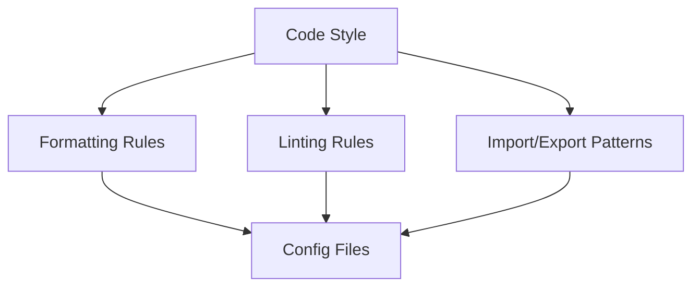

# {{platform_name}} Development Conventions

<cite>
**Files Referenced in This Document**
{{#each source_files}}
- [{{name}}](file://{{path}})
{{/each}}
</cite>

> **Target Audience**: devcrew-designer-{{platform_id}}, devcrew-dev-{{platform_id}}, devcrew-test-{{platform_id}}

## Table of Contents

1. [Introduction](#introduction)
2. [Project Structure](#project-structure)
3. [Core Components](#core-components)
4. [Architecture Overview](#architecture-overview)
5. [Detailed Component Analysis](#detailed-component-analysis)
6. [Dependency Analysis](#dependency-analysis)
7. [Performance Considerations](#performance-considerations)
8. [Troubleshooting Guide](#troubleshooting-guide)
9. [Conclusion](#conclusion)
10. [Appendix](#appendix)

## Introduction

This development conventions document defines naming conventions, directory structure, code style, import/export patterns, Git commit conventions, and code review checklists for the {{platform_name}} platform.

## Project Structure

### Directory Structure

```
{{directory_structure}}
```

```mermaid
graph TB
{{#each directory_components}}
{{id}}["{{name}}"]
{{/each}}
{{#each directory_relations}}
{{from}} --> {{to}}
{{/each}}
```

**Diagram Source**
{{#each structure_sources}}
- [{{name}}](file://{{path}}#L{{start}}-L{{end}})
{{/each}}

**Section Source**
{{#each project_structure_sources}}
- [{{name}}](file://{{path}}#L{{start}}-L{{end}})
{{/each}}

## Core Components

### Naming Conventions

#### Files

| Type | Pattern | Example |
|------|---------|---------|
{{#each file_naming}}
| {{type}} | {{pattern}} | {{example}} |
{{/each}}

#### Variables & Functions

| Type | Pattern | Example |
|------|---------|---------|
{{#each naming_conventions}}
| {{type}} | {{pattern}} | {{example}} |
{{/each}}

#### Classes & Types

| Type | Pattern | Example |
|------|---------|---------|
{{#each class_naming}}
| {{type}} | {{pattern}} | {{example}} |
{{/each}}

**Section Source**
{{#each core_components_sources}}
- [{{name}}](file://{{path}}#L{{start}}-L{{end}})
{{/each}}

## Architecture Overview

### Code Style Overview



**Diagram Source**
{{#each architecture_sources}}
- [{{name}}](file://{{path}}#L{{start}}-L{{end}})
{{/each}}

**Section Source**
{{#each architecture_overview_sources}}
- [{{name}}](file://{{path}}#L{{start}}-L{{end}})
{{/each}}

## Detailed Component Analysis

### Formatting Rules

{{#each formatting_rules}}
- **{{name}}**: {{value}}
{{/each}}

### Linting Rules

{{#each linting_rules}}
#### {{tool}}

| Rule | Setting | Description |
|------|---------|-------------|
{{#each rules}}
| `{{rule}}` | {{setting}} | {{description}} |
{{/each}}

{{/each}}

### Import/Export Patterns

{{import_export_patterns}}

### Common Patterns

{{#each common_patterns}}
#### {{name}}

{{description}}

```{{language}}
{{code_example}}
```

{{/each}}

**Section Source**
{{#each component_analysis_sources}}
- [{{name}}](file://{{path}}#L{{start}}-L{{end}})
{{/each}}

## Dependency Analysis

### Module Dependencies

```mermaid
graph LR
{{#each modules}}
{{id}}["{{name}}"]
{{/each}}
{{#each module_relations}}
{{from}} --> {{to}}
{{/each}}
```

**Diagram Source**
{{#each dependency_sources}}
- [{{name}}](file://{{path}}#L{{start}}-L{{end}})
{{/each}}

### Import Rules

{{#each import_rules}}
- {{this}}
{{/each}}

**Section Source**
{{#each dependency_analysis_sources}}
- [{{name}}](file://{{path}}#L{{start}}-L{{end}})
{{/each}}

## Performance Considerations

### Code Performance Guidelines

{{#each performance_guidelines}}
#### {{category}}

{{description}}

**Guidelines:**
{{#each items}}
- {{this}}
{{/each}}

{{/each}}

[This section provides general guidance, no specific file reference required]

## Troubleshooting Guide

### Common Development Issues

{{#each troubleshooting}}
#### {{issue}}

**Symptoms:**
{{#each symptoms}}
- {{this}}
{{/each}}

**Solutions:**
{{#each solutions}}
- {{this}}
{{/each}}

{{/each}}

**Section Source**
{{#each troubleshooting_sources}}
- [{{name}}](file://{{path}}#L{{start}}-L{{end}})
{{/each}}

## Conclusion

{{conclusion}}

[This section is a summary, no specific file reference required]

## Appendix

### Git Conventions

#### Commit Message Format

```
<type>(<scope>): <subject>

<body>

<footer>
```

**Types:**
{{#each commit_types}}
- `{{type}}`: {{description}}
{{/each}}

#### Branch Naming

{{branch_naming}}

### Code Review Checklist

- [ ] Code follows naming conventions
- [ ] Code follows style guidelines
- [ ] No console.log or debug code left
- [ ] Error handling is comprehensive
- [ ] Tests are included
- [ ] Documentation is updated

**Section Source**
{{#each appendix_sources}}
- [{{name}}](file://{{path}}#L{{start}}-L{{end}})
{{/each}}
