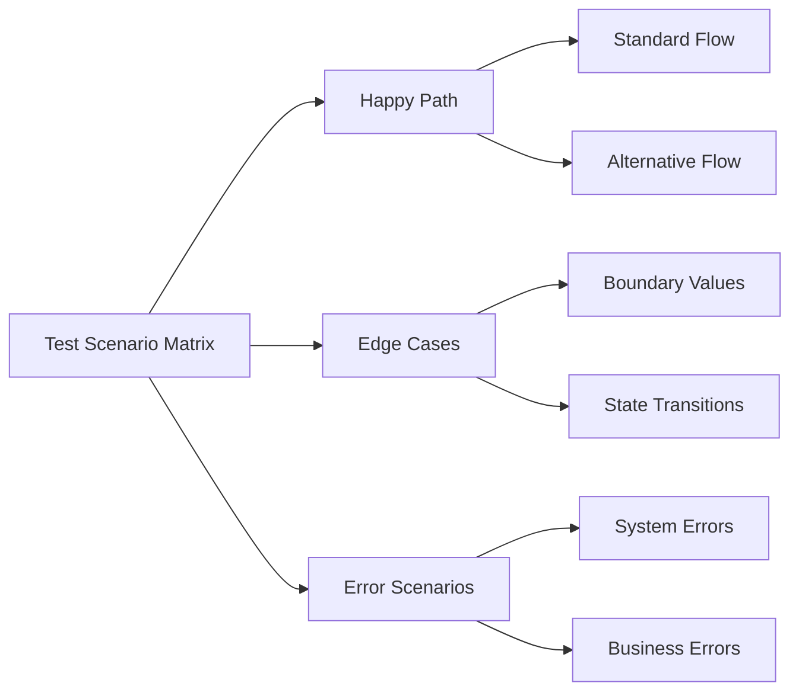
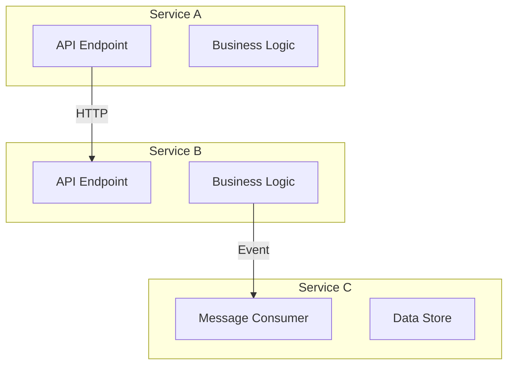
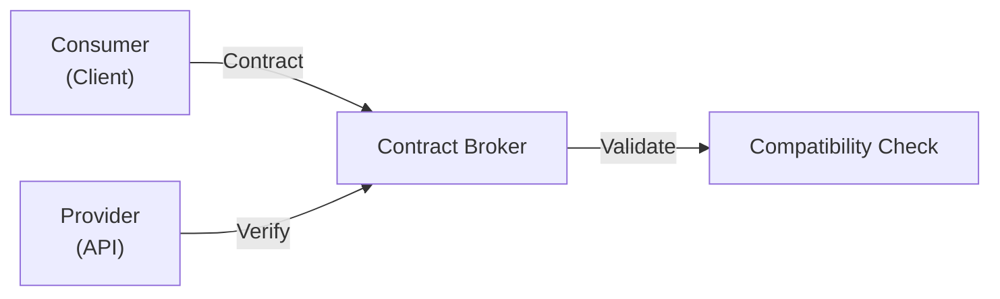
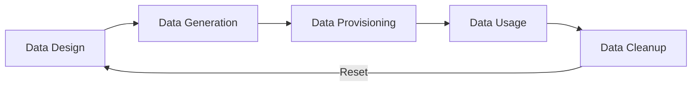

# {{platform_name}} System Testing Conventions

**Files Referenced in This Document**

| # | File | Source |
|---|------|--------|
{{#each source_files}}
| {{@index}} | {{name}} | [View]({{path}}) |
{{/each}}

> **Target Audience**: devcrew-designer-{{platform_id}}, devcrew-dev-{{platform_id}}, devcrew-test-{{platform_id}}

## Table of Contents

1. [Testing Framework & Toolchain](#1-testing-framework--toolchain)
2. [Test Organization & Naming (Platform-Specific)](#2-test-organization--naming-platform-specific)
3. [Test Layering & Boundaries](#3-test-layering--boundaries)
4. [Test Scenario Matrix](#4-test-scenario-matrix)
5. [Integration Testing Patterns (Platform-Specific)](#5-integration-testing-patterns-platform-specific)
6. [Cross-Service Testing](#6-cross-service-testing)
7. [API Contract Testing](#7-api-contract-testing)
8. [System-Level Exception Testing](#8-system-level-exception-testing)
9. [Mocking Strategy vs Real Dependencies](#9-mocking-strategy-vs-real-dependencies)
10. [Test Data Management (Platform-Specific)](#10-test-data-management-platform-specific)
11. [Coverage Requirements](#11-coverage-requirements)
12. [Test Reuse & Maintenance](#12-test-reuse--maintenance)
13. [Security Testing](#13-security-testing)
14. [Performance & Load Testing](#14-performance--load-testing)
15. [Test Environment & Configuration](#15-test-environment--configuration)
16. [CI/CD Integration](#16-cicd-integration)
17. [Test Report Conventions](#17-test-report-conventions)
18. [Anti-Patterns & Pitfalls](#18-anti-patterns--pitfalls)
19. [Appendix](#appendix)

## 1. Testing Framework & Toolchain

<!-- AI-TAG: TEST_FRAMEWORK -->
<!-- List system testing frameworks for THIS platform. API Testing: Postman, REST Assured, Supertest. E2E Testing: Cypress, Playwright, Selenium, Appium. Performance Testing: k6, JMeter, Gatling. Contract Testing: Pact, Spring Cloud Contract. -->

### Primary System Testing Frameworks

| Framework | Version | Purpose | Scope |
|-----------|---------|---------|-------|
{{#each testing_frameworks}}
| {{name}} | {{version}} | {{purpose}} | {{scope}} |
{{/each}}

### Auxiliary Tools

<!-- Fill with: test data generators, environment provisioning tools, reporting tools -->

| Tool | Category | Purpose | Integration |
|------|----------|---------|-------------|
{{#each auxiliary_tools}}
| {{name}} | {{category}} | {{purpose}} | {{integration}} |
{{/each}}

**Section Source**
{{#each test_framework_sources}}
- [{{name}}]({{path}}#L{{start}}-L{{end}})
{{/each}}

## 2. Test Organization & Naming (Platform-Specific)

<!-- AI-TAG: TEST_ORGANIZATION -->
<!-- System tests typically organized in: cases/ (test scenarios), code/ (test scripts), reports/ (test results), data/ (test datasets), fixtures/ (shared test data). Describe the convention used in THIS platform. -->

### Test Directory Structure

```
{{test_directory_structure}}
```

```mermaid
graph TB
{{#each test_components}}
{{id}}["{{name}}"]
{{/each}}
{{#each test_relations}}
{{from}} --> {{to}}
{{/each}}
```

**Diagram Source**
{{#each structure_sources}}
- [{{name}}]({{path}}#L{{start}}-L{{end}})
{{/each}}

### Test File Naming Conventions

| Test Type | Naming Pattern | Example | Scenario Naming Rule |
|-----------|---------------|---------|---------------------|
{{#each test_file_naming}}
| {{type}} | {{pattern}} | {{example}} | {{scenario_rule}} |
{{/each}}

### Test Case Organization

<!-- Fill with: how test cases are organized within the test suite -->

| Organization Level | Structure | Naming Convention |
|-------------------|-----------|--------------------|
{{#each case_organization}}
| {{level}} | {{structure}} | {{convention}} |
{{/each}}

### Test Scenario Naming Template

```
<Feature>_<Scenario>_<ExpectedResult>
```

**Examples:**
- `UserCheckout_WithValidPayment_CompletesOrder`
- `OrderFulfillment_WhenInventoryLow_TriggersRestock`
- `PaymentProcessing_WhenGatewayTimeout_RetriesAndSucceeds`

**Section Source**
{{#each test_organization_sources}}
- [{{name}}]({{path}}#L{{start}}-L{{end}})
{{/each}}

## 3. Test Layering & Boundaries

<!-- AI-TAG: TEST_LAYERING -->
<!-- Fill with: system test layer definitions, scope, dependencies, and granularity standards -->

### System Test Layer Definitions

| Layer | Scope | Dependencies Allowed | Forbidden | Granularity |
|-------|-------|---------------------|-----------|-------------|
{{#each test_layers}}
| {{name}} | {{scope}} | {{dependencies}} | {{forbidden}} | {{granularity}} |
{{/each}}

### Layer Decision Guide

<!-- Fill with: guidelines for choosing between API, integration, and E2E tests -->

**When to Write API Tests:**
{{#each api_test_when}}
- {{this}}
{{/each}}

**When to Write Integration Tests:**
{{#each integration_test_when}}
- {{this}}
{{/each}}

**When to Write E2E Tests:**
{{#each e2e_test_when}}
- {{this}}
{{/each}}

### Layer Isolation Rules

<!-- Fill with: rules for maintaining proper test isolation between layers -->

| Rule | Description | Enforcement |
|------|-------------|-------------|
{{#each layer_isolation_rules}}
| {{name}} | {{description}} | {{enforcement}} |
{{/each}}

**Section Source**
{{#each test_layering_sources}}
- [{{name}}]({{path}}#L{{start}}-L{{end}})
{{/each}}

## 4. Test Scenario Matrix

<!-- AI-TAG: SCENARIO_MATRIX -->
<!-- Fill with: end-to-end scenario matrix design, covering happy paths, edge cases, and error scenarios -->

### Scenario Matrix Structure



### Scenario Categories

| Category | Description | Coverage Target | Priority |
|----------|-------------|-----------------|----------|
{{#each scenario_categories}}
| {{category}} | {{description}} | {{coverage}} | {{priority}} |
{{/each}}

### Scenario Design Template

<!-- Fill with: standardized template for designing test scenarios -->

| Field | Description | Example |
|-------|-------------|---------|
{{#each scenario_template_fields}}
| {{field}} | {{description}} | {{example}} |
{{/each}}

### Scenario Coverage Matrix

<!-- Fill with: matrix mapping scenarios to features and requirements -->

| Feature | Happy Path | Edge Cases | Error Scenarios | Total |
|---------|-----------|------------|-----------------|-------|
{{#each scenario_coverage_matrix}}
| {{feature}} | {{happy}} | {{edge}} | {{error}} | {{total}} |
{{/each}}

**Section Source**
{{#each scenario_matrix_sources}}
- [{{name}}]({{path}}#L{{start}}-L{{end}})
{{/each}}

## 5. Integration Testing Patterns (Platform-Specific)

<!-- AI-TAG: INTEGRATION_TESTING -->
<!-- Fill with: database, API, message queue, and external service integration testing patterns -->

### Database Integration Testing

<!-- Fill with: database integration testing patterns -->

**Pattern:**
{{database_integration_pattern}}

**Test Setup:**
```{{language}}
{{database_test_example}}
```

### API Integration Testing

<!-- Fill with: API integration testing patterns -->

**Pattern:**
{{api_integration_pattern}}

**Test Setup:**
```{{language}}
{{api_test_example}}
```

### Message Queue Integration Testing

<!-- Fill with: message queue testing patterns (if applicable) -->

**Pattern:**
{{message_queue_pattern}}

**Test Setup:**
```{{language}}
{{message_queue_test_example}}
```

### External Service Integration Testing

<!-- Fill with: third-party service integration testing patterns -->

**Pattern:**
{{external_service_pattern}}

**Test Setup:**
```{{language}}
{{external_service_test_example}}
```

### Integration Test Data Management

| Strategy | When to Use | Implementation |
|----------|------------|----------------|
{{#each integration_data_strategies}}
| {{name}} | {{when_to_use}} | {{implementation}} |
{{/each}}

**Section Source**
{{#each integration_testing_sources}}
- [{{name}}]({{path}}#L{{start}}-L{{end}})
{{/each}}

## 6. Cross-Service Testing

<!-- AI-TAG: CROSS_SERVICE_TESTING -->
<!-- Fill with: cross-service/cross-module interaction testing patterns -->

### Cross-Service Test Patterns



### Service Interaction Testing

| Interaction Type | Test Approach | Verification Strategy |
|------------------|---------------|----------------------|
{{#each service_interactions}}
| {{type}} | {{approach}} | {{verification}} |
{{/each}}

### Service Dependency Testing

<!-- Fill with: testing service dependencies and fallback scenarios -->

**Pattern:**
{{service_dependency_pattern}}

**Test Setup:**
```{{language}}
{{service_dependency_example}}
```

### Saga/Distributed Transaction Testing

<!-- Fill with: distributed transaction testing patterns (if applicable) -->

| Saga Pattern | Test Focus | Verification Points |
|--------------|-----------|---------------------|
{{#each saga_patterns}}
| {{pattern}} | {{focus}} | {{verification}} |
{{/each}}

**Section Source**
{{#each cross_service_sources}}
- [{{name}}]({{path}}#L{{start}}-L{{end}})
{{/each}}

## 7. API Contract Testing

<!-- AI-TAG: CONTRACT_TESTING -->
<!-- Fill with: API contract validation testing patterns using Pact, OpenAPI, or similar tools -->

### Contract Testing Overview



### Contract Types

| Contract Type | Tool | Purpose | Scope |
|---------------|------|---------|-------|
{{#each contract_types}}
| {{type}} | {{tool}} | {{purpose}} | {{scope}} |
{{/each}}

### Consumer-Driven Contract Testing

<!-- Fill with: consumer-side contract testing patterns -->

**Pattern:**
{{consumer_contract_pattern}}

**Test Setup:**
```{{language}}
{{consumer_contract_example}}
```

### Provider Contract Verification

<!-- Fill with: provider-side contract verification patterns -->

**Pattern:**
{{provider_contract_pattern}}

**Test Setup:**
```{{language}}
{{provider_contract_example}}
```

### Contract Versioning Strategy

| Strategy | When to Use | Migration Approach |
|----------|-------------|-------------------|
{{#each contract_versioning}}
| {{strategy}} | {{when_to_use}} | {{migration}} |
{{/each}}

**Section Source**
{{#each contract_testing_sources}}
- [{{name}}]({{path}}#L{{start}}-L{{end}})
{{/each}}

## 8. System-Level Exception Testing

<!-- AI-TAG: EXCEPTION_TESTING -->
<!-- Fill with: system-level exception scenarios, failure injection, and recovery testing -->

### Exception Categories and Coverage

| Exception Category | Examples | Must Test | Assertion Standard |
|-------------------|----------|-----------|-------------------|
{{#each exception_categories}}
| {{category}} | {{examples}} | {{must_test}} | {{assertion_standard}} |
{{/each}}

### Failure Injection Testing

<!-- Fill with: chaos engineering and failure injection patterns -->

| Failure Type | Injection Method | Expected Behavior |
|--------------|-----------------|-------------------|
{{#each failure_injection_types}}
| {{type}} | {{method}} | {{expected}} |
{{/each}}

### System Recovery Testing

<!-- Fill with: system recovery and resilience testing patterns -->

| Recovery Scenario | Test Approach | Success Criteria |
|-------------------|---------------|------------------|
{{#each recovery_scenarios}}
| {{scenario}} | {{approach}} | {{criteria}} |
{{/each}}

### Exception Testing Code Examples

**Good Example:**
```{{language}}
{{exception_test_good_example}}
```

**Bad Example:**
```{{language}}
{{exception_test_bad_example}}
```

**Section Source**
{{#each exception_testing_sources}}
- [{{name}}]({{path}}#L{{start}}-L{{end}})
{{/each}}

## 9. Mocking Strategy vs Real Dependencies

<!-- AI-TAG: MOCKING_STRATEGY -->
<!-- Fill with: when to use mocks vs real dependencies in system tests, stub services, test containers -->

### Mock vs Real Decision Matrix

| Dependency Type | Use Mock | Use Real | Hybrid Approach |
|-----------------|----------|----------|-----------------|
{{#each mock_vs_real}}
| {{type}} | {{mock}} | {{real}} | {{hybrid}} |
{{/each}}

### Test Container Strategy

<!-- Fill with: Docker test containers and service virtualization patterns -->

| Service | Strategy | Configuration |
|---------|----------|---------------|
{{#each test_containers}}
| {{service}} | {{strategy}} | {{configuration}} |
{{/each}}

### Service Virtualization

<!-- Fill with: service virtualization and stub service patterns -->

**Pattern:**
{{service_virtualization_pattern}}

**Test Setup:**
```{{language}}
{{service_virtualization_example}}
```

### Mock Verification Rules

<!-- Fill with: rules for verifying mock interactions in system tests -->

| Rule | Description | Example |
|------|-------------|---------|
{{#each mock_verification_rules}}
| {{name}} | {{description}} | {{example}} |
{{/each}}

**Section Source**
{{#each mocking_strategy_sources}}
- [{{name}}]({{path}}#L{{start}}-L{{end}})
{{/each}}

## 10. Test Data Management (Platform-Specific)

<!-- AI-TAG: TEST_DATA -->
<!-- Fill with: comprehensive test dataset management, data provisioning, state management -->

### Test Data Lifecycle



### Test Data Strategies

| Strategy | When to Use | Example | Pros/Cons |
|----------|------------|---------|-----------|
{{#each test_data_strategies}}
| {{name}} | {{when_to_use}} | {{example}} | {{pros_cons}} |
{{/each}}

### Data Provisioning Patterns

<!-- Fill with: test data provisioning and state setup patterns -->

| Provisioning Method | Scope | Speed | Isolation |
|--------------------|-------|-------|-----------|
{{#each data_provisioning}}
| {{method}} | {{scope}} | {{speed}} | {{isolation}} |
{{/each}}

### Test Data Sets

<!-- Fill with: predefined test data sets for different scenarios -->

| Dataset | Purpose | Size | Refresh Frequency |
|---------|---------|------|-------------------|
{{#each test_datasets}}
| {{name}} | {{purpose}} | {{size}} | {{refresh}} |
{{/each}}

### Data State Management

<!-- Fill with: managing test data state across test executions -->

| State Type | Management Approach | Cleanup Strategy |
|------------|--------------------|------------------|
{{#each data_state_types}}
| {{type}} | {{approach}} | {{cleanup}} |
{{/each}}

**Section Source**
{{#each test_data_sources}}
- [{{name}}]({{path}}#L{{start}}-L{{end}})
{{/each}}

## 11. Coverage Requirements

<!-- AI-TAG: COVERAGE -->
<!-- Fill with: system-level coverage metrics (functional, API, scenario coverage) -->

### Coverage Metrics

| Metric | Minimum | Target | Scope |
|--------|---------|--------|-------|
{{#each coverage_metrics}}
| {{metric}} | {{minimum}} | {{target}} | {{scope}} |
{{/each}}

### Functional Coverage

<!-- Fill with: functional coverage requirements -->

| Feature Category | Coverage Requirement | Measurement Method |
|------------------|---------------------|--------------------|
{{#each functional_coverage}}
| {{category}} | {{requirement}} | {{method}} |
{{/each}}

### API Coverage

<!-- Fill with: API endpoint coverage requirements -->

| API Coverage Type | Target | Measurement |
|-------------------|--------|-------------|
{{#each api_coverage}}
| {{type}} | {{target}} | {{measurement}} |
{{/each}}

### Scenario Coverage

<!-- Fill with: end-to-end scenario coverage requirements -->

| Scenario Type | Minimum Coverage | Priority |
|---------------|-----------------|----------|
{{#each scenario_coverage}}
| {{type}} | {{minimum}} | {{priority}} |
{{/each}}

### Coverage Scope Rules

<!-- Fill with: inclusion and exclusion rules for coverage calculation -->

**Include:**
{{#each coverage_include}}
- {{this}}
{{/each}}

**Exclude:**
{{#each coverage_exclude}}
- {{this}}
{{/each}}

**Section Source**
{{#each coverage_sources}}
- [{{name}}]({{path}}#L{{start}}-L{{end}})
{{/each}}

## 12. Test Reuse & Maintenance

<!-- AI-TAG: TEST_MAINTENANCE -->
<!-- Fill with: utility classes, base classes, shared steps, cleanup mechanisms -->

### Test Utility Classes

<!-- Fill with: standardized test utility classes -->

| Utility Class | Purpose | Location |
|--------------|---------|----------|
{{#each test_utilities}}
| {{name}} | {{purpose}} | {{location}} |
{{/each}}

### Test Base Classes and Shared Configuration

<!-- Fill with: base test classes and shared setup -->

| Base Class | Purpose | Common Setup |
|-----------|---------|--------------|
{{#each test_base_classes}}
| {{name}} | {{purpose}} | {{common_setup}} |
{{/each}}

### Shared Test Steps

<!-- Fill with: reusable test steps and step definitions -->

| Step Category | Steps | Usage |
|---------------|-------|-------|
{{#each shared_steps}}
| {{category}} | {{steps}} | {{usage}} |
{{/each}}

### Outdated Test Cleanup

<!-- Fill with: process for identifying and removing obsolete tests -->

| Trigger | Action | Responsible |
|---------|--------|-------------|
{{#each cleanup_triggers}}
| {{trigger}} | {{action}} | {{responsible}} |
{{/each}}

### Test Code Refactoring Guidelines

<!-- Fill with: when and how to refactor test code -->

| Scenario | Refactoring Action | Verification |
|----------|-------------------|--------------|
{{#each refactoring_guidelines}}
| {{scenario}} | {{action}} | {{verification}} |
{{/each}}

**Section Source**
{{#each test_maintenance_sources}}
- [{{name}}]({{path}}#L{{start}}-L{{end}})
{{/each}}

## 13. Security Testing

<!-- AI-TAG: SECURITY_TESTING -->
<!-- Fill with: security test checklist, authentication/authorization testing patterns -->

### Security Testing Checklist

| Security Concern | Test Approach | Priority | Verification |
|-----------------|---------------|----------|--------------|
{{#each security_concerns}}
| {{concern}} | {{test_approach}} | {{priority}} | {{verification}} |
{{/each}}

### Authentication Testing

<!-- Fill with: authentication flow testing patterns -->

| Auth Type | Test Scenarios | Verification |
|-----------|----------------|--------------|
{{#each auth_tests}}
| {{type}} | {{scenarios}} | {{verification}} |
{{/each}}

### Authorization Testing

<!-- Fill with: role-based access control testing patterns -->

| Pattern | Use Case | Example |
|---------|----------|---------|
{{#each permission_patterns}}
| {{name}} | {{use_case}} | {{example}} |
{{/each}}

**Example:**
```{{language}}
{{permission_test_example}}
```

### Input Validation Testing

<!-- Fill with: input validation and sanitization testing -->

| Validation Type | Test Cases | Expected Behavior |
|----------------|-----------|-------------------|
{{#each validation_tests}}
| {{type}} | {{test_cases}} | {{expected}} |
{{/each}}

**Section Source**
{{#each security_testing_sources}}
- [{{name}}]({{path}}#L{{start}}-L{{end}})
{{/each}}

## 14. Performance & Load Testing

<!-- AI-TAG: PERFORMANCE_TESTING -->
<!-- Fill with: system-level performance baselines, load testing scenarios, stress testing -->

### Performance Baselines

| Metric | Threshold | Measurement Method | Test Environment |
|--------|-----------|-------------------|------------------|
{{#each performance_baselines}}
| {{metric}} | {{threshold}} | {{measurement}} | {{environment}} |
{{/each}}

### Load Testing Scenarios

<!-- Fill with: load testing scenarios and thresholds -->

| Scenario | Load Pattern | Duration | Success Criteria |
|----------|-------------|----------|-----------------|
{{#each load_test_scenarios}}
| {{scenario}} | {{load_pattern}} | {{duration}} | {{success_criteria}} |
{{/each}}

### Stress Testing

<!-- Fill with: stress testing patterns and breaking point identification -->

| Stress Test Type | Approach | Target Metric |
|------------------|----------|---------------|
{{#each stress_tests}}
| {{type}} | {{approach}} | {{target}} |
{{/each}}

### Soak/Endurance Testing

<!-- Fill with: long-running stability testing patterns -->

| Test Type | Duration | Monitoring Focus |
|-----------|----------|------------------|
{{#each soak_tests}}
| {{type}} | {{duration}} | {{focus}} |
{{/each}}

### Performance Test Execution

**Good Example:**
```{{language}}
{{good_perf_test_example}}
```

**Bad Example:**
```{{language}}
{{bad_perf_test_example}}
```

**Section Source**
{{#each performance_testing_sources}}
- [{{name}}]({{path}}#L{{start}}-L{{end}})
{{/each}}

## 15. Test Environment & Configuration

<!-- AI-TAG: TEST_ENVIRONMENT -->
<!-- Fill with: multi-environment configurations, environment provisioning, isolation strategies -->

### Test Environment Configurations

| Environment | Purpose | Configuration | Data Strategy |
|-------------|---------|---------------|---------------|
{{#each environment_configs}}
| {{environment}} | {{purpose}} | {{configuration}} | {{data_strategy}} |
{{/each}}

### Environment Provisioning

<!-- Fill with: automated environment provisioning patterns -->

| Provisioning Method | Speed | Cost | Use Case |
|--------------------|-------|------|----------|
{{#each provisioning_methods}}
| {{method}} | {{speed}} | {{cost}} | {{use_case}} |
{{/each}}

### Configuration Isolation

<!-- Fill with: rules for isolating test configurations -->

| Isolation Level | Implementation | Scope |
|----------------|---------------|-------|
{{#each config_isolation}}
| {{level}} | {{implementation}} | {{scope}} |
{{/each}}

### Environment Variable Management

<!-- Fill with: handling of environment variables in system tests -->

| Variable Type | Source | Override Strategy |
|--------------|--------|-------------------|
{{#each env_variables}}
| {{type}} | {{source}} | {{override}} |
{{/each}}

### Multi-Environment Switching

<!-- Fill with: strategies for running tests across environments -->

| Strategy | Use Case | Command/Config |
|----------|----------|----------------|
{{#each env_switching}}
| {{strategy}} | {{use_case}} | {{command}} |
{{/each}}

**Section Source**
{{#each test_environment_sources}}
- [{{name}}]({{path}}#L{{start}}-L{{end}})
{{/each}}

## 16. CI/CD Integration

<!-- AI-TAG: CICD_INTEGRATION -->
<!-- Fill with: pipeline stages, test execution strategies, coverage gates for system tests -->

### CI/CD Test Execution Strategy

| Pipeline Stage | Test Types | Failure Action | Timeout | Parallelism |
|---------------|------------|---------------|---------|-------------|
{{#each cicd_stages}}
| {{stage}} | {{test_types}} | {{failure_action}} | {{timeout}} | {{parallelism}} |
{{/each}}

### Coverage Gate Rules

<!-- Fill with: coverage thresholds that block pipeline progression -->

| Gate | Metric | Threshold | Block Action |
|------|--------|-----------|--------------|
{{#each coverage_gates}}
| {{gate}} | {{metric}} | {{threshold}} | {{block_action}} |
{{/each}}

### Test Report Archival

<!-- Fill with: requirements for test report storage -->

| Report Type | Format | Retention | Location |
|------------|--------|-----------|----------|
{{#each report_archival}}
| {{type}} | {{format}} | {{retention}} | {{location}} |
{{/each}}

### Flaky Test Handling

<!-- Fill with: process for handling flaky tests in CI/CD -->

| Scenario | Detection | Action | Follow-up |
|----------|-----------|--------|-----------|
{{#each flaky_test_handling}}
| {{scenario}} | {{detection}} | {{action}} | {{followup}} |
{{/each}}

**Section Source**
{{#each cicd_integration_sources}}
- [{{name}}]({{path}}#L{{start}}-L{{end}})
{{/each}}

## 17. Test Report Conventions

<!-- AI-TAG: TEST_REPORT -->
<!-- Fill with: test report format, content standards, and distribution -->

### Report Types

| Report Type | Audience | Content | Format |
|-------------|----------|---------|--------|
{{#each report_types}}
| {{type}} | {{audience}} | {{content}} | {{format}} |
{{/each}}

### Report Structure

<!-- Fill with: standardized test report structure -->

```
{{report_structure}}
```

### Report Content Standards

<!-- Fill with: required content for each report type -->

| Content Element | Description | Required |
|-----------------|-------------|----------|
{{#each report_content}}
| {{element}} | {{description}} | {{required}} |
{{/each}}

### Report Distribution

<!-- Fill with: report distribution channels and schedules -->

| Distribution Channel | Frequency | Recipients |
|---------------------|-----------|------------|
{{#each report_distribution}}
| {{channel}} | {{frequency}} | {{recipients}} |
{{/each}}

### Historical Trend Analysis

<!-- Fill with: tracking test metrics over time -->

| Metric | Trend Direction | Alert Threshold |
|--------|-----------------|-----------------|
{{#each trend_metrics}}
| {{metric}} | {{direction}} | {{threshold}} |
{{/each}}

**Section Source**
{{#each test_report_sources}}
- [{{name}}]({{path}}#L{{start}}-L{{end}})
{{/each}}

## 18. Anti-Patterns & Pitfalls

<!-- AI-TAG: TEST_ANTIPATTERNS -->
<!-- Fill with: system testing anti-patterns and their better approaches -->

### System Test Anti-Patterns

| Anti-Pattern | Description | Impact | Better Approach |
|-------------|-------------|--------|----------------|
{{#each anti_patterns}}
| {{name}} | {{description}} | {{impact}} | {{better_approach}} |
{{/each}}

### Common Failure Scenarios and Solutions

<!-- Fill with: frequent test failures and resolution strategies -->

| Failure Scenario | Root Cause | Quick Fix | Prevention |
|-----------------|------------|-----------|------------|
{{#each failure_scenarios}}
| {{scenario}} | {{root_cause}} | {{quick_fix}} | {{prevention}} |
{{/each}}

### Test Smell Detection

<!-- Fill with: indicators of poorly written system tests -->

| Smell | Indicator | Refactoring |
|-------|-----------|-------------|
{{#each test_smells}}
| {{name}} | {{indicator}} | {{refactoring}} |
{{/each}}

**Section Source**
{{#each antipattern_sources}}
- [{{name}}]({{path}}#L{{start}}-L{{end}})
{{/each}}

## Appendix

### Testing Best Practices Summary

<!-- Fill with: concise summary of key system testing best practices -->

{{#each testing_best_practices}}
- **{{title}}**: {{description}}
{{/each}}

### Common Test Scenarios

<!-- Fill with: examples of common system testing scenarios -->

{{#each common_test_scenarios}}
#### {{name}}

{{description}}

```{{language}}
{{example}}
```

{{/each}}

### Test Commands Quick Reference

<!-- Fill with: common test execution commands -->

{{#each test_commands}}
#### {{name}}

```bash
{{command}}
```

{{description}}

{{/each}}

### Version History

| Version | Date | Author | Changes |
|---------|------|--------|---------|
{{#each version_history}}
| {{version}} | {{date}} | {{author}} | {{changes}} |
{{/each}}

**Section Source**
{{#each appendix_sources}}
- [{{name}}]({{path}}#L{{start}}-L{{end}})
{{/each}}
