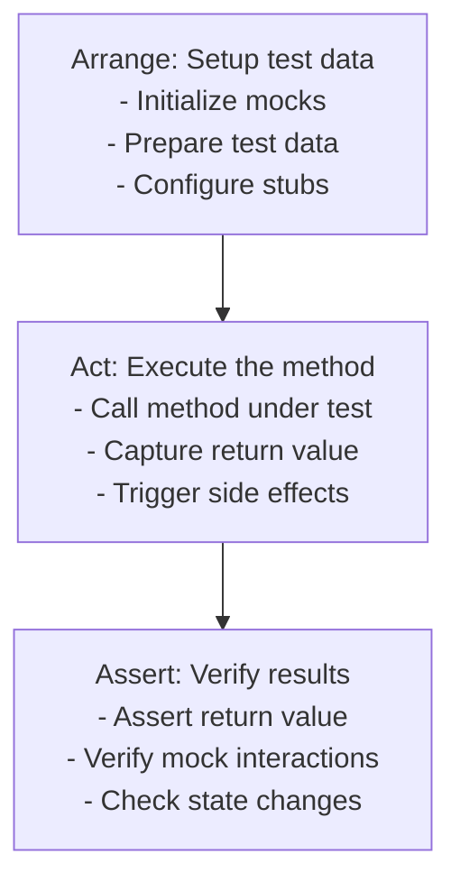

# {{platform_name}} Testing Conventions

**Files Referenced in This Document**

| # | File | Source |
|---|------|--------|
{{#each source_files}}
| {{@index}} | {{name}} | [View]({{path}}) |
{{/each}}

> **Target Audience**: devcrew-designer-{{platform_id}}, devcrew-dev-{{platform_id}}, devcrew-test-{{platform_id}}

## Table of Contents

1. [Testing Framework & Toolchain](#1-testing-framework--toolchain)
2. [Test Organization & Naming (Platform-Specific)](#2-test-organization--naming-platform-specific)
3. [Test Layering & Boundaries](#3-test-layering--boundaries)
4. [Unit Testing Patterns (Platform-Specific)](#4-unit-testing-patterns-platform-specific)
5. [Integration Testing Patterns (Platform-Specific)](#5-integration-testing-patterns-platform-specific)
6. [Exception Testing](#6-exception-testing)
7. [Mocking Strategy (Platform-Specific)](#7-mocking-strategy-platform-specific)
8. [Test Data Management (Platform-Specific)](#8-test-data-management-platform-specific)
9. [Coverage Requirements](#9-coverage-requirements)
10. [Test Reuse & Maintenance](#10-test-reuse--maintenance)
11. [Security Testing](#11-security-testing)
12. [Performance Testing (Platform-Specific)](#12-performance-testing-platform-specific)
13. [Test Environment & Configuration](#13-test-environment--configuration)
14. [CI/CD Integration](#14-cicd-integration)
15. [Anti-Patterns & Pitfalls](#15-anti-patterns--pitfalls)
16. [Appendix](#appendix)

## 1. Testing Framework & Toolchain

<!-- AI-TAG: TEST_FRAMEWORK -->
<!-- List frameworks for THIS platform's language/runtime. Backend examples: JUnit5/Mockito (Java), pytest (Python), Jest/Supertest (Node.js). Frontend examples: Jest/Vitest (Vue/React), Cypress/Playwright (E2E). Mobile examples: Jest (React Native), flutter_test (Flutter). -->

### Primary Testing Frameworks

| Framework | Version | Purpose | Scope |
|-----------|---------|---------|-------|
{{#each testing_frameworks}}
| {{name}} | {{version}} | {{purpose}} | {{scope}} |
{{/each}}

### Auxiliary Tools

<!-- Fill with: assertion libraries, coverage tools, reporting tools -->

| Tool | Category | Purpose | Integration |
|------|----------|---------|-------------|
{{#each auxiliary_tools}}
| {{name}} | {{category}} | {{purpose}} | {{integration}} |
{{/each}}

**Section Source**
{{#each test_framework_sources}}
- [{{name}}]({{path}}#L{{start}}-L{{end}})
{{/each}}

## 2. Test Organization & Naming (Platform-Specific)

<!-- AI-TAG: TEST_ORGANIZATION -->
<!-- Backend: typically src/test/java mirroring src/main/java. Frontend: typically src/__tests__ or *.spec.ts co-located with source. Describe the convention used in THIS platform. -->

### Test Directory Structure

```
{{test_directory_structure}}
```

```mermaid
graph TB
{{#each test_components}}
{{id}}["{{name}}"]
{{/each}}
{{#each test_relations}}
{{from}} --> {{to}}
{{/each}}
```

**Diagram Source**
{{#each structure_sources}}
- [{{name}}]({{path}}#L{{start}}-L{{end}})
{{/each}}

### Test File Naming Conventions

| Test Type | Naming Pattern | Example | Scenario Naming Rule |
|-----------|---------------|---------|---------------------|
{{#each test_file_naming}}
| {{type}} | {{pattern}} | {{example}} | {{scenario_rule}} |
{{/each}}

### Test Class to Source Class Mapping

<!-- Fill with: correspondence rules between test classes and classes under test -->

| Source Class Location | Test Class Location | Naming Convention |
|----------------------|--------------------|--------------------|
{{#each class_mapping}}
| {{source_location}} | {{test_location}} | {{convention}} |
{{/each}}

### Test Method Naming Template

```
test<MethodName>_<Scenario>_<ExpectedResult>
```

**Examples:**
- `testCalculateDiscount_WithValidCoupon_ReturnsDiscountedPrice`
- `testCreateUser_WithDuplicateEmail_ThrowsUserExistsException`
- `testProcessPayment_WhenTimeout_ThrowsPaymentException`

**Section Source**
{{#each test_organization_sources}}
- [{{name}}]({{path}}#L{{start}}-L{{end}})
{{/each}}

## 3. Test Layering & Boundaries

<!-- AI-TAG: TEST_LAYERING -->
<!-- Fill with: test layer definitions, scope, dependencies, and granularity standards -->

### Test Layer Definitions

| Layer | Scope | Dependencies Allowed | Forbidden | Granularity |
|-------|-------|---------------------|-----------|-------------|
{{#each test_layers}}
| {{name}} | {{scope}} | {{dependencies}} | {{forbidden}} | {{granularity}} |
{{/each}}

### Layer Decision Guide

<!-- Fill with: guidelines for choosing between unit, integration, and E2E tests -->

**When to Write Unit Tests:**
{{#each unit_test_when}}
- {{this}}
{{/each}}

**When to Write Integration Tests:**
{{#each integration_test_when}}
- {{this}}
{{/each}}

**When to Write E2E Tests:**
{{#each e2e_test_when}}
- {{this}}
{{/each}}

### Layer Isolation Rules

<!-- Fill with: rules for maintaining proper test isolation between layers -->

| Rule | Description | Enforcement |
|------|-------------|-------------|
{{#each layer_isolation_rules}}
| {{name}} | {{description}} | {{enforcement}} |
{{/each}}

**Section Source**
{{#each test_layering_sources}}
- [{{name}}]({{path}}#L{{start}}-L{{end}})
{{/each}}

## 4. Unit Testing Patterns (Platform-Specific)

<!-- AI-TAG: UNIT_TESTING -->
<!-- Fill with unit testing patterns specific to this platform. Backend: Service/Repository/Controller layer testing. Frontend: Component/Composable/Store testing. Provide examples in this platform's language. -->

### AAA Pattern (Arrange-Act-Assert)



**Diagram Source**
{{#each aaa_pattern_sources}}
- [{{name}}]({{path}}#L{{start}}-L{{end}})
{{/each}}

### Service Layer Unit Testing

<!-- Fill with: Service layer testing patterns (if backend) -->

**Pattern:**
{{service_layer_test_pattern}}

**Good Example:**
```{{language}}
{{service_test_good_example}}
```

**Bad Example:**
```{{language}}
{{service_test_bad_example}}
```

### Controller Layer Unit Testing (if applicable)

<!-- Fill with: Controller/API layer testing patterns (if backend) -->

**Pattern:**
{{controller_layer_test_pattern}}

**Good Example:**
```{{language}}
{{controller_test_good_example}}
```

### Component Unit Testing (if frontend)

<!-- Fill with: Component testing patterns (if frontend) -->

**Pattern:**
{{component_test_pattern}}

**Good Example:**
```{{language}}
{{component_test_good_example}}
```

**Section Source**
{{#each unit_testing_sources}}
- [{{name}}]({{path}}#L{{start}}-L{{end}})
{{/each}}

## 5. Integration Testing Patterns (Platform-Specific)

<!-- AI-TAG: INTEGRATION_TESTING -->
<!-- Fill with: database, API, and cross-service integration testing patterns -->

### Database Integration Testing

<!-- Fill with: Mapper/Repository testing patterns (if backend) -->

**Pattern:**
{{database_integration_pattern}}

**Test Setup:**
```{{language}}
{{database_test_example}}
```

### API Integration Testing

<!-- Fill with: API/controller integration testing patterns -->

**Pattern:**
{{api_integration_pattern}}

**Test Setup:**
```{{language}}
{{api_test_example}}
```

### Cross-Service Integration Testing (if applicable)

<!-- Fill with: microservice integration testing patterns (if applicable) -->

**Pattern:**
{{cross_service_pattern}}

**Test Setup:**
```{{language}}
{{cross_service_test_example}}
```

### Frontend Integration Testing (if frontend platform)

<!-- AI-TAG: FRONTEND_INTEGRATION_TEST -->
<!-- Fill with frontend integration testing patterns. If backend platform, skip this subsection. -->

#### Component + Store Integration

| Test Scenario | Setup | Verification |
|--------------|-------|-------------|
| scenario | setup_approach | verification_approach |

```lang
// Example: Component integration with state store
frontend_store_integration_example
```

#### Component + API Mock Integration

| Test Scenario | Mock Strategy | Verification |
|--------------|--------------|-------------|
| scenario | mock_strategy | verification_approach |

```lang
// Example: Component integration with mocked API
frontend_api_integration_example
```

#### Route Navigation Testing

| Test Scenario | Setup | Verification |
|--------------|-------|-------------|
| scenario | setup_approach | verification_approach |

### Integration Test Data Management

| Strategy | When to Use | Implementation |
|----------|------------|----------------|
{{#each integration_data_strategies}}
| {{name}} | {{when_to_use}} | {{implementation}} |
{{/each}}

**Section Source**
{{#each integration_testing_sources}}
- [{{name}}]({{path}}#L{{start}}-L{{end}})
{{/each}}

## 6. Exception Testing

<!-- AI-TAG: EXCEPTION_TESTING -->
<!-- Fill with: exception categories, coverage requirements, assertion standards -->

### Exception Categories and Coverage

| Exception Category | Examples | Must Test | Assertion Standard |
|-------------------|----------|-----------|-------------------|
{{#each exception_categories}}
| {{category}} | {{examples}} | {{must_test}} | {{assertion_standard}} |
{{/each}}

### Boundary Exception Scenarios Checklist

<!-- Fill with: common boundary exception scenarios to test -->

- [ ] Null input parameters
- [ ] Empty collections/strings
- [ ] Boundary values (min/max limits)
- [ ] Invalid enum values
- [ ] Malformed data formats
- [ ] Resource not found
- [ ] Permission denied
- [ ] Timeout scenarios
- [ ] Concurrent access conflicts

### Exception Testing Code Examples

**Good Example:**
```{{language}}
{{exception_test_good_example}}
```

**Bad Example:**
```{{language}}
{{exception_test_bad_example}}
```

**Section Source**
{{#each exception_testing_sources}}
- [{{name}}]({{path}}#L{{start}}-L{{end}})
{{/each}}

## 7. Mocking Strategy (Platform-Specific)

<!-- AI-TAG: MOCKING_STRATEGY -->
<!-- Backend: focus on mocking repositories, external services, message queues. Frontend: focus on mocking HTTP requests, browser APIs, third-party libraries. Describe mocking tools and patterns used in THIS platform. -->

### Mock Scenarios and Granularity

| Component | Mock Granularity | Verification Required | Example |
|-----------|-----------------|----------------------|---------|
{{#each mock_scenarios}}
| {{component}} | {{granularity}} | {{verification}} | {{example}} |
{{/each}}

### Mock vs Spy Selection Guide

| Scenario | Use Mock | Use Spy |
|----------|----------|---------|
{{#each mock_spy_guide}}
| {{scenario}} | {{use_mock}} | {{use_spy}} |
{{/each}}

### Mock Verification Rules

<!-- Fill with: rules for verifying mock interactions -->

| Rule | Description | Example |
|------|-------------|---------|
{{#each mock_verification_rules}}
| {{name}} | {{description}} | {{example}} |
{{/each}}

### Core Mock Usage Patterns

**When/Then Pattern:**
```{{language}}
{{mock_when_then_example}}
```

**DoThrow Pattern:**
```{{language}}
{{mock_dothrow_example}}
```

**Verify Pattern:**
```{{language}}
{{mock_verify_example}}
```

**Argument Matchers:**
```{{language}}
{{mock_matchers_example}}
```

**Section Source**
{{#each mocking_strategy_sources}}
- [{{name}}]({{path}}#L{{start}}-L{{end}})
{{/each}}

## 8. Test Data Management (Platform-Specific)

<!-- AI-TAG: TEST_DATA -->
<!-- Fill with: test data strategies, SQL scripts, TestDataFactory patterns -->

### Test Data Strategies

| Strategy | When to Use | Example | Pros/Cons |
|----------|------------|---------|-----------|
{{#each test_data_strategies}}
| {{name}} | {{when_to_use}} | {{example}} | {{pros_cons}} |
{{/each}}

### Backend Test Data (if backend platform)

<!-- AI-TAG: BACKEND_TEST_DATA -->
<!-- Fill with backend test data management patterns. If frontend platform, skip this subsection. -->

#### SQL Scripts Naming and Version Management

<!-- Fill with: SQL script organization rules (if backend with SQL) -->

| Script Type | Naming Convention | Location | Versioning |
|-------------|------------------|----------|------------|
{{#each sql_script_rules}}
| {{type}} | {{naming}} | {{location}} | {{versioning}} |
{{/each}}

#### TestDataFactory Pattern

<!-- Fill with: TestDataFactory implementation guidelines -->

**Pattern:**
{{testdatafactory_pattern}}

**Example:**
```{{language}}
{{testdatafactory_example}}
```

#### Large Dataset Testing

<!-- Fill with: guidelines for testing with large datasets -->

| Scenario | Approach | Considerations |
|----------|----------|----------------|
{{#each large_dataset_strategies}}
| {{scenario}} | {{approach}} | {{considerations}} |
{{/each}}

#### Test Data Isolation

<!-- Fill with: transaction rollback, dataset isolation strategies -->

| Isolation Method | Implementation | Use Case |
|-----------------|---------------|----------|
{{#each data_isolation_methods}}
| {{method}} | {{implementation}} | {{use_case}} |
{{/each}}

### Frontend Test Data (if frontend platform)

<!-- AI-TAG: FRONTEND_TEST_DATA -->
<!-- Fill with frontend test data management patterns. If backend platform, skip this subsection. -->

#### Mock Data Organization

| Category | Location | Naming | Example |
|----------|----------|--------|---------|
| API Response Mocks | mock_location | naming_pattern | example |
| Component Props Fixtures | fixture_location | naming_pattern | example |
| State Store Fixtures | fixture_location | naming_pattern | example |

#### Mock Data Factory

```lang
// Example: Factory function for generating test data
frontend_test_data_factory_example
```

#### MSW / API Mock Setup (if applicable)

| Item | Detail |
|------|--------|
| Mock Tool | mock_tool (e.g., MSW, axios-mock-adapter, fetch-mock) |
| Handler Location | handler_location |
| Setup Pattern | setup_pattern |

**Section Source**
{{#each test_data_sources}}
- [{{name}}]({{path}}#L{{start}}-L{{end}})
{{/each}}

## 9. Coverage Requirements

<!-- AI-TAG: COVERAGE -->
<!-- Fill with: coverage metrics, scope rules, incremental requirements -->

### Coverage Metrics

| Metric | Minimum | Target | Scope |
|--------|---------|--------|-------|
{{#each coverage_metrics}}
| {{metric}} | {{minimum}} | {{target}} | {{scope}} |
{{/each}}

### Coverage Scope Rules

<!-- Fill with: inclusion and exclusion rules for coverage calculation -->

**Include:**
{{#each coverage_include}}
- {{this}}
{{/each}}

**Exclude:**
{{#each coverage_exclude}}
- {{this}}
{{/each}}

### Incremental Code Coverage

<!-- Fill with: requirements for new code coverage -->

| Code Type | Minimum Coverage | Enforcement |
|-----------|-----------------|-------------|
{{#each incremental_coverage}}
| {{type}} | {{minimum}} | {{enforcement}} |
{{/each}}

### Low Coverage Exemption

<!-- Fill with: rules for exempting code from coverage requirements -->

| Exemption Category | Justification Required | Approval |
|-------------------|----------------------|----------|
{{#each coverage_exemptions}}
| {{category}} | {{justification}} | {{approval}} |
{{/each}}

### Prohibited Practices

<!-- Fill with: testing practices that are not allowed -->

| Prohibited Practice | Why | Correct Approach |
|--------------------|-----|-----------------|
{{#each prohibited_practices}}
| {{practice}} | {{reason}} | {{correct_approach}} |
{{/each}}

**Section Source**
{{#each coverage_sources}}
- [{{name}}]({{path}}#L{{start}}-L{{end}})
{{/each}}

## 10. Test Reuse & Maintenance

<!-- AI-TAG: TEST_MAINTENANCE -->
<!-- Fill with: utility classes, base classes, cleanup mechanisms -->

### Test Utility Classes

<!-- Fill with: standardized test utility classes -->

| Utility Class | Purpose | Location |
|--------------|---------|----------|
{{#each test_utilities}}
| {{name}} | {{purpose}} | {{location}} |
{{/each}}

### Test Base Classes and Shared Configuration

<!-- Fill with: base test classes and shared setup -->

| Base Class | Purpose | Common Setup |
|-----------|---------|--------------|
{{#each test_base_classes}}
| {{name}} | {{purpose}} | {{common_setup}} |
{{/each}}

### Outdated Test Cleanup

<!-- Fill with: process for identifying and removing obsolete tests -->

| Trigger | Action | Responsible |
|---------|--------|-------------|
{{#each cleanup_triggers}}
| {{trigger}} | {{action}} | {{responsible}} |
{{/each}}

### Test Code Refactoring Guidelines

<!-- Fill with: when and how to refactor test code -->

| Scenario | Refactoring Action | Verification |
|----------|-------------------|--------------|
{{#each refactoring_guidelines}}
| {{scenario}} | {{action}} | {{verification}} |
{{/each}}

**Section Source**
{{#each test_maintenance_sources}}
- [{{name}}]({{path}}#L{{start}}-L{{end}})
{{/each}}

## 11. Security Testing

<!-- AI-TAG: SECURITY_TESTING -->
<!-- Fill with: security test checklist, permission testing patterns -->

### Security Testing Checklist

| Security Concern | Test Approach | Priority | Verification |
|-----------------|---------------|----------|--------------|
{{#each security_concerns}}
| {{concern}} | {{test_approach}} | {{priority}} | {{verification}} |
{{/each}}

### Permission Testing Patterns (if applicable)

<!-- Fill with: role-based access control testing patterns -->

| Pattern | Use Case | Example |
|---------|----------|---------|
{{#each permission_patterns}}
| {{name}} | {{use_case}} | {{example}} |
{{/each}}

**Example:**
```{{language}}
{{permission_test_example}}
```

### Input Validation Testing

<!-- Fill with: input validation and sanitization testing -->

| Validation Type | Test Cases | Expected Behavior |
|----------------|-----------|-------------------|
{{#each validation_tests}}
| {{type}} | {{test_cases}} | {{expected}} |
{{/each}}

**Section Source**
{{#each security_testing_sources}}
- [{{name}}]({{path}}#L{{start}}-L{{end}})
{{/each}}

## 12. Performance Testing (Platform-Specific)

<!-- AI-TAG: PERFORMANCE_TESTING -->
<!-- Fill with: performance baselines, API standards, load testing scenarios -->

### Performance Baselines

| Metric | Threshold | Measurement Method | Test Environment |
|--------|-----------|-------------------|------------------|
{{#each performance_baselines}}
| {{metric}} | {{threshold}} | {{measurement}} | {{environment}} |
{{/each}}

### Backend Performance Testing (if backend platform)

<!-- AI-TAG: BACKEND_PERF_TEST -->
<!-- Fill with backend performance testing patterns. If frontend platform, skip this subsection. -->

#### API Performance Standards

<!-- Fill with: API response time requirements (if backend) -->

| API Type | Max Response Time | p95 Response Time | Concurrent Users |
|----------|------------------|-------------------|------------------|
{{#each api_performance_standards}}
| {{type}} | {{max_time}} | {{p95_time}} | {{concurrent}} |
{{/each}}

#### Load Testing Scenarios

<!-- Fill with: load testing scenarios and thresholds -->

| Scenario | Load Pattern | Duration | Success Criteria |
|----------|-------------|----------|-----------------|
{{#each load_test_scenarios}}
| {{scenario}} | {{load_pattern}} | {{duration}} | {{success_criteria}} |
{{/each}}

### Frontend Performance Testing (if frontend platform)

<!-- AI-TAG: FRONTEND_PERF_TEST -->
<!-- Fill with frontend performance testing patterns. If backend platform, skip this subsection. -->

#### Render Performance

| Metric | Target | Tool | Test Method |
|--------|--------|------|-------------|
| First Contentful Paint | target | tool | method |
| Largest Contentful Paint | target | tool | method |
| Time to Interactive | target | tool | method |
| Component Render Time | target | tool | method |

#### Bundle Size Monitoring

| Check | Threshold | Tool | CI Integration |
|-------|-----------|------|---------------|
| Total Bundle Size | max_size | tool | ci_step |
| Per-Route Chunk Size | max_size | tool | ci_step |
| Tree-Shaking Effectiveness | threshold | tool | ci_step |

#### Memory Leak Testing

| Scenario | Detection Method | Tool |
|----------|-----------------|------|
| scenario | detection_method | tool |

**Good Example**
```lang
// Good: Performance test with clear metrics
good_perf_test_example
```

**Bad Example**
```lang
// Bad: No performance assertions
bad_perf_test_example
```

### Test Execution Time Baselines

<!-- Fill with: maximum allowed test execution times -->

| Test Type | Max Execution Time | Typical Range |
|-----------|-------------------|---------------|
{{#each execution_time_baselines}}
| {{type}} | {{max_time}} | {{typical_range}} |
{{/each}}

**Section Source**
{{#each performance_testing_sources}}
- [{{name}}]({{path}}#L{{start}}-L{{end}})
{{/each}}

## 13. Test Environment & Configuration

<!-- AI-TAG: TEST_ENVIRONMENT -->
<!-- Fill with: environment configurations, isolation strategies -->

### Test Environment Configurations

| Test Type | Database | Config File | Profile | Properties |
|-----------|----------|-------------|---------|------------|
{{#each environment_configs}}
| {{type}} | {{database}} | {{config_file}} | {{profile}} | {{properties}} |
{{/each}}

### Configuration Isolation

<!-- Fill with: rules for isolating test configurations -->

| Isolation Level | Implementation | Scope |
|----------------|---------------|-------|
{{#each config_isolation}}
| {{level}} | {{implementation}} | {{scope}} |
{{/each}}

### Environment Variable Management

<!-- Fill with: handling of environment variables in tests -->

| Variable Type | Source | Override Strategy |
|--------------|--------|-------------------|
{{#each env_variables}}
| {{type}} | {{source}} | {{override}} |
{{/each}}

### Multi-Environment Switching

<!-- Fill with: strategies for running tests across environments -->

| Strategy | Use Case | Command/Config |
|----------|----------|----------------|
{{#each env_switching}}
| {{strategy}} | {{use_case}} | {{command}} |
{{/each}}

**Section Source**
{{#each test_environment_sources}}
- [{{name}}]({{path}}#L{{start}}-L{{end}})
{{/each}}

## 14. CI/CD Integration

<!-- AI-TAG: CICD_INTEGRATION -->
<!-- Fill with: pipeline stages, test execution strategies, coverage gates -->

### CI/CD Test Execution Strategy

| Pipeline Stage | Test Types | Failure Action | Timeout | Parallelism |
|---------------|------------|---------------|---------|-------------|
{{#each cicd_stages}}
| {{stage}} | {{test_types}} | {{failure_action}} | {{timeout}} | {{parallelism}} |
{{/each}}

### Coverage Gate Rules

<!-- Fill with: coverage thresholds that block pipeline progression -->

| Gate | Metric | Threshold | Block Action |
|------|--------|-----------|--------------|
{{#each coverage_gates}}
| {{gate}} | {{metric}} | {{threshold}} | {{block_action}} |
{{/each}}

### Test Report Archival

<!-- Fill with: requirements for test report storage -->

| Report Type | Format | Retention | Location |
|------------|--------|-----------|----------|
{{#each report_archival}}
| {{type}} | {{format}} | {{retention}} | {{location}} |
{{/each}}

### Flaky Test Handling

<!-- Fill with: process for handling flaky tests in CI/CD -->

| Scenario | Detection | Action | Follow-up |
|----------|-----------|--------|-----------|
{{#each flaky_test_handling}}
| {{scenario}} | {{detection}} | {{action}} | {{followup}} |
{{/each}}

**Section Source**
{{#each cicd_integration_sources}}
- [{{name}}]({{path}}#L{{start}}-L{{end}})
{{/each}}

## 15. Anti-Patterns & Pitfalls

<!-- AI-TAG: TEST_ANTIPATTERNS -->
<!-- Fill with: common anti-patterns and their better approaches -->

### Test Anti-Patterns

| Anti-Pattern | Description | Impact | Better Approach |
|-------------|-------------|--------|----------------|
{{#each anti_patterns}}
| {{name}} | {{description}} | {{impact}} | {{better_approach}} |
{{/each}}

### Common Failure Scenarios and Solutions

<!-- Fill with: frequent test failures and resolution strategies -->

| Failure Scenario | Root Cause | Quick Fix | Prevention |
|-----------------|------------|-----------|------------|
{{#each failure_scenarios}}
| {{scenario}} | {{root_cause}} | {{quick_fix}} | {{prevention}} |
{{/each}}

### Test Smell Detection

<!-- Fill with: indicators of poorly written tests -->

| Smell | Indicator | Refactoring |
|-------|-----------|-------------|
{{#each test_smells}}
| {{name}} | {{indicator}} | {{refactoring}} |
{{/each}}

**Section Source**
{{#each antipattern_sources}}
- [{{name}}]({{path}}#L{{start}}-L{{end}})
{{/each}}

## Appendix

### Testing Best Practices Summary

<!-- Fill with: concise summary of key testing best practices -->

{{#each testing_best_practices}}
- **{{title}}**: {{description}}
{{/each}}

### Common Test Scenarios

<!-- Fill with: examples of common testing scenarios -->

{{#each common_test_scenarios}}
#### {{name}}

{{description}}

```{{language}}
{{example}}
```

{{/each}}

### Test Commands Quick Reference

<!-- Fill with: common test execution commands -->

{{#each test_commands}}
#### {{name}}

```bash
{{command}}
```

{{description}}

{{/each}}

### Version History

| Version | Date | Author | Changes |
|---------|------|--------|---------|
{{#each version_history}}
| {{version}} | {{date}} | {{author}} | {{changes}} |
{{/each}}

**Section Source**
{{#each appendix_sources}}
- [{{name}}]({{path}}#L{{start}}-L{{end}})
{{/each}}
