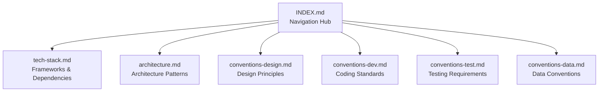

# {{platform_name}} Technology Index

<cite>
**Files Referenced in This Document**
{{#each source_files}}
- [{{name}}](file://{{path}})
{{/each}}
</cite>

> **Target Audience**: devcrew-designer-{{platform_id}}, devcrew-dev-{{platform_id}}, devcrew-test-{{platform_id}}

## Table of Contents

1. [Introduction](#introduction)
2. [Project Structure](#project-structure)
3. [Core Components](#core-components)
4. [Architecture Overview](#architecture-overview)
5. [Detailed Component Analysis](#detailed-component-analysis)
6. [Dependency Analysis](#dependency-analysis)
7. [Performance Considerations](#performance-considerations)
8. [Troubleshooting Guide](#troubleshooting-guide)
9. [Conclusion](#conclusion)
10. [Appendix](#appendix)

## Introduction

This document serves as the technology knowledge index for the {{platform_name}} platform, providing technology stack overview, document navigation, and Agent usage guidelines.

## Project Structure

### Platform Overview

| Attribute | Value |
|-----------|-------|
| Platform Type | {{platform_type}} |
| Primary Framework | {{framework}} |
| Language | {{language}} |
| Source Path | `{{source_path}}` |

### Directory Structure

```
{{platform_id}}/
├── INDEX.md                    # This file
├── tech-stack.md              # Technology stack details
├── architecture.md            # Architecture patterns
├── conventions-design.md      # Design conventions
├── conventions-dev.md         # Development conventions
├── conventions-test.md        # Testing conventions
└── conventions-data.md        # Data conventions (optional)
```

**Section Source**
{{#each project_structure_sources}}
- [{{name}}](file://{{path}}#L{{start}}-L{{end}})
{{/each}}

## Core Components

### Technology Stack Summary

{{tech_stack_summary}}

### Key Technologies

| Category | Technology | Version |
|----------|------------|---------|
{{#each key_technologies}}
| {{category}} | {{name}} | {{version}} |
{{/each}}

**Section Source**
{{#each core_components_sources}}
- [{{name}}](file://{{path}}#L{{start}}-L{{end}})
{{/each}}

## Architecture Overview

### Document Navigation



**Diagram Source**
{{#each architecture_sources}}
- [{{name}}](file://{{path}}#L{{start}}-L{{end}})
{{/each}}

**Section Source**
{{#each architecture_overview_sources}}
- [{{name}}](file://{{path}}#L{{start}}-L{{end}})
{{/each}}

## Detailed Component Analysis

### Quick Navigation

| Document | Purpose | Primary Audience |
|----------|---------|------------------|
| [tech-stack.md](tech-stack.md) | Frameworks, libraries, tools | All Agents |
| [architecture.md](architecture.md) | Architecture patterns | Designer Agent |
| [conventions-design.md](conventions-design.md) | Design principles | Designer Agent |
| [conventions-dev.md](conventions-dev.md) | Coding standards | Dev Agent |
| [conventions-test.md](conventions-test.md) | Testing requirements | Test Agent |
| [conventions-data.md](conventions-data.md) | Data layer conventions | Designer/Dev Agent |

### Key Conventions Summary

#### Design
- See [conventions-design.md](conventions-design.md) for design patterns

#### Development
- See [conventions-dev.md](conventions-dev.md) for coding standards

#### Testing
- See [conventions-test.md](conventions-test.md) for testing requirements

**Section Source**
{{#each component_analysis_sources}}
- [{{name}}](file://{{path}}#L{{start}}-L{{end}})
{{/each}}

## Dependency Analysis

### Configuration Files

{{#each config_files}}
- [{{name}}]({{path}}) - {{purpose}}
{{/each}}

### Module Dependencies

```mermaid
graph LR
{{#each modules}}
{{id}}["{{name}}"]
{{/each}}
{{#each module_deps}}
{{from}} --> {{to}}
{{/each}}
```

**Diagram Source**
{{#each dependency_sources}}
- [{{name}}](file://{{path}}#L{{start}}-L{{end}})
{{/each}}

**Section Source**
{{#each dependency_analysis_sources}}
- [{{name}}](file://{{path}}#L{{start}}-L{{end}})
{{/each}}

## Performance Considerations

### Platform Performance Characteristics

{{performance_characteristics}}

[This section provides general guidance, no specific file reference required]

## Troubleshooting Guide

### Common Issues

{{#each troubleshooting}}
#### {{issue}}

**Quick Fix:** {{quick_fix}}

{{/each}}

**Section Source**
{{#each troubleshooting_sources}}
- [{{name}}](file://{{path}}#L{{start}}-L{{end}})
{{/each}}

## Conclusion

{{conclusion}}

[This section is a summary, no specific file reference required]

## Appendix

### Agent Usage Guide

#### For Designer Agents
1. Read [architecture.md] for platform architecture patterns
2. Read [conventions-design.md] for design principles
3. Reference [tech-stack.md] for technology capabilities

#### For Developer Agents
1. Read [conventions-dev.md] for coding standards
2. Read [conventions-test.md] for testing requirements
3. Reference [architecture.md] when implementation details are unclear

#### For Tester Agents
1. Read [conventions-test.md] for testing standards
2. Reference [conventions-design.md] to understand design intent

### Related Documentation

- [Root Technology Index](../../INDEX.md)

**Section Source**
{{#each appendix_sources}}
- [{{name}}](file://{{path}}#L{{start}}-L{{end}})
{{/each}}
