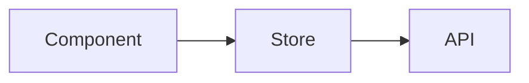

<!-- AI-TAG: platform_id-ui-page-types -->
# Page Type Summary - platform_id

**Files Referenced in This Document**

- [views_dir](relative_pathviews_source_path)

---

## 1. Page Type Overview

> platform_id contains total_pages pages across type_count page types.

## 2. Page Type Classification

<!-- AI-TAG: PAGE_TYPES -->

| Page Type | Count | Description | Typical Structure | Example Pages |
|-----------|-------|-------------|-------------------|---------------|
| page_type | count | description | structure | examples |

## 3. Page Type Details

<!-- AI-TAG: PAGE_TYPE_DETAILS -->

### 3.1 PageTypeName

**Description:** description

**Standard Structure:**
```
┌─────────────────────────────────┐
│ structure_diagram               │
└─────────────────────────────────┘
```

**Required Components:**

| Component | Role | Required |
|-----------|------|----------|
| component | role | required |

**Routing Pattern:** `route_pattern`

**Data Flow:**


## 4. Page Naming & Routing Conventions

<!-- AI-TAG: ROUTING -->

| Convention | Rule | Example |
|-----------|------|---------|
| File naming | rule | example |
| Route path | rule | example |
| Route params | rule | example |

## 5. Agent Usage Guide

| Agent Role | How to Use This Document |
|-----------|------------------------|
| Solution Agent | 评估新功能应采用哪种页面类型 |
| Design Agent | 参考页面类型标准结构设计原型 |
| Dev Agent | 遵循路由和命名规范创建新页面 |

---

**Section Source**
- [views_dir](relative_pathviews_source_path)
