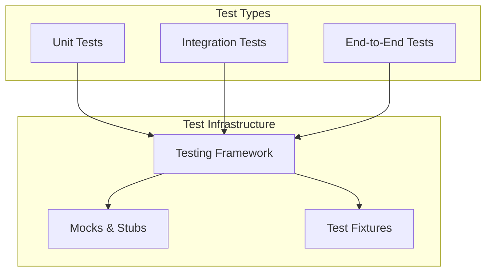
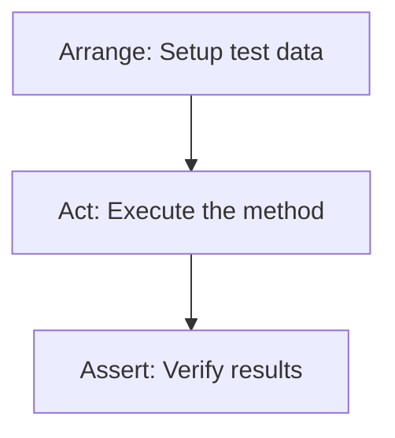

# {{platform_name}} Testing Conventions

<cite>
**Files Referenced in This Document**
{{#each source_files}}
- [{{name}}](file://{{path}})
{{/each}}
</cite>

> **Target Audience**: devcrew-designer-{{platform_id}}, devcrew-dev-{{platform_id}}, devcrew-test-{{platform_id}}

## 目录 / Table of Contents

1. [引言 / Introduction](#引言)
2. [项目结构 / Project Structure](#项目结构)
3. [核心组件 / Core Components](#核心组件)
4. [架构总览 / Architecture Overview](#架构总览)
5. [详细组件分析 / Detailed Component Analysis](#详细组件分析)
6. [依赖分析 / Dependency Analysis](#依赖分析)
7. [性能考虑 / Performance Considerations](#性能考虑)
8. [故障排查指南 / Troubleshooting Guide](#故障排查指南)
9. [结论 / Conclusion](#结论)
10. [附录 / Appendix](#附录)

## 引言

本测试规范文档面向 {{platform_name}} 平台，定义测试框架、测试文件组织、覆盖率要求、单元测试模式、集成测试模式、Mock 策略与测试数据管理。

## 项目结构

### Test Directory Structure

```
{{test_directory_structure}}
```

```mermaid
graph TB
{{#each test_components}}
{{id}}["{{name}}"]
{{/each}}
{{#each test_relations}}
{{from}} --> {{to}}
{{/each}}
```

**Diagram Source**
{{#each structure_sources}}
- [{{name}}](file://{{path}}#L{{start}}-L{{end}})
{{/each}}

**Section Source**
{{#each project_structure_sources}}
- [{{name}}](file://{{path}}#L{{start}}-L{{end}})
{{/each}}

## 核心组件

### Testing Framework

| Framework | Version | Purpose |
|-----------|---------|---------|
{{#each testing_frameworks}}
| {{name}} | {{version}} | {{purpose}} |
{{/each}}

### Test File Naming

| Test Type | Naming Pattern | Example |
|-----------|---------------|---------|
{{#each test_file_naming}}
| {{type}} | {{pattern}} | {{example}} |
{{/each}}

**Section Source**
{{#each core_components_sources}}
- [{{name}}](file://{{path}}#L{{start}}-L{{end}})
{{/each}}

## 架构总览

### Testing Architecture



**Diagram Source**
{{#each architecture_sources}}
- [{{name}}](file://{{path}}#L{{start}}-L{{end}})
{{/each}}

**Section Source**
{{#each architecture_overview_sources}}
- [{{name}}](file://{{path}}#L{{start}}-L{{end}})
{{/each}}

## 详细组件分析

### Coverage Requirements

| Metric | Minimum | Target |
|--------|---------|--------|
{{#each coverage_requirements}}
| {{metric}} | {{minimum}} | {{target}} |
{{/each}}

### Unit Testing Patterns

{{unit_testing_patterns}}



**Diagram Source**
{{#each unit_test_sources}}
- [{{name}}](file://{{path}}#L{{start}}-L{{end}})
{{/each}}

### Integration Testing Patterns

{{integration_testing_patterns}}

### Mocking Strategies

{{mocking_strategies}}

### Test Data Management

{{test_data_management}}

**Section Source**
{{#each component_analysis_sources}}
- [{{name}}](file://{{path}}#L{{start}}-L{{end}})
{{/each}}

## 依赖分析

### Test Dependencies

```mermaid
graph LR
{{#each test_modules}}
{{id}}["{{name}}"]
{{/each}}
{{#each test_deps}}
{{from}} --> {{to}}
{{/each}}
```

**Diagram Source**
{{#each dependency_sources}}
- [{{name}}](file://{{path}}#L{{start}}-L{{end}})
{{/each}}

**Section Source**
{{#each dependency_analysis_sources}}
- [{{name}}](file://{{path}}#L{{start}}-L{{end}})
{{/each}}

## 性能考虑

### Test Performance Guidelines

{{#each performance_guidelines}}
#### {{category}}

{{description}}

**Guidelines:**
{{#each items}}
- {{this}}
{{/each}}

{{/each}}

### Test Execution Optimization

{{test_execution_optimization}}

[This section provides general guidance, no specific file reference required]

## 故障排查指南

### Common Test Issues

{{#each troubleshooting}}
#### {{issue}}

**Symptoms:**
{{#each symptoms}}
- {{this}}
{{/each}}

**Diagnostic Steps:**
{{#each steps}}
{{number}}. {{action}}
{{/each}}

**Solutions:**
{{#each solutions}}
- {{this}}
{{/each}}

{{/each}}

**Section Source**
{{#each troubleshooting_sources}}
- [{{name}}](file://{{path}}#L{{start}}-L{{end}})
{{/each}}

## 结论

{{conclusion}}

[This section is a summary, no specific file reference required]

## 附录

### Testing Best Practices

{{#each testing_best_practices}}
- {{this}}
{{/each}}

### Common Test Scenarios

{{#each common_test_scenarios}}
#### {{name}}

{{description}}

```{{language}}
{{test_example}}
```

{{/each}}

### Running Tests

{{#each test_commands}}
#### {{name}}

```bash
{{command}}
```

{{description}}

{{/each}}

**Section Source**
{{#each appendix_sources}}
- [{{name}}](file://{{path}}#L{{start}}-L{{end}})
{{/each}}
