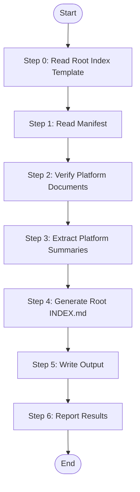

# Stage 3: Generate Root Technology Index

Aggregate all platform technology documentation into a single root INDEX.md that serves as the master navigation hub for technology knowledge.

## Language Adaptation

**CRITICAL**: Generate all content in the language specified by the `language` parameter.

- `language: "zh"` → Generate all content in 中文
- `language: "en"` → Generate all content in English
- Other languages → Use the specified language

## Trigger Scenarios

- "Generate techs root index"
- "Create technology knowledge index"
- "Aggregate platform tech docs"
- "Generate master tech index"

## User

Worker Agent (speccrew-task-worker)

## Input

- `manifest_path`: Path to techs-manifest.json
- `techs_base_path`: Base path for techs documentation (default: `speccrew-workspace/knowledges/techs/`)
- `output_path`: Output path for root INDEX.md (default: `speccrew-workspace/knowledges/techs/`)
- `language`: Target language (e.g., "zh", "en") - **REQUIRED**

## Output

- `{{output_path}}/INDEX.md` - Root technology knowledge index

**INDEX.md Content Structure**:
- Introduction (generation info, platform count)
- Platform Overview (table with links to all platform docs)
- Quick Reference (links organized by document type)
- Agent-to-Platform Mapping (maps agents to their platform docs)
- Document Guide (explains each document type)
- Usage Guide (how to use the knowledge)

## Workflow



### Step 0: Read Root Index Template

Before processing, read the template file to understand the required content structure:
- **Read**: `templates/INDEX-TEMPLATE.md`
- **Purpose**: Understand the template chapters and example content requirements for root technology index documents
- **Key sections to follow**:
  - Introduction (generation info, platform count)
  - Project Structure (Platform Overview table, Directory Structure)
  - Core Components (Technology Stacks, Architecture Guidelines, Design Conventions, Development Conventions, Testing Conventions)
  - Architecture Overview (Platform Architecture Map with Mermaid diagram)
  - Detailed Component Analysis (Agent-to-Platform Mapping)
  - Dependency Analysis (Cross-Platform Dependencies with Mermaid diagram)
  - Performance Considerations
  - Troubleshooting Guide
  - Conclusion
  - Appendix (Document Guide, Usage Guide)

### Step 1: Read Manifest

Read `techs-manifest.json` to get the list of all platforms:

```json
{
  "generated_at": "2024-01-15T10:30:00Z",
  "source_path": "/project",
  "language": "zh",
  "platforms": [
    {
      "platform_id": "web-react",
      "platform_type": "web",
      "framework": "react",
      "language": "typescript"
    },
    {
      "platform_id": "backend-nestjs",
      "platform_type": "backend",
      "framework": "nestjs",
      "language": "typescript"
    }
  ]
}
```

### Step 2: Verify Platform Documents

**CRITICAL**: Do NOT assume all platforms have the same document set. Must dynamically detect which documents actually exist.

**Step 2a: Scan Platform Directories**

For each platform in manifest:
1. List all `.md` files in `{{techs_base_path}}/{{platform_id}}/`
2. Build a document availability map for each platform

**Step 2b: Verify Required Documents**

Check each platform for required documents:
| Document | Required? | If Missing |
|----------|-----------|------------|
| INDEX.md | YES | Skip entire platform from root INDEX |
| tech-stack.md | YES | Mark as "[Missing]" in links |
| architecture.md | YES | Mark as "[Missing]" in links |
| conventions-design.md | YES | Mark as "[Missing]" in links |
| conventions-dev.md | YES | Mark as "[Missing]" in links |
| conventions-test.md | YES | Mark as "[Missing]" in links |
| conventions-build.md | YES | Mark as "[Missing]" in links |
| conventions-data.md | NO | Silently skip link |

**Step 2c: Determine Platform Eligibility**

- IF `INDEX.md` missing → Platform SKIPPED entirely
- IF any required doc missing (except INDEX.md) → Platform INCLUDED but marked INCOMPLETE
- IF only conventions-data.md missing → Platform is COMPLETE (it's optional)

### Step 3: Extract Platform Summaries

Read each platform's INDEX.md to extract:
- Platform name/type
- Framework and version
- Primary language
- Key technologies (brief)

### Step 4: Generate Root INDEX.md (MANDATORY: Copy Template + Fill)

**CRITICAL**: This step MUST follow the template fill workflow - copy template first, then fill sections.

1. **Copy Template File**:
   - Copy `templates/INDEX-TEMPLATE.md` to `{output_path}/INDEX.md`
   - This preserves the template structure and all required sections

2. **Fill Template Sections with search_replace**:
   - Use `search_replace` tool to fill each section of the template
   - Replace placeholder content with actual data from platform analysis

   **MANDATORY RULES**:
   - **Do NOT use create_file to rewrite the entire document**
   - **Do NOT delete or skip any template section**
   - Only replace the placeholder content within each section
   - Preserve all template section headers and structure

3. **Get Timestamp**:
   - **CRITICAL**: Use the Skill tool to invoke `speccrew-get-timestamp` (no format parameter needed, uses default)
   - Store the returned timestamp as `{{generated_at}}` template variable

4. **Fill the following sections** in the copied template:

#### Section 1: Header

```markdown
# Technology Knowledge Index

**Files Referenced in This Document**

- [techs-manifest.json](../../../speccrew-workspace/knowledges/techs/techs-manifest.json)

> **Target Audience**: devcrew-designer-*, devcrew-dev-*, devcrew-test-*

## Table of Contents

1. [Introduction](#introduction)
2. [Project Structure](#project-structure)
3. [Core Components](#core-components)
4. [Architecture Overview](#architecture-overview)
5. [Detailed Component Analysis](#detailed-component-analysis)
6. [Dependency Analysis](#dependency-analysis)
7. [Performance Considerations](#performance-considerations)
8. [Troubleshooting Guide](#troubleshooting-guide)
9. [Conclusion](#conclusion)
10. [Appendix](#appendix)

## Introduction

This technology knowledge index serves all platforms in the project, providing platform overview, document navigation, and Agent usage guidelines.

> Generated at: {{generated_at}}
> Source: {{source_path}}
> Platforms: {{platform_count}}
```

#### Section 2: Platform Overview

Summary table of all platforms with **dynamically generated document links**:

```markdown
## Platform Overview

| Platform | Type | Framework | Stack | Arch | Design | Dev | Test | Build | Data |
|----------|------|-----------|-------|------|--------|-----|------|-------|------|
| [web-react](web-react/INDEX.md) | web | React | [Stack](web-react/tech-stack.md) | [Arch](web-react/architecture.md) | [Design](web-react/conventions-design.md) | [Dev](web-react/conventions-dev.md) | [Test](web-react/conventions-test.md) | [Build](web-react/conventions-build.md) | - |
| [backend-nestjs](backend-nestjs/INDEX.md) | backend | NestJS | [Stack](backend-nestjs/tech-stack.md) | [Arch](backend-nestjs/architecture.md) | [Design](backend-nestjs/conventions-design.md) | [Dev](backend-nestjs/conventions-dev.md) | [Test](backend-nestjs/conventions-test.md) | [Build](backend-nestjs/conventions-build.md) | [Data](backend-nestjs/conventions-data.md) |
| [mobile-uniapp](mobile-uniapp/INDEX.md) | mobile | UniApp | [Stack](mobile-uniapp/tech-stack.md) | [Arch](mobile-uniapp/architecture.md) | [Design](mobile-uniapp/conventions-design.md) | [Dev](mobile-uniapp/conventions-dev.md) | [Test](mobile-uniapp/conventions-test.md) | [Build](mobile-uniapp/conventions-build.md) | - |
```

**Dynamic Link Generation Rules:**

1. **Always include links to required documents** (if they exist):
   - INDEX.md, tech-stack.md, architecture.md, conventions-design.md, conventions-dev.md, conventions-test.md, conventions-build.md
   - If document missing → Display `[Missing]` instead of link

2. **Conditionally include conventions-data.md**:
   - If exists → Add link `[Data](...)`
   - If not exists → Display `-` (dash, not [Missing])
   - For `backend` platforms, typically include
   - For `mobile` platforms without data layer, omit

3. **Link Format**: Use short abbreviations to save space:
   - `[Stack]` → tech-stack.md
   - `[Arch]` → architecture.md
   - `[Design]` → conventions-design.md
   - `[Dev]` → conventions-dev.md
   - `[Test]` → conventions-test.md
   - `[Build]` → conventions-build.md (Required column)
   - `[Data]` → conventions-data.md (Optional column, show `-` if missing)

#### Section 3: Quick Reference

Quick links organized by document type:

```markdown
## Quick Reference

### Technology Stacks
- [Web Frontend - React](web-react/tech-stack.md)
- [Backend API - NestJS](backend-nestjs/tech-stack.md)

### Architecture Guidelines
- [Web Frontend](web-react/architecture.md)
- [Backend API](backend-nestjs/architecture.md)

### Design Conventions
- [Web Frontend](web-react/conventions-design.md)
- [Backend API](backend-nestjs/conventions-design.md)

### Development Conventions
- [Web Frontend](web-react/conventions-dev.md)
- [Backend API](backend-nestjs/conventions-dev.md)

### Testing Conventions
- [Web Frontend](web-react/conventions-test.md)
- [Backend API](backend-nestjs/conventions-test.md)
```

#### Section 4: Agent-to-Platform Mapping

Critical section that defines how Agents map to platform documentation. **Must dynamically adjust based on actual document availability**:

```markdown
## Agent-to-Platform Mapping

This section maps dynamically generated Agents to their respective platform documentation.

### Web Frontend (web-react)

| Agent Role | Agent Name | Documentation Path |
|------------|------------|-------------------|
| Designer | speccrew-designer-web-react | [speccrew-workspace/knowledges/techs/web-react/](web-react/) |
| Developer | speccrew-dev-web-react | [speccrew-workspace/knowledges/techs/web-react/](web-react/) |
| Tester | speccrew-test-web-react | [speccrew-workspace/knowledges/techs/web-react/](web-react/) |

**Key Documents for Web Agents:**
- Designer: [architecture.md](web-react/architecture.md), [conventions-design.md](web-react/conventions-design.md), [ui-style/ui-style-guide.md](web-react/ui-style/ui-style-guide.md)
  - If bizs pipeline executed: Also reference [ui-style-patterns/](web-react/ui-style-patterns/) for business UI patterns
- Developer: [conventions-dev.md](web-react/conventions-dev.md), [conventions-build.md](web-react/conventions-build.md)
- Tester: [conventions-test.md](web-react/conventions-test.md), [conventions-build.md](web-react/conventions-build.md)

### Backend API (backend-nestjs)

| Agent Role | Agent Name | Documentation Path |
|------------|------------|-------------------|
| Designer | speccrew-designer-backend-nestjs | [speccrew-workspace/knowledges/techs/backend-nestjs/](backend-nestjs/) |
| Developer | speccrew-dev-backend-nestjs | [speccrew-workspace/knowledges/techs/backend-nestjs/](backend-nestjs/) |
| Tester | speccrew-test-backend-nestjs | [speccrew-workspace/knowledges/techs/backend-nestjs/](backend-nestjs/) |

**Key Documents for Backend Agents:**
- Designer: [architecture.md](backend-nestjs/architecture.md), [conventions-design.md](backend-nestjs/conventions-design.md), [conventions-data.md](backend-nestjs/conventions-data.md)
- Developer: [conventions-dev.md](backend-nestjs/conventions-dev.md), [conventions-build.md](backend-nestjs/conventions-build.md), [conventions-data.md](backend-nestjs/conventions-data.md)
- Tester: [conventions-test.md](backend-nestjs/conventions-test.md), [conventions-build.md](backend-nestjs/conventions-build.md)

### Mobile App (mobile-uniapp) - Example without conventions-data.md

| Agent Role | Agent Name | Documentation Path |
|------------|------------|-------------------|
| Designer | speccrew-designer-mobile-uniapp | [speccrew-workspace/knowledges/techs/mobile-uniapp/](mobile-uniapp/) |
| Developer | speccrew-dev-mobile-uniapp | [speccrew-workspace/knowledges/techs/mobile-uniapp/](mobile-uniapp/) |
| Tester | speccrew-test-mobile-uniapp | [speccrew-workspace/knowledges/techs/mobile-uniapp/](mobile-uniapp/) |

**Key Documents for Mobile Agents:**
- Designer: [architecture.md](mobile-uniapp/architecture.md), [conventions-design.md](mobile-uniapp/conventions-design.md), [ui-style/ui-style-guide.md](mobile-uniapp/ui-style/ui-style-guide.md)
  - If bizs pipeline executed: Also reference [ui-style-patterns/](mobile-uniapp/ui-style-patterns/) for business UI patterns
- Developer: [conventions-dev.md](mobile-uniapp/conventions-dev.md), [conventions-build.md](mobile-uniapp/conventions-build.md)
- Tester: [conventions-test.md](mobile-uniapp/conventions-test.md), [conventions-build.md](mobile-uniapp/conventions-build.md)
```

**Dynamic Adjustment Rules:**

1. **Designer Agent Documents**:
   - Primary: architecture.md, conventions-design.md, ui-style/ui-style-guide.md
   - Optional: conventions-data.md (if data layer involved)
   - Optional: ui-style-patterns/ directory (if bizs pipeline Stage 3.5 executed)
   - Note: For frontend/mobile platforms, Designer should reference both ui-style/ (tech perspective) and ui-style-patterns/ (business perspective, if exists)

2. **Developer Agent Documents**:
   - Primary: conventions-dev.md, conventions-build.md
   - Optional: conventions-data.md
   - Note: Developer needs conventions-build.md for build process, environment configuration, and CI/CD conventions

3. **Tester Agent Documents**:
   - Primary: conventions-test.md, conventions-build.md
   - Optional: conventions-data.md (for database testing)
   - Note: Tester needs conventions-build.md for CI/CD pipeline and test environment configuration

**UI Style Directory Reference Guide**:

For frontend platforms (web, mobile, desktop), the INDEX.md should document both UI style directories:

| Directory | Managed By | Content | Reference Condition |
|-----------|------------|---------|---------------------|
| `ui-style/` | techs pipeline Stage 2 | Framework-level design system | Always reference for frontend platforms |
| `ui-style-patterns/` | bizs pipeline Stage 3.5 | Business UI patterns | Only reference if directory exists |

#### Section 5: Document Guide

Explain what each document type contains:

```markdown
## Document Guide

### INDEX.md (per platform)
Platform-specific overview and navigation.

### tech-stack.md
Framework versions, dependencies, build tools, and configuration files.

### architecture.md
Architecture patterns, layering, component organization, and design patterns.

### conventions-design.md
Design principles, patterns, and guidelines for detailed design work.

### conventions-dev.md
Naming conventions, code style, directory structure, and Git conventions.

### conventions-test.md
Testing frameworks, coverage requirements, and testing patterns.

### conventions-build.md
Build process, environment configuration, CI/CD pipelines, and deployment conventions.

### conventions-data.md
Data modeling, ORM usage, and database conventions (if applicable).
```

#### Section 6: Usage Guide

How to use the technology knowledge:

```markdown
## Usage Guide

### For Designer Agents
1. Read [architecture.md] for platform architecture patterns
2. Read [conventions-design.md] for design principles
3. Reference [tech-stack.md] for technology capabilities

### For Developer Agents
1. Read [conventions-dev.md] for coding standards
2. Read [conventions-test.md] for testing requirements
3. Reference [architecture.md] when implementation details are unclear

### For Tester Agents
1. Read [conventions-test.md] for testing standards
2. Reference [conventions-design.md] to understand design intent
```

### Step 5: Write Output

Write the generated INDEX.md to `{{output_path}}/INDEX.md`.

### Step 6: Report Results

```
Stage 3 completed: Root Technology Index Generated
- Platforms Indexed: {{platform_count}}
  - web-react: ✓
  - backend-nestjs: ✓
- Root Index: {{output_path}}/INDEX.md
- Agent Mappings: Documented for all platforms
```

## Template

Use template at `templates/INDEX-TEMPLATE.md`:

**Template Variables:**
- `{{generated_at}}`: ISO timestamp
- `{{source_path}}`: Source path
- `{{platform_count}}`: Number of platforms
- `{{#each platforms}}`: Loop through platforms
  - `{{platform_id}}`: Platform identifier
  - `{{platform_type}}`: Platform type
  - `{{framework}}`: Framework name
  - `{{language}}`: Programming language

## Checklist

### Pre-Generation
- [ ] techs-manifest.json read successfully
- [ ] Platform list extracted from manifest

### Dynamic Document Detection
- [ ] Each platform directory scanned for actual document existence
- [ ] Document availability map created for each platform
- [ ] Required documents verified (INDEX.md, tech-stack.md, architecture.md, conventions-design.md, conventions-dev.md, conventions-test.md, conventions-build.md)
- [ ] Optional conventions-data.md existence checked per platform

### Content Generation
- [ ] Platform summaries extracted from existing INDEX.md files
- [ ] Root INDEX.md generated with all sections
- [ ] **Platform Overview table**: Links dynamically generated based on actual document existence
- [ ] **Agent-to-Platform mapping**: Document recommendations adjusted per platform
- [ ] Document guide included
- [ ] Usage guide included

### Quality & Validation
- [ ] No broken links to non-existent documents
- [ ] conventions-data.md links only included for platforms where it exists
- [ ] **Source traceability**: File reference block added to root INDEX.md
- [ ] **Source traceability**: Section Source annotations added at end of major sections
- [ ] Output file written successfully
- [ ] Results reported with document availability summary

