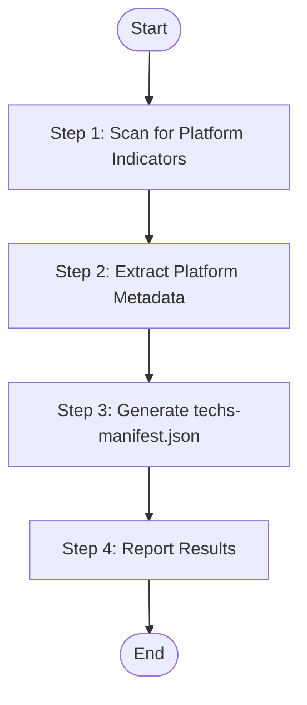

# Stage 1: Detect Technology Platforms

Scan project source code to identify all technology platforms, extract configuration metadata, and generate techs-manifest.json for downstream document generation.

## Language Adaptation

**CRITICAL**: Generate all content in the language specified by the `language` parameter.

- `language: "zh"` → Generate all content in 中文
- `language: "en"` → Generate all content in English
- Other languages → Use the specified language

**All output content must be in the target language only.**

## Trigger Scenarios

- "Initialize technology knowledge base"
- "Scan source code for technology platforms"
- "Detect tech stacks in project"
- "Generate techs manifest"

## User

Worker Agent (speccrew-task-worker)

## Input

- `source_path`: Source code root directory (default: project root)
- `output_path`: Output directory for techs-manifest.json (default: `speccrew-workspace/knowledges/base/sync-state/knowledge-techs/`)
- `language`: Target language for generated content (e.g., "zh", "en") - **REQUIRED**

## Output

- `{{output_path}}/techs-manifest.json` - Technology platform manifest for pipeline orchestration

## Workflow



### Step 1: Scan for Platform Indicators

1. **Read Configuration**:
   - Read `speccrew-workspace/docs/configs/platform-mapping.json` - Get standardized platform identifiers and mapping rules

2. **Analyze project structure to detect technology platforms**:
   - Check for platform-specific files and configurations (see [Platform Detection Reference](#platform-detection-reference))

#### Web Platform Detection

**Indicators:**

| Signal | Platform ID | Framework |
|--------|-------------|-----------|
| package.json + react dependency | web-react | React |
| package.json + vue dependency | web-vue | Vue |
| package.json + @angular/core | web-angular | Angular |
| package.json + next | web-nextjs | Next.js |
| package.json + nuxt | web-nuxt | Nuxt |
| package.json + svelte | web-svelte | Svelte |

**Configuration Files to Capture:**
- package.json
- tsconfig.json
- vite.config.* / webpack.config.* / next.config.* / nuxt.config.*
- tailwind.config.* / postcss.config.*
- .eslintrc.* / .prettierrc.*

#### Mobile Platform Detection

**Indicators:**

| Signal | Platform ID | Framework |
|--------|-------------|-----------|
| pubspec.yaml | mobile-flutter | Flutter |
| package.json + react-native | mobile-react-native | React Native |
| .xcodeproj / Package.swift | mobile-ios | iOS (Swift) |
| build.gradle + AndroidManifest.xml | mobile-android | Android (Kotlin/Java) |
| manifest.json + pages.json (uni-app) | mobile-uniapp | UniApp |
| project.config.json + app.json | mobile-miniprogram | Mini Program |

**Configuration Files to Capture:**
- Flutter: pubspec.yaml, analysis_options.yaml
- React Native: package.json, metro.config.js
- iOS: Package.swift, Podfile, Info.plist
- Android: build.gradle, AndroidManifest.xml

#### Backend Platform Detection

**Indicators:**

| Signal | Platform ID | Framework |
|--------|-------------|-----------|
| package.json + @nestjs/core | backend-nestjs | NestJS |
| package.json + express | backend-express | Express |
| package.json + fastify | backend-fastify | Fastify |
| pom.xml + spring-boot | backend-spring | Spring Boot |
| build.gradle + spring-boot | backend-spring | Spring Boot |
| requirements.txt + django | backend-django | Django |
| requirements.txt + fastapi | backend-fastapi | FastAPI |
| go.mod | backend-go | Go |
| Cargo.toml | backend-rust | Rust (Actix/Rocket) |

**Configuration Files to Capture:**
- Node.js: package.json, tsconfig.json, nest-cli.json
- Java: pom.xml, build.gradle, application.yml/properties
- Python: requirements.txt, pyproject.toml
- Go: go.mod, go.sum
- Rust: Cargo.toml

#### Desktop Platform Detection

**Indicators:**

| Signal | Platform ID | Framework |
|--------|-------------|-----------|
| package.json + electron | desktop-electron | Electron |
| tauri.conf.json | desktop-tauri | Tauri |
| .csproj + WPF references | desktop-wpf | WPF |
| .csproj + WinForms | desktop-winforms | WinForms |
| .pro file + Qt | desktop-qt | Qt |

**Configuration Files to Capture:**
- Electron: package.json, electron-builder.yml
- Tauri: tauri.conf.json, Cargo.toml
- WPF/WinForms: .csproj, App.xaml
- Qt: .pro, CMakeLists.txt

### Step 2: Extract Platform Metadata

For each detected platform, extract:

| Field | Source | Example |
|-------|--------|---------|
| platform_id | `{{platform_type}}-{{framework}}` | web-react, backend-nestjs |
| platform_type | Platform category | web, mobile, backend, desktop |
| framework | Primary framework | react, nestjs, flutter |
| language | Primary language | typescript, kotlin, dart |
| source_path | Relative source directory | src/web, src/server |
| config_files | List of config file paths | ["package.json", "tsconfig.json"] |
| convention_files | Lint/format config files | [".eslintrc.js", ".prettierrc"] |

### Step 3: Generate techs-manifest.json

1. **Get Timestamp**:
   - **CRITICAL**: Run `node scripts/get-timestamp.js` to get current timestamp (no format parameter needed, uses default)
   - Store the output as `generated_at` value

2. **Create JSON file** with detected platforms:

```json
{
  "generated_at": "{{timestamp_from_get_timestamp}}",
  "source_path": "/project",
  "language": "zh",
  "platforms": [
    {
      "platform_id": "web-react",
      "platform_type": "web",
      "framework": "react",
      "language": "typescript",
      "source_path": "src/web",
      "config_files": [
        "src/web/package.json",
        "src/web/tsconfig.json",
        "src/web/vite.config.ts"
      ],
      "convention_files": [
        "src/web/.eslintrc.js",
        "src/web/.prettierrc"
      ]
    },
    {
      "platform_id": "backend-nestjs",
      "platform_type": "backend",
      "framework": "nestjs",
      "language": "typescript",
      "source_path": "src/server",
      "config_files": [
        "src/server/package.json",
        "src/server/nest-cli.json",
        "src/server/tsconfig.json"
      ],
      "convention_files": [
        "src/server/.eslintrc.js"
      ]
    }
  ]
}
```

### Step 4: Report Results

```
Stage 1 completed: Technology Platform Detection
- Platforms Detected: {{platform_count}}
  - web-react: React 18.2.0, TypeScript 5.3.0
  - backend-nestjs: NestJS 10.0.0, TypeScript 5.3.0
- Configuration Files Found: {{config_file_count}}
- Output: {{output_path}}/techs-manifest.json
- Next: Dispatch parallel tasks for Stage 2 (Tech Document Generation)
```

## Reference Guides

### Platform Detection Reference

#### Multiple Platforms in Same Project

If a project contains multiple platforms (e.g., web + backend + mobile):
- Detect each platform separately
- Assign unique platform_id for each
- Include all platforms in manifest

#### Monorepo Structure

For monorepos with multiple packages:
- Detect platforms in each package directory
- Use relative paths for source_path
- Example: `packages/web-app` → web-react platform

#### Framework Version Detection

Extract version information when available:
- From package.json dependencies
- From pom.xml version tags
- Include in report but not in manifest (manifest focuses on structure)

#### Platform Mapping to bizs-init

Ensure consistency with modules.json by using standardized platform identifiers from `platform-mapping.json`:

**Key Rules:**
- `platform_id` format: `{{platform_type}}-{{framework}}` (e.g., `mobile-uniapp`, `web-vue`)
- `platform_type` must match between techs-manifest.json and modules.json
- `framework` maps to `platform_subtype` in modules.json

**Example Mapping:**
| platform_id | platform_type | framework | platform_subtype (for bizs-init) |
|-------------|---------------|-----------|----------------------------------|
| web-vue | web | vue | vue |
| mobile-uniapp | mobile | uniapp | uniapp |
| backend-spring | backend | spring | spring |

---

## Checklist

- [ ] All platform indicators checked
- [ ] Platform metadata extracted (platform_id, type, framework, language)
- [ ] Configuration files identified and paths recorded
- [ ] Convention files (eslint, prettier) identified
- [ ] techs-manifest.json generated with valid JSON structure
- [ ] **Source traceability**: All config_file paths recorded for downstream use
- [ ] Output path verified
- [ ] Results reported with platform summary

