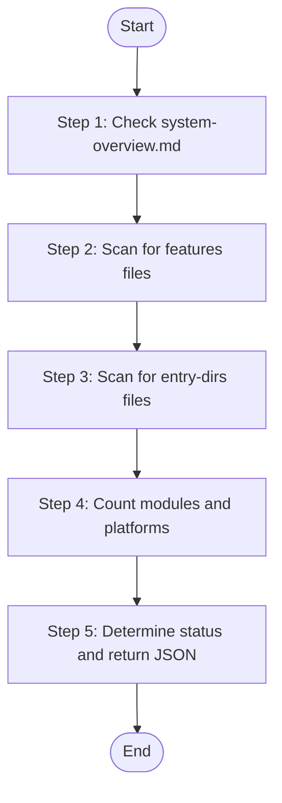

# Knowledge Base Detector

Detect business knowledge base availability and completeness status. Scans the sync-state directory to determine the current knowledge state.

## Language Adaptation

**CRITICAL**: Generate all content in the language specified by the `language` parameter.

- `language: "zh"` → Generate all content in 中文
- `language: "en"` → Generate all content in English
- Other languages → Use the specified language

**All output content must be in the target language only.**

## Trigger Scenarios

- "Check knowledge base status"
- "Detect if business knowledge exists"
- "Scan knowledge availability"
- "What knowledge is available?"

## Input

| Variable | Type | Description | Required |
|----------|------|-------------|----------|
| `workspace_path` | string | Absolute path to speccrew workspace (e.g., `speccrew-workspace`) | **Yes** |
| `sync_state_bizs_dir` | string | Absolute path to `knowledges/base/sync-state/knowledge-bizs/` directory | **Yes** |
| `configs_dir` | string | Absolute path to `docs/configs/` directory | **Yes** |

## Output JSON

```json
{
  "status": "full | lite | none",
  "has_system_overview": false,
  "has_features": false,
  "has_entry_dirs": false,
  "available_platforms": ["web-vue3", "backend-spring"],
  "module_count": 0,
  "features_files": ["path/to/features-web-vue3.json"],
  "entry_dirs_files": ["path/to/entry-dirs-web-vue3.json"],
  "system_overview_path": null,
  "message": "Knowledge base status detected"
}
```

**Status Definitions**:

| Status | Condition |
|--------|-----------|
| `full` | has_system_overview = true AND has_features = true |
| `lite` | has_features = true AND has_system_overview = false |
| `none` | has_features = false AND has_system_overview = false |

## Workflow



### Step 1: Check system-overview.md

Check if the system overview file exists:

1. Path: `{workspace_path}/knowledges/bizs/system-overview.md`
2. Attempt to read the file
3. Set `has_system_overview` = true if exists, false otherwise
4. Set `system_overview_path` = path if exists, null otherwise

**Output**: "Step 1 Status: ✅ COMPLETED - system-overview.md {exists|not found}"

### Step 2: Scan for features files

Scan the sync-state directory for feature inventory files:

1. Use provided path: `{sync_state_bizs_dir}/`
2. Glob pattern: `features-*.json`
3. Collect all matching files into `features_files` array
4. Set `has_features` = true if any files found

**Output**: "Step 2 Status: ✅ COMPLETED - Found {count} features files"

### Step 3: Scan for entry-dirs files

Scan for entry directory configuration files:

1. Use provided path: `{sync_state_bizs_dir}/`
2. Glob pattern: `entry-dirs-*.json`
3. Collect all matching files into `entry_dirs_files` array
4. Set `has_entry_dirs` = true if any files found

**Output**: "Step 3 Status: ✅ COMPLETED - Found {count} entry-dirs files"

### Step 4: Count modules and platforms

For each features file found:

1. Read the JSON content
2. Extract `platformId` and add to `available_platforms` array
3. Sum up `modules` array length for `module_count`
4. Extract `features` array length for feature count per platform

**Output**: "Step 4 Status: ✅ COMPLETED - {platform_count} platforms, {module_count} modules"

### Step 5: Determine status and return JSON

Calculate the overall status:

```
IF has_system_overview AND has_features THEN
    status = "full"
ELSE IF has_features THEN
    status = "lite"
ELSE
    status = "none"
END IF
```

Return the complete JSON output.

**Output**: "Step 5 Status: ✅ COMPLETED - Knowledge status: {status}"

## Constraints

1. **READ-ONLY**: This skill does not modify any files
2. **Fast execution**: Use Glob for scanning, avoid deep file reads
3. **Graceful handling**: Return empty arrays if directories don't exist
4. **Path format**: All returned paths should be relative to workspace_path

> **MANDATORY**: Use the provided absolute paths directly. DO NOT construct or derive paths yourself.

## Task Completion Report

When the task is complete, report:

```json
{
  "status": "success | failed",
  "skill": "speccrew-pm-knowledge-detector",
  "detection_result": {
    "status": "full | lite | none",
    "available_platforms": [...],
    "module_count": 0
  },
  "message": "Knowledge base status detected successfully"
}
```

## Checklist

- [ ] Step 1: Checked system-overview.md existence
- [ ] Step 2: Scanned for features-*.json files
- [ ] Step 3: Scanned for entry-dirs-*.json files
- [ ] Step 4: Counted platforms and modules
- [ ] Step 5: Determined overall status and returned JSON
