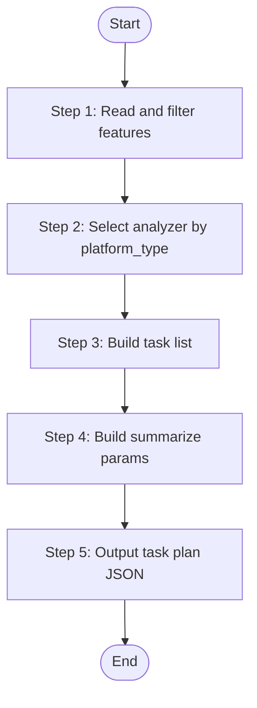

# Module Initializer (Task Plan Generator)

Generate analyze task plan for a single business module. Reads features-*.json, filters matched module's pending features, and outputs a task plan JSON (list of features to analyze with analyzer parameters). Used by Worker Agent, invoked by PM Agent for on-demand module task planning.

> **Positioning**: Task plan generator for PM phase. Generates task list for PM Agent to orchestrate. Does NOT execute analyze or summarize directly — PM Agent handles Worker dispatch based on task plan output.

## Language Adaptation

**CRITICAL**: Generate all content in the language specified by the `language` parameter.

- `language: "zh"` → Generate all content in Chinese
- `language: "en"` → Generate all content in English
- Other languages → Use the specified language

**All output content must be in the target language only.**

## Trigger Scenarios

- "Generate task plan for module {name}"
- "Plan module {name} initialization"
- "List pending features for module {name}"

## Input

| Parameter | Type | Required | Description |
|-----------|------|----------|-------------|
| `source_path` | string | Yes | Project source code root path |
| `module_name` | string | Yes | Module name |
| `platform_id` | string | Yes | Platform ID (e.g., "web-vue", "admin-api") |
| `platform_type` | string | Yes | web / mobile / backend / desktop |
| `platform_subtype` | string | No | Platform subtype (e.g., "vue", "spring-boot") |
| `tech_stack` | array | No | Platform tech stack (e.g., ["java", "spring-boot"]) |
| `features_file` | string | Yes | Path to the platform's features-{platform}.json file |
| `output_path` | string | Yes | Knowledge base output root path (e.g., speccrew-workspace/knowledges) |
| `completed_dir` | string | Yes | Marker file output directory for api-analyze .done.json markers. Value from PM Agent: `{sync_state_bizs_dir}/completed` |
| `sourceFile` | string | Yes | Features JSON filename (e.g., "features-backend-system.json"), used for api-analyze marking |
| `language` | string | Yes | Output language (zh / en) |
| `workspace_path` | string | Yes | Workspace root path for constructing absolute paths |

## Output JSON

```json
{
  "module_name": "system",
  "platform_id": "web-vue",
  "analyzer_skill": "speccrew-knowledge-bizs-ui-analyze",
  "tasks": [
    {
      "fileName": "index",
      "sourcePath": "src/views/system/user/index.vue",
      "documentPath": "knowledges/bizs/web-vue/system/features",
      "module": "system",
      "platform_type": "web",
      "platform_subtype": "vue",
      "tech_stack": ["vue", "typescript"],
      "language": "zh"
    }
  ],
  "total_pending": 90,
  "summarize_params": {
    "skill": "speccrew-knowledge-module-summarize",
    "module_name": "system",
    "module_path": "knowledges/bizs/web-vue/system",
    "language": "zh"
  }
}
```

**Field Definitions**:

| Field | Description |
|-------|-------------|
| `module_name` | Module being processed |
| `platform_id` | Platform identifier |
| `analyzer_skill` | Selected analyzer skill name |
| `tasks` | Array of pending features to analyze |
| `total_pending` | Count of pending features |
| `summarize_params` | Parameters for module-summarize skill (to be executed after all analyze tasks complete) |

## Workflow



### Step 1: Read and Filter Features

**Step 1 Status: 🔄 IN PROGRESS**

1. **Read features file**: Parse the `features_file` JSON
2. **Filter by module**: Select features where `module == module_name` AND `analyzed == false`
3. **Record counts**:
   - Total features for this module
   - Pending features (analyzed = false)

**Output**: "Step 1 Status: ✅ COMPLETED - Found {total} total features, {pending} pending for analysis"

### Step 2: Select Analyzer by Platform Type

**Step 2 Status: 🔄 IN PROGRESS**

Based on `platform_type`, select the appropriate analyzer Skill:

| platform_type | skill_name | Description |
|---------------|------------|-------------|
| web, mobile, desktop | `speccrew-knowledge-bizs-ui-analyze` | UI Feature Analysis |
| backend | `speccrew-knowledge-bizs-api-analyze` | API Controller Analysis |

**Output**: "Step 2 Status: ✅ COMPLETED - Selected analyzer: {skill_name}"

### Step 3: Build Task List

**Step 3 Status: 🔄 IN PROGRESS**

For each pending feature from Step 1, build a task object with analyzer parameters.

> 🛑 **IMPORTANT**: This Skill does NOT execute analyze. It ONLY generates the task list. PM Agent will dispatch Workers based on this task plan.

#### Task object structure for each pending feature:

```json
{
  "fileName": "{feature.fileName}",
  "sourcePath": "{feature.sourcePath}",
  "documentPath": "{output_path}/bizs/{platform_id}/{feature.module}/features",
  "module": "{feature.module}",
  "platform_type": "{platform_type}",
  "platform_subtype": "{platform_subtype}",
  "tech_stack": "{tech_stack}",
  "language": "{language}"
}
```

For backend features (api-analyze), also include:
```json
{
  "completed_dir": "{completed_dir}",
  "sourceFile": "{sourceFile}"
}
```

**Output**: "Step 3 Status: ✅ COMPLETED - Built {count} task entries"

### Step 4: Build Summarize Parameters

**Step 4 Status: 🔄 IN PROGRESS**

Build the summarize_params object for module-summarize skill. This will be used by PM Agent after all analyze tasks complete.

```json
{
  "skill": "speccrew-knowledge-module-summarize",
  "module_name": "{module_name}",
  "module_path": "{output_path}/bizs/{platform_id}/{module_name}",
  "language": "{language}"
}
```

**Output**: "Step 4 Status: ✅ COMPLETED - Summarize params ready"

### Step 5: Output Task Plan JSON

**Step 5 Status: 🔄 IN PROGRESS**

Compile and output the final task plan:

```json
{
  "module_name": "...",
  "platform_id": "...",
  "analyzer_skill": "...",
  "tasks": [...],
  "total_pending": <count>,
  "summarize_params": {...}
}
```

**Output**: "Step 5 Status: ✅ COMPLETED - Task plan generated with {count} pending features"

## Constraints

1. **Output path format**: Must match bizs-dispatch format: `{output_path}/bizs/{platform_id}/{module_name}/`

2. **Use same analyzers as dispatch**: 
   - Backend → `speccrew-knowledge-bizs-api-analyze`
   - Web/Mobile/Desktop → `speccrew-knowledge-bizs-ui-analyze`

3. **Worker context**: This Skill runs in Worker Agent context, invoked by PM Agent

4. **NO execution**: This Skill generates task plan ONLY. It does NOT:
   - Execute analyzer skills
   - Execute summarize skills
   - Update features.json analyzed field
   - All execution is handled by PM Agent based on task plan output

5. **Mutual exclusion with full dispatch**: Do not run simultaneously with full dispatch process

## Error Handling

| Scenario | Action |
|----------|--------|
| Features file not found | Return error with message |
| No features for module | Return empty tasks array with summarize_params |
| No pending features | Return empty tasks array with summarize_params |

## Reference: Analyzer Input Parameters

### API Analyzer (speccrew-knowledge-bizs-api-analyze)

| Variable | Type | Description | Example |
|----------|------|-------------|---------|
| `fileName` | string | Controller file name | `"UserController"` |
| `sourcePath` | string | Relative path to source file | `"src/.../UserController.java"` |
| `documentPath` | string | Target path for generated document | `"knowledges/bizs/.../features"` |
| `module` | string | Business module name | `"system"` |
| `analyzed` | boolean | Analysis status flag | `false` |
| `platform_type` | string | Platform type | `"backend"` |
| `platform_subtype` | string | Platform subtype | `"spring-boot"` |
| `tech_stack` | array | Platform tech stack | `["java", "spring-boot"]` |
| `language` | string | Target language | `"zh"` |
| `completed_dir` | string | Marker output directory (absolute path) | `".../knowledges/base/sync-state/completed"` |
| `sourceFile` | string | Source features JSON filename | `"features-admin-api.json"` |

### UI Analyzer (speccrew-knowledge-bizs-ui-analyze)

| Variable | Type | Description | Example |
|----------|------|-------------|---------|
| `fileName` | string | Feature file name | `"index"` |
| `sourcePath` | string | Relative path to source file | `"src/views/system/user/index.vue"` |
| `documentPath` | string | Target path for generated document | `"knowledges/bizs/.../features"` |
| `module` | string | Business module name | `"system"` |
| `analyzed` | boolean | Analysis status flag | `false` |
| `platform_type` | string | Platform type | `"web"` |
| `platform_subtype` | string | Platform subtype | `"vue"` |
| `tech_stack` | array | Platform tech stack | `["vue", "typescript"]` |
| `language` | string | Target language | `"zh"` |

## Task Completion Report

When the task is complete, report:

```json
{
  "status": "success",
  "skill": "speccrew-pm-module-initializer",
  "output": {
    "module_name": "...",
    "platform_id": "...",
    "analyzer_skill": "...",
    "tasks": [...],
    "total_pending": <count>,
    "summarize_params": {...}
  }
}
```

## Checklist

- [ ] Step 1: Read features file and filtered by module
- [ ] Step 2: Selected analyzer type based on platform_type
- [ ] Step 3: Built task list with analyzer parameters
- [ ] Step 4: Built summarize parameters
- [ ] Step 5: Output task plan JSON
