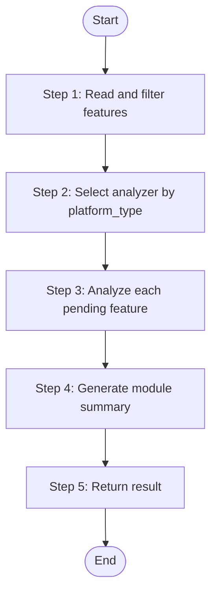

# Module Initializer

Initialize knowledge base for a single business module by analyzing its features. Dispatches api-analyze or ui-analyze based on platform type, then generates module summary. Used by Worker Agent, invoked by PM Agent for on-demand module initialization.

> **Positioning**: Lightweight knowledge base initializer for PM phase, processes only modules matched by PM matcher.
> Difference from bizs-dispatch: module-initializer processes single modules on-demand, does not generate graph data, output is for PRD authoring reference only.

## Language Adaptation

**CRITICAL**: Generate all content in the language specified by the `language` parameter.

- `language: "zh"` → Generate all content in Chinese
- `language: "en"` → Generate all content in English
- Other languages → Use the specified language

**All output content must be in the target language only.**

## Trigger Scenarios

- "Initialize module {name}"
- "Deep analyze module {name}"
- "Generate knowledge for module {name}"
- "Start module analysis"

## Input

| Parameter | Type | Required | Description |
|-----------|------|----------|-------------|
| `source_path` | string | Yes | Project source code root path |
| `module_name` | string | Yes | Module name |
| `platform_id` | string | Yes | Platform ID (e.g., "web-vue3", "admin-api") |
| `platform_type` | string | Yes | web / mobile / backend / desktop |
| `platform_subtype` | string | No | Platform subtype (e.g., "vue", "spring-boot") |
| `tech_stack` | array | No | Platform tech stack (e.g., ["java", "spring-boot"]) |
| `features_file` | string | Yes | Path to the platform's features-{platform}.json file |
| `output_path` | string | Yes | Knowledge base output root path (e.g., speccrew-workspace/knowledges) |
| `completed_dir` | string | Yes | Marker file output directory for api-analyze .done.json markers. Value from PM Agent: `{sync_state_bizs_dir}/completed` |
| `sourceFile` | string | Yes | Features JSON filename (e.g., "features-backend-system.json"), used for api-analyze marking |
| `language` | string | Yes | Output language (zh / en) |

## Output JSON

```json
{
  "status": "success | partial | failed",
  "module_name": "system",
  "platform_id": "web-vue3",
  "features_analyzed": 12,
  "features_failed": 0,
  "output_dir": "speccrew-workspace/knowledges/bizs/web-vue3/system/",
  "overview_file": "system-overview.md",
  "errors": []
}
```

**Status Definitions**:

| Status | Condition |
|--------|-----------|
| `success` | All features analyzed successfully, overview generated |
| `partial` | Some features analyzed or overview generated with warnings |
| `failed` | No features analyzed or critical error occurred |

## Workflow



### Step 1: Read and Filter Features

**Step 1 Status: 🔄 IN PROGRESS**

1. **Read features file**: Parse the `features_file` JSON
2. **Filter by module**: Select features where `module == module_name` AND `analyzed == false`
3. **Record counts**:
   - Total features for this module
   - Pending features (analyzed = false)
   - If no pending features found, skip to Step 4 (still generate/update module summary)

**Output**: "Step 1 Status: ✅ COMPLETED - Found {total} total features, {pending} pending for analysis"

### Step 2: Select Analyzer by Platform Type

**Step 2 Status: 🔄 IN PROGRESS**

Based on `platform_type`, select the appropriate analyzer Skill:

| platform_type | skill_name | Description |
|---------------|------------|-------------|
| web, mobile, desktop | `speccrew-knowledge-bizs-ui-analyze` | UI Feature Analysis |
| backend | `speccrew-knowledge-bizs-api-analyze` | API Controller Analysis |

**Output**: "Step 2 Status: ✅ COMPLETED - Selected analyzer: {skill_name}"

### Step 3: Analyze Each Pending Feature (Sequential)

**Step 3 Status: 🔄 IN PROGRESS**

For each pending feature from Step 1, call the appropriate analyzer skill.

> 🛑 **FORBIDDEN**: DO NOT write custom scripts. You MUST call the analyzer skill directly using the Agent tool or execute it as defined in the skill's SKILL.md.

#### For backend modules (api-analyze):

For each pending feature, invoke the `speccrew-knowledge-bizs-api-analyze` skill with these parameters:

```
Use Agent tool to invoke speccrew-task-worker:
- agent: speccrew-task-worker  
- task: Execute speccrew-knowledge-bizs-api-analyze skill
- context:
    skill: speccrew-knowledge-bizs-api-analyze
    fileName: {feature.fileName}
    sourcePath: {source_path}/{feature.sourcePath}
    documentPath: {output_path}/bizs/{platform_id}/{feature.module}/features
    module: {feature.module}
    analyzed: false
    platform_type: backend
    platform_subtype: {platform_subtype}
    tech_stack: {tech_stack}
    language: {language}
    completed_dir: {completed_dir}
    sourceFile: {sourceFile}
```

#### For web/mobile/desktop modules (ui-analyze):

For each pending feature, invoke the `speccrew-knowledge-bizs-ui-analyze` skill with these parameters:

```
Use Agent tool to invoke speccrew-task-worker:
- agent: speccrew-task-worker
- task: Execute speccrew-knowledge-bizs-ui-analyze skill  
- context:
    skill: speccrew-knowledge-bizs-ui-analyze
    fileName: {feature.fileName}
    sourcePath: {source_path}/{feature.sourcePath}
    documentPath: {output_path}/bizs/{platform_id}/{feature.module}/features
    module: {feature.module}
    analyzed: false
    platform_type: {platform_type}
    platform_subtype: {platform_subtype}
    tech_stack: {tech_stack}
    language: {language}
```

> **NOTE**: UI Analyzer does NOT write .done.json marker files (handled by ui-graph skill in bizs-dispatch).

#### After each successful analysis:
Update the feature's `analyzed` field to `true` in the features JSON file.

#### Error handling:
- If an analyzer fails, log the error, increment `features_failed` counter
- Continue with next feature (do NOT abort the entire module)
- A module with partial analysis is better than no analysis

**Output**: "Step 3 Status: ✅ COMPLETED - Analyzed {success} features, {failed} failed"

### Step 4: Generate Module Summary

**Step 4 Status: 🔄 IN PROGRESS**

**Pre-check**: Verify that feature documents exist at `{output_path}/bizs/{platform_id}/{module_name}/features/`.

IF no feature documents exist AND features_analyzed == 0:
  - Set status to "partial"
  - Skip module-summarize
  - Proceed to Step 5

IF feature documents exist:
  Invoke `speccrew-knowledge-module-summarize` skill:
  ```
  Use Agent tool to invoke speccrew-task-worker:
  - agent: speccrew-task-worker
  - task: Execute speccrew-knowledge-module-summarize skill
  - context:
      skill: speccrew-knowledge-module-summarize
      module_name: {module_name}
      module_path: {output_path}/bizs/{platform_id}/{module_name}
      language: {language}
  ```

**Output**: "Step 4 Status: ✅ COMPLETED - Module overview generated at {module_path}/{module_name}-overview.md"

### Step 5: Return Result

**Step 5 Status: 🔄 IN PROGRESS**

Compile and return the final result:

```json
{
  "status": "success | partial | failed",
  "module_name": "...",
  "platform_id": "...",
  "features_analyzed": <count>,
  "features_failed": <count>,
  "output_dir": "...",
  "overview_file": "...",
  "errors": [...]
}
```

**Status determination**:
- `success`: All features analyzed successfully, overview generated
- `partial`: Some features failed but overview generated, or no pending features but overview updated
- `failed`: All features failed or critical error prevented overview generation

**Output**: "Step 5 Status: ✅ COMPLETED - Module initialization {status}"

## Constraints

1. **Output path format**: Must match bizs-dispatch format: `{output_path}/bizs/{platform_id}/{module_name}/`

2. **Use same analyzers as dispatch**: 
   - Backend → `speccrew-knowledge-bizs-api-analyze`
   - Web/Mobile/Desktop → `speccrew-knowledge-bizs-ui-analyze`

3. **Worker context**: This Skill runs in Worker Agent context, invoked by PM Agent

4. **Sequential execution**: Process features sequentially within this Worker (PM Agent handles module-level parallelism)

5. **No sync-state modification**: Do not directly create or modify sync-state directory files (that's dispatch's responsibility), but can update features.json analyzed markers

6. **Mutual exclusion with full dispatch**: Do not run simultaneously with full dispatch process

## Error Handling

| Scenario | Action |
|----------|--------|
| Features file not found | Return `status: failed` with error message |
| No features for module | Skip to Step 4, generate overview if possible |
| No pending features | Skip to Step 4, update existing overview |
| Analyzer fails for feature | Record in errors array, continue with next feature |
| Module summarize fails | Return `status: partial` with error details |

## Reference: Analyzer Input Parameters

### API Analyzer (speccrew-knowledge-bizs-api-analyze)

| Variable | Type | Description | Example |
|----------|------|-------------|---------|
| `feature` | object | Complete feature object from features.json | - |
| `fileName` | string | Controller file name | `"UserController"` |
| `sourcePath` | string | Relative path to source file | `"src/.../UserController.java"` |
| `documentPath` | string | Target path for generated document | `"knowledges/bizs/.../UserController.md"` |
| `module` | string | Business module name | `"system"` |
| `analyzed` | boolean | Analysis status flag | `false` |
| `platform_type` | string | Platform type | `"backend"` |
| `platform_subtype` | string | Platform subtype | `"spring-boot"` |
| `tech_stack` | array | Platform tech stack | `["java", "spring-boot"]` |
| `language` | string | Target language | `"zh"` |
| `completed_dir` | string | Marker output directory (absolute path) | `".../knowledges/base/sync-state/completed"` |
| `sourceFile` | string | Source features JSON filename | `"features-admin-api.json"` |

### UI Analyzer (speccrew-knowledge-bizs-ui-analyze)

| Variable | Type | Description | Example |
|----------|------|-------------|---------|
| `feature` | object | Complete feature object from features.json | - |
| `fileName` | string | Feature file name | `"index"` |
| `sourcePath` | string | Relative path to source file | `"src/views/system/user/index.vue"` |
| `documentPath` | string | Target path for generated document | `"knowledges/bizs/.../index.md"` |
| `module` | string | Business module name | `"system"` |
| `analyzed` | boolean | Analysis status flag | `false` |
| `platform_type` | string | Platform type | `"web"` |
| `platform_subtype` | string | Platform subtype | `"vue"` |
| `tech_stack` | array | Platform tech stack | `["vue", "typescript"]` |
| `language` | string | Target language | `"zh"` |
| `completed_dir` | string | Marker output directory (absolute path) | `".../knowledges/base/sync-state/completed"` |
| `sourceFile` | string | Source features JSON filename | `"features-web-vue3.json"` |

## Task Completion Report

When the task is complete, report:

```json
{
  "status": "success | failed",
  "skill": "speccrew-pm-module-initializer",
  "output": {
    "status": "success | partial | failed",
    "module_name": "...",
    "platform_id": "...",
    "features_analyzed": 12,
    "features_failed": 0,
    "output_dir": "...",
    "overview_file": "...",
    "errors": []
  },
  "metrics": {
    "features_total": 15,
    "features_analyzed": 12,
    "features_skipped": 3,
    "features_failed": 0
  },
  "errors": []
}
```

## Checklist

- [ ] Step 1: Read features file and filtered by module
- [ ] Step 2: Selected analyzer type based on platform_type
- [ ] Step 3: Analyzed each pending feature sequentially
- [ ] Step 4: Generated module summary via module-summarize
- [ ] Step 5: Returned aggregated result with correct status
