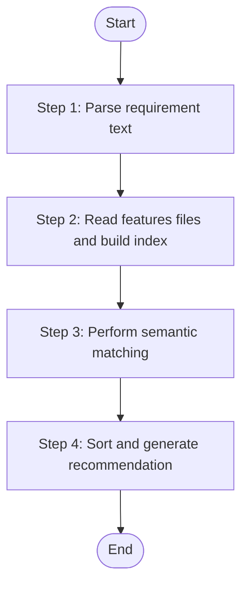

# Module Matcher

Match user requirement text against business knowledge base features to identify related modules. Performs semantic matching based on keywords, module names, and feature definitions.

## Language Adaptation

**CRITICAL**: Generate all content in the language specified by the `language` parameter.

- `language: "zh"` → Generate all content in 中文
- `language: "en"` → Generate all content in English
- Other languages → Use the specified language

**All output content must be in the target language only.**

## Trigger Scenarios

- "Find modules for requirement X"
- "Which modules handle user management?"
- "Match requirement to knowledge base"
- "Identify relevant modules"

## Input

| Variable | Type | Description | Required |
|----------|------|-------------|----------|
| `requirement_text` | string | User requirement text to match | **Yes** |
| `features_files` | string[] | Array of paths to features-*.json files | **Yes** |
| `language` | string | Target language for output | **Yes** |

## Output JSON

```json
{
  "matched_modules": [
    {
      "platform_id": "web-vue3",
      "module_name": "system",
      "platform_type": "web",
      "confidence": "high | medium | low",
      "matching_features": ["user-management", "role-management"],
      "feature_count": 15,
      "analyzed_count": 8,
      "source_path": "src/views/system"
    }
  ],
  "unmatched_keywords": ["workflow", "approval"],
  "recommendation": "Suggested modules based on requirement analysis",
  "total_platforms_scanned": 3,
  "total_modules_scanned": 12,
  "message": "Matching completed"
}
```

**Confidence Levels**:

| Level | Condition |
|-------|-----------|
| `high` | Direct keyword match with module name or feature fileName |
| `medium` | Partial match or synonym match |
| `low` | Related concept match only |

## Workflow



### Step 1: Parse Requirement Text

Extract key entities and domain terms from the requirement:

1. **Tokenize**: Split text into words/phrases
2. **Extract entities**: Identify nouns, technical terms, business concepts
3. **Normalize**: Convert to lowercase, handle Chinese/English mixed text
4. **Build keyword list**: Create array of searchable terms

**Chinese Text Handling**:
- Use character-level matching for Chinese terms
- Consider common abbreviations (e.g., "用户" matches "user")
- Support both simplified and traditional characters

**Output**: "Step 1 Status: ✅ COMPLETED - Extracted {keyword_count} keywords"

### Step 2: Read Features Files and Build Index

For each features file in the input array:

1. **Read JSON**: Parse the features-*.json file
2. **Extract platform info**: `platformId`, `platformType`
3. **Build module index**: Group features by `module`
4. **Build feature index**: Create lookup by `fileName`, `sourcePath`

**Index Structure**:
```
{
  "platform_id": {
    "modules": {
      "module_name": {
        "features": [...],
        "feature_count": N,
        "analyzed_count": M
      }
    }
  }
}
```

**Error Handling**: Skip files that cannot be read or parsed, continue with others.

**Output**: "Step 2 Status: ✅ COMPLETED - Built index from {file_count} files, {module_count} modules"

### Step 3: Perform Semantic Matching

Match keywords against the module-feature index:

1. **Direct matching**:
   - Keyword matches module name directly
   - Keyword matches feature fileName
   - Confidence = `high`

2. **Partial matching**:
   - Keyword is substring of module/feature name
   - Module/feature name is substring of keyword
   - Confidence = `medium`

3. **Conceptual matching**:
   - Keyword relates to known domain concepts
   - Synonym matching (configurable)
   - Confidence = `low`

**Matching Algorithm**:
```
FOR each platform IN platforms:
  FOR each module IN platform.modules:
    score = 0
    matching_features = []
    
    FOR each keyword IN keywords:
      IF keyword matches module.name THEN
        score += 3  // high confidence boost
      END IF
      
      FOR each feature IN module.features:
        IF keyword matches feature.fileName THEN
          score += 1
          matching_features.add(feature)
        END IF
      END FOR
    END FOR
    
    IF score > 0 THEN
      confidence = calculate_confidence(score, keyword_count)
      matched_modules.add(module with confidence)
    END IF
  END FOR
END FOR
```

**Output**: "Step 3 Status: ✅ COMPLETED - Found {match_count} matching modules"

### Step 4: Sort and Generate Recommendation

1. **Sort matched modules** by confidence (high → medium → low)
2. **Generate recommendation text** based on top matches
3. **Collect unmatched keywords** for user awareness
4. **Return complete JSON result**

**Recommendation Template**:
- High confidence: "Module '{name}' is highly relevant for this requirement"
- Medium confidence: "Module '{name}' may be relevant"
- Low confidence: "Module '{name}' has partial relevance"

**Output**: "Step 4 Status: ✅ COMPLETED - Generated recommendation"

## Constraints

1. **READ-ONLY**: This skill does not modify any files
2. **Handle Chinese+English**: Support bilingual text matching
3. **Skip unreadable files**: Continue processing even if some files fail
4. **No external API**: Matching is done locally without LLM calls

## Error Handling

| Scenario | Action |
|----------|--------|
| File not found | Skip file, log warning |
| Invalid JSON | Skip file, log error |
| Empty features array | Continue with empty module list |
| No keywords extracted | Return empty matches with warning |

## Task Completion Report

When the task is complete, report:

```json
{
  "status": "success | partial | failed",
  "skill": "speccrew-pm-module-matcher",
  "matching_result": {
    "matched_count": 3,
    "high_confidence_count": 1,
    "medium_confidence_count": 1,
    "low_confidence_count": 1
  },
  "message": "Module matching completed"
}
```

## Checklist

- [ ] Step 1: Parsed requirement text and extracted keywords
- [ ] Step 2: Read all features files and built index
- [ ] Step 3: Performed semantic matching
- [ ] Step 4: Sorted results and generated recommendation
- [ ] Returned complete JSON output
