# Business Modeling - [Feature/Skill Name]

## Document Info

| Item | Value |
|------|-------|
| Modeling Target | __________ |
| Modeling Type | ☐ Agent Skill ☐ Business Feature ☐ System Module |
| Author | __________ |
| Date | __________ |
| Priority | ☐ High ☐ Medium ☐ Low |
| Version | __________ |

---

## 1. Domain Description

<!-- AI-NOTE: Define WHAT the system is and WHERE its boundaries lie. -->

### 1.1 Domain Boundary

**Domain**: __________

**In-Scope**:
- __________
- __________

**Out-of-Scope**:
- __________
- __________

### 1.2 External Participants

| Participant Type | Name | Description |
|------------------|------|-------------|
| User | __________ | __________ |
| System | __________ | __________ |
| Agent | __________ | __________ |

### 1.3 Domain Glossary

| Term | Definition | Related Domain |
|------|------------|----------------|
| __________ | __________ | __________ |

### 1.4 System Context Diagram

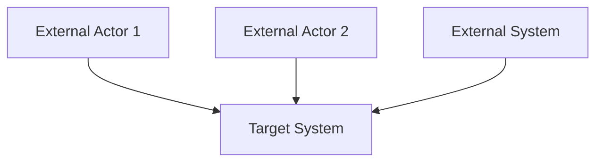

---

## 2. Functions in Domain

<!-- AI-NOTE: List ALL functions within domain boundary. Don't filter yet. -->

### 2.1 Function Decomposition (WBS)

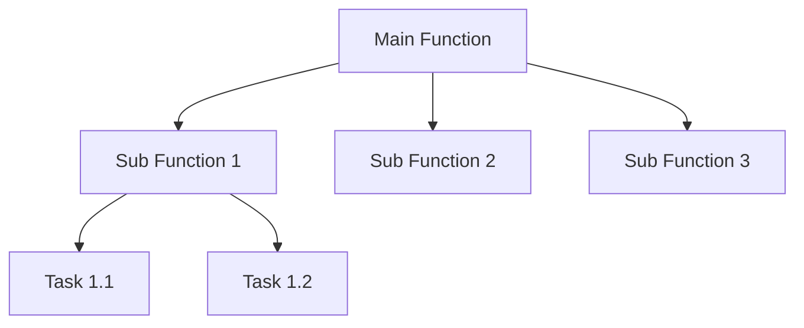

### 2.2 Function-Capability Mapping Table

| Function Module | Core Sub-function | Business Capability | UML Visualization |
|-----------------|-------------------|---------------------|-------------------|
| __________ | __________ | __________ | Use Case / Activity / State |

### 2.3 UML Visualization (As Needed)

<!-- AI-NOTE: Choose: Use Case Diagram (actor-function), Activity Diagram (process flow), State Machine (entity lifecycle only) -->

#### 2.3.1 Use Case Diagram

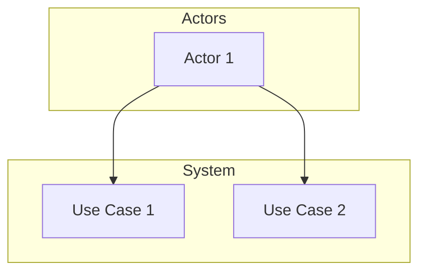

#### 2.3.2 Activity Diagram

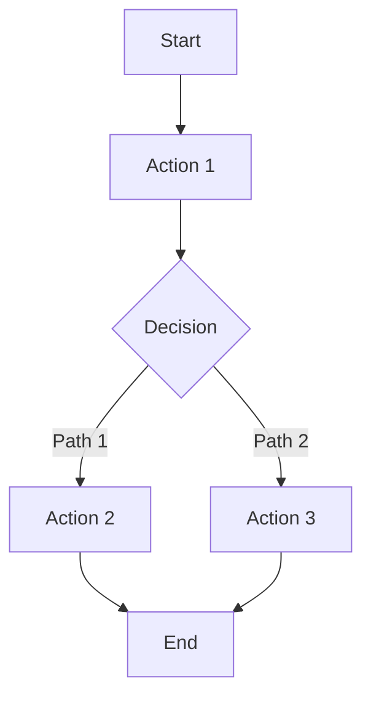

#### 2.3.3 State Machine Diagram (Core Entities Only)

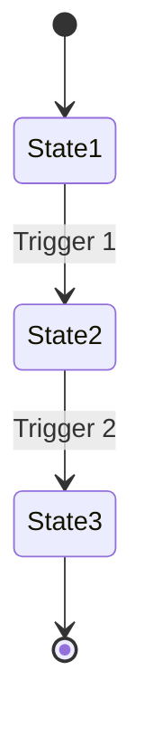

---

## 3. Functions of Interest

<!-- AI-NOTE: Focus on CORE functions for MVP. Use MoSCoW method. -->

### 3.1 Core Function Selection (MoSCoW)

| Function Name | Priority | Is Core? | Notes |
|---------------|----------|----------|-------|
| __________ | Must have | Yes/No | __________ |
| __________ | Should have | Yes/No | __________ |
| __________ | Could have | Yes/No | __________ |
| __________ | Won't have | Yes/No | __________ |

### 3.2 Core Function Use Case Diagram

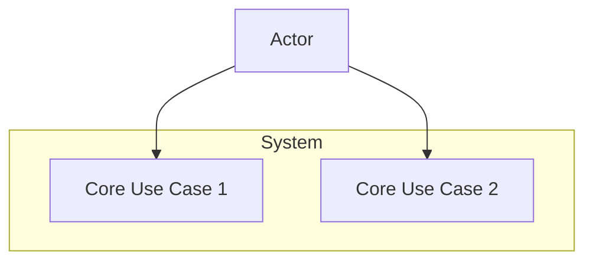

### 3.3 Non-core Function Notes

| Function | Current Status | Planned Iteration |
|----------|----------------|-------------------|
| __________ | Deferred | Iteration X |

---

## 4. Information Flows of Interest

<!-- AI-NOTE: Document HOW information flows between core functions and external systems. -->

### 4.1 Core Information Flow Description

**Description**: __________

**Data Sources**: __________

**Data Destinations**: __________

**Flow Frequency**: __________

### 4.2 Sequence Diagram

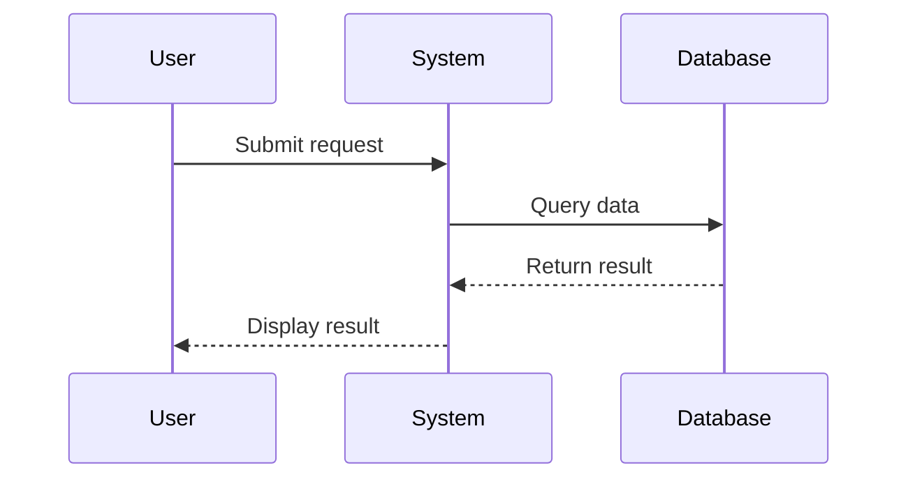

### 4.3 Data Flow Diagram (DFD)

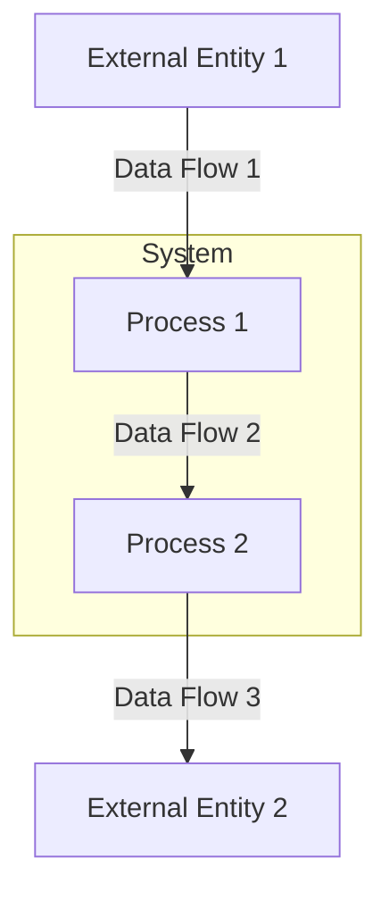

### 4.4 Interface Interaction List

| Interface Name | Direction | Data Format | Frequency | Core Fields |
|----------------|-----------|-------------|-----------|-------------|
| __________ | User→System | JSON/XML | Real-time | __________ |

---

## 5. Categories of Information

<!-- AI-NOTE: Define WHAT data entities exist. Focus on business concepts, not implementation. -->

### 5.1 Information Category Directory

| Information Category | Core Entity | Related Stage | Description |
|---------------------|-------------|---------------|-------------|
| __________ | __________ | Stage X | __________ |

### 5.2 Data Dictionary

| Entity Name | Core Attributes | Data Type | Constraints | Description |
|-------------|-----------------|-----------|-------------|-------------|
| __________ | __________ | String/Number/Enum | Non-null | __________ |

### 5.3 Conceptual Class Diagram

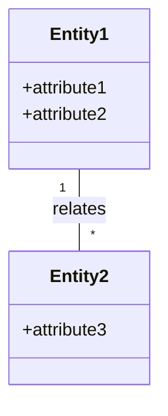

---

## 6. Information Descriptions

<!-- AI-NOTE: IMPLEMENTATION-READY specifications with technical details. -->

### 6.1 Design Class Diagram

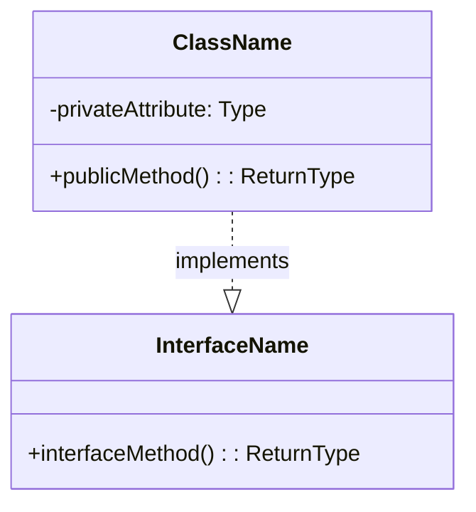

### 6.2 Component Diagram

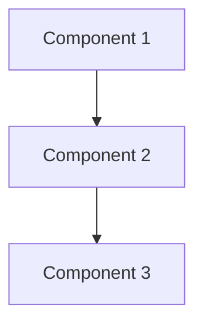

### 6.3 Information Description Standards

**Output Format**: __________

**Encoding**: UTF-8

**Validation Rules**:
- __________

**Storage Requirements**: __________

---

## 7. Acceptance Criteria

### 7.1 Functional Acceptance

| Function | Acceptance Condition | Verification Method |
|----------|---------------------|---------------------|
| __________ | __________ | Test / Demo / Review |

### 7.2 Performance Acceptance

| Metric | Target | Measurement Method |
|--------|--------|-------------------|
| Response Time | ≤ X ms | __________ |
| Accuracy | ≥ X% | __________ |

### 7.3 Interface Acceptance

| Interface | Success Rate | Error Handling |
|-----------|-------------|----------------|
| __________ | ≥ X% | __________ |

---

## 8. Risks and Constraints

### 8.1 Risks

| Risk | Probability | Impact | Mitigation |
|------|-------------|--------|------------|
| __________ | High/Medium/Low | High/Medium/Low | __________ |

### 8.2 Constraints

| Constraint Type | Description |
|-----------------|-------------|
| Technical | __________ |
| Business | __________ |

---

## 9. References

### 9.1 Related System Modules

| Module | Relationship | Document Link |
|--------|-------------|---------------|
| __________ | Dependency / Dependent | [Link] |

### 9.2 Reference Documents

| Document | Description |
|----------|-------------|
| ISA-95 Standard | Business modeling methodology |
| UML Specification | Visual modeling language |

---

> Document generated using ISA-95 six-stage methodology. Mermaid diagrams follow mermaid-rule.md guidelines.
