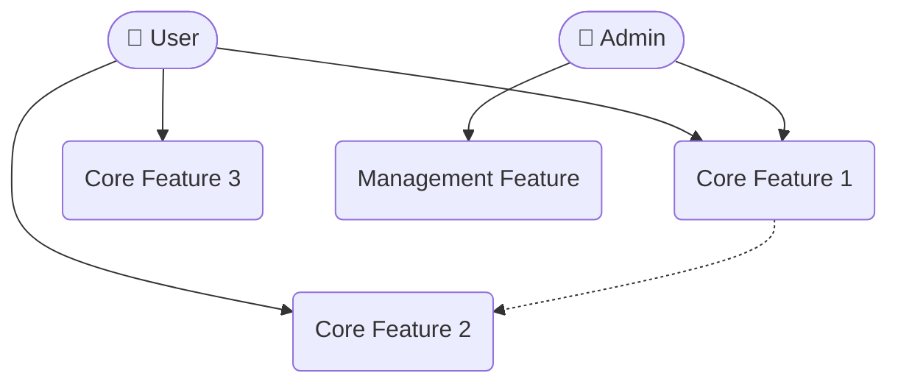
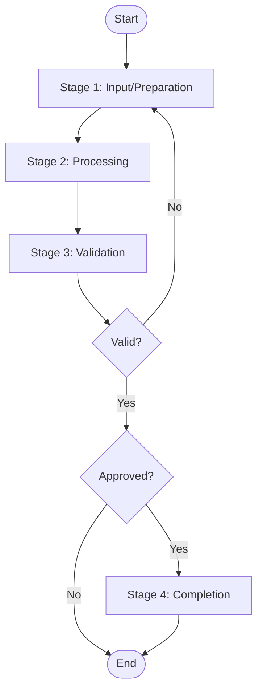
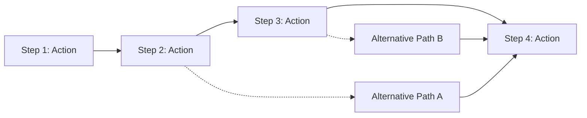

# PRD - [Feature Name]

## 1. Background & Goals

### 1.1 Background
[Describe why this feature is needed and what problem it solves]

### 1.2 Goals
[Describe the business objectives to be achieved]

### 1.3 Domain Boundary

**In-Scope Domains:**
- {Domain 1: brief description}
- {Domain 2: brief description}

**Out-of-Scope Domains:**
- {Domain 1: reason for exclusion}

**External Participants:**

| Participant Type | Name | Description |
|------------------|------|-------------|
| User | {Role name} | {Role description} |
| System | {System name} | {Integration description} |

### 1.4 Domain Glossary

> Unify key business terms to eliminate cross-stakeholder ambiguity.

| Term | Definition | Related Concepts |
|------|------------|------------------|
| {Term 1} | {Precise definition} | {Related terms or modules} |
| {Term 2} | {Precise definition} | {Related terms or modules} |

## 2. User Stories

### 2.1 Target Users
[Describe who will use this feature]

### 2.2 User Scenarios

**Scenario 1: [Scenario Name]**
- **As a** [role]
- **I want** [action]
- **So that** [value]

**Scenario 2: [Scenario Name]**
...

## 3. Functional Requirements

### 3.1 Use Case Diagram

**Use Case Description:**

| Use Case ID | Name | Actor | Description |
|-------------|------|-------|-------------|
| UC-001 | Core Feature 1 | User, Admin | [Description] |
| UC-002 | Core Feature 2 | User | [Description] |
| UC-003 | Core Feature 3 | User | [Description] |
| UC-004 | Management Feature | Admin | [Description] |

### 3.2 Business Process Flow

**Process Description:**

| Stage | Description | Input | Output | Responsible Role |
|-------|-------------|-------|--------|------------------|
| Stage 1 | [Description] | [Input data] | [Output data] | [Role] |
| Stage 2 | [Description] | [Input data] | [Output data] | [Role] |
| Stage 3 | [Description] | [Input data] | [Output data] | [Role] |
| Stage 4 | [Description] | [Input data] | [Output data] | [Role] |

### 3.3 Feature List

| Feature | Priority | Description | Acceptance Criteria |
|---------|----------|-------------|---------------------|
| [Feature 1] | P0 | [Description] | [Acceptance Criteria] |
| [Feature 2] | P1 | [Description] | [Acceptance Criteria] |

### 3.4 Feature Breakdown

> List all business operation units in this module. Each feature represents a cohesive business operation (e.g., one frontend page with its backend APIs, or one API group for backend-only). This breakdown guides downstream Feature Design to generate per-feature specs.

> Priority follows MoSCoW method: P0 = Must have (MVP core), P1 = Should have, P2 = Could have, Deferred = Won't have this iteration.

| Feature ID | Feature Name | Type | Priority | Pages/Endpoints | Description |
|------------|-------------|------|----------|-----------------|-------------|
| F-{MODULE}-01 | {Feature name} | Page+API / API-only | P0 (Must) / P1 (Should) / P2 (Could) | {count} | {Brief description} |
| F-{MODULE}-02 | {Feature name} | Page+API / API-only | P0 (Must) / P1 (Should) / P2 (Could) | {count} | {Brief description} |

#### Feature Dependencies

| Feature | Depends On | Dependency Type |
|---------|-----------|----------------|
| F-{MODULE}-02 | F-{MODULE}-01 | Data dependency |

### 3.5 Feature Details

#### Feature 1: [Feature Name]

**Requirement Description:**
[Detailed description of this feature's specific requirements]

**Interaction Flow:**
1. [Step 1]
2. [Step 2]
3. [Step 3]

**Boundary Conditions:**
| Condition Type | Scenario Description | Expected Handling |
|----------------|---------------------|-------------------|
| Edge Cases | [e.g., empty input, too long, special characters] | [Handling method] |
| Concurrency/Race | [e.g., duplicate submission, concurrent operations] | [Handling method] |
| Permission Boundary | [e.g., unauthorized access, not logged in] | [Handling method] |
| Dependency Failure | [e.g., third-party service unavailable] | [Handling method] |

**Exception Scenarios:**
- [Exception 1]: [Handling method]
- [Exception 2]: [Handling method]

**Operation Flow Diagram:**

**Operation Steps Detail:**

| Step | Action | System Response | User Feedback | Exception Handling |
|------|--------|-----------------|---------------|-------------------|
| 1 | [User action] | [System behavior] | [UI feedback] | [Error handling] |
| 2 | [User action] | [System behavior] | [UI feedback] | [Error handling] |
| 3 | [User action] | [System behavior] | [UI feedback] | [Error handling] |
| 4 | [User action] | [System behavior] | [UI feedback] | [Error handling] |

## 4. Non-functional Requirements

- **Performance**: [Performance requirements]
- **Security**: [Security requirements]
- **Compatibility**: [Compatibility requirements]

## 5. Acceptance Criteria

### 5.1 Must Have
- [ ] [Acceptance Item]
- [ ] [Acceptance Item]

### 5.2 Should Have
- [ ] [Acceptance Item]
- [ ] [Acceptance Item]

## 6. Boundary Description

### 6.1 In Scope
- [Scope Item]
- [Scope Item]

### 6.2 Out of Scope
- [Scope Item]
- [Scope Item]

## 7. Assumptions & Dependencies

- **Assumptions**: [Prerequisites]
- **Dependencies**: [Other features/systems depended upon]

---

**PRD Status:** 📝 Draft / 👀 In Review / ✅ Confirmed  
**Confirmation Date:** [Date]  
**Confirmed By:** [Name]
