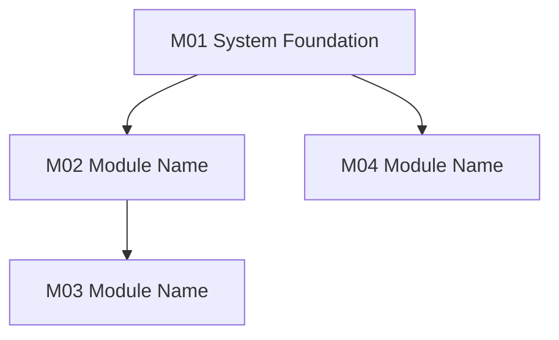
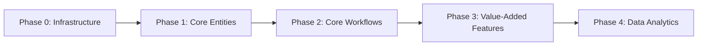

# Module Design Document (.module-design.md)

> **Iteration**: iteration_name
> **Generated**: date
> **System**: system_name
> **Tech Stack**: tech_stack
> **Document Type**: ISA-95 Business Modeling & Module Decomposition

---

## 1. Business Domain Analysis (ISA-95 Stage 1: Domain Description)

### 1.1 Domain Boundary Definition

<!-- Describe system positioning -->

#### System Scope (IN-SCOPE)
| Domain | Description |
|--------|-------------|
| domain | description |

#### Out of Scope (OUT-OF-SCOPE)
| Domain | Description | Planned Phase |
|--------|-------------|---------------|
| domain | description | phase |

### 1.2 Actor Definition
| Actor ID | Actor Name | Responsibilities | Data Scope | Typical Scenario |
|----------|------------|------------------|------------|------------------|
| role_id | role_name | responsibility | data_scope | scenario |

### 1.3 Core Business Glossary
| Term | Definition | Business Rule | Related Module |
|------|------------|---------------|----------------|
| term | definition | rule | module |

### 1.4 Domain Model Diagram

---

## 2. Function Decomposition (ISA-95 Stage 2: Functions in Domain)

### 2.1 WBS Work Breakdown Structure

#### module_id - module_name (count function points)
| Function ID | Function Name | Description | Priority | Dependencies |
|-------------|---------------|-------------|----------|--------------|
| func_id | func_name | description | priority | dependency |

### 2.2 Function Priority Distribution
| Priority | Function Points | Percentage | Module Distribution |
|----------|-----------------|------------|--------------------|
| **P0 (Core)** | count | percent | modules |
| **P1 (Important)** | count | percent | modules |
| **P2 (Optional)** | count | percent | modules |

---

## 3. Module Priority & Phasing (ISA-95 Stage 3: Functions of Interest)

### 3.1 MoSCoW Priority Analysis
| Priority | Definition | Module | Description |
|----------|------------|--------|-------------|

### 3.2 Implementation Phases

#### Phase 1 (MVP - Minimum Viable Product)
**Core Chain**: core_chain
| Module | Function Points | Deliverables |
|--------|-----------------|--------------|

**MVP Acceptance Criteria**:
- ✅ criteria

#### Phase 2 (Full Version - Stage 1)
<!-- Same structure as above -->

#### Phase 3 (Stage 2 Planning)
<!-- Same structure as above -->

---

## 4. Module Dependencies

### 4.1 Dependency Matrix
| Module | Dependent Module | Dependency Type | Description |
|--------|------------------|-----------------|-------------|

### 4.2 Dependency Graph

### 4.3 Circular Dependency Check
<!-- Must confirm no circular dependencies -->

---

## 5. Module Implementation Sequence

### 5.1 Implementation Phase Ordering

### 5.2 Parallel Development Recommendations
| Phase | Parallel Modules | Description |
|-------|------------------|-------------|

---

## 6. Module Boundary Definition

### 6.1 Module Responsibility Boundaries
| Module | Core Responsibilities | Excluded Responsibilities | Boundary Notes |
|--------|----------------------|--------------------------|----------------|

### 6.2 Data Ownership
| Data Entity | Owner Module | Read-Only Modules | Description |
|-------------|--------------|-------------------|-------------|

---

## 7. Tech Stack Capability Reuse Analysis

### 7.1 Reusable Capabilities
| Required Function | Existing Capability | Reuse Level | Development Effort | Notes |
|-------------------|---------------------|-------------|--------------------|-------|

### 7.2 New Development Capabilities
| Capability | Module | Development Priority | Estimated Effort | Notes |
|------------|--------|---------------------|------------------|-------|

---

## 8. Risks & Mitigation Measures

### 8.1 Technical Risks
| Risk Item | Affected Modules | Impact Level | Probability | Mitigation Measures |
|-----------|------------------|--------------|-------------|---------------------|

### 8.2 Business Risks
| Risk Item | Affected Modules | Impact Level | Probability | Mitigation Measures |
|-----------|------------------|--------------|-------------|---------------------|

---

## 9. Module Summary
| Module ID | Module Name | Function Points | Priority | Implementation Phase | Dependencies | Core Responsibilities |
|-----------|-------------|-----------------|----------|---------------------|--------------|-----------------------|

---

## 10. Sign-off
| Role | Name | Date | Signature |
|------|------|------|-----------|
