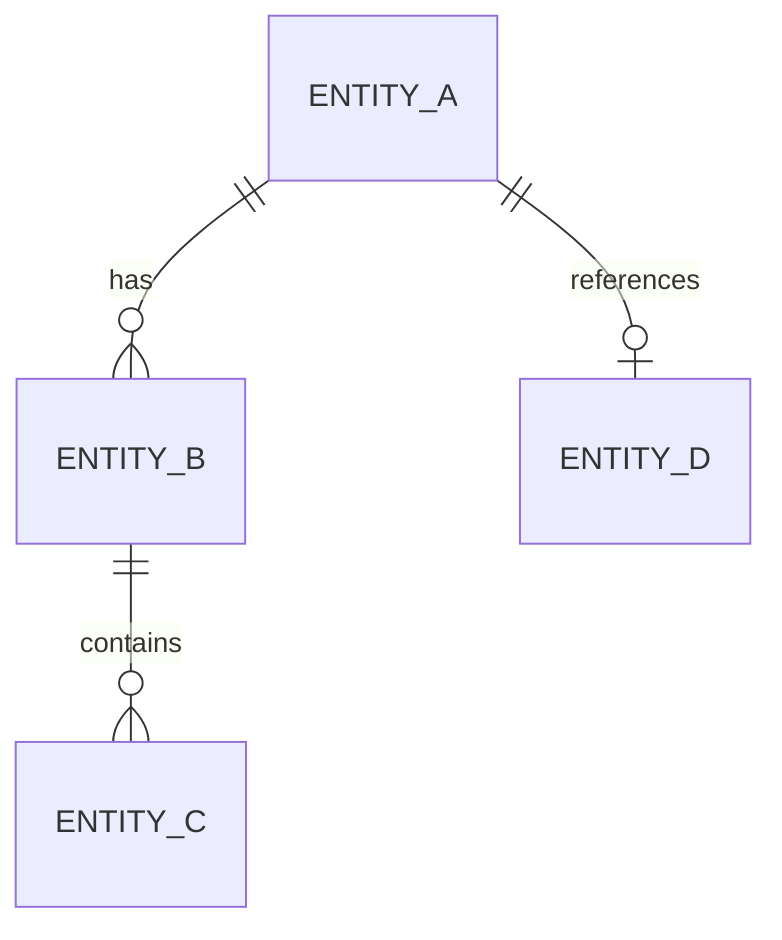

# Backend System Design Index - {PlatformId}

> Platform: {PlatformId} | Framework: {Framework} | Language: {Language}
> Feature Spec: {FeatureSpecPath}
> Generated: {Timestamp}

## 1. Platform Tech Stack Summary

| Category | Technology | Version | Purpose |
|----------|-----------|---------|---------|
| Framework | {e.g., Spring Boot} | {version} | {purpose} |
| ORM | {e.g., MyBatis-Plus} | {version} | {purpose} |
| Database | {e.g., MySQL} | {version} | {purpose} |
| Cache | {e.g., Redis} | {version} | {purpose} |
| Auth | {e.g., Spring Security + JWT} | {version} | {purpose} |
| API Docs | {e.g., Swagger/SpringDoc} | {version} | {purpose} |

## 2. Shared Design Decisions

### 2.1 Middleware Stack

| Middleware | Order | Purpose | Configuration |
|-----------|-------|---------|--------------|
| {middleware} | {order} | {purpose} | {key config} |

### 2.2 Data Source Configuration

{Description of database connection, connection pool, read-write separation if applicable}

### 2.3 Base Classes and Shared Services

| Class/Service | Path | Purpose | Used By |
|--------------|------|---------|---------|
| {base class} | {path} | {purpose} | {which modules} |

### 2.4 Common Utilities

| Utility | Path | Purpose |
|---------|------|---------|
| {utility} | {path} | {purpose} |

### 2.5 Authentication and Authorization

{Description of auth mechanism, permission model, annotation-based access control}

## 3. Module Design Index

| Module | Scope | APIs | Entities | Status | Document |
|--------|-------|------|----------|--------|----------|
| {module-name} | {brief scope} | {count} | {count} | [NEW]/[MODIFIED] | [{module-name}-design.md](./{module-name}-design.md) |

## 4. Cross-Module Interaction Notes

{Describe any shared services, event-driven patterns, or cross-module dependencies}

## 5. Database Schema Overview

### 5.1 New Tables

| Table | Module | Description |
|-------|--------|-------------|
| {table} | {module} | {purpose} |

### 5.2 Modified Tables

| Table | Module | Change Type | Description |
|-------|--------|------------|-------------|
| {table} | {module} | ADD COLUMN/MODIFY/... | {what changed} |

### 5.3 Entity Relationship Overview



## 6. Directory Structure Impact

```
{source-directory}/
├── {new directories and files to be created}
└── {modified directories and files}
```
