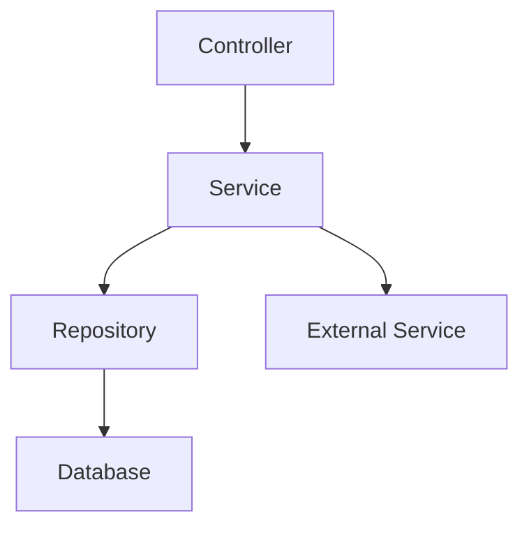
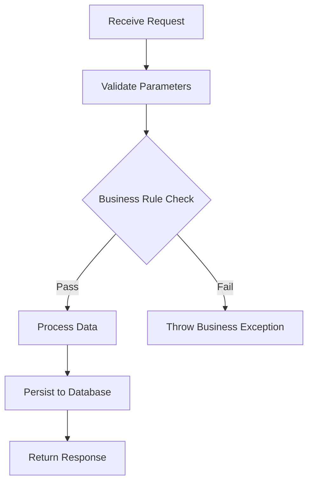

# Backend System Design - {ModuleName}

> Feature Spec Reference: {FeatureSpecPath}
> API Contract Reference: {ApiContractPath}
> Platform: {PlatformId} | Framework: {Framework} | Language: {Language}

## 1. Design Goal

{Brief description of what this module implements, referencing Feature Spec function}

## 2. Module Structure

### 2.1 File Layout

| File | Layer | Status | Description |
|------|-------|--------|-------------|
| {FilePath} | Controller/Service/Repository/Entity | [NEW]/[MODIFIED]/[EXISTING] | {Purpose} |

### 2.2 Dependency Diagram



## 3. Interface Detail Design

### 3.N {API Name} - {HTTP Method} {Path}

**Contract Reference**: {link to API Contract section}

**Controller Layer**:

```{framework-language}
// AI-NOTE: Use actual framework annotations/decorators from techs knowledge
// Spring Boot: @RestController, @PostMapping, @Valid, etc.
// NestJS: @Controller, @Post, @Body, etc.
// Go: gin.Context, echo.Context, etc.

{Controller pseudo-code with parameter validation}
```

**Service Layer**:

```{framework-language}
// AI-NOTE: Business logic implementation
// Include transaction annotation if needed

{Service pseudo-code with step-by-step logic}
```

**Business Validation Pseudo-code**:

<!-- AI-NOTE: Detailed business rule validation patterns -->

```java
// Business rule validation - detailed conditions
public void validateOrder(CreateOrderRequest request) {
  // Null/empty checks
  if (request.getItems() == null || request.getItems().isEmpty()) {
    throw new BusinessException("ORDER_EMPTY", "Order must contain at least one item");
  }
  // Business rule: price validation
  for (OrderItem item : request.getItems()) {
    if (item.getQuantity() <= 0) {
      throw new BusinessException("INVALID_QUANTITY", "Quantity must be positive");
    }
    if (item.getPrice().compareTo(BigDecimal.ZERO) < 0) {
      throw new BusinessException("INVALID_PRICE", "Price must be non-negative");
    }
  }
  // Business rule: total amount limit
  BigDecimal total = calculateTotal(request.getItems());
  if (total.compareTo(new BigDecimal("999999.99")) > 0) {
    throw new BusinessException("AMOUNT_EXCEEDED", "Order total exceeds limit");
  }
}
```

**Business Flow**:



**Repository Layer**:

```{framework-language}
// AI-NOTE: Use actual ORM/query patterns from conventions-data.md

{Repository method definitions}
```

**Request/Response**:

| Field | Type | Required | Validation | Description |
|-------|------|----------|-----------|-------------|
| {field} | {type} | Yes/No | {rules} | {description} |

## 4. Database Design

### 4.1 Entity Definitions

```{framework-language}
// AI-NOTE: Use actual ORM entity syntax from conventions-data.md
// Spring Boot: @Entity, @Table, @Column, etc.
// NestJS/TypeORM: @Entity, @Column, etc.

{Entity class definition with all fields, types, constraints}
```

### 4.2 Table Schema

| Column | Type | Nullable | Default | Index | Description |
|--------|------|----------|---------|-------|-------------|
| {column} | {db type} | Yes/No | {default} | {index type} | {description} |

### 4.3 Index Strategy

| Index Name | Columns | Type | Purpose |
|-----------|---------|------|---------|
| {name} | {columns} | {UNIQUE/BTREE/...} | {query it optimizes} |

### 4.4 Migration Requirements

<!-- AI-NOTE: File Path and Script Name MUST follow the migration naming convention 
     and script directory defined in conventions-data.md Migration Configuration -->

| Migration | Type | Script Name | File Path | Description |
|-----------|------|-------------|-----------|-------------|
| {migration-name} | CREATE TABLE/ALTER TABLE/ADD INDEX | {e.g., V001__create_user.sql} | {e.g., src/main/resources/db/migration/} | {what changes} |

## 5. Transaction Design

| Operation | Scope | Isolation Level | Rollback Trigger |
|-----------|-------|----------------|-----------------|
| {operation} | {which steps} | {level} | {error condition} |

```{framework-language}
// AI-NOTE: Use actual transaction syntax from techs knowledge
{Transaction pseudo-code}
```

### 5.1 Concurrency Control Pseudo-code

<!-- AI-NOTE: Optimistic locking and batch processing patterns -->

```java
// Optimistic locking with version check
@Transactional(isolation = Isolation.READ_COMMITTED)
public void updateStock(Long productId, int quantity, Long expectedVersion) {
  Product product = productRepository.findById(productId)
    .orElseThrow(() -> new NotFoundException("PRODUCT_NOT_FOUND", productId));
  
  // Optimistic lock check
  if (!product.getVersion().equals(expectedVersion)) {
    throw new ConcurrentModificationException("Data has been modified by another user");
  }
  
  // Business rule: stock boundary check
  int newStock = product.getStock() - quantity;
  if (newStock < 0) {
    throw new BusinessException("INSUFFICIENT_STOCK", 
      String.format("Available: %d, Requested: %d", product.getStock(), quantity));
  }
  
  product.setStock(newStock);
  productRepository.save(product); // Version auto-incremented by @Version
}

// Batch operation with chunked processing
@Transactional
public BatchResult batchImport(List<ImportItem> items) {
  int successCount = 0;
  List<String> errors = new ArrayList<>();
  
  // Process in chunks to avoid memory/timeout issues
  List<List<ImportItem>> chunks = Lists.partition(items, 100);
  for (List<ImportItem> chunk : chunks) {
    try {
      repository.saveAll(chunk.stream().map(this::toEntity).collect(toList()));
      successCount += chunk.size();
    } catch (DataIntegrityViolationException e) {
      // Fallback: process one by one to identify problematic records
      for (ImportItem item : chunk) {
        try {
          repository.save(toEntity(item));
          successCount++;
        } catch (Exception ex) {
          errors.add(String.format("Row %d: %s", item.getRowNum(), ex.getMessage()));
        }
      }
    }
  }
  return new BatchResult(successCount, errors);
}
```

## 6. Exception Handling

### 6.1 Exception Types

| Exception Class | HTTP Status | Error Code | Trigger Scenario |
|----------------|-------------|-----------|-----------------|
| {exception} | {status} | {code from API Contract} | {when thrown} |

### 6.2 Error Response Mapping

```{framework-language}
// AI-NOTE: Use actual exception handler syntax
{Global/local exception handler pseudo-code}
```

### 6.3 Pagination & Boundary Handling

<!-- AI-NOTE: Pagination safety and null-safe data access patterns -->

```java
// Pagination boundary handling
public Page<OrderDTO> listOrders(int page, int size, String sortBy) {
  // Boundary normalization
  page = Math.max(0, page);
  size = Math.min(Math.max(1, size), 100); // Limit: 1-100 per page
  
  // Validate sort field (prevent SQL injection via sort)
  Set<String> allowedSorts = Set.of("createdAt", "updatedAt", "amount");
  if (!allowedSorts.contains(sortBy)) {
    sortBy = "createdAt"; // Default fallback
  }
  
  Pageable pageable = PageRequest.of(page, size, Sort.by(Sort.Direction.DESC, sortBy));
  Page<Order> orders = orderRepository.findAll(pageable);
  
  return orders.map(this::toDTO);
}

// Null-safe data access patterns
private OrderDTO toDTO(Order order) {
  return OrderDTO.builder()
    .id(order.getId())
    .customerName(Optional.ofNullable(order.getCustomer())
      .map(Customer::getName)
      .orElse("Unknown"))
    .totalAmount(Optional.ofNullable(order.getItems())
      .map(items -> items.stream()
        .map(OrderItem::getSubtotal)
        .reduce(BigDecimal.ZERO, BigDecimal::add))
      .orElse(BigDecimal.ZERO))
    .build();
}
```

## 7. Business Rules Implementation

| Rule | Description | Implementation Location | Validation Logic |
|------|-------------|----------------------|-----------------|
| {rule} | {description} | {Service/Validator/...} | {pseudo-code or description} |

## 8. Unit Test Points

| Test Target | Test Scenario | Input | Expected Output |
|-------------|--------------|-------|----------------|
| {class.method} | {scenario} | {test data} | {expected result} |
