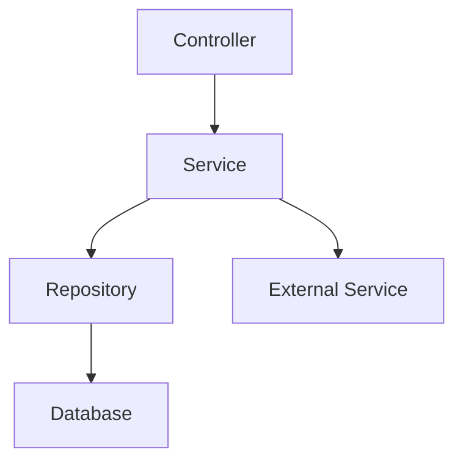
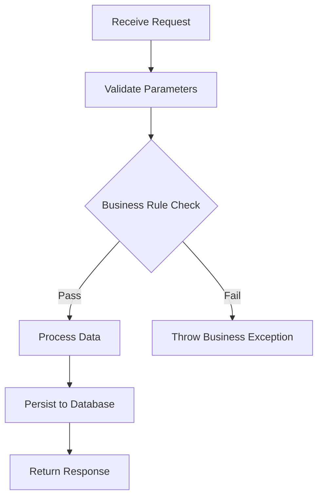

# Backend System Design - {ModuleName}

> Feature Spec Reference: {FeatureSpecPath}
> API Contract Reference: {ApiContractPath}
> Platform: {PlatformId} | Framework: {Framework} | Language: {Language}

## 1. Design Goal

{Brief description of what this module implements, referencing Feature Spec function}

## 2. Module Structure

### 2.1 File Layout

| File | Layer | Status | Description |
|------|-------|--------|-------------|
| {FilePath} | Controller/Service/Repository/Entity | [NEW]/[MODIFIED]/[EXISTING] | {Purpose} |

### 2.2 Dependency Diagram



## 3. Interface Detail Design

### 3.N {API Name} - {HTTP Method} {Path}

**Contract Reference**: {link to API Contract section}

**Controller Layer**:

```{framework-language}
// AI-NOTE: Use actual framework annotations/decorators from techs knowledge
// Spring Boot: @RestController, @PostMapping, @Valid, etc.
// NestJS: @Controller, @Post, @Body, etc.
// Go: gin.Context, echo.Context, etc.

{Controller pseudo-code with parameter validation}
```

**Service Layer**:

```{framework-language}
// AI-NOTE: Business logic implementation
// Include transaction annotation if needed

{Service pseudo-code with step-by-step logic}
```

**Business Flow**:



**Repository Layer**:

```{framework-language}
// AI-NOTE: Use actual ORM/query patterns from conventions-data.md

{Repository method definitions}
```

**Request/Response**:

| Field | Type | Required | Validation | Description |
|-------|------|----------|-----------|-------------|
| {field} | {type} | Yes/No | {rules} | {description} |

## 4. Database Design

### 4.1 Entity Definitions

```{framework-language}
// AI-NOTE: Use actual ORM entity syntax from conventions-data.md
// Spring Boot: @Entity, @Table, @Column, etc.
// NestJS/TypeORM: @Entity, @Column, etc.

{Entity class definition with all fields, types, constraints}
```

### 4.2 Table Schema

| Column | Type | Nullable | Default | Index | Description |
|--------|------|----------|---------|-------|-------------|
| {column} | {db type} | Yes/No | {default} | {index type} | {description} |

### 4.3 Index Strategy

| Index Name | Columns | Type | Purpose |
|-----------|---------|------|---------|
| {name} | {columns} | {UNIQUE/BTREE/...} | {query it optimizes} |

### 4.4 Migration Requirements

| Migration | Type | Description |
|-----------|------|-------------|
| {migration-name} | CREATE TABLE/ALTER TABLE/ADD INDEX | {what changes} |

## 5. Transaction Design

| Operation | Scope | Isolation Level | Rollback Trigger |
|-----------|-------|----------------|-----------------|
| {operation} | {which steps} | {level} | {error condition} |

```{framework-language}
// AI-NOTE: Use actual transaction syntax from techs knowledge
{Transaction pseudo-code}
```

## 6. Exception Handling

### 6.1 Exception Types

| Exception Class | HTTP Status | Error Code | Trigger Scenario |
|----------------|-------------|-----------|-----------------|
| {exception} | {status} | {code from API Contract} | {when thrown} |

### 6.2 Error Response Mapping

```{framework-language}
// AI-NOTE: Use actual exception handler syntax
{Global/local exception handler pseudo-code}
```

## 7. Business Rules Implementation

| Rule | Description | Implementation Location | Validation Logic |
|------|-------------|----------------------|-----------------|
| {rule} | {description} | {Service/Validator/...} | {pseudo-code or description} |

## 8. Unit Test Points

| Test Target | Test Scenario | Input | Expected Output |
|-------------|--------------|-------|----------------|
| {class.method} | {scenario} | {test data} | {expected result} |
