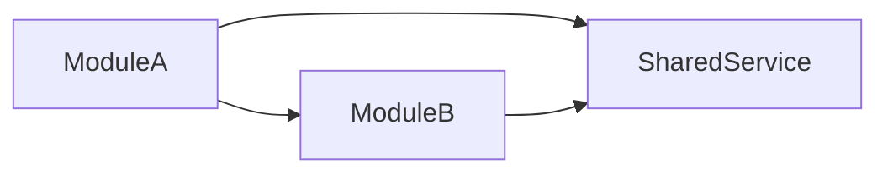

# Desktop System Design Index - {PlatformId}

> Platform: {PlatformId} | Framework: {Framework} | Language: {Language}
> Feature Spec: {FeatureSpecPath}
> Generated: {Timestamp}

## 1. Platform Tech Stack Summary

<!-- AI-NOTE: Fill from techs knowledge tech-stack.md -->

| Category | Technology | Version | Purpose |
|----------|-----------|---------|---------|
| Framework | {e.g., Electron} | {version} | Desktop application framework |
| UI Renderer | {e.g., Chromium} | {version} | UI rendering engine |
| Main Process | {e.g., Node.js} | {version} | Backend logic runtime |
| Build Tool | {e.g., electron-builder} | {version} | Build and packaging |
| Local DB | {e.g., SQLite} | {version} | Local data storage |
| Auto-Update | {e.g., electron-updater} | {version} | Auto-update mechanism |
| Language | {e.g., TypeScript} | {version} | Type-safe development |

## 2. Target Operating Systems

<!-- AI-NOTE: Fill from tech-stack.md OS support section -->

| OS | Min Version | Architecture | Special Requirements |
|----|-------------|--------------|---------------------|
| Windows | {e.g., 10} | x64/arm64 | {requirements} |
| macOS | {e.g., 10.15} | x64/arm64 | {requirements} |
| Linux | {e.g., Ubuntu 18.04} | x64 | {requirements} |

## 3. Shared Design Decisions

<!-- AI-NOTE: Fill from architecture.md and conventions-design.md -->

### 3.1 Process Architecture Strategy

<!-- AI-NOTE: Describe main/renderer process split or core/webview architecture -->

{Description of process architecture approach}

**Process Communication**:

| Pattern | Use Case | Implementation |
|---------|----------|----------------|
| {pattern} | {use case} | {implementation} |

### 3.2 IPC Communication Patterns

<!-- AI-NOTE: Describe standard IPC patterns used across modules -->

**Channel Naming Convention**: {naming pattern}

**Standard Payload Structure**:

```typescript
// AI-NOTE: Use actual types from conventions-dev.md
interface IPCRequest<T> {
  requestId: string
  payload: T
}

interface IPCResponse<T> {
  success: boolean
  data?: T
  error?: string
}
```

### 3.3 Security Model

<!-- AI-NOTE: Describe context isolation, CSP, and security practices -->

**Context Isolation**: {Enabled/Disabled}

**Content Security Policy**:

```
{ CSP policy }
```

**Security Best Practices**:

1. {practice 1}
2. {practice 2}
3. {practice 3}

### 3.4 Base Components/Widgets

<!-- AI-NOTE: List base components that modules should reuse -->

| Component | Path | Purpose | Used By |
|-----------|------|---------|---------|
| {BaseWindow} | `{path}` | {purpose} | {which modules} |
| {BaseDialog} | `{path}` | {purpose} | {which modules} |
| {NativeMenu} | `{path}` | {purpose} | {which modules} |

### 3.5 API Client Configuration

<!-- AI-NOTE: Describe HTTP client setup for backend API calls -->

**Request Configuration**:

```typescript
// AI-NOTE: Use actual pattern from conventions-dev.md
const apiClient = axios.create({
  baseURL: '{backend-url}',
  timeout: {timeout},
  headers: {
    'Content-Type': 'application/json'
  }
})

// Request interceptor for auth token
apiClient.interceptors.request.use((config) => {
  const token = getAuthToken()
  if (token) {
    config.headers.Authorization = `Bearer ${token}`
  }
  return config
})
```

**Error Handling**:

| HTTP Status | Error Code | Handling |
|-------------|-----------|----------|
| 401 | UNAUTHORIZED | Redirect to login |
| 403 | FORBIDDEN | Show permission denied |
| 500 | INTERNAL_ERROR | Show error dialog |

### 3.6 Local Storage Strategy

<!-- AI-NOTE: Describe local data storage approach -->

| Storage Type | Use Case | Implementation |
|--------------|----------|----------------|
| {type} | {use case} | {implementation} |

## 4. Native Dependencies

<!-- AI-NOTE: List native dependencies from tech-stack.md -->

| Dependency | Version | Purpose | OS Requirement |
|------------|---------|---------|----------------|
| {dependency} | {version} | {purpose} | {OS requirement} |

## 5. Module Design Index

<!-- AI-NOTE: List all module design documents generated for this platform -->

| Module | Scope | Windows | IPC Channels | APIs | Status | Document |
|--------|-------|---------|--------------|------|--------|----------|
| {module-name} | {brief scope} | {count} | {count} | {count} | [NEW]/[MODIFIED] | [{module-name}-design.md](./{module-name}-design.md) |

**Status Legend**:
- [NEW]: All components and modules are newly created
- [MODIFIED]: Some existing components/modules are modified

## 6. Cross-Module Interaction Notes

<!-- AI-NOTE: Describe shared state, cross-module IPC, or dependencies -->

**Shared State**:

| Shared Data | Source | Consumer Modules | Access Pattern |
|-------------|--------|------------------|----------------|
| {data} | {source} | {modules} | {how accessed} |

**Cross-Module IPC**:

| Channel | Publisher Module | Subscriber Module | Purpose |
|---------|-----------------|-------------------|---------|
| {channel} | {module} | {module} | {purpose} |

**Module Dependencies**:



## 7. Packaging & Distribution

<!-- AI-NOTE: Fill from architecture.md distribution section -->

| OS | Format | Signing | Distribution Channel | Auto-Update |
|----|--------|---------|---------------------|-------------|
| Windows | MSI/NSIS/AppX | {Code Signing Cert} | {channel} | {updater} |
| macOS | DMG/pkg/zip | {Apple Developer ID} | {channel} | {updater} |
| Linux | AppImage/deb/rpm | {GPG} | {channel} | {updater} |

**Build Configuration**:

```json
{
  "build": {
    "appId": "{app-id}",
    "productName": "{product-name}",
    "directories": {
      "output": "dist"
    },
    "files": [
      "build/**/*",
      "node_modules/**/*"
    ],
    "mac": {
      "category": "public.app-category.productivity"
    },
    "win": {
      "target": "nsis"
    },
    "linux": {
      "target": "AppImage"
    }
  }
}
```

## 8. Directory Structure Impact

<!-- AI-NOTE: Show new directories and files to be created/modified -->

```
src/
├── main/                    # Main process code
│   ├── index.ts            # Entry point [NEW]/[MODIFIED]
│   ├── ipc/                # IPC handlers
│   │   └── {module}/       # [NEW]
│   ├── services/           # Main process services
│   │   └── {service}.ts    # [NEW]
│   └── window/             # Window management
│       └── {window}.ts     # [NEW]
├── renderer/               # Renderer process code
│   ├── components/         # UI components
│   │   └── {Module}/       # [NEW]
│   ├── stores/             # State management
│   │   └── {store}.ts      # [NEW]
│   ├── apis/               # API layer
│   │   ├── remote/         # Backend API calls
│   │   │   └── {module}.ts # [NEW]
│   │   └── local/          # IPC wrappers
│   │       └── {module}.ts # [NEW]
│   └── views/              # Page views
│       └── {Page}.tsx      # [NEW]
├── preload/                # Preload scripts
│   └── {module}.ts         # [NEW]
└── common/                 # Shared types/utils
    └── types/
        └── {module}.ts     # [NEW]

# For Tauri:
src-tauri/
├── src/
│   ├── main.rs             # Entry point
│   ├── commands/           # Command handlers
│   │   └── {module}.rs     # [NEW]
│   └── lib.rs              # [MODIFIED]
└── tauri.conf.json         # [MODIFIED]
```

**Legend**:
- [NEW]: New file/directory to create
- [MODIFIED]: Existing file to modify

---

**Document Status**: Draft / In Review / Published
**Last Updated**: {Date}
**Related Feature Spec**: [{Feature Name}]({FeatureSpecPath})
