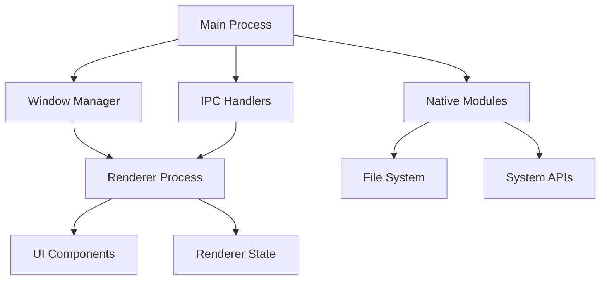
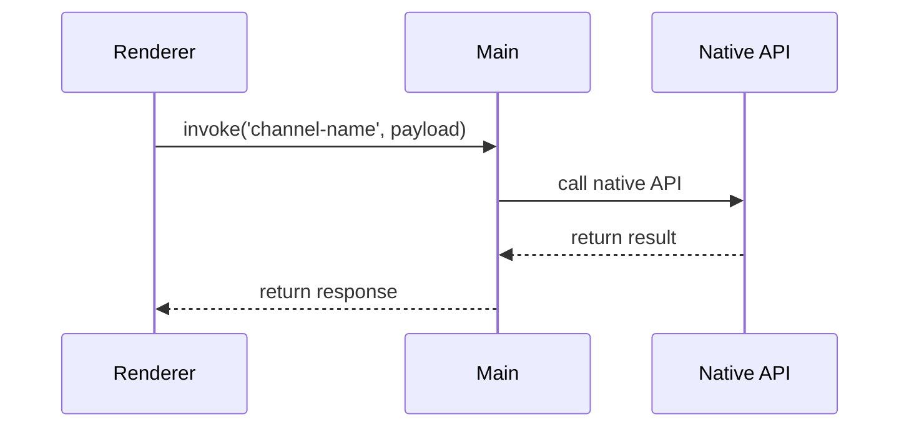
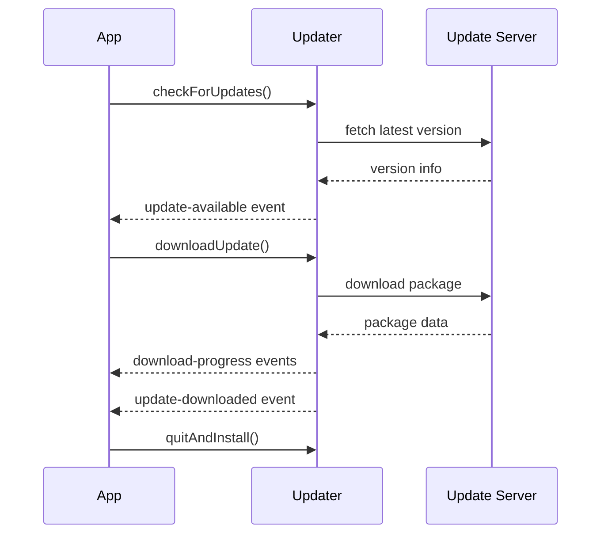

# Desktop System Design - {ModuleName}

> Feature Spec Reference: {FeatureSpecPath}
> API Contract Reference: {ApiContractPath}
> Platform: {PlatformId} | Framework: {Framework} | Language: {Language}

## 1. Design Goal

{Brief description of what this module implements, referencing Feature Spec function}

## 2. Process Architecture

### 2.1 Process Model

<!-- AI-NOTE: Describe Main Process vs Renderer Process for Electron; or Rust Core vs WebView for Tauri -->

{Description of process model and responsibilities}

### 2.2 Process Responsibility Table

| Process | Type | Responsibility | Has UI |
|---------|------|----------------|--------|
| Main Process | Node.js/Rust | {responsibilities: window management, native APIs, background tasks} | No |
| Renderer Process | Chromium/WebView | {responsibilities: UI rendering, user interaction} | Yes |

### 2.3 Architecture Diagram

<!-- AI-NOTE: Use Mermaid graph TD with basic syntax only. No style definitions, no HTML tags, no nested subgraph, no direction keyword. -->



## 3. Window Design

### 3.1 Window Configuration

| Window | Type | Size | Resizable | Frame | Purpose |
|--------|------|------|-----------|-------|---------|
| {MainWindow} | BrowserWindow/Window | 1200x800 | Yes | Yes | Main application window |
| {ModalWindow} | BrowserWindow/Window | 600x400 | No | No | Dialog/modal content |

### 3.2 Window Lifecycle

<!-- AI-NOTE: Describe create, show, hide, close, restore behaviors -->

| Stage | Action | Description |
|-------|--------|-------------|
| Create | {create logic} | {when and how window is created} |
| Show | {show logic} | {when window becomes visible} |
| Hide | {hide logic} | {when window is hidden but not closed} |
| Close | {close logic} | {cleanup and event handling} |
| Restore | {restore logic} | {window state restoration} |

### 3.3 Multi-Window Communication

<!-- AI-NOTE: Describe how multiple windows communicate if applicable -->

{Description of inter-window communication strategy}

## 4. IPC Communication Design

### 4.1 IPC Channel Registry

| Channel | Direction | Payload Type | Handler | Description |
|---------|-----------|--------------|---------|-------------|
| {channel-name} | Renderer→Main | {type} | {handler} | {description} |
| {channel-name} | Main→Renderer | {type} | {handler} | {description} |
| {channel-name} | Bidirectional | {type} | {handler} | {description} |

### 4.2 IPC Flow Diagrams

<!-- AI-NOTE: Use Mermaid sequenceDiagram for IPC flows -->



### 4.3 IPC Pseudo-code

<!-- AI-NOTE: Use actual IPC syntax from techs knowledge -->

**Main Process Handler:**

```{framework-language}
// AI-NOTE: Electron example - use actual syntax from techs knowledge
// File: src/main/ipc/{module}.ts

import { ipcMain, BrowserWindow } from 'electron'
import { {Service} } from '../services/{service}'

// AI-NOTE: Use actual handler pattern from conventions
ipcMain.handle('{channel-name}', async (event, payload: {PayloadType}) => {
  try {
    const result = await {Service}.{method}(payload)
    return { success: true, data: result }
  } catch (error) {
    return { success: false, error: error.message }
  }
})

// AI-NOTE: For Tauri, use:
// #[tauri::command]
// async fn handler_name(payload: PayloadType) -> Result<ResponseType, Error> {
//     // handler logic
// }
```

**Renderer Process Invocation:**

```{framework-language}
// AI-NOTE: Electron example - use actual syntax from techs knowledge
// File: src/renderer/apis/{module}.ts

import { ipcRenderer } from 'electron'
import type { {PayloadType}, {ResponseType} } from '@/types/{module}'

export const {apiFunction} = async (payload: {PayloadType}): Promise<{ResponseType}> => {
  const result = await ipcRenderer.invoke('{channel-name}', payload)
  if (!result.success) {
    throw new Error(result.error)
  }
  return result.data
}

// AI-NOTE: For Tauri, use:
// import { invoke } from '@tauri-apps/api/tauri'
// export const apiFunction = async (payload: PayloadType) => {
//   return await invoke<ResponseType>('handler_name', payload)
// }
```

### 4.4 IPC Error Recovery & Retry

<!-- AI-NOTE: IPC timeout, retry logic, and error classification patterns -->

```typescript
// IPC call with timeout and retry
const ipcCallWithRetry = async <T>(
  channel: string, 
  payload: unknown, 
  options: { timeout?: number; maxRetries?: number } = {}
): Promise<T> => {
  const { timeout = 10000, maxRetries = 3 } = options;
  
  for (let attempt = 0; attempt < maxRetries; attempt++) {
    try {
      const result = await Promise.race([
        window.electronAPI[channel](payload),
        new Promise((_, reject) => 
          setTimeout(() => reject(new Error('IPC_TIMEOUT')), timeout)
        ),
      ]);
      return result as T;
    } catch (error) {
      if (error.message === 'IPC_TIMEOUT' && attempt < maxRetries - 1) {
        await new Promise(r => setTimeout(r, 1000 * (attempt + 1)));
        continue;
      }
      throw error;
    }
  }
  throw new Error('IPC_MAX_RETRIES_EXCEEDED');
};

// IPC error classification and handling
const handleIpcError = (error: Error, channel: string) => {
  if (error.message === 'IPC_TIMEOUT') {
    // Main process may be busy - show non-blocking notification
    showNotification('Operation is taking longer than expected...');
    return;
  }
  if (error.message?.includes('ENOENT')) {
    // File not found
    showError(`File not found: ${error.message}`);
    return;
  }
  if (error.message?.includes('EPERM') || error.message?.includes('EACCES')) {
    // Permission denied
    showError('Permission denied. Please check file permissions.');
    return;
  }
  // Unknown error - log and show generic message
  console.error(`IPC error on channel ${channel}:`, error);
  showError('An unexpected error occurred. Please try again.');
};
```

## 5. UI Component Design

### 5.1 Component Tree

<!-- AI-NOTE: ASCII component tree showing UI structure in renderer process -->

```
MainWindow
├── TitleBar
│   ├── WindowControls
│   └── MenuButton
├── Sidebar
│   ├── NavigationItems
│   └── UserProfile
├── ContentArea
│   ├── Toolbar
│   │   ├── SearchBox
│   │   └── ActionButtons
│   └── DataView
│       ├── ListView
│       └── DetailPanel
└── StatusBar
```

### 5.2 Component Summary Table

| Component | Path | Type | Status | Description |
|-----------|------|------|--------|-------------|
| {Name} | `{directory}/{FileName}` | Page | [NEW]/[MODIFIED]/[EXISTING] | {Purpose} |
| {Name} | `{directory}/{FileName}` | Component | [NEW]/[MODIFIED]/[EXISTING] | {Purpose} |

### 5.3 Component Detail

<!-- AI-NOTE: Repeat Section 5.3.N for each component. Focus on [NEW] or [MODIFIED] status. -->

#### 5.3.1 {ComponentName}

**Purpose**: {What this component does}

**Props**:

| Prop | Type | Required | Default | Description |
|------|------|----------|---------|-------------|
| {prop} | {TypeScript type} | Yes/No | {value} | {description} |

**Emits/Callbacks**:

| Event | Payload Type | Description |
|-------|-------------|-------------|
| {event} | {TypeScript type} | {description} |

**Internal State**:

| State | Type | Initial Value | Description |
|-------|------|--------------|-------------|
| {state} | {type} | {value} | {description} |

**Pseudo-code**:

```{framework-language}
// AI-NOTE: Use actual framework API syntax from techs knowledge
// Example for React with TypeScript:

import React, { useState, useEffect } from 'react'
import { use{StoreName}Store } from '@/stores/{store-name}'
import { {apiFunction} } from '@/apis/{module}'

interface {ComponentName}Props {
  {propName}: {Type}
}

export const {ComponentName}: React.FC<{ComponentName}Props> = ({ {propName} }) => {
  const [{state}, set{State}] = useState<{Type}>({initialValue})
  const {store} = use{StoreName}Store()

  const handle{Action} = async () => {
    try {
      const result = await {apiFunction}(params)
      // handle result
    } catch (error) {
      // handle error
    }
  }

  useEffect(() => {
    // initialization
  }, [])

  return (
    // JSX structure
  )
}
```

**Referenced IPC Calls**:

| IPC Channel | Usage Context |
|-------------|---------------|
| {channel} | {when and why called} |

---

### 5.4 Component Error Boundary & Loading States

<!-- AI-NOTE: Error handling and async data loading patterns for desktop apps -->

```typescript
// Error boundary wrapper for desktop app sections
const SectionErrorBoundary: React.FC<{
  fallback: React.ReactNode;
  onError?: (error: Error) => void;
  children: React.ReactNode;
}> = ({ fallback, onError, children }) => {
  const [hasError, setHasError] = useState(false);
  
  // Note: Use React ErrorBoundary class component in actual implementation
  // This shows the pattern for the design document
  if (hasError) return <>{fallback}</>;
  return <>{children}</>;
};

// Loading state management pattern
const useAsyncData = <T>(fetcher: () => Promise<T>) => {
  const [data, setData] = useState<T | null>(null);
  const [isLoading, setIsLoading] = useState(true);
  const [error, setError] = useState<Error | null>(null);

  const load = useCallback(async () => {
    setIsLoading(true);
    setError(null);
    try {
      const result = await fetcher();
      setData(result);
    } catch (e) {
      setError(e instanceof Error ? e : new Error(String(e)));
    } finally {
      setIsLoading(false);
    }
  }, [fetcher]);

  useEffect(() => { load(); }, [load]);

  return { data, isLoading, error, reload: load };
};

// Usage in component
const FileManager: React.FC = () => {
  const { data: files, isLoading, error, reload } = useAsyncData(
    () => window.electronAPI.listFiles(currentDir)
  );

  if (isLoading) return <LoadingSpinner />;
  if (error) return <ErrorPanel message={error.message} onRetry={reload} />;
  if (!files?.length) return <EmptyState message="No files in this directory" />;

  return (
    <FileGrid files={files} onFileClick={handleFileClick} />
  );
};
```

## 6. State Management

### 6.1 Main Process State

<!-- AI-NOTE: Describe state managed in main process (window states, native resources) -->

| State | Type | Scope | Description |
|-------|------|-------|-------------|
| {state} | {type} | {scope} | {description} |

### 6.2 Renderer Process State

<!-- AI-NOTE: Describe state managed in renderer process (UI state, user data) -->

| State | Type | Scope | Description |
|-------|------|-------|-------------|
| {state} | {type} | {scope} | {description} |

**Store Module**: `{store-path}/{store-name}`
**Status**: [NEW]/[MODIFIED]/[EXISTING]

```{framework-language}
// AI-NOTE: Use actual store pattern from techs knowledge
// Example for Zustand:

import { create } from 'zustand'
import type { {TypeName} } from '@/types/{module}'

interface {StoreName}State {
  {stateField}: {Type}
  {action}: (params: {Type}) => void
}

export const use{StoreName}Store = create<{StoreName}State>((set, get) => ({
  {stateField}: {initialValue},
  
  {action}: (params) => {
    // action implementation
    set({ {stateField}: newValue })
  }
}))
```

### 6.3 State Synchronization

<!-- AI-NOTE: Describe how state is synchronized between main and renderer processes -->

| Direction | Mechanism | Trigger | Description |
|-----------|-----------|---------|-------------|
| Main→Renderer | IPC event | {trigger} | {description} |
| Renderer→Main | IPC invoke | {trigger} | {description} |

## 7. API Layer

### 7.1 Remote API Functions

<!-- AI-NOTE: HTTP calls to backend server -->

```{framework-language}
// AI-NOTE: File path follows conventions from techs knowledge
// File: src/renderer/apis/remote/{module}.ts

import { request } from '@/utils/request'
import type { {RequestType}, {ResponseType} } from '@/types/{module}'

export const {remoteApiFunction} = (params: {RequestType}): Promise<{ResponseType}> => {
  return request.{method}('{path}', params)
}
```

### 7.2 Local API Functions

<!-- AI-NOTE: IPC calls to main process -->

See Section 4.3 for IPC pseudo-code.

### 7.3 Error Handling

| Error Source | Error Type | Handling | User Feedback |
|--------------|------------|----------|---------------|
| Remote API | HTTP Error | {handling logic} | {message/dialog} |
| Local IPC | IPC Error | {handling logic} | {message/dialog} |
| Native API | Native Error | {handling logic} | {message/dialog} |

## 8. Native Integration

### 8.1 File System Access

| Operation | API | Scope | Security |
|-----------|-----|-------|----------|
| Read File | {API} | {allowed paths} | {security measure} |
| Write File | {API} | {allowed paths} | {security measure} |
| Open Dialog | {API} | {scope} | {security measure} |
| Save Dialog | {API} | {scope} | {security measure} |

### 8.2 File System Safety Patterns

<!-- AI-NOTE: Path validation, size limits, and safe file operations -->

```typescript
// Main process: Safe file operations with path validation
const ALLOWED_BASE_PATHS = [
  app.getPath('documents'),
  app.getPath('downloads'),
  app.getPath('userData'),
];

ipcMain.handle('file:read', async (_event, filePath: string) => {
  // Path traversal prevention
  const resolvedPath = path.resolve(filePath);
  const isAllowed = ALLOWED_BASE_PATHS.some(base => 
    resolvedPath.startsWith(path.resolve(base))
  );
  if (!isAllowed) {
    throw new Error('ACCESS_DENIED: Path outside allowed directories');
  }
  
  // Check existence before reading
  try {
    await fs.promises.access(resolvedPath, fs.constants.R_OK);
  } catch {
    throw new Error(`FILE_NOT_FOUND: ${path.basename(resolvedPath)}`);
  }
  
  // Read with size limit (prevent memory issues)
  const stats = await fs.promises.stat(resolvedPath);
  if (stats.size > 100 * 1024 * 1024) { // 100MB limit
    throw new Error('FILE_TOO_LARGE: Max 100MB');
  }
  
  return await fs.promises.readFile(resolvedPath, 'utf-8');
});

// Renderer process: File operation with user feedback
const openAndReadFile = async (): Promise<string | null> => {
  try {
    setIsLoading(true);
    const filePath = await window.electronAPI.showOpenDialog({
      filters: [{ name: 'Documents', extensions: ['json', 'csv', 'txt'] }],
    });
    if (!filePath) return null; // User cancelled
    
    return await ipcCallWithRetry<string>('file:read', filePath, { timeout: 30000 });
  } catch (error) {
    handleIpcError(error, 'file:read');
    return null;
  } finally {
    setIsLoading(false);
  }
};
```

### 8.3 System Tray Design

- **Icon**: {icon path or generation method}
- **Context Menu Items**:
  | Item | Action | Handler |
  |------|--------|---------|
  | {item} | {action} | {handler} |
- **Click Behavior**: {single click / double click behavior}

### 8.4 Menu Bar Design

| Menu | Items | Shortcuts | Handler |
|------|-------|-----------|---------|
| File | {items} | {shortcuts} | {handlers} |
| Edit | {items} | {shortcuts} | {handlers} |
| View | {items} | {shortcuts} | {handlers} |

### 8.5 OS Notifications

<!-- AI-NOTE: Describe notification usage -->

| Scenario | Title | Body | Actions |
|----------|-------|------|---------|
| {scenario} | {title} | {body} | {actions} |

### 8.6 Protocol Handlers & File Associations

| Protocol/Extension | Handler | Description |
|-------------------|---------|-------------|
| {protocol} | {handler} | {description} |
| {.ext} | {handler} | {description} |

### 8.7 Keyboard Shortcuts

| Shortcut | Scope | Action |
|----------|-------|--------|
| {Ctrl/Cmd}+N | Global/Window | {action} |
| {Ctrl/Cmd}+S | Window | {action} |

## 9. Local Data Storage

### 9.1 Storage Strategy

<!-- AI-NOTE: Choose from SQLite/LevelDB/JSON files/electron-store/tauri-store -->

| Data Type | Storage | Location | Encryption |
|-----------|---------|----------|------------|
| {data type} | {SQLite/LevelDB/etc} | {path} | {Yes/No} |

### 9.2 Data Schema

| Table/Key | Fields | Description |
|-----------|--------|-------------|
| {table/key} | {fields} | {description} |

### 9.3 Migration Strategy

<!-- AI-NOTE: Describe how data migrations are handled -->

{Description of migration approach}

## 10. Security Design

### 10.1 Context Isolation Configuration

<!-- AI-NOTE: Electron-specific: describe contextIsolation, nodeIntegration settings -->

| Setting | Value | Purpose |
|---------|-------|---------|
| contextIsolation | true/false | {purpose} |
| nodeIntegration | true/false | {purpose} |
| enableRemoteModule | true/false | {purpose} |

### 10.2 Preload Script Design

```{framework-language}
// AI-NOTE: Electron preload script example
// File: src/preload/{module}.ts

import { contextBridge, ipcRenderer } from 'electron'
import type { {PayloadType}, {ResponseType} } from '@/types/{module}'

// AI-NOTE: Expose safe APIs to renderer
contextBridge.exposeInMainWorld('{apiName}', {
  {functionName}: (payload: {PayloadType}): Promise<{ResponseType}> => {
    return ipcRenderer.invoke('{channel-name}', payload)
  }
})
```

### 10.3 Content Security Policy

<!-- AI-NOTE: Describe CSP configuration -->

```
{ CSP policy string }
```

### 10.4 Permission Scoping

| Permission | Scope | Justification |
|------------|-------|---------------|
| {permission} | {scope} | {justification} |

## 11. Auto-Update Mechanism

### 11.1 Update Check Strategy

<!-- AI-NOTE: Describe when and how update checks are performed -->

| Trigger | Frequency | Method |
|---------|-----------|--------|
| {trigger} | {frequency} | {method} |

### 11.2 Download and Install Flow



### 11.3 Rollback Mechanism

<!-- AI-NOTE: Describe rollback strategy if update fails -->

{Description of rollback approach}

## 12. Unit Test Points

| Test Target | Test Scenario | Expected Behavior |
|-------------|--------------|-------------------|
| {IPC handler} | {scenario} | {expected result} |
| {Window manager} | {scenario} | {expected result} |
| {Native API wrapper} | {scenario} | {expected result} |
| {Component} | {scenario} | {expected result} |
| {Store action} | {scenario} | {expected result} |

---

**Document Status**: Draft / In Review / Published
**Last Updated**: {Date}
**Related Feature Spec**: [{Feature Name}]({FeatureSpecPath})
