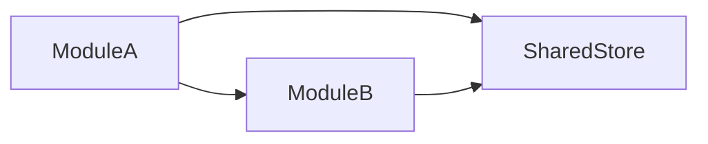

# Frontend System Design Index - {PlatformId}

> Platform: {PlatformId} | Framework: {Framework} | Language: {Language}
> Feature Spec: {FeatureSpecPath}
> Generated: {Timestamp}

## 1. Platform Tech Stack Summary

<!-- AI-NOTE: Fill from techs knowledge tech-stack.md -->

| Category | Technology | Version | Purpose |
|----------|-----------|---------|---------|
| Framework | {e.g., Vue 3} | {version} | Core UI framework |
| State Management | {e.g., Pinia} | {version} | Global state management |
| Router | {e.g., Vue Router 4} | {version} | Client-side routing |
| HTTP Client | {e.g., Axios} | {version} | API request handling |
| UI Library | {e.g., Element Plus} | {version} | Component library |
| Build Tool | {e.g., Vite} | {version} | Build and dev server |
| Language | {e.g., TypeScript} | {version} | Type-safe development |

## 2. Shared Design Decisions

<!-- AI-NOTE: Fill from architecture.md and conventions-design.md -->

### 2.1 Global State Strategy

<!-- AI-NOTE: Describe global state management approach, shared stores pattern -->

{Description of global state management approach}

**Shared Stores**:

| Store | Path | Purpose | Used By Modules |
|-------|------|---------|-----------------|
| {store-name} | `{path}` | {purpose} | {module list} |

### 2.2 Base Components

<!-- AI-NOTE: List base/shared components that modules should reuse -->

| Component | Path | Purpose | Used By |
|-----------|------|---------|---------|
| {BaseButton} | `@/components/base/BaseButton.vue` | {purpose} | {which modules} |
| {BaseTable} | `@/components/base/BaseTable.vue` | {purpose} | {which modules} |
| {BaseForm} | `@/components/base/BaseForm.vue` | {purpose} | {which modules} |

### 2.3 API Interceptor Configuration

<!-- AI-NOTE: Describe request/response interceptors, auth token handling, error handling -->

**Request Interceptor**:

```typescript
// AI-NOTE: Simplified example - use actual pattern from conventions-dev.md
request.interceptors.request.use((config) => {
  // Add auth token
  const token = useAuthStore().token
  if (token) {
    config.headers.Authorization = `Bearer ${token}`
  }
  return config
})
```

**Response Interceptor**:

```typescript
// AI-NOTE: Simplified example - use actual pattern from conventions-dev.md
request.interceptors.response.use(
  (response) => response.data,
  (error) => {
    // Handle common errors (401, 403, 500, etc.)
    if (error.response?.status === 401) {
      // Redirect to login
    }
    return Promise.reject(error)
  }
)
```

**Common Error Handling**:

| HTTP Status | Error Code | Handling |
|-------------|-----------|----------|
| 401 | UNAUTHORIZED | Redirect to login page |
| 403 | FORBIDDEN | Show permission denied message |
| 500 | INTERNAL_ERROR | Show server error toast |

### 2.4 Authentication Pattern

<!-- AI-NOTE: Describe how auth state is managed, route guards, token refresh -->

**Auth Flow**:

1. User logs in → Store token in auth store + localStorage
2. Route guard checks auth state before protected routes
3. Token refresh mechanism (if applicable)
4. Logout clears auth state and redirects

**Route Guard**:

```typescript
// AI-NOTE: Example - use actual pattern from architecture.md
router.beforeEach((to, from, next) => {
  const authStore = useAuthStore()
  if (to.meta.requiresAuth && !authStore.isAuthenticated) {
    next({ name: 'Login', query: { redirect: to.fullPath } })
  } else {
    next()
  }
})
```

## 3. Module Design Index

<!-- AI-NOTE: List all module design documents generated for this platform -->

| Module | Scope | Components | APIs | Status | Document |
|--------|-------|------------|------|--------|----------|
| {module-name} | {brief scope} | {count} | {count} | [NEW]/[MODIFIED] | [{module-name}-design.md](./{module-name}-design.md) |

**Status Legend**:
- [NEW]: All components and stores are newly created
- [MODIFIED]: Some existing components/stores are modified

## 4. Cross-Module Interaction Notes

<!-- AI-NOTE: Describe any shared state, event bus patterns, or cross-module dependencies -->

**Shared State**:

| Shared Data | Source Store | Consumer Modules | Access Pattern |
|-------------|-------------|------------------|----------------|
| {data} | {store} | {modules} | {how accessed} |

**Cross-Module Events**:

| Event | Publisher | Subscriber | Payload |
|-------|-----------|------------|---------|
| {event-name} | {module} | {module} | {type} |

**Module Dependencies**:



## 5. Directory Structure Impact

<!-- AI-NOTE: Show new directories and files to be created/modified -->

```
src/
├── views/
│   └── {ModuleName}/
│       ├── {PageName}.vue          # [NEW]
│       └── components/
│           ├── {Component1}.vue    # [NEW]
│           └── {Component2}.vue    # [MODIFIED]
├── components/
│   └── {SharedComponent}/          # [MODIFIED]
├── stores/
│   └── {store-name}.ts             # [NEW]/[MODIFIED]
├── apis/
│   └── {module}.ts                 # [NEW]
├── router/
│   └── modules/
│       └── {module}.ts             # [NEW]/[MODIFIED]
└── types/
    └── {module}.ts                 # [NEW]
```

**Legend**:
- [NEW]: New file/directory to create
- [MODIFIED]: Existing file to modify

---

**Document Status**: Draft / In Review / Published
**Last Updated**: {Date}
**Related Feature Spec**: [{Feature Name}]({FeatureSpecPath})
