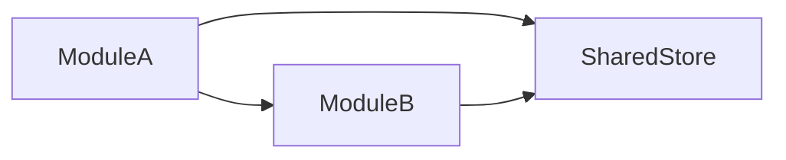

# Mobile System Design Index - {PlatformId}

> Platform: {PlatformId} | Framework: {Framework} | Language: {Language}
> Feature Spec: {FeatureSpecPath}
> Generated: {Timestamp}

## 1. Platform Tech Stack Summary

<!-- AI-NOTE: Fill from techs knowledge tech-stack.md -->

| Category | Technology | Version | Purpose |
|----------|-----------|---------|---------|
| Framework | {e.g., Flutter} | {version} | Core UI framework |
| State Management | {e.g., Provider} | {version} | Global state management |
| Navigation | {e.g., GoRouter} | {version} | Screen routing |
| HTTP Client | {e.g., Dio} | {version} | API request handling |
| Local Storage | {e.g., Hive} | {version} | Local data persistence |
| UI Library | {e.g., Material Design} | {version} | Component library |
| Build Tool | {e.g., Gradle/Xcode} | {version} | Build and packaging |
| Language | {e.g., Dart} | {version} | Development language |

## 2. Target Platforms

| Platform | Min SDK/OS Version | Special Requirements |
|----------|-------------------|---------------------|
| iOS | {e.g., 14.0} | {requirements} |
| Android | {e.g., API 21} | {requirements} |

## 3. Shared Design Decisions

<!-- AI-NOTE: Fill from architecture.md and conventions-design.md -->

### 3.1 State Management Strategy

<!-- AI-NOTE: Describe global state management approach, shared providers/stores pattern -->

{Description of global state management approach}

**Shared Stores/Providers**:

| Store | Path | Purpose | Used By Modules |
|-------|------|---------|-----------------|
| {store-name} | `{path}` | {purpose} | {module list} |

### 3.2 Base Widgets/Components

<!-- AI-NOTE: List base/shared widgets that modules should reuse -->

| Widget | Path | Purpose | Used By |
|--------|------|---------|---------|
| {BaseButton} | `lib/widgets/base/base_button.dart` | {purpose} | {which modules} |
| {BaseCard} | `lib/widgets/base/base_card.dart` | {purpose} | {which modules} |
| {BaseInput} | `lib/widgets/base/base_input.dart` | {purpose} | {which modules} |

### 3.3 API Client Configuration

<!-- AI-NOTE: Describe request/response interceptors, auth token handling, error handling -->

**Request Interceptor**:

```dart
// AI-NOTE: Simplified example - use actual pattern from conventions-dev.md
_dio.interceptors.add(InterceptorsWrapper(
  onRequest: (options, handler) {
    // Add auth token
    final token = authProvider.token;
    if (token != null) {
      options.headers['Authorization'] = 'Bearer $token';
    }
    return handler.next(options);
  },
));
```

**Response Interceptor**:

```dart
// AI-NOTE: Simplified example - use actual pattern from conventions-dev.md
_dio.interceptors.add(InterceptorsWrapper(
  onResponse: (response, handler) {
    return handler.next(response);
  },
  onError: (error, handler) {
    // Handle common errors (401, 403, 500, etc.)
    if (error.response?.statusCode == 401) {
      // Redirect to login
    }
    return handler.next(error);
  },
));
```

**Common Error Handling**:

| HTTP Status | Error Code | Handling |
|-------------|-----------|----------|
| 401 | UNAUTHORIZED | Redirect to login screen |
| 403 | FORBIDDEN | Show permission denied snackbar |
| 500 | INTERNAL_ERROR | Show server error dialog |

### 3.4 Authentication Pattern

<!-- AI-NOTE: Describe how auth state is managed, token storage, biometrics, session -->

**Auth Flow**:

1. User logs in -> Store token in auth provider + secure storage
2. Route guard checks auth state before protected screens
3. Token refresh mechanism (if applicable)
4. Logout clears auth state and redirects

**Secure Token Storage**:

| Token | Storage | Notes |
|-------|---------|-------|
| Access Token | {solution} | {notes} |
| Refresh Token | {solution} | {notes} |

**Biometrics** (if applicable):

| Feature | Implementation | Trigger |
|---------|---------------|---------|
| {feature} | {implementation} | {trigger} |

### 3.5 Theming & Design System

<!-- AI-NOTE: Describe theme configuration, colors, typography -->

| Theme Element | Value | Usage |
|--------------|-------|-------|
| Primary Color | {value} | {usage} |
| Secondary Color | {value} | {usage} |
| Typography | {font} | {usage} |

## 4. Third-Party SDKs & Permissions

| SDK | Version | Purpose | Permissions Required |
|-----|---------|---------|---------------------|
| {sdk} | {version} | {purpose} | {permissions} |

## 5. Module Design Index

<!-- AI-NOTE: List all module design documents generated for this platform -->

| Module | Scope | Screens | APIs | Status | Document |
|--------|-------|---------|------|--------|----------|
| {module-name} | {brief scope} | {count} | {count} | [NEW]/[MODIFIED] | [{module-name}-design.md](./{module-name}-design.md) |

**Status Legend**:
- [NEW]: All screens and widgets are newly created
- [MODIFIED]: Some existing screens/widgets are modified

## 6. Cross-Module Interaction Notes

<!-- AI-NOTE: Describe any shared state, event patterns, or cross-module dependencies -->

**Shared State**:

| Shared Data | Source Store | Consumer Modules | Access Pattern |
|-------------|-------------|------------------|----------------|
| {data} | {store} | {modules} | {how accessed} |

**Cross-Module Events**:

| Event | Publisher | Subscriber | Payload |
|-------|-----------|------------|---------|
| {event-name} | {module} | {module} | {type} |

**Module Dependencies**:



## 7. App Distribution

| Platform | Package Format | Signing | Distribution Channel |
|----------|---------------|---------|---------------------|
| iOS | {e.g., .ipa} | {method} | {channel} |
| Android | {e.g., .apk/.aab} | {method} | {channel} |

## 8. Directory Structure Impact

<!-- AI-NOTE: Show new directories and files to be created/modified -->

```
lib/
├── screens/
│   └── {ModuleName}/
│       ├── {ScreenName}.dart          # [NEW]
│       └── widgets/
│           ├── {Widget1}.dart         # [NEW]
│           └── {Widget2}.dart         # [MODIFIED]
├── widgets/
│   └── {SharedWidget}/                # [MODIFIED]
├── providers/
│   └── {provider-name}.dart           # [NEW]/[MODIFIED]
├── api/
│   └── {module}.dart                  # [NEW]
├── router/
│   └── app_router.dart                # [NEW]/[MODIFIED]
├── storage/
│   └── {storage-module}.dart          # [NEW]
└── models/
    └── {model-name}.dart              # [NEW]
```

**Legend**:
- [NEW]: New file/directory to create
- [MODIFIED]: Existing file to modify

---

**Document Status**: Draft / In Review / Published
**Last Updated**: {Date}
**Related Feature Spec**: [{Feature Name}]({FeatureSpecPath})
