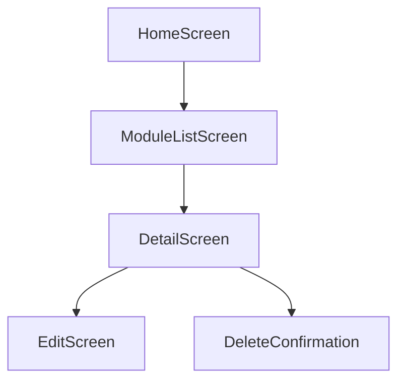

# Mobile System Design - {ModuleName}

> Feature Spec Reference: {FeatureSpecPath}
> API Contract Reference: {ApiContractPath}
> Platform: {PlatformId} | Framework: {Framework} | Language: {Language}

## 1. Design Goal

{Brief description of what this module implements, referencing Feature Spec function}

## 2. Screen Architecture

### 2.1 Screen/Widget Tree

<!-- AI-NOTE: ASCII tree showing screen/widget hierarchy. Adjust depth based on complexity. -->

```
MainScreen
├── AppBar
│   ├── Title
│   └── ActionButtons
├── Body
│   ├── ListView
│   │   └── ListItem (repeated)
│   └── FloatingActionButton
└── BottomNavigationBar
    ├── Tab1
    ├── Tab2
    └── Tab3
```

### 2.2 Screen Summary Table

| Screen | Path | Type | Status | Description |
|--------|------|------|--------|-------------|
| {Name} | `{directory}/{file_name}` | Screen | [NEW]/[MODIFIED]/[EXISTING] | {Purpose} |
| {Name} | `{directory}/{file_name}` | Widget | [NEW]/[MODIFIED]/[EXISTING] | {Purpose} |

## 3. Screen Detail Design

<!-- AI-NOTE: Repeat Section 3.N for each screen. Focus on screens with [NEW] or [MODIFIED] status. -->

### 3.1 {ScreenName}

**Purpose**: {What this screen does}

**Props/Parameters**:

<!-- AI-NOTE: For Flutter: constructor params; for React Native: navigation params + props -->

| Parameter | Type | Required | Default | Description |
|-----------|------|----------|---------|-------------|
| {param} | {type} | Yes/No | {value} | {description} |

**Internal State**:

<!-- AI-NOTE: Include actual state management syntax from techs knowledge -->

| State | Type | Initial Value | Description |
|-------|------|--------------|-------------|
| {state} | {type} | {value} | {description} |

**Lifecycle**:

<!-- AI-NOTE: For Flutter: initState/dispose; for React Native: useEffect -->

- `initState` / `useEffect`: {description of initialization logic}
- `dispose` / `useEffect cleanup`: {description of cleanup logic}

**Pseudo-code**:

<!-- AI-NOTE: Use actual framework API syntax from techs knowledge. NOT generic code. -->

```dart
// AI-NOTE: Example for Flutter with Provider
// Adjust imports and syntax based on actual framework from techs knowledge
import 'package:flutter/material.dart';
import 'package:provider/provider.dart';

class {ScreenName} extends StatefulWidget {
  final {ParamType} {paramName};
  
  const {ScreenName}({Key? key, required this.{paramName}}) : super(key: key);
  
  @override
  State<{ScreenName}> createState() => _{ScreenName}State();
}

class _{ScreenName}State extends State<{ScreenName}> {
  // State variables
  late {Type} {stateName};
  
  @override
  void initState() {
    super.initState();
    // Initialization logic
    {stateName} = {initialValue};
  }
  
  @override
  void dispose() {
    // Cleanup logic
    super.dispose();
  }
  
  void handle{Action}() {
    // Implementation logic
  }
  
  @override
  Widget build(BuildContext context) {
    return Scaffold(
      appBar: AppBar(title: Text('{title}')),
      body: {bodyWidget},
    );
  }
}
```

**Referenced APIs**:

| API Name | Method | Path | Usage Context |
|----------|--------|------|--------------|
| {api} | GET/POST/PUT/DELETE | {path} | {when and why called} |

---

### 3.2 {ScreenName}

<!-- AI-NOTE: Repeat the same structure as 3.1 for each additional screen -->

**Purpose**: {What this screen does}

**Props/Parameters**:

| Parameter | Type | Required | Default | Description |
|-----------|------|----------|---------|-------------|
| {param} | {type} | Yes/No | {value} | {description} |

**Pseudo-code**:

```dart
// AI-NOTE: Use actual framework API syntax from techs knowledge
{implementation pseudo-code}
```

---

### 3.3 Advanced Widget Patterns

<!-- AI-NOTE: Common patterns for conditional rendering, form validation, and pagination with pull-to-refresh -->

```dart
// Conditional rendering with loading/empty/error states
@override
Widget build(BuildContext context) {
  if (_isLoading) {
    return const Center(child: CircularProgressIndicator());
  }
  if (_error != null) {
    return ErrorWidget(
      message: _error!,
      onRetry: () => _loadData(),
    );
  }
  if (_items.isEmpty) {
    return const EmptyStateWidget(message: 'No items found');
  }
  return ListView.builder(
    itemCount: _items.length,
    itemBuilder: (context, index) => ItemCard(item: _items[index]),
  );
}

// Form validation with field-level errors
String? _validateField(String field, dynamic value) {
  switch (field) {
    case 'name':
      if (value == null || (value as String).trim().isEmpty) {
        return 'Name is required';
      }
      if (value.length > 100) return 'Name too long (max 100)';
      return null;
    case 'price':
      if (value == null || value < 0) return 'Price must be non-negative';
      return null;
    default:
      return null;
  }
}

// Pagination with pull-to-refresh
Future<void> _loadMore() async {
  if (_isLoadingMore || !_hasMore) return;
  setState(() => _isLoadingMore = true);
  try {
    final result = await _api.fetchPage(_currentPage + 1);
    setState(() {
      _items.addAll(result.items);
      _currentPage++;
      _hasMore = result.items.isNotEmpty;
    });
  } catch (e) {
    ScaffoldMessenger.of(context).showSnackBar(
      SnackBar(content: Text('Load failed: ${e.toString()}')),
    );
  } finally {
    setState(() => _isLoadingMore = false);
  }
}
```

---

## 4. Navigation Design

### 4.1 Navigation Stack

**Route Definitions**:

<!-- AI-NOTE: Use actual router syntax from techs knowledge (GoRouter for Flutter, React Navigation for React Native) -->

```dart
// AI-NOTE: Example for Flutter GoRouter
// File: lib/router/app_router.dart
final GoRouter appRouter = GoRouter(
  routes: [
    GoRoute(
      path: '/{route-path}',
      name: '{routeName}',
      builder: (context, state) => {ScreenName}(
        {paramName}: state.params['{param}'],
      ),
    ),
  ],
);
```

**Deep Linking Configuration**:

<!-- AI-NOTE: Document deep link URL patterns and handling -->

| Deep Link | Target Screen | Parameters |
|-----------|--------------|------------|
| `app://{path}` | {ScreenName} | {param list} |

**Navigation Guards/Middleware**:

<!-- AI-NOTE: Document any auth guards or route guards -->

| Guard | Logic | Applied Routes |
|-------|-------|---------------|
| {guardName} | {description} | {route list} |

### 4.2 Navigation Flow

<!-- AI-NOTE: Use basic Mermaid flowchart syntax. No style definitions, no HTML tags, no nested subgraph, no direction keyword. -->



## 5. State Management

### 5.1 Store/Provider Design

**Store Module**: `{store-path}/{store-name}`
**Status**: [NEW]/[MODIFIED]/[EXISTING]

**State Definition**:

<!-- AI-NOTE: Use actual state management pattern from techs knowledge (Provider/Bloc/Riverpod for Flutter, Redux/MobX for React Native) -->

```dart
// AI-NOTE: Example for Flutter Provider
// File: lib/providers/{store-name}.dart
import 'package:flutter/foundation.dart';

class {StoreName}Provider with ChangeNotifier {
  // State
  {Type} _{stateField} = {initialValue};
  
  // Getters
  {Type} get {stateField} => _{stateField};
  
  // Actions/Methods
  Future<void> {actionName}({params}) async {
    // Implementation
    notifyListeners();
  }
}
```

**Actions/Events and Effects**:

| Action/Event | Parameters | Description | API Calls |
|-------------|-----------|-------------|-----------|
| {action} | {params} | {description} | {api references} |

### 5.2 Advanced Provider Patterns

<!-- AI-NOTE: Combined data loading with error state, computed properties, and optimistic updates -->

```dart
// Combined data loading with error state management
class OrderListProvider with ChangeNotifier {
  List<Order> _orders = [];
  bool _isLoading = false;
  String? _error;
  int _currentPage = 0;
  bool _hasMore = true;

  List<Order> get orders => _orders;
  bool get isLoading => _isLoading;
  String? get error => _error;
  bool get hasMore => _hasMore;

  // Computed property - filtered orders
  List<Order> get pendingOrders => 
    _orders.where((o) => o.status == OrderStatus.pending).toList();

  Future<void> loadOrders({bool refresh = false}) async {
    if (_isLoading) return;
    if (refresh) {
      _currentPage = 0;
      _hasMore = true;
    }
    _isLoading = true;
    _error = null;
    notifyListeners();

    try {
      final result = await _api.getOrders(page: _currentPage);
      if (refresh) {
        _orders = result.items;
      } else {
        _orders.addAll(result.items);
      }
      _hasMore = result.items.isNotEmpty;
      _currentPage++;
    } catch (e) {
      _error = e.toString();
    } finally {
      _isLoading = false;
      notifyListeners();
    }
  }

  // Optimistic update with rollback
  Future<void> updateOrderStatus(String id, OrderStatus status) async {
    final index = _orders.indexWhere((o) => o.id == id);
    if (index == -1) return;
    
    final previousStatus = _orders[index].status;
    _orders[index] = _orders[index].copyWith(status: status);
    notifyListeners();

    try {
      await _api.updateOrder(id, {'status': status.value});
    } catch (e) {
      // Rollback
      _orders[index] = _orders[index].copyWith(status: previousStatus);
      notifyListeners();
      rethrow;
    }
  }
}
```

## 6. API Layer

### 6.1 API Functions

<!-- AI-NOTE: Follow actual API layer patterns from conventions-dev.md. Include request/response types. -->

```dart
// AI-NOTE: Example for Flutter with Dio
// File: lib/api/{module}.dart
import 'package:dio/dio.dart';

class {Module}Api {
  final Dio _dio;
  
  {Module}Api(this._dio);
  
  Future<{ResponseType}> {functionName}({RequestType} params) async {
    final response = await _dio.{method}('{path}', data: params);
    return {ResponseType}.fromJson(response.data);
  }
}
```

### 6.2 Error Handling

| Error Code | HTTP Status | Mobile Handling | User Feedback |
|-----------|-------------|-----------------|---------------|
| {code} | {status} | {handling logic} | {message/snackbar/dialog} |

### 6.3 Caching Strategy

<!-- AI-NOTE: Document API response caching approach if applicable -->

| API | Cache Strategy | TTL | Invalidation Trigger |
|-----|---------------|-----|---------------------|
| {api} | {strategy} | {duration} | {trigger} |

### 6.4 API Error Handling & Cache Strategy

<!-- AI-NOTE: Unified error handling with token refresh, retry logic, and simple TTL cache -->

```dart
// Unified API error handling
Future<T> safeApiCall<T>(Future<T> Function() apiCall) async {
  try {
    return await apiCall();
  } on DioException catch (e) {
    if (e.response?.statusCode == 401) {
      // Token expired - trigger refresh and retry
      await _authProvider.refreshToken();
      return await apiCall(); // Retry once
    }
    if (e.response?.statusCode == 422) {
      // Validation error
      throw ValidationException(e.response?.data['errors']);
    }
    if (e.type == DioExceptionType.connectionTimeout ||
        e.type == DioExceptionType.receiveTimeout) {
      throw NetworkException('Connection timeout, please check network');
    }
    rethrow;
  }
}

// Request retry with exponential backoff
Future<T> withRetry<T>(Future<T> Function() fn, {int maxRetries = 3}) async {
  for (int i = 0; i < maxRetries; i++) {
    try {
      return await fn();
    } catch (e) {
      if (i == maxRetries - 1) rethrow;
      await Future.delayed(Duration(seconds: (1 << i))); // 1s, 2s, 4s
    }
  }
  throw Exception('Unreachable');
}

// Simple cache with TTL
final Map<String, _CacheEntry> _cache = {};

Future<List<Item>> fetchItems({bool forceRefresh = false}) async {
  final cacheKey = 'items_list';
  if (!forceRefresh && _cache.containsKey(cacheKey)) {
    final entry = _cache[cacheKey]!;
    if (DateTime.now().difference(entry.timestamp).inMinutes < 5) {
      return entry.data as List<Item>;
    }
  }
  final items = await _dio.get<List<Item>>('/items');
  _cache[cacheKey] = _CacheEntry(data: items, timestamp: DateTime.now());
  return items;
}
```

## 7. Local Storage Design

### 7.1 Storage Strategy

<!-- AI-NOTE: Document storage solution: SharedPreferences, Hive, SQLite, MMKV, etc. -->

| Data Type | Storage Solution | Key/Table | Notes |
|-----------|-----------------|-----------|-------|
| {data} | {solution} | {key} | {notes} |

### 7.2 Data Schema

<!-- AI-NOTE: If using structured storage (SQLite, Hive), document schema -->

```dart
// AI-NOTE: Example Hive type adapter
@HiveType(typeId: 1)
class {ModelName} {
  @HiveField(0)
  final String id;
  
  @HiveField(1)
  final String name;
}
```

### 7.3 Sync Strategy

<!-- AI-NOTE: Document offline-first patterns if applicable -->

| Scenario | Strategy | Conflict Resolution |
|----------|----------|---------------------|
| {scenario} | {strategy} | {resolution} |

## 8. Platform-Specific Features

### 8.1 Permissions Required

| Permission | Platform | Purpose | Fallback |
|------------|----------|---------|----------|
| {permission} | iOS/Android/Both | {purpose} | {fallback behavior} |

### 8.2 Native Integration

| Feature | Implementation | Platform Channel | Notes |
|---------|---------------|------------------|-------|
| {feature} | {plugin/package} | {channel name} | {notes} |

## 9. App Lifecycle Handling

- **Background/Foreground Transitions**: {description}
- **State Persistence on App Kill**: {description}
- **Push Notification Handling**: {description for different app states}

## 10. Unit Test Points

| Test Target | Test Scenario | Expected Behavior |
|-------------|--------------|-------------------|
| {screen/widget} | {scenario description} | {expected result} |
| {provider/store} | {scenario description} | {expected result} |
| {api function} | {scenario description} | {expected result} |

---

**Document Status**: Draft / In Review / Published
**Last Updated**: {Date}
**Related Feature Spec**: [{Feature Name}]({FeatureSpecPath})
