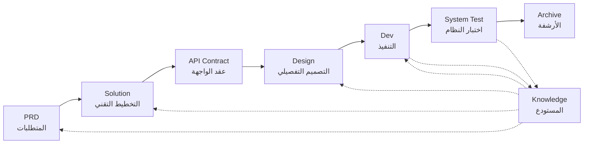

# SpecCrew - إطار عمل هندسة البرمجيات المدعوم بالذكاء الاصطناعي

<p align="center">
  <a href="./README.md">中文</a> |
  <a href="./README.en.md">English</a> |
  <a href="./README.ar.md">العربية</a> |
  <a href="./README.es.md">Español</a>
</p>

<p align="center">
  <a href="https://www.npmjs.com/package/speccrew"></a>
  <a href="https://www.npmjs.com/package/speccrew"></a>
  <a href="https://github.com/charlesmu99/speccrew/blob/main/LICENSE"></a>
</p>

> فريق تطوير افتراضي بالذكاء الاصطناعي يتيح التنفيذ الهندسي السريع لأي مشروع برمجي

## ما هو SpecCrew؟

SpecCrew هو إطار عمل مدمج لفريق تطوير افتراضي بالذكاء الاصطناعي. يحول سير عمل هندسة البرمجيات المهنية (PRD → Feature Design → System Design → Dev → Test) إلى سير عمل وكلاء (Agent) قابلة لإعادة الاستخدام، مما يساعد فرق التطوير على تحقيق التطوير المدفوع بالمواصفات (SDD)، ومناسب بشكل خاص للمشاريع الحالية.

من خلال دمج الوكلاء والمهارات في المشاريع الحالية، يمكن للفرق تهيئة أنظمة توثيق المشاريع وفريق البرمجيات الافتراضي بسرعة، وتنفيذ الميزات الجديدة والتعديلات باتباع سير عمل الهندسة القياسية.

---

## 8 مشاكل أساسية تم حلها

### 1. الذكاء الاصطناعي يتجاهل توثيق المشروع الحالي (فجوة المعرفة)
**المشكلة**: تعتمد أساليب SDD أو Vibe Coding الحالية على الذكاء الاصطناعي لتلخيص المشاريع في الوقت الفعلي، مما يسهل إغفال السياق الحرج ويسبب انحراف نتائج التطوير عن التوقعات.

**الحل**: يعمل مستودع `knowledge/` كـ"مصدر الحقيقة الوحيد" للمشروع، حيث يتراكم تصميم الهندسة المعمارية والوحدات الوظيفية وعمليات الأعمال لضمان بقاء المتطلبات على المسار الصحيح من المصدر.

### 2. الانتقال المباشر من PRD إلى التوثيق التقني (حذف المحتوى)
**المشكلة**: الانتقال المباشر من PRD إلى التصميم التفصيلي يسهل إغفال تفاصيل المتطلبات، مما يتسبب في انحراف الميزات المنفذة عن المتطلبات.

**الحل**: إدخال مرحلة **وثيقة الحل (Solution)**، مع التركيز فقط على هيكل المتطلبات دون التفاصيل التقنية:
- ما هي الصفحات والمكونات المضمنة
- تدفقات عمليات الصفحات
- منطق المعالجة الخلفية
- هيكل تخزين البيانات

يحتاج التطوير فقط إلى "ملء اللحم" بناءً على المكدس التقني المحدد، مما يضمن نمو الميزات "بالقرب من العظم (المتطلبات)."

### 3. نطاق البحث غير المؤكد للوكيل (عدم اليقين)
**المشكلة**: في المشاريع المعقدة، يؤدي البحث الواسع للذكاء الاصطناعي في الكود والمستندات إلى نتائج غير مؤكدة، مما يجعل ضمان الاتساق صعباً.

**الحل**: هياكل دليل واضحة وقوالب للمستندات، مصممة بناءً على احتياجات كل وكيل، تنفذ **الإفصاح التدريجي والتحميل عند الطلب** لضمان الحتمية.

### 4. نقص الخطوات والمهام (انقطاع العملية)
**المشكلة**: نقص التغطية الكاملة لسير عمل الهندسة يسهل إغفال الخطوات الحرجة، مما يجعل ضمان الجودة صعباً.

**الحل**: تغطية دورة حياة هندسة البرمجيات الكاملة:
```
PRD (المتطلبات) → Solution (التخطيط) → API Contract
    → Design → Dev (التطوير) → Test (الاختبار)
```
- مخرجات كل مرحلة هي مدخلات المرحلة التالية
- كل خطوة تتطلب تأكيداً بشرياً قبل المتابعة
- جميع تنفيذات الوكلاء لها قوائم مهام مع فحص ذاتي بعد الانتهاء

### 5. كفاءة التعاون المنخفضة في الفريق (جزر المعرفة)
**المشكلة**: من الصعب مشاركة خبرة البرمجة بالذكاء الاصطناعي عبر الفرق، مما يؤدي إلى أخطاء متكررة.

**الحل**: جميع الوكلاء والمهارات والمستندات ذات الصلة تخضع للتحكم في الإصدار مع الكود المصدري:
- تحسين شخص واحد، يشاركه الفريق
- تراكم المعرفة في قاعدة الكود
- تحسين كفاءة التعاون في الفريق

### 7. سياق الوكيل الواحد طويل جداً (اختناق الأداء)
**المشكلة**: المهام المعقدة الكبيرة تتجاوز نوافذ سياق الوكيل الواحد، مما يسبب انحرافاً في الفهم وانخفاضاً في جودة المخرجات.

**الحل**: **آلية الإرسال التلقائي للوكلاء الفرعيين**:
- يتم تحديد المهام المعقدة تلقائياً وتقسيمها إلى مهام فرعية
- كل مهمة فرعية تنفذها وكيل فرعي مستقل بسياق معزول
- يقوم الوكيل الأب بالتنسيق والتجميع لضمان الاتساق العام
- يتجنب تضخم سياق الوكيل الواحد، مما يضمن جودة المخرجات

### 8. فوضى تكرار المتطلبات (صعوبة الإدارة)
**المشكلة**: المتطلبات المتعددة المختلطة في نفس الفرع تؤثر على بعضها البعض، مما يجعل التتبع والاسترجاع صعباً.

**الحل**: **كل متطلب كمشروع مستقل**:
- كل متطلب ينشئ دليل تكرار مستقل `iterations/iXXX-[اسم-المتطلب]/`
- عزل كامل: المستندات والتصميم والكود والاختبارات تدار بشكل مستقل
- تكرار سريع: تسليم بحبوب صغيرة، تحقق سريع، نشر سريع
- أرشفة مرنة: بعد الانتهاء، الأرشفة إلى `archive/` مع إمكانية تتبع تاريخي واضح

### 6. تأخر تحديث المستندات (تحلل المعرفة)
**المشكلة**: تصبح المستندات قديمة مع تطور المشاريع، مما يتسبب في عمل الذكاء الاصطناعي بمعلومات غير صحيحة.

**الحل**: الوكلاء لديهم قدرات تحديث المستندات التلقائي، مما يزامن تغييرات المشروع في الوقت الفعلي للحفاظ على دقة قاعدة المعرفة.

---

## سير العمل الأساسي



### أوصاف المراحل

| المرحلة | الوكيل | المدخلات | المخرجات | التأكيد البشري |
|---------|--------|----------|----------|---------------|
| PRD | PM | متطلبات المستخدم | وثيقة متطلبات المنتج | ✅ مطلوب |
| Solution | Planner | PRD | الحل التقني + عقد API | ✅ مطلوب |
| Design | Designer | Solution | مستندات التصميم الأمامي/الخلفي | ✅ مطلوب |
| Dev | Dev | Design | الكود + سجلات المهام | ✅ مطلوب |
| System Test | Test Manager | مخرجات Dev + Feature Spec | حالات الاختبار + كود الاختبار + تقرير الاختبار + تقرير الأخطاء | ✅ مطلوب |

---

## المقارنة مع الحلول الموجودة

| البُعد | Vibe Coding | Ralph Loop | **SpecCrew** |
|--------|-------------|------------|-------------|
| الاعتماد على المستندات | يتجاهل المستندات الموجودة | يعتمد على AGENTS.md | **قاعدة معرفة منظمة** |
| نقل المتطلبات | ترميز مباشر | PRD → Code | **PRD → Feature Design → System Design → Code** |
| المشاركة البشرية | الحد الأدنى | عند البدء | **في كل مرحلة** |
| اكتمال العملية | ضعيف | متوسط | **سير عمل هندسي كامل** |
| التعاون في الفريق | صعب المشاركة | كفاءة شخصية | **مشاركة المعرفة في الفريق** |
| إدارة السياق | مثيل واحد | حلقة مثيل واحد | **إرسال تلقائي للوكلاء الفرعيين** |
| إدارة التكرار | مختلط | قائمة المهام | **المتطلب كمشروع، تكرار مستقل** |
| الحتمية | منخفضة | متوسطة | **عالية (الإفصاح التدريجي)** |

---

## البدء السريع

### المتطلبات المسبقة

- Node.js >= 16.0.0
- IDEs المدعومة: [Qoder](https://qoder.com/)

### 1. تثبيت SpecCrew

```bash
npm install -g speccrew
```

### 2. تهيئة المشروع

انتقل إلى الدليل الجذر لمشروعك وقم بتشغيل أمر التهيئة:

```bash
cd /path/to/your-project
speccrew init --ide qoder
```

بعد التهيئة، سيتم إنشاء ما يلي في مشروعك:
- `.qoder/agents/` — 7 تعريفات أدوار Agent
- `.qoder/skills/` — 38 سير عمل Skill
- `speccrew-workspace/` — مساحة العمل (أدلة التكرار، قاعدة المعرفة، قوالب المستندات)
- `.speccrewrc` — ملف تكوين SpecCrew

### 3. بدء سير عمل التطوير

اتبع سير عمل الهندسة القياسي خطوة بخطوة:

1. **PRD**: يقوم Product Manager Agent بتحليل المتطلبات وإنشاء وثيقة متطلبات المنتج
2. **Feature Design**: يقوم Feature Designer Agent بإنشاء وثيقة تصميم الميزات + عقد API
3. **System Design**: يقوم System Designer Agent بإنشاء مستندات تصميم النظام حسب المنصة (واجهة/خلفية/محمول/سطح مكتب)
4. **Dev**: يقوم System Developer Agent بتنفيذ التطوير حسب المنصة بالتوازي
5. **System Test**: يقوم Test Manager Agent بتنسيق اختبار ثلاثي المراحل (تصميم الحالات → توليد الكود → تقرير التنفيذ)
6. **Archive**: أرشفة التكرار

> تتطلب مخرجات كل مرحلة تأكيداً بشرياً قبل الانتقال إلى المرحلة التالية.

### 4. أوامر CLI الأخرى

```bash
speccrew list       # عرض قائمة agents و skills المثبتة
speccrew doctor     # تشخيص البيئة وحالة التثبيت
speccrew update     # تحديث agents و skills إلى أحدث إصدار
speccrew uninstall  # إلغاء تثبيت SpecCrew (--all يحذف أيضاً مساحة العمل)
```

---

## هيكل الدليل

```
your-project/
├── .qoder/                          # دليل تكوين IDE (مثال Qoder)
│   ├── agents/                      # 7 وكلاء أدوار
│   │   ├── speccrew-team-leader.md       # قائد الفريق: الجدولة العامة وإدارة التكرار
│   │   ├── speccrew-product-manager.md   # مدير المنتج: تحليل المتطلبات و PRD
│   │   ├── speccrew-feature-designer.md  # مصمم الميزات: Feature Design + عقد API
│   │   ├── speccrew-system-designer.md   # مصمم النظام: تصميم النظام حسب المنصة
│   │   ├── speccrew-system-developer.md  # مطور النظام: التطوير المتوازي حسب المنصة
│   │   ├── speccrew-test-manager.md      # مدير الاختبار: تنسيق الاختبار ثلاثي المراحل
│   │   └── speccrew-task-worker.md       # عامل المهام: تنفيذ المهام الفرعية المتوازية
│   └── skills/                      # 38 مهارة (مجمعة حسب الوظيفة)
│       ├── speccrew-pm-*/                # إدارة المنتج (تحليل المتطلبات، التقييم)
│       ├── speccrew-fd-*/                # تصميم الميزات (Feature Design، عقد API)
│       ├── speccrew-sd-*/                # تصميم النظام (واجهة/خلفية/محمول/سطح مكتب)
│       ├── speccrew-dev-*/               # التطوير (واجهة/خلفية/محمول/سطح مكتب)
│       ├── speccrew-test-*/              # الاختبار (تصميم الحالات/توليد الكود/تقرير التنفيذ)
│       ├── speccrew-knowledge-bizs-*/    # معرفة الأعمال (تحليل API/تحليل UI/تصنيف الوحدات، إلخ)
│       ├── speccrew-knowledge-techs-*/   # المعرفة التقنية (توليد المكدس/الاتفاقيات/الفهرس، إلخ)
│       ├── speccrew-knowledge-graph-*/   # رسم المعرفة (قراءة/كتابة/استعلام)
│       └── speccrew-*/                   # الأدوات (التشخيص/الطوابع الزمنية/سير العمل، إلخ)
│
└── speccrew-workspace/              # مساحة العمل (تُنشأ أثناء التهيئة)
    ├── docs/                        # المستندات الإدارية
    │   ├── configs/                 # ملفات التكوين (تعيين المنصة، تعيين المكدس التقني، إلخ)
    │   ├── rules/                   # تكوينات القواعد
    │   └── solutions/               # مستندات الحلول
    │
    ├── iterations/                  # مشاريع التكرار (تُنشأ ديناميكياً)
    │   └── {رقم}-{نوع}-{اسم}/
    │       ├── 00.docs/             # المتطلبات الأصلية
    │       ├── 01.product-requirement/ # متطلبات المنتج
    │       ├── 02.feature-design/   # تصميم الميزات
    │       ├── 03.system-design/    # تصميم النظام
    │       ├── 04.development/      # مرحلة التطوير
    │       ├── 05.system-test/      # اختبار النظام
    │       └── 06.delivery/         # مرحلة التسليم
    │
    ├── iteration-archives/          # أرشيف التكرار
    │
    └── knowledges/                  # قاعدة المعرفة
        ├── base/                    # الأساس/البيانات الوصفية
        │   ├── diagnosis-reports/   # تقارير التشخيص
        │   ├── sync-state/          # حالة المزامنة
        │   └── tech-debts/          # الديون التقنية
        ├── bizs/                    # معرفة الأعمال
        │   └── {نوع-المنصة}/{اسم-الوحدة}/
        └── techs/                   # المعرفة التقنية
            └── {معرف-المنصة}/
```

---

## المبادئ التصميمية الأساسية

1. **المدفوع بالمواصفات**: كتابة المواصفات أولاً، ثم السماح للكود بال"نمو" منها
2. **الإفصاح التدريجي**: الوكلاء يبدأون من نقاط دخول دنيا، تحميل المعلومات عند الطلب
3. **التأكيد البشري**: مخرجات كل مرحلة تتطلب تأكيداً بشرياً لمنع انحراف الذكاء الاصطناعي
4. **عزل السياق**: المهام الكبيرة مقسمة إلى مهام فرعية صغيرة معزولة السياق
5. **التعاون الوكيل الفرعي**: المهام المعقدة ترسل تلقائياً للوكلاء الفرعيين لتجنب تضخم سياق الوكيل الواحد
6. **التكرار السريع**: كل متطلب كمشروع مستقل للتسليم السريع والتحقق
7. **مشاركة المعرفة**: جميع التكوينات تخضع للتحكم في الإصدار مع الكود المصدري

---

## حالات الاستخدام

### ✅ موصى به لـ
- المشاريع المتوسطة إلى الكبيرة التي تتطلب سير عمل موحد
- تطوير البرمجيات التعاوني للفرق
- تحويل الهندسة للمشاريع القديمة
- المنتجات التي تتطلب صيانة طويلة الأجل

### ❌ غير مناسب لـ
- التحقق السريع من النماذج الأولية الشخصية
- المشاريع الاستكشافية بمتطلبات غير مؤكدة للغاية
- البرامج النصية أو الأدوات لمرة واحدة

---

## مزيد من المعلومات

- **خريطة معرفة الوكيل**: [speccrew-workspace/docs/agent-knowledge-map.md](./speccrew-workspace/docs/agent-knowledge-map.md)
- **npm**: https://www.npmjs.com/package/speccrew
- **GitHub**: https://github.com/charlesmu99/speccrew
- **Gitee**: https://gitee.com/amutek/speccrew
- **Qoder IDE**: https://qoder.com/

---

> **SpecCrew لا يهدف إلى استبدال المطورين، بل إلى أتمتة الأجزاء المملة حتى يمكن للفرق التركيز على عمل أكثر قيمة.**

---


