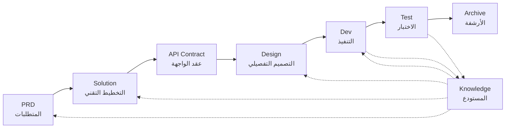

# SpecCrew - إطار عمل هندسة البرمجيات المدعوم بالذكاء الاصطناعي

<p align="center">
  <a href="./README.md">中文</a> |
  <a href="./README.en.md">English</a> |
  <a href="./README.ar.md">العربية</a> |
  <a href="./README.es.md">Español</a>
</p>

> فريق تطوير افتراضي بالذكاء الاصطناعي يتيح التنفيذ الهندسي السريع لأي مشروع برمجي

## ما هو SpecCrew؟

SpecCrew هو إطار عمل مدمج لفريق تطوير افتراضي بالذكاء الاصطناعي. يحول سير عمل هندسة البرمجيات المهنية (PRD → Solution → Design → Dev → Test) إلى سير عمل وكلاء (Agent) قابلة لإعادة الاستخدام، مما يساعد فرق التطوير على تحقيق التطوير المدفوع بالمواصفات (SDD)، ومناسب بشكل خاص للمشاريع الحالية.

من خلال دمج الوكلاء والمهارات في المشاريع الحالية، يمكن للفرق تهيئة أنظمة توثيق المشاريع وفريق البرمجيات الافتراضي بسرعة، وتنفيذ الميزات الجديدة والتعديلات باتباع سير عمل الهندسة القياسية.

---

## 8 مشاكل أساسية تم حلها

### 1. الذكاء الاصطناعي يتجاهل توثيق المشروع الحالي (فجوة المعرفة)
**المشكلة**: تعتمد أساليب SDD أو Vibe Coding الحالية على الذكاء الاصطناعي لتلخيص المشاريع في الوقت الفعلي، مما يسهل إغفال السياق الحرج ويسبب انحراف نتائج التطوير عن التوقعات.

**الحل**: يعمل مستودع `knowledge/` كـ"مصدر الحقيقة الوحيد" للمشروع، حيث يتراكم تصميم الهندسة المعمارية والوحدات الوظيفية وعمليات الأعمال لضمان بقاء المتطلبات على المسار الصحيح من المصدر.

### 2. الانتقال المباشر من PRD إلى التوثيق التقني (حذف المحتوى)
**المشكلة**: الانتقال المباشر من PRD إلى التصميم التفصيلي يسهل إغفال تفاصيل المتطلبات، مما يتسبب في انحراف الميزات المنفذة عن المتطلبات.

**الحل**: إدخال مرحلة **وثيقة الحل (Solution)**، مع التركيز فقط على هيكل المتطلبات دون التفاصيل التقنية:
- ما هي الصفحات والمكونات المضمنة
- تدفقات عمليات الصفحات
- منطق المعالجة الخلفية
- هيكل تخزين البيانات

يحتاج التطوير فقط إلى "ملء اللحم" بناءً على المكدس التقني المحدد، مما يضمن نمو الميزات "بالقرب من العظم (المتطلبات)."

### 3. نطاق البحث غير المؤكد للوكيل (عدم اليقين)
**المشكلة**: في المشاريع المعقدة، يؤدي البحث الواسع للذكاء الاصطناعي في الكود والمستندات إلى نتائج غير مؤكدة، مما يجعل ضمان الاتساق صعباً.

**الحل**: هياكل دليل واضحة وقوالب للمستندات، مصممة بناءً على احتياجات كل وكيل، تنفذ **الإفصاح التدريجي والتحميل عند الطلب** لضمان الحتمية.

### 4. نقص الخطوات والمهام (انقطاع العملية)
**المشكلة**: نقص التغطية الكاملة لسير عمل الهندسة يسهل إغفال الخطوات الحرجة، مما يجعل ضمان الجودة صعباً.

**الحل**: تغطية دورة حياة هندسة البرمجيات الكاملة:
```
PRD (المتطلبات) → Solution (التخطيط) → API Contract
    → Design → Dev (التطوير) → Test (الاختبار)
```
- مخرجات كل مرحلة هي مدخلات المرحلة التالية
- كل خطوة تتطلب تأكيداً بشرياً قبل المتابعة
- جميع تنفيذات الوكلاء لها قوائم مهام مع فحص ذاتي بعد الانتهاء

### 5. كفاءة التعاون المنخفضة في الفريق (جزر المعرفة)
**المشكلة**: من الصعب مشاركة خبرة البرمجة بالذكاء الاصطناعي عبر الفرق، مما يؤدي إلى أخطاء متكررة.

**الحل**: جميع الوكلاء والمهارات والمستندات ذات الصلة تخضع للتحكم في الإصدار مع الكود المصدري:
- تحسين شخص واحد، يشاركه الفريق
- تراكم المعرفة في قاعدة الكود
- تحسين كفاءة التعاون في الفريق

### 7. سياق الوكيل الواحد طويل جداً (اختناق الأداء)
**المشكلة**: المهام المعقدة الكبيرة تتجاوز نوافذ سياق الوكيل الواحد، مما يسبب انحرافاً في الفهم وانخفاضاً في جودة المخرجات.

**الحل**: **آلية الإرسال التلقائي للوكلاء الفرعيين**:
- يتم تحديد المهام المعقدة تلقائياً وتقسيمها إلى مهام فرعية
- كل مهمة فرعية تنفذها وكيل فرعي مستقل بسياق معزول
- يقوم الوكيل الأب بالتنسيق والتجميع لضمان الاتساق العام
- يتجنب تضخم سياق الوكيل الواحد، مما يضمن جودة المخرجات

### 8. فوضى تكرار المتطلبات (صعوبة الإدارة)
**المشكلة**: المتطلبات المتعددة المختلطة في نفس الفرع تؤثر على بعضها البعض، مما يجعل التتبع والاسترجاع صعباً.

**الحل**: **كل متطلب كمشروع مستقل**:
- كل متطلب ينشئ دليل تكرار مستقل `iterations/iXXX-[اسم-المتطلب]/`
- عزل كامل: المستندات والتصميم والكود والاختبارات تدار بشكل مستقل
- تكرار سريع: تسليم بحبوب صغيرة، تحقق سريع، نشر سريع
- أرشفة مرنة: بعد الانتهاء، الأرشفة إلى `archive/` مع إمكانية تتبع تاريخي واضح

### 6. تأخر تحديث المستندات (تحلل المعرفة)
**المشكلة**: تصبح المستندات قديمة مع تطور المشاريع، مما يتسبب في عمل الذكاء الاصطناعي بمعلومات غير صحيحة.

**الحل**: الوكلاء لديهم قدرات تحديث المستندات التلقائي، مما يزامن تغييرات المشروع في الوقت الفعلي للحفاظ على دقة قاعدة المعرفة.

---

## سير العمل الأساسي



### أوصاف المراحل

| المرحلة | الوكيل | المدخلات | المخرجات | التأكيد البشري |
|---------|--------|----------|----------|---------------|
| PRD | PM | متطلبات المستخدم | وثيقة متطلبات المنتج | ✅ مطلوب |
| Solution | Planner | PRD | الحل التقني + عقد API | ✅ مطلوب |
| Design | Designer | Solution | مستندات التصميم الأمامي/الخلفي | ✅ مطلوب |
| Dev | Dev | Design | الكود + سجلات المهام | ✅ مطلوب |
| Test | Test | مخرجات Dev + معايير قبول PRD | تقرير الاختبار | ✅ مطلوب |

---

## المقارنة مع الحلول الموجودة

| البُعد | Vibe Coding | Ralph Loop | **SpecCrew** |
|--------|-------------|------------|-------------|
| الاعتماد على المستندات | يتجاهل المستندات الموجودة | يعتمد على AGENTS.md | **قاعدة معرفة منظمة** |
| نقل المتطلبات | ترميز مباشر | PRD → Code | **PRD → Solution → Design → Code** |
| المشاركة البشرية | الحد الأدنى | عند البدء | **في كل مرحلة** |
| اكتمال العملية | ضعيف | متوسط | **سير عمل هندسي كامل** |
| التعاون في الفريق | صعب المشاركة | كفاءة شخصية | **مشاركة المعرفة في الفريق** |
| إدارة السياق | مثيل واحد | حلقة مثيل واحد | **إرسال تلقائي للوكلاء الفرعيين** |
| إدارة التكرار | مختلط | قائمة المهام | **المتطلب كمشروع، تكرار مستقل** |
| الحتمية | منخفضة | متوسطة | **عالية (الإفصاح التدريجي)** |

---

## البدء السريع

### 1. تثبيت SpecCrew

**الطريقة 1: سكريبت التثبيت بنقرة واحدة (موصى به، Qoder IDE فقط)**

```bash
# macOS / Linux / WSL - التثبيت من GitHub
curl -fsSL https://raw.githubusercontent.com/charlesmu99/SpecCrew/main/scripts/install-qoder.sh | bash

# macOS / Linux / WSL - التثبيت من Gitee (مرآة الصين)
curl -fsSL https://gitee.com/amutek/SpecCrew/raw/main/scripts/install-qoder.sh | bash
```

```powershell
# Windows - التثبيت من GitHub
Invoke-Expression (Invoke-WebRequest -Uri "https://raw.githubusercontent.com/charlesmu99/SpecCrew/main/scripts/install-qoder.ps1").Content

# Windows - التثبيت من Gitee (مرآة الصين)
Invoke-Expression (Invoke-WebRequest -Uri "https://gitee.com/amutek/SpecCrew/raw/main/scripts/install-qoder.ps1").Content
```

> **ملاحظة**: سكريبت التثبيت بنقرة واحدة يدعم حالياً Qoder IDE فقط. للـ IDEs الأخرى (VS Code, Cursor, إلخ)، يرجى استخدام طريقة النسخ اليدوي أدناه.

**الطريقة 2: النسخ اليدوي (عالمي لجميع IDEs)**

```bash
# استنساخ المستودع والنسخ إلى مشروع موجود
git clone https://github.com/charlesmu99/SpecCrew.git
# أو: git clone https://gitee.com/amutek/SpecCrew.git

# نسخ إلى المشروع الهدف (تعديل حسب دليل تكوين IDE الخاص بك)
cp -r SpecCrew/.speccrew /path/to/your-project/
cp -r SpecCrew/SpecCrew-workspace /path/to/your-project/

# لـ Qoder IDE، انسخ أيضًا إلى دليل .qoder/
cp -r SpecCrew/.speccrew/agents/* /path/to/your-project/.qoder/agents/
cp -r SpecCrew/.speccrew/skills/* /path/to/your-project/.qoder/skills/
```

### 2. تهيئة المشروع

```bash
# تشغيل مهارة التهيئة لإنشاء قاعدة المعرفة وهيكل المشروع تلقائياً
# يتم تنفيذها تلقائياً بواسطة مهارة SpecCrew-project-init
```

### 3. بدء سير عمل التطوير

```bash
# 1. إنشاء PRD
# 2. إنشاء Solution
# 3. تأكيد عقد API
# 4. التصميم التفصيلي
# 5. تنفيذ التطوير
# 6. الاختبار
```

### 4. إلغاء تثبيت SpecCrew

**الطريقة 1: سكريبت إلغاء التثبيت بنقرة واحدة (موصى به، Qoder IDE فقط)**

```bash
# macOS / Linux / WSL - إلغاء التثبيت من GitHub
curl -fsSL https://raw.githubusercontent.com/charlesmu99/SpecCrew/main/scripts/uninstall-qoder.sh | bash

# macOS / Linux / WSL - إلغاء التثبيت من Gitee (مرآة الصين)
curl -fsSL https://gitee.com/amutek/SpecCrew/raw/main/scripts/uninstall-qoder.sh | bash
```

```powershell
# Windows - إلغاء التثبيت من GitHub
Invoke-Expression (Invoke-WebRequest -Uri "https://raw.githubusercontent.com/charlesmu99/SpecCrew/main/scripts/uninstall-qoder.ps1").Content

# Windows - إلغاء التثبيت من Gitee (مرآة الصين)
Invoke-Expression (Invoke-WebRequest -Uri "https://gitee.com/amutek/SpecCrew/raw/main/scripts/uninstall-qoder.ps1").Content
```

> **ملاحظة**: سكريبت إلغاء التثبيت بنقرة واحدة يدعم حالياً Qoder IDE فقط.

**الطريقة 2: إلغاء التثبيت اليدوي (عالمي لجميع IDEs)**

```bash
# حذف دليل SpecCrew-workspace
rm -rf SpecCrew-workspace/

# حذف الملفات ببادئة SpecCrew- في .speccrew/ (الحفاظ على المحتوى المخصص)
rm -rf .speccrew/agents/SpecCrew-*.md
rm -rf .speccrew/skills/SpecCrew-*/

# لـ Qoder IDE، نظف أيضًا دليل .qoder/
rm -rf .qoder/agents/SpecCrew-*.md
rm -rf .qoder/skills/SpecCrew-*/
```

> **ملاحظة**: سيؤدي إلغاء التثبيت إلى الحفاظ على ملفات المصدر والمحتوى المخصص في `.speccrew/`. لإزالة تكوينات IDE بالكامل، احذف دليل التكوين المقابل يدوياً (مثل `.qoder/`).

---

## هيكل الدليل

```
your-project/
├── .speccrew/                       # ملفات مصدر SpecCrew (قابلة للتحكم في الإصدار)
├── .qoder/                          # تكوين Qoder IDE (وقت التشغيل)
│   ├── agents/                      # 6 وكلاء الأدوار
│   └── skills/                      # 16 مهارة
│
└── SpecCrew-workspace/              # مساحة العمل (يتم إنشاؤها أثناء التهيئة)
    ├── docs/                        # المستندات الإدارية
    │   ├── rules/                   # تكوينات القواعد
    │   └── solutions/               # مستندات الحلول
    │       └── agent-knowledge-map.md
    │
    ├── iterations/                  # مشاريع التكرار (يتم إنشاؤها ديناميكياً)
    │   └── {رقم}-{نوع}-{اسم}/       # مثال: 001-feature-order
    │       ├── 00.docs/             # المتطلبات الأصلية
    │       ├── 01.prd/              # متطلبات المنتج
    │       ├── 02.solution/         # تصميم الحل
    │       ├── 03.design/           # مستندات التصميم
    │       ├── 04.dev/              # مرحلة التطوير
    │       ├── 05.test/             # مرحلة الاختبار
    │       └── 06.delivery/         # مرحلة التسليم
    │
    ├── iteration-archives/          # أرشيف التكرار
    │   └── {رقم}-{نوع}-{اسم}-{تاريخ}/
    │
    └── knowledges/                  # قاعدة المعرفة
        ├── base/                    # البيانات الوصفية الأساسية
        │   ├── diagnosis-reports/   # تقارير التشخيص
        │   ├── sync-state/          # حالة المزامنة
        │   └── tech-debts/          # الديون التقنية
        │
        ├── bizs/                    # المعرفة التجارية
        │   └── {نوع-المنصة}/
        │       └── {اسم-الوحدة}/
        │
        └── techs/                   # المعرفة التقنية
            └── {معرف-المنصة}/
```

---

## المبادئ التصميمية الأساسية

1. **المدفوع بالمواصفات**: كتابة المواصفات أولاً، ثم السماح للكود بال"نمو" منها
2. **الإفصاح التدريجي**: الوكلاء يبدأون من نقاط دخول دنيا، تحميل المعلومات عند الطلب
3. **التأكيد البشري**: مخرجات كل مرحلة تتطلب تأكيداً بشرياً لمنع انحراف الذكاء الاصطناعي
4. **عزل السياق**: المهام الكبيرة مقسمة إلى مهام فرعية صغيرة معزولة السياق
5. **التعاون الوكيل الفرعي**: المهام المعقدة ترسل تلقائياً للوكلاء الفرعيين لتجنب تضخم سياق الوكيل الواحد
6. **التكرار السريع**: كل متطلب كمشروع مستقل للتسليم السريع والتحقق
7. **مشاركة المعرفة**: جميع التكوينات تخضع للتحكم في الإصدار مع الكود المصدري

---

## حالات الاستخدام

### ✅ موصى به لـ
- المشاريع المتوسطة إلى الكبيرة التي تتطلب سير عمل موحد
- تطوير البرمجيات التعاوني للفرق
- تحويل الهندسة للمشاريع القديمة
- المنتجات التي تتطلب صيانة طويلة الأجل

### ❌ غير مناسب لـ
- التحقق السريع من النماذج الأولية الشخصية
- المشاريع الاستكشافية بمتطلبات غير مؤكدة للغاية
- البرامج النصية أو الأدوات لمرة واحدة

---

## مزيد من المعلومات

- **خريطة معرفة الوكيل**: [SpecCrew-workspace/docs/agent-knowledge-map.md](./SpecCrew-workspace/docs/agent-knowledge-map.md)
- **GitHub**: https://github.com/charlesmu99/SpecCrew
- **Gitee**: https://gitee.com/amutek/SpecCrew
- **Qoder IDE**: https://qoder.com/

---

> **SpecCrew لا يهدف إلى استبدال المطورين، بل إلى أتمتة الأجزاء المملة حتى يمكن للفرق التركيز على عمل أكثر قيمة.**

---


