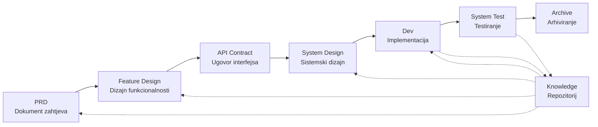

# SpecCrew - AI-pogon softverski inženjerski okvir

<p align="center">
  <a href="./README.md">简体中文</a> |
  <a href="./README.zh-TW.md">繁體中文</a> |
  <a href="./README.en.md">English</a> |
  <a href="./README.ko.md">한국어</a> |
  <a href="./README.de.md">Deutsch</a> |
  <a href="./README.es.md">Español</a> |
  <a href="./README.fr.md">Français</a> |
  <a href="./README.it.md">Italiano</a> |
  <a href="./README.da.md">Dansk</a> |
  <a href="./README.ja.md">日本語</a> |
  <a href="./README.pl.md">Polski</a> |
  <a href="./README.ru.md">Русский</a> |
  <a href="./README.bs.md">Bosanski</a> |
  <a href="./README.ar.md">العربية</a> |
  <a href="./README.no.md">Norsk</a> |
  <a href="./README.pt-BR.md">Português (Brasil)</a> |
  <a href="./README.th.md">ไทย</a> |
  <a href="./README.tr.md">Türkçe</a> |
  <a href="./README.uk.md">Українська</a> |
  <a href="./README.bn.md">বাংলা</a> |
  <a href="./README.el.md">Ελληνικά</a> |
  <a href="./README.vi.md">Tiếng Việt</a>
</p>

<p align="center">
  <a href="https://www.npmjs.com/package/speccrew"></a>
  <a href="https://www.npmjs.com/package/speccrew"></a>
  <a href="https://github.com/charlesmu99/speccrew/blob/main/LICENSE"></a>
</p>

> Virtuelni AI razvojni tim koji omogućava brzu inženjersku implementaciju za bilo koji softverski projekat

## Šta je SpecCrew?

SpecCrew je ugrađeni virtuelni AI razvojni okvir. Transformiše profesionalne softverske inženjerske tokove rada (PRD → Feature Design → System Design → Dev → Test) u višekorisne tokove rada Agenta, pomažući razvojnim timovima da postignu Specification-Driven Development (SDD), posebno pogodan za postojeće projekte.

Integracijom Agenata i Vještina u postojeće projekte, timovi mogu brzo inicijalizirati sisteme dokumentacije projekta i virtuelne softverske timove, implementirajući nove funkcionalnosti i modifikacije prema standardnim inženjerskim tokovima rada.

---

## ✨ Ključne Karakteristike

### 🏭 Virtuelni Softverski Tim
Jednoklik generisanje **7 profesionalnih uloga Agenata** + **30+ tokova rada Vještina**, izgradnja kompletnog virtuelnog softverskog tima:
- **Team Leader** - Globalno planiranje i upravljanje iteracijama
- **Product Manager** - Analiza zahtjeva i PRD output
- **Feature Designer** - Dizajn funkcionalnosti + API ugovori
- **System Designer** - Dizajn sistema Frontend/Backend/Mobilni/Desktop
- **System Developer** - Multiplatformski paralelni razvoj
- **Test Manager** - Koordinacija testiranja u tri faze
- **Task Worker** - Paralelno izvršavanje podzadataka

### 📐 ISA-95 Šestostepeno Modeliranje
Bazirano na međunarodnoj metodologiji modeliranja **ISA-95**, standardizacija transformacije poslovnih zahtjeva u softverske sisteme:
```
Domain Descriptions → Functions in Domains → Functions of Interest
     ↓                       ↓                      ↓
Information Flows → Categories of Information → Information Descriptions
```
- Svaki stepen odgovara specifičnim UML dijagramima (use case, sequence, class diagrams)
- Poslovni zahtjevi se "pročišćavaju korak po korak", bez gubitka informacija
- Rezultati su direktno upotrebljivi za razvoj

### 📚 Sistem Baze Znanja
Troslojna arhitektura baze znanja koja osigurava da AI uvijek radi bazirano na "jednom izvoru istine":

| Sloj | Direktorij | Sadržaj | Svrha |
|------|------------|---------|-------|
| L1 Sistemsko Znanje | `knowledge/techs/` | Tech stack, arhitektura, konvencije | AI razumije tehničke granice projekta |
| L2 Poslovno Znanje | `knowledge/bizs/` | Funkcionalnosti modula, poslovni tokovi, entiteti | AI razumije poslovnu logiku |
| L3 Artefakti Iteracija | `iterations/iXXX/` | PRD, dizajn dokumenti, test izvještaji | Kompletni lanac praćenja za trenutne zahtjeve |

### 🔄 Četvorostepeni Pipeline Znanja
**Automatizovana arhitektura generisanja znanja**, automatsko generisanje poslovne/tehničke dokumentacije iz izvornog koda:
```
Stepen 1: Skeniranje izvornog koda → Generisanje liste modula
Stepen 2: Paralelna analiza → Ekstrakcija funkcionalnosti (multi-Worker paralelno)
Stepen 3: Paralelno sažimanje → Dopuna pregleda modula (multi-Worker paralelno)
Stepen 4: Sistemska agregacija → Generisanje panorame sistema
```
- Podržava **potpunu sinhronizaciju** i **inkrementalnu sinhronizaciju** (bazirano na Git diff)
- Jedna osoba optimizira, tim dijeli

### 🔧 Harness Okvir za Praktičnu Implementaciju
**Standardizovani okvir za izvršavanje**, osigurava preciznu transformaciju dizajn dokumenata u izvršne razvojne instrukcije:
- **Princip operativnog priručnika**: Skill je SOP, koraci jasni, kontinuirani, samodovoljni
- **Ugovor o ulazima i izlazima**: jasno definisani interfejsi, strogo izvršavanje poput pseudokoda
- **Arhitektura postepenog otkrivanja**: informacije se učitavaju u slojevima, izbjegava preopterećenje konteksta
- **Delegiranje sub-agenta**: kompleksni zadaci se automatski dijele, paralelno izvršavanje osigurava kvalitet

---

## Rješavanje 8 ključnih problema

### 1. AI ignoriše postojeću dokumentaciju projekta (jaz u znanju)
**Problem**: Postojeće SDD ili Vibe Coding metode se oslanjaju na AI da sumira projekte u realnom vremenu, lako propuštajući kritični kontekst i uzrokujući da rezultati razvoja odstupaju od očekivanja.

**Rješenje**: Repozitorij `knowledge/` služi kao "jedini izvor istine" projekta, akumulirajući dizajn arhitekture, funkcionalne module i poslovne procese kako bi se osiguralo da zahtjevi ostanu na pravom putu od izvora.

### 2. Direktna tehnička dokumentacija iz PRD-a (izostavljanje sadržaja)
**Problem**: Direktni skok iz PRD-a u detaljni dizajn lako propušta detalje zahtjeva, uzrokujući da implementirane funkcionalnosti odstupaju od zahtjeva.

**Rješenje**: Uvođenje faze **Dokumenta Feature Design**, fokusirajući se samo na skelet zahtjeva bez tehničkih detalja:
- Koje stranice i komponente su uključene?
- Tokovi operacija stranica
| Logika obrade bekenda
- Struktura skladištenja podataka

Razvoj samo treba da "popuni meso" na osnovu specifičnog tehničkog steka, osiguravajući da funkcionalnosti rastu "blizu kostiju (zahtjeva)".

### 3. Neizvjesni opseg pretrage Agenta (neizvjesnost)
**Problem**: U kompleksnim projektima, široka pretraga koda i dokumenata od strane AI daje neizvjesne rezultate, čineći dosljednost teškom za garanciju.

**Rješenje**: Jasne strukture direktorija dokumenata i predlošci, dizajnirani na osnovu potreba svakog Agenta, implementiraju **progresivno otkrivanje i učitavanje na zahtjev** kako bi se osigurao determinizam.

### 4. Nedostajući koraci i zadaci (prekid procesa)
**Problem**: Nedostatak potpunog pokrića inženjerskog procesa lako propušta kritične korake, čineći kvalitet teškim za garanciju.

**Rješenje**: Pokrivanje cijelog životnog ciklusa softverskog inženjerstva:
```
PRD (Zahtjevi) → Feature Design (Dizajn funkcionalnosti) → API Contract (Ugovor)
    → System Design (Sistemski dizajn) → Dev (Razvoj) → Test (Testiranje)
```
- Izlaz svake faze je ulaz sljedeće faze
- Svaki korak zahtijeva ljudsku potvrdu prije nastavka
- Sve egzekucije Agenata imaju todo liste sa samoprovjerom nakon završetka

### 5. Niska efikasnost timskog kolaboracije (silosi znanja)
**Problem**: Iskustvo AI programiranja je teško dijeliti među timovima, što dovodi do ponovljenih grešaka.

**Rješenje**: Svi Agenti, Vještine i povezani dokumenti su verzionisani sa izvornim kodom:
- Optimizacija jedne osobe se dijeli sa timom
- Znanje se akumulira u bazi koda
- Poboljšana efikasnost timskog kolaboracije

### 7. Predugi kontekst jednog Agenta (uskog grla performansi)
**Problem**: Veliki složeni zadaci premašuju kontekstne prozore jednog Agenta, uzrokujući odstupanja u razumijevanju i smanjenje kvaliteta izlaza.

**Rješenje**: **Mehanizam auto-dispatch Sub-Agenata**:
- Složeni zadaci se automatski identifikuju i dijele na podzadatke
- Svaki podzadatak se izvršava od strane nezavisnog sub-Agenta sa izolovanim kontekstom
- Roditeljski Agent koordinira i agregira kako bi osigurao ukupnu dosljednost
- Izbjegava ekspanziju konteksta jednog Agenta, osiguravajući kvalitet izlaza

### 8. Haos iteracije zahtjeva (poteškoće upravljanja)
**Problem**: Višestruki zahtjevi pomiješani u istoj grani međusobno utiču, čineći praćenje i povratak teškim.

**Rješenje**: **Svaki zahtjev kao nezavisni projekat**:
- Svaki zahtjev kreira nezavisni direktorij iteracije `iterations/iXXX-[ime-zahtjeva]/`
- Potpuna izolacija: dokumenti, dizajn, kod i testovi se upravljaju nezavisno
- Brza iteracija: isporuka male granularnosti, brza verifikacija, brzo raspoređivanje
- Fleksibilno arhiviranje: nakon završetka, arhiviranje u `archive/` sa jasnom historijskom praćivošću

### 6. Kašnjenje ažuriranja dokumenata (propadanje znanja)
**Problem**: Dokumenti zastarjevaju kako projekti evoluiraju, uzrokujući da AI radi sa netačnim informacijama.

**Rješenje**: Agenti imaju mogućnosti automatskog ažuriranja dokumenata, sinhronizirajući promjene projekta u realnom vremenu kako bi održali tačnost baze znanja.

---

## Glavni tok rada



### Opisi faza

| Faza | Agent | Ulaz | Izlaz | Ljudska potvrda |
|------|-------|------|-------|-----------------|
| PRD | PM | Korisnički zahtjevi | Dokument zahtjeva proizvoda | ✅ Potrebna |
| Feature Design | Feature Designer | PRD | Dokument Feature Design + API ugovor | ✅ Potrebna |
| System Design | System Designer | Feature Spec | Dokumenti dizajna Frontend/Backend | ✅ Potrebna |
| Dev | Dev | Design | Kod + Zapisi zadataka | ✅ Potrebna |
| System Test | Test Manager | Izlaz Dev + Feature Spec | Test slučajevi + Test kod + Test izvještaj + Izvještaj bugova | ✅ Potrebna |

---

## Uporedno sa postojećim rješenjima

| Dimenzija | Vibe Coding | Ralph Loop | **SpecCrew** |
|-----------|-------------|------------|-------------|
| Zavisnost od dokumenata | Ignoriše postojeće doc | Oslanja se na AGENTS.md | **Strukturirana baza znanja** |
| Prijenos zahtjeva | Direktno kodiranje | PRD → Kod | **PRD → Feature Design → System Design → Kod** |
| Ljudsko učešće | Minimalno | Pri pokretanju | **U svakoj fazi** |
| Potpunost procesa | Slaba | Srednja | **Potpuni inženjerski tok rada** |
| Timska kolaboracija | Teško dijeljenje | Lična efikasnost | **Dijeljenje znanja tima** |
| Upravljanje kontekstom | Jedna instanca | Petlja jedne instance | **Auto-dispatch sub-Agenata** |
| Upravljanje iteracijom | Pomiješano | Lista zadataka | **Zahtjev kao projekat, nezavisna iteracija** |
| Determinizam | Nizak | Srednji | **Visok (progresivno otkrivanje)** |

---

## Brzi početak

### Preduslovi

- Node.js >= 16.0.0
- Podržani IDE-ovi: Qoder (zadani), Cursor, Claude Code

> **Napomena**: Adapteri za Cursor i Claude Code nisu testirani u stvarnim IDE okruženjima (implementirani na nivou koda i verificirani kroz E2E testove, ali još nisu testirani u stvarnom Cursor/Claude Code).

### 1. Instaliraj SpecCrew

```bash
npm install -g speccrew
```

### 2. Inicijalizuj projekat

Navigiraj do korijenskog direktorija projekta i pokreni komandu za inicijalizaciju:

```bash
cd /path/to/your-project

| Zadano koristi Qoder
speccrew init

# Ili specificiraj IDE
speccrew init --ide qoder
speccrew init --ide cursor
speccrew init --ide claude
```

Nakon inicijalizacije, u projektu će biti generisano:
- `.qoder/agents/` / `.cursor/agents/` / `.claude/agents/` — 7 definicija uloga Agenata
- `.qoder/skills/` / `.cursor/skills/` / `.claude/skills/` — 30+ tokova rada Vještina
- `speccrew-workspace/` — Radni prostor (direktoriji iteracija, baza znanja, predlošci dokumenata)
- `.speccrewrc` — Konfiguracioni fajl SpecCrew

Da bi kasnije ažurirali Agente i Vještine za specifični IDE:

```bash
speccrew update --ide cursor
speccrew update --ide claude
```

### 3. Započni tok rada razvoja

Prati standardni inženjerski tok rada korak po korak:

1. **PRD**: Agent Product Manager analizira zahtjeve i generiše dokument zahtjeva proizvoda
2. **Feature Design**: Agent Feature Designer generiše dokument feature design + API ugovor
3. **System Design**: Agent System Designer generiše dokumente system design po platformama (frontend/backend/mobile/desktop)
4. **Dev**: Agent System Developer implementira razvoj po platformama paralelno
5. **System Test**: Agent Test Manager koordinira trofazno testiranje (dizajn slučajeva → generisanje koda → izvještaj izvršavanja)
6. **Archive**: Arhiviraj iteraciju

> Rezultati svake faze zahtijevaju ljudsku potvrdu prije prelaska na sljedeću fazu.

### 4. Ažuriranje SpecCrew-a

Kada SpecCrew objavi novu verziju, potrebne su dvije koraka za dovršetak ažuriranja:

```bash
# Step 1: 更新全局 CLI 工具到最新版本
npm install -g speccrew@latest

# Step 2: 同步项目中的 Agents 和 Skills 到最新版本
cd /path/to/your-project
speccrew update
```

> **Napomena**: `npm install -g speccrew@latest` ažurira sam CLI alat, dok `speccrew update` ažurira datoteke definicija Agenta i Skillova u projektu. Oba koraka su potrebna za potpuno ažuriranje.

### 5. Druge CLI komande

```bash
speccrew list       # Izlistaj instalirane agente i vještine
speccrew doctor     # Dijagnosticiraj okruženje i status instalacije
speccrew update     # Ažuriraj agente i vještine na najnoviju verziju
speccrew uninstall  # Deinstaliraj SpecCrew (--all također briše radni prostor)
```

📖 **Detaljni vodič**: Nakon instalacije, pogledaj [Vodič za početak](docs/GETTING-STARTED.bs.md) za kompletan tok rada i vodič za razgovore agenata.

---

## Struktura direktorija

```
your-project/
├── .qoder/                          # IDE konfiguracioni direktorij (primjer Qoder)
│   ├── agents/                      # 7 Agenata uloga
│   │   ├── speccrew-team-leader.md       # Vođa tima: Globalno planiranje i upravljanje iteracijama
│   │   ├── speccrew-product-manager.md   | Product Manager: Analiza zahtjeva i PRD
│   │   ├── speccrew-feature-designer.md  # Feature Designer: Feature Design + API ugovor
│   │   ├── speccrew-system-designer.md   # System Designer: Sistemski dizajn po platformama
│   │   ├── speccrew-system-developer.md  # System Developer: Paralelni razvoj po platformama
│   │   ├── speccrew-test-manager.md      # Test Manager: Koordinacija trofaznog testiranja
│   │   └── speccrew-task-worker.md       # Task Worker: Paralelno izvršavanje podzadataka
│   └── skills/                      # 30+ Vještina (grupisanih po funkciji)
│       ├── speccrew-pm-*/                # Upravljanje proizvodom (analiza zahtjeva, evaluacija)
│       ├── speccrew-fd-*/                # Feature Design (Feature Design, API ugovor)
│       ├── speccrew-sd-*/                # System Design (frontend/backend/mobile/desktop)
│       ├── speccrew-dev-*/               # Razvoj (frontend/backend/mobile/desktop)
│       ├── speccrew-test-*/              # Testiranje (dizajn slučajeva/generisanje koda/izvještaj izvršavanja)
│       ├── speccrew-knowledge-bizs-*/    # Poslovno znanje (API analiza/UI analiza/klasifikacija modula itd.)
│       ├── speccrew-knowledge-techs-*/   # Tehničko znanje (generisanje tehničkog steka/konvencije/indeks itd.)
│       ├── speccrew-knowledge-graph-*/   # Graf znanja (čitanje/pisanje/upit)
│       └── speccrew-*/                   # Alati (dijagnostika/vremenske oznake/tok rada itd.)
│
└── speccrew-workspace/              # Radni prostor (generisan pri inicijalizaciji)
    ├── docs/                        # Upravljački dokumenti
    │   ├── configs/                 # Konfiguracioni fajlovi (mapiranje platformi, mapiranje tehničkog steka itd.)
    │   ├── rules/                   # Konfiguracije pravila
    │   └── solutions/               # Dokumenti rješenja
    │
    ├── iterations/                  # Projekti iteracija (dinamički generisani)
    │   └── {broj}-{tip}-{ime}/
    │       ├── 00.docs/             # Originalni zahtjevi
    │       ├── 01.product-requirement/ # Zahtjevi proizvoda
    │       ├── 02.feature-design/   # Feature design
    │       ├── 03.system-design/    # System design
    │       ├── 04.development/      # Faza razvoja
    │       ├── 05.system-test/      # Sistemsko testiranje
    │       └── 06.delivery/         # Faza isporuke
    │
    ├── iteration-archives/          # Arhive iteracija
    │
    └── knowledges/                  # Baza znanja
        ├── base/                    # Baza/metapodaci
        │   ├── diagnosis-reports/   # Izvještaji dijagnostike
        │   ├── sync-state/          # Stanje sinhronizacije
        │   └── tech-debts/          # Tehnički dug
        ├── bizs/                    # Poslovno znanje
        │   └── {platform-type}/{module-name}/
        └── techs/                   # Tehničko znanje
            └── {platform-id}/
```

---

## Ključni principi dizajna

1. **Specification-Driven**: Prvo napiši specifikacije, a onda pusti kod da "izraste" iz njih
2. **Progresivno otkrivanje**: Agenti počinju od minimalnih ulaznih tačaka, učitavajući informacije na zahtjev
3. **Ljudska potvrda**: Izlaz svake faze zahtijeva ljudsku potvrdu kako bi se spriječilo odstupanje AI
4. **Izolacija konteksta**: Veliki zadaci se dijele na male, kontekstno izolovane podzadatke
5. **Kolaboracija sub-Agenata**: Složeni zadaci automatski dispatchaju sub-Agente kako bi izbjegli ekspanziju konteksta jednog Agenta
6. **Brza iteracija**: Svaki zahtjev kao nezavisni projekat za brzu isporuku i verifikaciju
7. **Dijeljenje znanja**: Sve konfiguracije su verzionisane sa izvornim kodom

---

## Slučajevi upotrebe

### ✅ Preporučeno za
| Srednje do velike projekte koji zahtijevaju standardizirane tokove rada
- Tinsku kolaboraciju u razvoju softvera
- Inženjersku transformaciju naslijeđenih projekata
- Proizvode koji zahtijevaju dugoročno održavanje

### ❌ Nije pogodno za
- Ličnu brzu validaciju prototipa
- Eksplorativne projekte sa vrlo neizvjesnim zahtjevima
- Jednokratne skripte ili alate

---

## Više informacija

- **Mapa znanja Agenata**: [speccrew-workspace/docs/agent-knowledge-map.md](./speccrew-workspace/docs/agent-knowledge-map.md)
- **npm**: https://www.npmjs.com/package/speccrew
- **GitHub**: https://github.com/charlesmu99/speccrew
- **Gitee**: https://gitee.com/amutek/speccrew
- **Qoder IDE**: https://qoder.com/

---

> **SpecCrew ne zamjenjuje developere, već automatizira dosadne dijelove kako bi se timovi mogli fokusirati na vrijedniji rad.**
