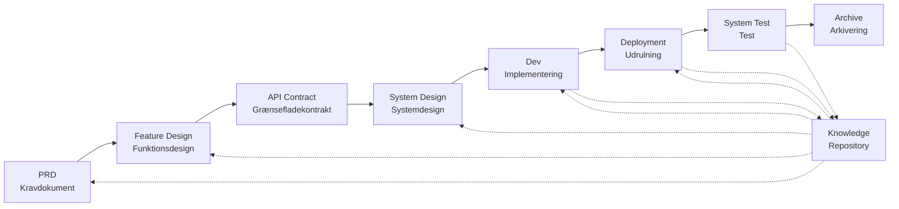

# SpecCrew - AI-drevet Software Engineering Framework

<p align="center">
  <a href="./README.md">简体中文</a> |
  <a href="./README.zh-TW.md">繁體中文</a> |
  <a href="./README.en.md">English</a> |
  <a href="./README.ko.md">한국어</a> |
  <a href="./README.de.md">Deutsch</a> |
  <a href="./README.es.md">Español</a> |
  <a href="./README.fr.md">Français</a> |
  <a href="./README.it.md">Italiano</a> |
  <a href="./README.da.md">Dansk</a> |
  <a href="./README.ja.md">日本語</a> |
  <a href="./README.pl.md">Polski</a> |
  <a href="./README.ru.md">Русский</a> |
  <a href="./README.bs.md">Bosanski</a> |
  <a href="./README.ar.md">العربية</a> |
  <a href="./README.no.md">Norsk</a> |
  <a href="./README.pt-BR.md">Português (Brasil)</a> |
  <a href="./README.th.md">ไทย</a> |
  <a href="./README.tr.md">Türkçe</a> |
  <a href="./README.uk.md">Українська</a> |
  <a href="./README.bn.md">বাংলা</a> |
  <a href="./README.el.md">Ελληνικά</a> |
  <a href="./README.vi.md">Tiếng Việt</a>
</p>

<p align="center">
  <a href="https://www.npmjs.com/package/speccrew"></a>
  <a href="https://www.npmjs.com/package/speccrew"></a>
  <a href="https://github.com/charlesmu99/speccrew/blob/main/LICENSE"></a>
</p>

> Et virtuelt AI-udviklingsteam, der muliggør hurtig engineering-implementering for ethvert softwareprojekt

## Hvad er SpecCrew?

SpecCrew er et indlejret virtuelt AI-udviklingsteam-framework. Det omdanner professionelle software engineering-workflows (PRD → Feature Design → System Design → Dev → Deployment → Test) til genanvendelige Agent-workflows og hjælper udviklingsteams med at opnå Specification-Driven Development (SDD), især velegnet til eksisterende projekter.

Ved at integrere Agents og Skills i eksisterende projekter kan teams hurtigt initialisere projektdokumentationssystemer og virtuelle softwareteams og implementere nye funktioner og ændringer efter standard engineering-workflows.

---

## ✨ Nøglefunktioner

### 🏭 Virtuelt Softwareteam
Et-kliks generering af **7 professionelle Agent-roller** + **30+ Skill-workflows**, opbygning af et komplet virtuelt softwareteam:
- **Team Leader** - Global planlægning og iterationshåndtering
- **Product Manager** - Kravanalyse og PRD-output
- **Feature Designer** - Feature-design + API-kontrakter
- **System Designer** - Frontend/Backend/Mobil/Desktop-systemdesign
- **System Developer** - Multiplatform-paralleludvikling
- **Test Manager** - Trefaset-testkoordinering
- **Task Worker** - Parallel underopgaveudførelse

### 📐 ISA-95 Sekstrins Modellering
Baseret på international **ISA-95** modelleringsmetodik, standardisering af transformationen fra forretningskrav til softwaresystemer:
```
Domain Descriptions → Functions in Domains → Functions of Interest
     ↓                       ↓                      ↓
Information Flows → Categories of Information → Information Descriptions
```
- Hvert trin svarer til specifikke UML-diagrammer (use case, sekvens, klassediagrammer)
- Forretningskrav "forfines trin for trin" uden informationstab
- Outputs er direkte brugbare til udvikling

### 📚 Videnbase-system
Trenivå videnbase-arkitektur, der sikrer, at AI altid arbejder baseret på "den eneste sandhedskilde":

| Niveau | Bibliotek | Indhold | Formål |
|--------|-----------|---------|--------|
| L1 Systemviden | `knowledge/techs/` | Tech-stack, arkitektur, konventioner | AI forstår projektets tekniske grænser |
| L2 Forretningsviden | `knowledge/bizs/` | Modulfunktioner, forretningsflows, enheder | AI forstår forretningslogik |
| L3 Iterationsartefakter | `iterations/iXXX/` | PRD, designdokumenter, testrapporter | Komplet sporbarhedskæde for aktuelle krav |

### 🔄 Firetrins Videnspipeline
**Automatiseret vidensgenereringsarkitektur**, automatisk generering af forretnings/teknisk dokumentation fra kildekode:
```
Trin 1: Scan kildekode → Generer modulliste
Trin 2: Parallel analyse → Uddrag features (multi-Worker-parallel)
Trin 3: Parallel opsummering → Færdiggør moduloversigter (multi-Worker-parallel)
Trin 4: Systemaggregering → Generer systempanorama
```
- Understøtter **fuld synkronisering** og **inkrementel synkronisering** (baseret på Git diff)
- En person optimerer, team deler

### 🔧 Harness Praktisk Implementeringsramme
**Standardiseret eksekveringsramme**, sikrer præcis transformation af designdokumenter til eksekverbare udviklingsinstruktioner:
- **Operationsmanual-princip**: Skill er SOP, trin er klare, kontinuerlige, selvstændige
- **Input-output-kontrakt**: grænseflader tydeligt defineret, streng eksekvering som pseudokode
- **Gradvis offentliggørelsesarkitektur**: information indlæses lag for lag, undgår engangskontekst-overbelastning
- **Underagent-delegering**: komplekse opgaver opdeles automatisk, parallelt eksekvering sikrer kvalitet

---

## 8 Kerne-problemer Løst

### 1. AI Ignorerer Eksisterende Projektdokumentation (Videnskløft)
**Problem**: Eksisterende SDD- eller Vibe Coding-metoder er afhængige af, at AI opsummerer projekter i realtid, hvilket let går glip af kritisk kontekst og får udviklingsresultater til at afvige fra forventninger.

**Løsning**: `knowledge/`-repositoryet fungerer som projektets "eneste kilde til sandhed" og akkumulerer arkitekturdesign, funktionsmoduler og forretningsprocesser for at sikre, at krav holder sig på sporet fra kilden.

### 2. Direkte PRD-til-Teknisk Dokumentation (Indholdsudeladelse)
**Problem**: At hoppe direkte fra PRD til detaljeret design går let glip af kravdetaljer, hvilket får implementerede funktioner til at afvige fra krav.

**Løsning**: Introducerer **Feature Design-dokument**-fasen, der kun fokuserer på kravets skelet uden tekniske detaljer:
- Hvilke sider og komponenter er inkluderet?
- Sideoperationsforløb
- Backend-behandlingslogik
- Dataopbevaringsstruktur

Udvikling behøver kun at "udfylde kødet" baseret på den specifikke tech-stack og sikrer, at funktioner vokser "tæt på knoglen (krav)".

### 3. Usikker Agent-søgningsomfang (Usikkerhed)
**Problem**: I komplekse projekter giver AI's brede søgning efter kode og dokumenter usikre resultater, hvilket gør konsistens vanskelig at garantere.

**Løsning**: Klare dokumentkatalogstrukturer og skabeloner, designet baseret på hver Agents behov, implementerer **progressiv offentliggørelse og on-demand indlæsning** for at sikre determinisme.

### 4. Manglende Trin og Opgaver (Proces-nedbrydning)
**Problem**: Manglende fuld engineering-procesdækning går let glip af kritiske trin, hvilket gør kvalitet vanskelig at garantere.

**Løsning**: Dækker hele software engineering-livscyklussen:
```
PRD (Krav) → Feature Design (Funktionsdesign) → API Contract (Kontrakt)
    → System Design (Systemdesign) → Dev (Udvikling) → Deployment (Udrulning) → Test (Test)
```
- Hver fasers output er næste fasers input
- Hvert trin kræver menneskelig bekræftelse før fortsættelse
- Alle Agent-eksekveringer har todo-lister med selv-tjek efter afslutning

### 5. Lav Team-samarbejdseffektivitet (Videns-silos)
**Problem**: AI-programmeringserfaring er svær at dele på tværs af teams, hvilket fører til gentagne fejl.

**Løsning**: Alle Agents, Skills og relaterede dokumenter er versionsstyret med kildekode:
- Én persons optimering deles af teamet
- Viden akkumuleres i kodebasen
- Forbedret team-samarbejdseffektivitet

### 7. Enkelt Agent-kontekst for Lang (Ydeevne-flaskehals)
**Problem**: Store komplekse opgaver overstiger enkelt Agent-kontekstvinduer, hvilket forårsager forståelsesafvigelser og nedsat outputkvalitet.

**Løsning**: **Sub-Agent Auto-Dispatch-mekanisme**:
- Komplekse opgaver identificeres automatisk og opdeles i underopgaver
- Hver underopgave udføres af en uafhængig sub-Agent med isoleret kontekst
- Parent Agent koordinerer og aggregerer for at sikre overordnet konsistens
- Undgår enkelt Agent-kontekstudvidelse og sikrer outputkvalitet

### 8. Krav-iterationskaos (Ledelsesvanskeligheder)
**Problem**: Flere krav blandet i samme gren påvirker hinanden, hvilket gør sporing og rollback vanskeligt.

**Løsning**: **Hvert Krav som et Uafhængigt Projekt**:
- Hvert krav opretter et uafhængigt iterationskatalog `iterations/iXXX-[krav-navn]/`
- Fuld isolation: dokumenter, design, kode og tests styres uafhængigt
- Hurtig iteration: lille granularitetslevering, hurtig verifikation, hurtig udrulning
- Fleksibel arkivering: efter afslutning arkivering til `archive/` med klar historisk sporing

### 6. Dokumentopdateringsforsinkelse (Videns-forfald)
**Problem**: Dokumenter bliver forældede efterhånden som projekter udvikler sig, hvilket får AI til at arbejde med forkert information.

**Løsning**: Agents har automatiske dokumentopdateringsmuligheder, der synkroniserer projektændringer i realtid for at holde vidensbasen nøjagtig.

---

## Kerne-workflow



### Fasebeskrivelser

| Fase | Agent | Input | Output | Menneskelig Bekræftelse |
|------|-------|-------|--------|------------------------|
| PRD | PM | Brugerkrav | Produktkravsdokument | ✅ Påkrævet |
| Feature Design | Feature Designer | PRD | Feature Design Dokument + API Kontrakt | ✅ Påkrævet |
| System Design | System Designer | Feature Spec | Frontend/Backend Design-dokumenter | ✅ Påkrævet |
| Dev | Dev | Design | Kode + Opgaveregistreringer | ✅ Påkrævet |
| Deployment | System Deployer | Dev Output | Udrulningsrapport + Kørende Applikation | ✅ Påkrævet |
| System Test | Test Manager | Deployment Output + Feature Spec | Testcases + Testkode + Testrapport + Bug-rapport | ✅ Påkrævet |

---

## Sammenligning med Eksisterende Løsninger

| Dimension | Vibe Coding | Ralph Loop | **SpecCrew** |
|-----------|-------------|------------|-------------|
| Dokumentafhængighed | Ignorerer eksisterende docs | Er afhængig af AGENTS.md | **Struktureret Vidensbase** |
| Kravoverførsel | Direkte kodning | PRD → Kode | **PRD → Feature Design → System Design → Kode** |
| Menneskelig involvering | Minimal | Ved opstart | **I hver fase** |
| Procesfuldstændighed | Svag | Middel | **Fuld engineering-workflow** |
| Team-samarbejde | Svært at dele | Personlig effektivitet | **Team vidensdeling** |
| Kontekststyring | Enkelt instans | Enkelt instans-løkke | **Sub-Agent auto-dispatch** |
| Iterationsstyring | Blandet | Opgaveliste | **Krav som projekt, uafhængig iteration** |
| Determinisme | Lav | Middel | **Høj (progressiv offentliggørelse)** |

---

## Hurtig Start

### Forudsætninger

- Node.js >= 16.0.0
| Understøttede IDE'er: Qoder (standard), Cursor, Claude Code

> **Bemærk**: Adapterne til Cursor og Claude Code er ikke blevet testet i faktiske IDE-miljøer (implementeret på kodeniveau og verificeret gennem E2E-tests, men endnu ikke testet i faktisk Cursor/Claude Code).

### 1. Installer SpecCrew

```bash
npm install -g speccrew
```

### 2. Initialiser Projekt

Naviger til dit projekts rodmappe og kør initialiseringskommandoen:

```bash
cd /path/to/your-project

# Bruger Qoder som standard
speccrew init

# Eller specificer IDE
speccrew init --ide qoder
speccrew init --ide cursor
speccrew init --ide claude
```

Efter initialisering vil følgende blive genereret i dit projekt:
- `.qoder/agents/` / `.cursor/agents/` / `.claude/agents/` — 7 Agent-rolledefinitioner
- `.qoder/skills/` / `.cursor/skills/` / `.claude/skills/` — 30+ Skill-workflows
- `speccrew-workspace/` — Arbejdsområde (iterationsmapper, vidensbase, dokumentskabeloner)
- `.speccrewrc` — SpecCrew-konfigurationsfil

For at opdatere Agents og Skills til en specifik IDE senere:

```bash
speccrew update --ide cursor
speccrew update --ide claude
```

### 3. Start Udviklingsworkflow

Følg standard engineering-workflow trin for trin:

1. **PRD**: Product Manager Agent analyserer krav og genererer produktkravsdokument
2. **Feature Design**: Feature Designer Agent genererer feature design dokument + API kontrakt
3. **System Design**: System Designer Agent genererer system design dokumenter pr. platform (frontend/backend/mobil/desktop)
4. **Dev**: System Developer Agent implementerer udvikling pr. platform parallelt
5. **Deployment**: System Deployer Agent udfører build, database migrationer, servicestart og smoke test
6. **System Test**: Test Manager Agent koordinerer tre-fase test (case-design → kode-generering → eksekveringsrapport)
7. **Archive**: Arkiver iteration

> Hver phases leverancer kræver menneskelig bekræftelse før fortsættelse til næste fase.

### 4. Opdatering af SpecCrew

Når SpecCrew udgiver en ny version, kræves der to trin for at fuldføre opdateringen:

```bash
# Step 1: 更新全局 CLI 工具到最新版本
npm install -g speccrew@latest

# Step 2: 同步项目中的 Agents 和 Skills 到最新版本
cd /path/to/your-project
speccrew update
```

> **Bemærkning**: `npm install -g speccrew@latest` opdaterer selve CLI-værktøjet, mens `speccrew update` opdaterer Agent- og Skill-definitionsfilerne i projektet. Begge trin skal udføres for at fuldføre den komplette opdatering.

### 5. Andre CLI-kommandoer

```bash
speccrew list       # List installerede agents og skills
speccrew doctor     # Diagnosticer miljø og installationsstatus
speccrew update     # Opdater agents og skills til nyeste version
speccrew uninstall  # Afinstaller SpecCrew (--all fjerner også arbejdsområde)
```

📖 **Detaljeret Guide**: Efter installation, tjek [Kom-godt-i-gang-guiden](docs/GETTING-STARTED.da.md) for det fulde workflow og agent-konversationsguide.

---

## Katalogstruktur

```
your-project/
├── .qoder/                          # IDE-konfigurationskatalog (Qoder-eksempel)
│   ├── agents/                      # 7 rolle-Agents
│   │   ├── speccrew-team-leader.md       # Teamleder: Global planlægning og iterationsstyring
│   │   ├── speccrew-product-manager.md   # Produktleder: Kravanalyse og PRD
│   │   ├── speccrew-feature-designer.md  # Feature Designer: Feature Design + API Kontrakt
│   │   ├── speccrew-system-designer.md   # System Designer: System design pr. platform
│   │   ├── speccrew-system-developer.md  # System Developer: Parallelt udvikling pr. platform
│   │   ├── speccrew-test-manager.md      # Test Manager: Tre-fase testkoordinering
│   │   └── speccrew-task-worker.md       # Opgavemedarbejder: Parallelt underopgave-eksekvering
│   └── skills/                      # 30+ Skills (grupperet efter funktion)
│       ├── speccrew-pm-*/                # Produktstyring (kravanalyse, evaluering)
│       ├── speccrew-fd-*/                # Feature Design (Feature Design, API Kontrakt)
│       ├── speccrew-sd-*/                # System Design (frontend/backend/mobil/desktop)
│       ├── speccrew-dev-*/               # Udvikling (frontend/backend/mobil/desktop)
│       ├── speccrew-test-*/              # Test (case-design/kode-generering/eksekveringsrapport)
│       ├── speccrew-knowledge-bizs-*/    # Forretningsviden (API-analyse/UI-analyse/modulklassificering osv.)
│       ├── speccrew-knowledge-techs-*/   # Teknisk viden (tech-stack-generering/konventioner/indeks osv.)
│       ├── speccrew-knowledge-graph-*/   # Vidensgraf (læse/skrive/forespørge)
│       └── speccrew-*/                   # Hjælpeprogrammer (diagnostik/tidsstempler/workflow osv.)
│
└── speccrew-workspace/              # Arbejdsområde (genereret under initialisering)
    ├── docs/                        # Styringsdokumenter
    │   ├── configs/                 # Konfigurationsfiler (platform-mapping, tech-stack-mapping osv.)
    │   ├── rules/                   # Regelkonfigurationer
    │   └── solutions/               # Løsningsdokumenter
    │
    ├── iterations/                  # Iterationsprojekter (dynamisk genereret)
    │   └── {nummer}-{type}-{navn}/
    │       ├── 00.docs/             # Originale krav
    │       ├── 01.product-requirement/ # Produktkrav
    │       ├── 02.feature-design/   # Feature design
    │       ├── 03.system-design/    # System design
    │       ├── 04.development/      # Udviklingsfase
    │       ├── 05.deployment/       # Udrulningsfase
    │       ├── 06.system-test/      # System test
    │       └── 07.delivery/         # Leveringsfase
    │
    ├── iteration-archives/          # Iterationsarkiver
    │
    └── knowledges/                  # Vidensbase
        ├── base/                    # Base/metadata
        │   ├── diagnosis-reports/   # Diagnoserapporter
        │   ├── sync-state/          # Synkroniseringsstatus
        │   └── tech-debts/          # Teknisk gæld
        ├── bizs/                    # Forretningsviden
        │   └── {platform-type}/{module-name}/
        └── techs/                   # Teknisk viden
            └── {platform-id}/
```

---

## Kerne Design-principper

1. **Specification-Driven**: Skriv specifikationer først, og lad koden "vokse" fra dem
2. **Progressiv Offentliggørelse**: Agents starter fra minimale indgangspunkter og indlæser information on-demand
3. **Menneskelig Bekræftelse**: Hver phases output kræver menneskelig bekræftelse for at forhindre AI-afvigelse
4. **Kontekst-isolation**: Store opgaver opdeles i små, kontekst-isolerede underopgaver
5. **Sub-Agent-samarbejde**: Komplekse opgaver dispatcher automatisk sub-Agents for at undgå enkelt Agent-kontekstudvidelse
6. **Hurtig Iteration**: Hvert krav som et uafhængigt projekt for hurtig levering og verifikation
7. **Vidensdeling**: Alle konfigurationer er versionsstyret med kildekode

---

## Anvendelsestilfælde

### ✅ Anbefalet Til
| Mellemstore til store projekter, der kræver standardiserede workflows
| Team-samarbejde softwareudvikling
| Legacy-projekt engineering-transformation
| Produkter, der kræver langvarig vedligeholdelse

### ❌ Ikke Velegnet Til
| Personlig hurtig prototype-validering
| Udforskende projekter med meget usikre krav
| Engangsscripts eller værktøjer

---

## Mere Information

- **Agent Videnskort**: [speccrew-workspace/docs/agent-knowledge-map.md](./speccrew-workspace/docs/agent-knowledge-map.md)
- **npm**: https://www.npmjs.com/package/speccrew
- **GitHub**: https://github.com/charlesmu99/speccrew
- **Gitee**: https://gitee.com/amutek/speccrew
- **Qoder IDE**: https://qoder.com/

---

> **SpecCrew handler ikke om at erstatte udviklere, men om at automatisere de kedelige dele, så teams kan fokusere på mere værdifuldt arbejde.**
