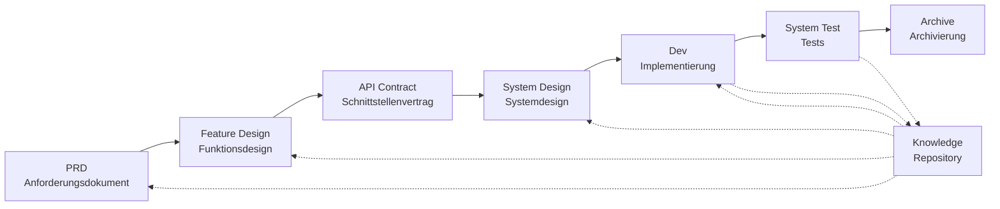

# SpecCrew - KI-gesteuertes Software-Engineering-Framework

<p align="center">
  <a href="./README.md">简体中文</a> |
  <a href="./README.zh-TW.md">繁體中文</a> |
  <a href="./README.en.md">English</a> |
  <a href="./README.ko.md">한국어</a> |
  <a href="./README.de.md">Deutsch</a> |
  <a href="./README.es.md">Español</a> |
  <a href="./README.fr.md">Français</a> |
  <a href="./README.it.md">Italiano</a> |
  <a href="./README.da.md">Dansk</a> |
  <a href="./README.ja.md">日本語</a> |
  <a href="./README.pl.md">Polski</a> |
  <a href="./README.ru.md">Русский</a> |
  <a href="./README.bs.md">Bosanski</a> |
  <a href="./README.ar.md">العربية</a> |
  <a href="./README.no.md">Norsk</a> |
  <a href="./README.pt-BR.md">Português (Brasil)</a> |
  <a href="./README.th.md">ไทย</a> |
  <a href="./README.tr.md">Türkçe</a> |
  <a href="./README.uk.md">Українська</a> |
  <a href="./README.bn.md">বাংলা</a> |
  <a href="./README.el.md">Ελληνικά</a> |
  <a href="./README.vi.md">Tiếng Việt</a>
</p>

<p align="center">
  <a href="https://www.npmjs.com/package/speccrew"></a>
  <a href="https://www.npmjs.com/package/speccrew"></a>
  <a href="https://github.com/charlesmu99/speccrew/blob/main/LICENSE"></a>
</p>

> Ein virtuelles KI-Entwicklungsteam, das schnelle Engineering-Umsetzung für jedes Softwareprojekt ermöglicht

## Was ist SpecCrew?

SpecCrew ist ein eingebettetes virtuelles KI-Entwicklungsteam-Framework. Es verwandelt professionelle Software-Engineering-Workflows (PRD → Feature Design → System Design → Dev → Test) in wiederverwendbare Agent-Workflows und hilft Entwicklungsteams, Specification-Driven Development (SDD) zu erreichen, besonders geeignet für bestehende Projekte.

Durch die Integration von Agents und Skills in bestehende Projekte können Teams schnell Projektdokumentationssysteme und virtuelle Softwareteams initialisieren und neue Funktionen sowie Änderungen nach Standard-Engineering-Workflows schrittweise implementieren.

---

## 8 Kernprobleme gelöst

### 1. KI ignoriert bestehende Projektdokumentation (Wissenslücke)
**Problem**: Bestehende SDD- oder Vibe-Coding-Methoden verlassen sich darauf, dass KI Projekte in Echtzeit zusammenfasst, wodurch kritischer Kontext leicht übersehen wird und Entwicklungsergebnisse von Erwartungen abweichen.

**Lösung**: Das `knowledge/`-Repository dient als "Single Source of Truth" des Projekts und sammelt Architekturdesign, Funktionsmodule und Geschäftsprozesse, um sicherzustellen, dass Anforderungen von der Quelle auf Kurs bleiben.

### 2. Direkte PRD-zu-Technische-Dokumentation (Inhaltsauslassung)
**Problem**: Direktes Springen vom PRD zum detaillierten Design lässt Anforderungsdetails leicht übersehen, wodurch implementierte Funktionen von Anforderungen abweichen.

**Lösung**: Einführung der **Feature Design-Dokument**-Phase, die sich nur auf das Anforderungsgerüst ohne technische Details konzentriert:
- Welche Seiten und Komponenten sind enthalten?
- Seitenoperationsabläufe
- Backend-Verarbeitungslogik
- Datenspeicherstruktur

Die Entwicklung muss nur noch auf Basis des spezifischen Tech-Stacks "Fleisch einfüllen" und sicherstellen, dass Funktionen "nah am Knochen (Anforderungen)" wachsen.

### 3. Unsicherer Agent-Suchbereich (Unsicherheit)
**Problem**: In komplexen Projekten liefern breite KI-Suchen nach Code und Dokumenten unsichere Ergebnisse, was Konsistenz schwierig zu garantieren macht.

**Lösung**: Klare Dokumentverzeichnisstrukturen und Vorlagen, basierend auf den Bedürfnissen jedes Agents, implementieren **progressive Offenlegung und On-Demand-Laden** um Determinismus zu gewährleisten.

### 4. Fehlende Schritte und Aufgaben (Prozessaufbruch)
**Problem**: Fehlende vollständige Engineering-Prozessabdeckung lässt kritische Schritte leicht übersehen, was Qualität schwer garantierbar macht.

**Lösung**: Abdeckung des vollständigen Software-Engineering-Lebenszyklus:
```
PRD (Anforderungen) → Feature Design (Funktionsdesign) → API Contract (Vertrag)
    → System Design (Systemdesign) → Dev (Entwicklung) → Test (Tests)
```
- Jede Phasenausgabe ist die Eingabe der nächsten Phase
- Jeder Schritt erfordert menschliche Bestätigung vor dem Fortfahren
- Alle Agent-Ausführungen haben Todo-Listen mit Selbstüberprüfung nach Abschluss

### 5. Niedrige Team-Zusammenarbeits-Effizienz (Wissens-Silos)
**Problem**: KI-Programmiererfahrung ist schwer teamübergreifend zu teilen, was zu wiederholten Fehlern führt.

**Lösung**: Alle Agents, Skills und zugehörigen Dokumente werden mit Quellcode versionskontrolliert:
- Eine Personen Optimierung wird vom Team geteilt
- Wissen wird in der Codebasis angesammelt
- Verbesserte Team-Zusammenarbeitseffizienz

### 7. Einzelner Agent-Kontext zu lang (Performance-Engpass)
**Problem**: Große komplexe Aufgaben überschreiten Einzel-Agent-Kontextfenster, was Verständnisabweichungen und verminderte Ausgabequalität verursacht.

**Lösung**: **Sub-Agent Auto-Dispatch-Mechanismus**:
- Komplexe Aufgaben werden automatisch erkannt und in Unteraufgaben aufgeteilt
- Jede Unteraufgabe wird von einem unabhängigen Sub-Agent mit isoliertem Kontext ausgeführt
- Parent-Agent koordiniert und aggregiert um Gesamt konsistenz zu gewährleisten
- Vermeidet Einzel-Agent-Kontexterweiterung und gewährleistet Ausgabequalität

### 8. Anforderungsiterationschaos (Verwaltungsschwierigkeit)
**Problem**: Mehrere Anforderungen im selben Branch vermischen sich und beeinflussen sich gegenseitig, was Tracking und Rollback erschwert.

**Lösung**: **Jede Anforderung als unabhängiges Projekt**:
- Jede Anforderung erstellt ein unabhängiges Iterationsverzeichnis `iterations/iXXX-[anforderungs-name]/`
- Vollständige Isolierung: Dokumente, Design, Code und Tests werden unabhängig verwaltet
- Schnelle Iteration: Kleine Granularitätslieferung, schnelle Verifizierung, schnelles Deployment
- Flexibles Archivieren: Nach Abschluss Archivierung in `archive/` mit klarer historischer Rückverfolgbarkeit

### 6. Dokumentaktualisierungsverzögerung (Wissensverfall)
**Problem**: Dokumente werden veraltet wenn Projekte sich weiterentwickeln, was KI mit falschen Informationen arbeiten lässt.

**Lösung**: Agents haben automatische Dokumentaktualisierungsfähigkeiten und synchronisieren Projektänderungen in Echtzeit um die Wissensbasis genau zu halten.

---

## Kernworkflow



### Phasenbeschreibungen

| Phase | Agent | Eingabe | Ausgabe | Menschliche Bestätigung |
|-------|-------|---------|---------|------------------------|
| PRD | PM | Benutzeranforderungen | Produktanforderungsdokument | ✅ Erforderlich |
| Feature Design | Feature Designer | PRD | Feature Design Dokument + API Vertrag | ✅ Erforderlich |
| System Design | System Designer | Feature Spec | Frontend/Backend Design-Dokumente | ✅ Erforderlich |
| Dev | Dev | Design | Code + Aufgabenprotokolle | ✅ Erforderlich |
| System Test | Test Manager | Dev-Ausgabe + Feature Spec | Testfälle + Testcode + Testbericht + Bug-Bericht | ✅ Erforderlich |

---

## Vergleich mit bestehenden Lösungen

| Dimension | Vibe Coding | Ralph Loop | **SpecCrew** |
|-----------|-------------|------------|-------------|
| Dokumentenabhängigkeit | Ignoriert bestehende Docs | Verlässt sich auf AGENTS.md | **Strukturierte Wissensbasis** |
| Anforderungsübergabe | Direktes Codieren | PRD → Code | **PRD → Feature Design → System Design → Code** |
| Menschliche Beteiligung | Minimal | Beim Start | **In jeder Phase** |
| Prozessvollständigkeit | Schwach | Mittel | **Vollständiger Engineering-Workflow** |
| Team-Zusammenarbeit | Schwer zu teilen | Persönliche Effizienz | **Team-Wissensteilung** |
| Kontextverwaltung | Einzelinstanz | Einzelinstanz-Schleife | **Sub-Agent Auto-Dispatch** |
| Iterationsverwaltung | Gemischt | Aufgabenliste | **Anforderung als Projekt, unabhängige Iteration** |
| Determinismus | Niedrig | Mittel | **Hoch (progressive Offenlegung)** |

---

## Schnellstart

### Voraussetzungen

- Node.js >= 16.0.0
- Unterstützte IDEs: Qoder (Standard), Cursor, Claude Code

> **Hinweis**: Die Adapter für Cursor und Claude Code wurden nicht in echten IDE-Umgebungen getestet (auf Code-Ebene implementiert und durch E2E-Tests verifiziert, aber noch nicht in echtem Cursor/Claude Code getestet).

### 1. SpecCrew installieren

```bash
npm install -g speccrew
```

### 2. Projekt initialisieren

Navigieren Sie zu Ihrem Projekt-Stammverzeichnis und führen Sie den Initialisierungsbefehl aus:

```bash
cd /path/to/your-project

# Standardmäßig Qoder verwenden
speccrew init

# Oder IDE angeben
speccrew init --ide qoder
speccrew init --ide cursor
speccrew init --ide claude
```

Nach der Initialisierung werden in Ihrem Projekt generiert:
- `.qoder/agents/` / `.cursor/agents/` / `.claude/agents/` — 7 Agent-Rollendefinitionen
- `.qoder/skills/` / `.cursor/skills/` / `.claude/skills/` — 38 Skill-Workflows
- `speccrew-workspace/` — Workspace (Iterationsverzeichnisse, Wissensbasis, Dokumentvorlagen)
- `.speccrewrc` — SpecCrew-Konfigurationsdatei

Um später Agents und Skills für eine bestimmte IDE zu aktualisieren:

```bash
speccrew update --ide cursor
speccrew update --ide claude
```

### 3. Entwicklungsworkflow starten

Folgen Sie dem Standard-Engineering-Workflow Schritt für Schritt:

1. **PRD**: Product Manager Agent analysiert Anforderungen und generiert Produktanforderungsdokument
2. **Feature Design**: Feature Designer Agent generiert Feature Design Dokument + API Vertrag
3. **System Design**: System Designer Agent generiert System Design Dokumente nach Plattform (Frontend/Backend/Mobile/Desktop)
4. **Dev**: System Developer Agent implementiert Entwicklung nach Plattform parallel
5. **System Test**: Test Manager Agent koordiniert dreiphasiges Testen (Fall-Design → Code-Generierung → Ausführungsbericht)
6. **Archive**: Iteration archivieren

> Die Liefergegenstände jeder Phase erfordern menschliche Bestätigung vor dem Fortfahren zur nächsten Phase.

### 4. SpecCrew Aktualisieren

Wenn SpecCrew eine neue Version veröffentlicht, sind zwei Schritte erforderlich, um das Update abzuschließen:

```bash
# Step 1: 更新全局 CLI 工具到最新版本
npm install -g speccrew@latest

# Step 2: 同步项目中的 Agents 和 Skills 到最新版本
cd /path/to/your-project
speccrew update
```

> **Hinweis**: `npm install -g speccrew@latest` aktualisiert das CLI-Tool selbst, während `speccrew update` die Agent- und Skill-Definitionsdateien im Projekt aktualisiert. Beide Schritte müssen ausgeführt werden, um das vollständige Update abzuschließen.

### 5. Andere CLI-Befehle

```bash
speccrew list       # Installierte Agents und Skills auflisten
speccrew doctor     # Umgebung und Installationsstatus diagnostizieren
speccrew update     # Agents und Skills auf neueste Version aktualisieren
speccrew uninstall  # SpecCrew deinstallieren (--all entfernt auch Workspace)
```

📖 **Detaillierter Leitfaden**: Nach der Installation lesen Sie den [Erste-Schritte-Leitfaden](docs/GETTING-STARTED.de.md) für den vollständigen Workflow und Agent-Konversationsleitfaden.

---

## Verzeichnisstruktur

```
your-project/
├── .qoder/                          # IDE-Konfigurationsverzeichnis (Qoder-Beispiel)
│   ├── agents/                      # 7 Rollen-Agents
│   │   ├── speccrew-team-leader.md       # Teamleiter: Globale Planung und Iterationsverwaltung
│   │   ├── speccrew-product-manager.md   # Produktmanager: Anforderungsanalyse und PRD
│   │   ├── speccrew-feature-designer.md  # Feature Designer: Feature Design + API Vertrag
│   │   ├── speccrew-system-designer.md   # System Designer: System Design nach Plattform
│   │   ├── speccrew-system-developer.md  # System Developer: Parallele Entwicklung nach Plattform
│   │   ├── speccrew-test-manager.md      # Test Manager: Dreiphasige Testkoordination
│   │   └── speccrew-task-worker.md       # Task Worker: Parallele Unteraufgabenausführung
│   └── skills/                      # 38 Skills (nach Funktion gruppiert)
│       ├── speccrew-pm-*/                # Produktmanagement (Anforderungsanalyse, Bewertung)
│       ├── speccrew-fd-*/                # Feature Design (Feature Design, API Vertrag)
│       ├── speccrew-sd-*/                # System Design (Frontend/Backend/Mobile/Desktop)
│       ├── speccrew-dev-*/               # Entwicklung (Frontend/Backend/Mobile/Desktop)
│       ├── speccrew-test-*/              # Testen (Fall-Design/Code-Generierung/Ausführungsbericht)
│       ├── speccrew-knowledge-bizs-*/    # Geschäftswissen (API-Analyse/UI-Analyse/Modulklassifikation usw.)
│       ├── speccrew-knowledge-techs-*/   # Technisches Wissen (Tech-Stack-Generierung/Konventionen/Index usw.)
│       ├── speccrew-knowledge-graph-*/   # Wissensgraph (Lesen/Schreiben/Abfrage)
│       └── speccrew-*/                   # Hilfsprogramme (Diagnose/Zeitstempel/Workflow usw.)
│
└── speccrew-workspace/              # Workspace (bei Initialisierung generiert)
    ├── docs/                        # Verwaltungsdokumente
    │   ├── configs/                 # Konfigurationsdateien (Plattform-Mapping, Tech-Stack-Mapping usw.)
    │   ├── rules/                   # Regelkonfigurationen
    │   └── solutions/               # Lösungsdokumente
    │
    ├── iterations/                  # Iterationsprojekte (dynamisch generiert)
    │   └── {nummer}-{typ}-{name}/
    │       ├── 00.docs/             # Originalanforderungen
    │       ├── 01.product-requirement/ # Produktanforderungen
    │       ├── 02.feature-design/   # Feature Design
    │       ├── 03.system-design/    # System Design
    │       ├── 04.development/      # Entwicklungsphase
    │       ├── 05.system-test/      # Systemtest
    │       └── 06.delivery/         # Lieferphase
    │
    ├── iteration-archives/          # Iterationsarchive
    │
    └── knowledges/                  # Wissensbasis
        ├── base/                    # Basis/Metadaten
        │   ├── diagnosis-reports/   # Diagnoseberichte
        │   ├── sync-state/          # Sync-Status
        │   └── tech-debts/          # Technische Schulden
        ├── bizs/                    # Geschäftswissen
        │   └── {platform-type}/{module-name}/
        └── techs/                   # Technisches Wissen
            └── {platform-id}/
```

---

## Kern-Design-Prinzipien

1. **Specification-Driven**: Spezifikationen zuerst schreiben, dann Code daraus "wachsen" lassen
2. **Progressive Disclosure**: Agents beginnen von minimalen Einstiegspunkten und laden Informationen bei Bedarf
3. **Menschliche Bestätigung**: Jede Phasenausgabe erfordert menschliche Bestätigung um KI-Abweichung zu verhindern
4. **Kontext-Isolation**: Große Aufgaben werden in kleine, kontext-isolierte Unteraufgaben aufgeteilt
5. **Sub-Agent-Zusammenarbeit**: Komplexe Aufgaben dispatchen automatisch Sub-Agents um Einzel-Agent-Kontexterweiterung zu vermeiden
6. **Schnelle Iteration**: Jede Anforderung als unabhängiges Projekt für schnelle Lieferung und Verifizierung
7. **Wissensteilung**: Alle Konfigurationen werden mit Quellcode versionskontrolliert

---

## Anwendungsfälle

### ✅ Empfohlen für
- Mittelgroße bis große Projekte, die standardisierte Workflows erfordern
- Team-Zusammenarbeit Softwareentwicklung
| Legacy-Projekt Engineering-Transformation
- Produkte, die langfristige Wartung erfordern

### ❌ Nicht geeignet für
- Persönliche schnelle Prototyp-Validierung
- Explorative Projekte mit sehr unsicheren Anforderungen
| Einweg-Skripte oder Werkzeuge

---

## Weitere Informationen

- **Agent Wissenskarte**: [speccrew-workspace/docs/agent-knowledge-map.md](./speccrew-workspace/docs/agent-knowledge-map.md)
- **npm**: https://www.npmjs.com/package/speccrew
- **GitHub**: https://github.com/charlesmu99/speccrew
- **Gitee**: https://gitee.com/amutek/speccrew
- **Qoder IDE**: https://qoder.com/

---

> **SpecCrew ersetzt nicht Entwickler, sondern automatisiert die langweiligen Teile, damit Teams sich auf wertvollere Arbeit konzentrieren können.**
