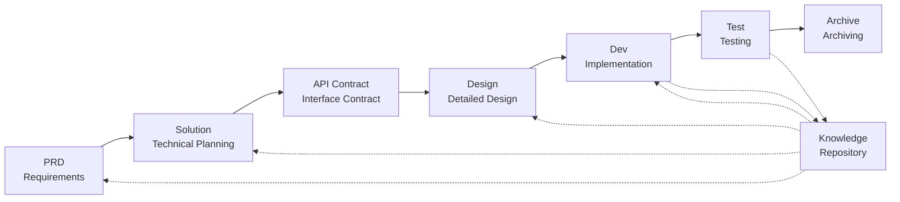

# DevCrew - AI-Driven Software Engineering Framework

<p align="center">
  <a href="./README.md">中文</a> |
  <a href="./README.en.md">English</a> |
  <a href="./README.ar.md">العربية</a> |
  <a href="./README.es.md">Español</a>
</p>

> A virtual AI development team that enables rapid engineering implementation for any software project

## What is DevCrew?

DevCrew is an embedded virtual AI development team framework built on [Qoder](https://qoder.com/). It transforms professional software engineering workflows (PRD ‚Ü?Solution ‚Ü?Design ‚Ü?Dev ‚Ü?Test) into reusable Agent workflows, helping development teams achieve Specification-Driven Development (SDD).

By integrating Agents and Skills into existing projects via CLI or copy, teams can quickly initialize project documentation systems and virtual software teams, implementing new features and modifications following standard engineering workflows.

---

## 8 Core Problems Solved

### 1. AI Ignores Existing Project Documentation (Knowledge Gap)
**Problem**: Existing SDD or Vibe Coding methods rely on AI to summarize projects in real-time, easily missing critical context and causing development results to deviate from expectations.

**Solution**: The `knowledge/` repository serves as the project's "single source of truth,"沉淀 architecture design, functional modules, and business processes to ensure requirements stay on track from the source.

### 2. Direct PRD-to-Technical Documentation (Content Omission)
**Problem**: Jumping directly from PRD to detailed design easily misses requirement details, causing implemented features to deviate from requirements.

**Solution**: Introduce the **Solution document** phase, focusing only on the requirement skeleton without technical details:
- What pages and components are included
- Page operation flows
- Backend processing logic
- Data storage structure

Development only needs to "fill in the flesh" based on the specific tech stack, ensuring features grow "close to the bone (requirements)."

### 3. Uncertain Agent Search Scope (Uncertainty)
**Problem**: In complex projects, AI's broad search of code and documents yields uncertain results, making consistency difficult to guarantee.

**Solution**: Clear document directory structures and templates, designed based on each Agent's needs, implementing **progressive disclosure and on-demand loading** to ensure determinism.

### 4. Missing Steps and Tasks (Process Breakdown)
**Problem**: Lack of complete engineering process coverage easily misses critical steps, making quality difficult to guarantee.

**Solution**: Cover the full software engineering lifecycle:
```
PRD (Requirements) ‚Ü?Solution (Planning) ‚Ü?API Contract
    ‚Ü?Design ‚Ü?Dev (Development) ‚Ü?Test (Testing)
```
- Each phase's output is the next phase's input
- Each step requires human confirmation before proceeding
- All Agent executions have todo lists with self-check after completion

### 5. Low Team Collaboration Efficiency (Knowledge Silos)
**Problem**: AI programming experience is difficult to share across teams, leading to repeated mistakes.

**Solution**: All Agents, Skills, and related documents are version-controlled with source code:
- One person's optimization, shared by the team
- Knowledge沉淀 in the codebase
- Improved team collaboration efficiency

### 7. Single Agent Context Too Long (Performance Bottleneck)
**Problem**: Large complex tasks exceed single Agent context windows, causing understanding偏差 and decreased output quality.

**Solution**: **Sub-Agent Auto-Dispatch Mechanism**:
- Complex tasks are automatically identified and split into subtasks
- Each subtask is executed by an independent sub-Agent with isolated context
- Parent Agent coordinates and aggregates to ensure overall consistency
- Avoids single Agent context膨胀, ensuring output quality

### 8. Requirement Iteration Chaos (Management Difficulty)
**Problem**: Multiple requirements mixed in the same branch affect each other, making tracking and rollback difficult.

**Solution**: **Each Requirement as an Independent Project**:
- Each requirement creates an independent iteration directory `projects/pXXX-[requirement-name]/`
- Complete isolation: documents, design, code, and tests managed independently
- Rapid iteration: small granularity delivery, rapid verification, rapid deployment
- Flexible archiving: after completion, archive to `archive/` with clear historical traceability

### 6. Document Update Lag (Knowledge Decay)
**Problem**: Documents become outdated as projects evolve, causing AI to work with incorrect information.

**Solution**: Agents have automatic document update capabilities, synchronizing project changes in real-time to keep the knowledge base accurate.

---

## Core Workflow



### Phase Descriptions

| Phase | Agent | Input | Output | Human Confirmation |
|-------|-------|-------|--------|-------------------|
| PRD | PM | User Requirements | Product Requirements Document | ‚ú?Required |
| Solution | Planner | PRD | Technical Solution + API Contract | ‚ú?Required |
| Design | Designer | Solution | Frontend/Backend Design Documents | ‚ú?Required |
| Dev | Dev | Design | Code + Task Records | ‚ú?Required |
| Test | Test | Dev Output + PRD Acceptance Criteria | Test Report | ‚ú?Required |

---

## Comparison with Existing Solutions

| Dimension | Vibe Coding | Ralph Loop | **DevCrew** |
|-----------|-------------|------------|-------------|
| Document Dependency | Ignores existing docs | Relies on AGENTS.md | **Structured Knowledge Base** |
| Requirement Transfer | Direct coding | PRD ‚Ü?Code | **PRD ‚Ü?Solution ‚Ü?Design ‚Ü?Code** |
| Human Involvement | Minimal | At startup | **At every phase** |
| Process Completeness | Weak | Medium | **Complete engineering workflow** |
| Team Collaboration | Hard to share | Personal efficiency | **Team knowledge sharing** |
| Context Management | Single instance | Single instance loop | **Sub-Agent auto-dispatch** |
| Iteration Management | Mixed | Task list | **Requirement as project, independent iteration** |
| Determinism | Low | Medium | **High (progressive disclosure)** |

---

## Quick Start

### 1. Install DevCrew

**Method 1: One-click Install Script (Recommended)**

```bash
# macOS / Linux / WSL - Install from GitHub
curl -fsSL https://raw.githubusercontent.com/charlesmu99/devcrew/main/install.sh | bash

# macOS / Linux / WSL - Install from Gitee (China Mirror)
curl -fsSL https://gitee.com/amutek/devcrew/raw/main/install.sh | bash
```

```powershell
# Windows - Install from GitHub
Invoke-Expression (Invoke-WebRequest -Uri "https://raw.githubusercontent.com/charlesmu99/devcrew/main/install.ps1").Content

# Windows - Install from Gitee (China Mirror)
Invoke-Expression (Invoke-WebRequest -Uri "https://gitee.com/amutek/devcrew/raw/main/install.ps1").Content
```

**Method 2: Manual Copy**

```bash
# Clone repository and copy to existing project
git clone https://github.com/charlesmu99/devcrew.git
# or: git clone https://gitee.com/amutek/devcrew.git

cp -r devcrew/.qoder devcrew/devcrew-workspace /path/to/your-project/
```

### 2. Initialize Project

```bash
# Run initialization Skill to automatically generate knowledge base and project structure
# Executed automatically by devcrew-project-init Skill
```

### 3. Start Development Workflow

```bash
# 1. Create PRD
# 2. Generate Solution
# 3. Confirm API Contract
# 4. Detailed Design
# 5. Development Implementation
# 6. Testing
```

---

## Directory Structure

```
your-project/
├── .qoder/                          # DevCrew configuration (runtime)
‚î?  ‚îú‚îÄ‚îÄ agents/                      # 6 role Agents
‚î?  ‚îî‚îÄ‚îÄ skills/                      # 16 Skills
‚î?
└── devcrew-workspace/              # Workspace (generated during initialization)
    ├── docs/                        # Management documents
    ‚î?  ‚îî‚îÄ‚îÄ agent-knowledge-map.md   # Agent knowledge map
    ├── knowledge/                   # Project knowledge base (dynamically generated)
    ‚î?  ‚îú‚îÄ‚îÄ README.md
    ‚î?  ‚îú‚îÄ‚îÄ constitution.md
    ‚î?  ‚îú‚îÄ‚îÄ architecture/
    ‚î?  ‚îú‚îÄ‚îÄ bizs/
    ‚î?  ‚îî‚îÄ‚îÄ domain/
    └── projects/                    # Iteration projects (dynamically generated)
        ├── p001-user-auth/          # Requirement as project, independent iteration
        └── archive/                 # Completed iteration archiving
```

---

## Core Design Principles

1. **Specification-Driven**: Write specifications first, then let code "grow" from them
2. **Progressive Disclosure**: Agents start from minimal entry points, loading information on demand
3. **Human Confirmation**: Each phase's output requires human confirmation to prevent AI deviation
4. **Context Isolation**: Large tasks are split into small, context-isolated subtasks
5. **Sub-Agent Collaboration**: Complex tasks automatically dispatch sub-Agents to avoid single Agent context膨胀
6. **Rapid Iteration**: Each requirement as an independent project for rapid delivery and verification
7. **Knowledge Sharing**: All configurations are version-controlled with source code

---

## Use Cases

### ‚ú?Recommended For
- Medium to large projects requiring standardized workflows
- Team collaboration software development
- Legacy project engineering transformation
- Products requiring long-term maintenance

### ‚ù?Not Suitable For
- Personal rapid prototype validation
- Exploratory projects with highly uncertain requirements
- One-off scripts or tools

---

## More Information

- **Agent Knowledge Map**: [devcrew-workspace/docs/agent-knowledge-map.md](./devcrew-workspace/docs/agent-knowledge-map.md)
- **GitHub**: https://github.com/charlesmu99/devcrew
- **Gitee**: https://gitee.com/amutek/devcrew
- **Qoder IDE**: https://qoder.com/

---

> **DevCrew is not about replacing developers, but automating the tedious parts so teams can focus on more valuable work.**

---


