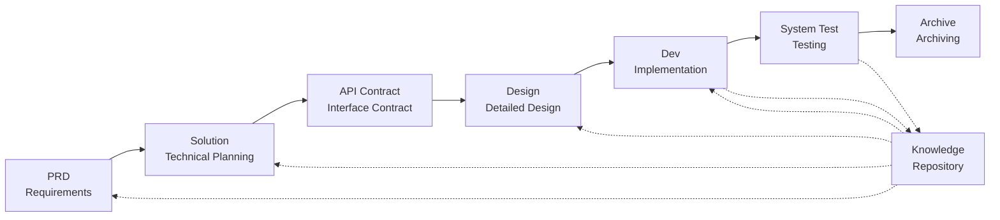

# SpecCrew - AI-Driven Software Engineering Framework

<p align="center">
  <a href="./README.md">简体中文</a> |
  <a href="./README.zh-TW.md">繁體中文</a> |
  <a href="./README.en.md">English</a> |
  <a href="./README.ko.md">한국어</a> |
  <a href="./README.de.md">Deutsch</a> |
  <a href="./README.es.md">Español</a> |
  <a href="./README.fr.md">Français</a> |
  <a href="./README.it.md">Italiano</a> |
  <a href="./README.da.md">Dansk</a> |
  <a href="./README.ja.md">日本語</a> |
  <a href="./README.pl.md">Polski</a> |
  <a href="./README.ru.md">Русский</a> |
  <a href="./README.bs.md">Bosanski</a> |
  <a href="./README.ar.md">العربية</a> |
  <a href="./README.no.md">Norsk</a> |
  <a href="./README.pt-BR.md">Português (Brasil)</a> |
  <a href="./README.th.md">ไทย</a> |
  <a href="./README.tr.md">Türkçe</a> |
  <a href="./README.uk.md">Українська</a> |
  <a href="./README.bn.md">বাংলা</a> |
  <a href="./README.el.md">Ελληνικά</a> |
  <a href="./README.vi.md">Tiếng Việt</a>
</p>

<p align="center">
  <a href="https://www.npmjs.com/package/speccrew"></a>
  <a href="https://www.npmjs.com/package/speccrew"></a>
  <a href="https://github.com/charlesmu99/speccrew/blob/main/LICENSE"></a>
</p>

> A virtual AI development team that enables rapid engineering implementation for any software project

## What is SpecCrew?

SpecCrew is an embedded virtual AI development team framework. It transforms professional software engineering workflows (PRD → Feature Design → System Design → Dev → Test) into reusable Agent workflows, helping development teams achieve Specification-Driven Development (SDD), especially suitable for existing projects.

By integrating Agents and Skills into existing projects, teams can quickly initialize project documentation systems and virtual software teams, implementing new features and modifications following standard engineering workflows.

---

## ✨ Key Highlights

### 🏭 Virtual Software Team
One-click generation of **7 professional Agent roles** + **30+ Skill workflows**, building a complete virtual software team:
- **Team Leader** - Global scheduling and iteration management
- **Product Manager** - Requirements analysis and PRD output
- **Feature Designer** - Feature design + API contracts
- **System Designer** - Frontend/Backend/Mobile/Desktop system design
- **System Developer** - Multi-platform parallel development
- **Test Manager** - Three-phase test coordination
- **Task Worker** - Parallel sub-task execution

### 📐 ISA-95 Six-Stage Modeling
Based on international **ISA-95** modeling methodology, standardizing the transformation from business requirements to software systems:
```
Domain Descriptions → Functions in Domains → Functions of Interest
     ↓                       ↓                      ↓
Information Flows → Categories of Information → Information Descriptions
```
- Each stage corresponds to specific UML diagrams (use case, sequence, class diagrams)
- Business requirements are "refined step by step" with no information loss
- Outputs are directly usable for development

### 📚 Knowledge Base System
Three-tier knowledge base architecture ensuring AI always works based on the "single source of truth":

| Layer | Directory | Content | Purpose |
|-------|-----------|---------|----------|
| L1 System Knowledge | `knowledge/techs/` | Tech stack, architecture, conventions | AI understands project technical boundaries |
| L2 Business Knowledge | `knowledge/bizs/` | Module features, business flows, entities | AI understands business logic |
| L3 Iteration Artifacts | `iterations/iXXX/` | PRD, design docs, test reports | Complete traceability chain for current requirements |

### 🔄 Four-Stage Knowledge Pipeline
**Automated knowledge generation architecture**, auto-generating business/technical documentation from source code:
```
Stage 1: Scan source code → Generate module list
Stage 2: Parallel analysis → Extract features (multi-Worker parallel)
Stage 3: Parallel summarization → Complete module overviews (multi-Worker parallel)
Stage 4: System aggregation → Generate system panorama
```
- Supports **full sync** and **incremental sync** (based on Git diff)
- One person optimizes, team shares

### 🔧 Harness Execution Framework
**Standardized execution framework** ensuring design documents are accurately transformed into executable development instructions:
- **SOP Principle**: Skills as standard operating procedures—clear, continuous, self-contained steps
- **Input/Output Contracts**: Well-defined interfaces for rigorous, pseudocode-like execution
- **Progressive Disclosure**: Layered information architecture preventing context overload
- **Sub-Agent Dispatch**: Automatic task decomposition with parallel execution for quality assurance

---

## 8 Core Problems Solved

### 1. AI Ignores Existing Project Documentation (Knowledge Gap)
**Problem**: Existing SDD or Vibe Coding methods rely on AI to summarize projects in real-time, easily missing critical context and causing development results to deviate from expectations.

**Solution**: The `knowledge/` repository serves as the project's "single source of truth," accumulating architecture design, functional modules, and business processes to ensure requirements stay on track from the source.

### 2. Direct PRD-to-Technical Documentation (Content Omission)
**Problem**: Jumping directly from PRD to detailed design easily misses requirement details, causing implemented features to deviate from requirements.

**Solution**: Introduce the **Solution document** phase, focusing only on the requirement skeleton without technical details:
- What pages and components are included
- Page operation flows
- Backend processing logic
- Data storage structure

Development only needs to "fill in the flesh" based on the specific tech stack, ensuring features grow "close to the bone (requirements)."

### 3. Uncertain Agent Search Scope (Uncertainty)
**Problem**: In complex projects, AI's broad search of code and documents yields uncertain results, making consistency difficult to guarantee.

**Solution**: Clear document directory structures and templates, designed based on each Agent's needs, implementing **progressive disclosure and on-demand loading** to ensure determinism.

### 4. Missing Steps and Tasks (Process Breakdown)
**Problem**: Lack of complete engineering process coverage easily misses critical steps, making quality difficult to guarantee.

**Solution**: Cover the full software engineering lifecycle:
```
PRD (Requirements) → Solution (Planning) → API Contract
    → Design → Dev (Development) → Test (Testing)
```
- Each phase's output is the next phase's input
- Each step requires human confirmation before proceeding
- All Agent executions have todo lists with self-check after completion

### 5. Low Team Collaboration Efficiency (Knowledge Silos)
**Problem**: AI programming experience is difficult to share across teams, leading to repeated mistakes.

**Solution**: All Agents, Skills, and related documents are version-controlled with source code:
- One person's optimization, shared by the team
- Knowledge accumulated in the codebase
- Improved team collaboration efficiency

### 7. Single Agent Context Too Long (Performance Bottleneck)
**Problem**: Large complex tasks exceed single Agent context windows, causing understanding deviation and decreased output quality.

**Solution**: **Sub-Agent Auto-Dispatch Mechanism**:
- Complex tasks are automatically identified and split into subtasks
- Each subtask is executed by an independent sub-Agent with isolated context
- Parent Agent coordinates and aggregates to ensure overall consistency
- Avoids single Agent context expansion, ensuring output quality

### 8. Requirement Iteration Chaos (Management Difficulty)
**Problem**: Multiple requirements mixed in the same branch affect each other, making tracking and rollback difficult.

**Solution**: **Each Requirement as an Independent Project**:
- Each requirement creates an independent iteration directory `iterations/iXXX-[requirement-name]/`
- Complete isolation: documents, design, code, and tests managed independently
- Rapid iteration: small granularity delivery, rapid verification, rapid deployment
- Flexible archiving: after completion, archive to `archive/` with clear historical traceability

### 6. Document Update Lag (Knowledge Decay)
**Problem**: Documents become outdated as projects evolve, causing AI to work with incorrect information.

**Solution**: Agents have automatic document update capabilities, synchronizing project changes in real-time to keep the knowledge base accurate.

---

## Core Workflow



### Phase Descriptions

| Phase | Agent | Input | Output | Human Confirmation |
|-------|-------|-------|--------|-------------------|
| PRD | PM | User Requirements | Product Requirements Document | ✅ Required |
| Solution | Planner | PRD | Technical Solution + API Contract | ✅ Required |
| Design | Designer | Solution | Frontend/Backend Design Documents | ✅ Required |
| Dev | Dev | Design | Code + Task Records | ✅ Required |
| System Test | Test Manager | Dev Output + Feature Spec | Test Cases + Test Code + Test Report + Bug Report | ✅ Required |

---

## Comparison with Existing Solutions

| Dimension | Vibe Coding | Ralph Loop | **SpecCrew** |
|-----------|-------------|------------|-------------|
| Document Dependency | Ignores existing docs | Relies on AGENTS.md | **Structured Knowledge Base** |
| Requirement Transfer | Direct coding | PRD → Code | **PRD → Feature Design → System Design → Code** |
| Human Involvement | Minimal | At startup | **At every phase** |
| Process Completeness | Weak | Medium | **Complete engineering workflow** |
| Team Collaboration | Hard to share | Personal efficiency | **Team knowledge sharing** |
| Context Management | Single instance | Single instance loop | **Sub-Agent auto-dispatch** |
| Iteration Management | Mixed | Task list | **Requirement as project, independent iteration** |
| Determinism | Low | Medium | **High (progressive disclosure)** |

---

## Quick Start

### Prerequisites

- Node.js >= 16.0.0
- Supported IDEs: Qoder (default), Cursor, Claude Code

> **Note**: The adapters for Cursor and Claude Code have not been tested in actual IDE environments (implemented at the code level and verified through E2E tests, but not yet tested in real Cursor/Claude Code).

### 1. Install SpecCrew

```bash
npm install -g speccrew
```

### 2. Initialize Project

Navigate to your project root directory and run the initialization command:

```bash
cd /path/to/your-project

# Default uses Qoder
speccrew init

# Or specify IDE
speccrew init --ide qoder
speccrew init --ide cursor
speccrew init --ide claude
```

After initialization, the following will be generated in your project:
- `.qoder/agents/` / `.cursor/agents/` / `.claude/agents/` — 7 Agent role definitions
- `.qoder/skills/` / `.cursor/skills/` / `.claude/skills/` — 30+ Skill workflows
- `speccrew-workspace/` — Workspace (iteration directories, knowledge base, document templates)
- `.speccrewrc` — SpecCrew configuration file

To update Agents and Skills for a specific IDE later:

```bash
speccrew update --ide cursor
speccrew update --ide claude
```

### 3. Start Development Workflow

Follow the standard engineering workflow step by step:

1. **PRD**: Product Manager Agent analyzes requirements and generates product requirements document
2. **Feature Design**: Feature Designer Agent generates feature design document + API contract
3. **System Design**: System Designer Agent generates system design documents by platform (frontend/backend/mobile/desktop)
4. **Dev**: System Developer Agent implements development by platform in parallel
5. **System Test**: Test Manager Agent coordinates three-phase testing (case design → code generation → execution report)
6. **Archive**: Archive iteration

> Each phase's deliverables require human confirmation before proceeding to the next phase.

### 4. Update SpecCrew

When a new version of SpecCrew is released, complete the update in two steps:

```bash
# Step 1: Update the global CLI tool to the latest version
npm install -g speccrew@latest

# Step 2: Sync Agents and Skills in your project to the latest version
cd /path/to/your-project
speccrew update
```

> **Note**: `npm install -g speccrew@latest` updates the CLI tool itself, while `speccrew update` updates the Agent and Skill definition files in your project. Both steps are required for a complete update.

### 5. Other CLI Commands

```bash
speccrew list       # List installed agents and skills
speccrew doctor     # Diagnose environment and installation status
speccrew update     # Update agents and skills to latest version
speccrew uninstall  # Uninstall SpecCrew (--all also removes workspace)
```

📖 **Detailed Guide**: After installation, check the [Getting Started Guide](docs/GETTING-STARTED.en.md) for the complete workflow and agent conversation guide.

---

## Directory Structure

```
your-project/
├── .qoder/                          # IDE configuration directory (Qoder example)
│   ├── agents/                      # 7 role Agents
│   │   ├── speccrew-team-leader.md       # Team Leader: Global scheduling and iteration management
│   │   ├── speccrew-product-manager.md   # Product Manager: Requirements analysis and PRD
│   │   ├── speccrew-feature-designer.md  # Feature Designer: Feature Design + API Contract
│   │   ├── speccrew-system-designer.md   # System Designer: System design by platform
│   │   ├── speccrew-system-developer.md  # System Developer: Parallel development by platform
│   │   ├── speccrew-test-manager.md      # Test Manager: Three-phase testing coordination
│   │   └── speccrew-task-worker.md       # Task Worker: Parallel subtask execution
│   └── skills/                      # 38 Skills (grouped by function)
│       ├── speccrew-pm-*/                # Product Management (requirements analysis, evaluation)
│       ├── speccrew-fd-*/                # Feature Design (Feature Design, API Contract)
│       ├── speccrew-sd-*/                # System Design (frontend/backend/mobile/desktop)
│       ├── speccrew-dev-*/               # Development (frontend/backend/mobile/desktop)
│       ├── speccrew-test-*/              # Testing (case design/code generation/execution report)
│       ├── speccrew-knowledge-bizs-*/    # Business Knowledge (API analysis/UI analysis/module classification, etc.)
│       ├── speccrew-knowledge-techs-*/   # Technical Knowledge (tech stack generation/conventions/index, etc.)
│       ├── speccrew-knowledge-graph-*/   # Knowledge Graph (read/write/query)
│       └── speccrew-*/                   # Utilities (diagnostics/timestamps/workflow, etc.)
│
└── speccrew-workspace/              # Workspace (generated during initialization)
    ├── docs/                        # Management documents
    │   ├── configs/                 # Configuration files (platform mapping, tech stack mapping, etc.)
    │   ├── rules/                   # Rule configurations
    │   └── solutions/               # Solution documents
    │
    ├── iterations/                  # Iteration projects (dynamically generated)
    │   └── {number}-{type}-{name}/
    │       ├── 00.docs/             # Original requirements
    │       ├── 01.product-requirement/ # Product requirements
    │       ├── 02.feature-design/   # Feature design
    │       ├── 03.system-design/    # System design
    │       ├── 04.development/      # Development phase
    │       ├── 05.system-test/      # System testing
    │       └── 06.delivery/         # Delivery phase
    │
    ├── iteration-archives/          # Iteration archives
    │
    └── knowledges/                  # Knowledge base
        ├── base/                    # Base/metadata
        │   ├── diagnosis-reports/   # Diagnosis reports
        │   ├── sync-state/          # Sync state
        │   └── tech-debts/          # Technical debts
        ├── bizs/                    # Business knowledge
        │   └── {platform-type}/{module-name}/
        └── techs/                   # Technical knowledge
            └── {platform-id}/
```

---

## Core Design Principles

1. **Specification-Driven**: Write specifications first, then let code "grow" from them
2. **Progressive Disclosure**: Agents start from minimal entry points, loading information on demand
3. **Human Confirmation**: Each phase's output requires human confirmation to prevent AI deviation
4. **Context Isolation**: Large tasks are split into small, context-isolated subtasks
5. **Sub-Agent Collaboration**: Complex tasks automatically dispatch sub-Agents to avoid single Agent context expansion
6. **Rapid Iteration**: Each requirement as an independent project for rapid delivery and verification
7. **Knowledge Sharing**: All configurations are version-controlled with source code

---

## Use Cases

### ✅ Recommended For
- Medium to large projects requiring standardized workflows
- Team collaboration software development
- Legacy project engineering transformation
- Products requiring long-term maintenance

### ❌ Not Suitable For
- Personal rapid prototype validation
- Exploratory projects with highly uncertain requirements
- One-off scripts or tools

---

## More Information

- **Agent Knowledge Map**: [speccrew-workspace/docs/agent-knowledge-map.md](./speccrew-workspace/docs/agent-knowledge-map.md)
- **npm**: https://www.npmjs.com/package/speccrew
- **GitHub**: https://github.com/charlesmu99/speccrew
- **Gitee**: https://gitee.com/amutek/speccrew
- **Qoder IDE**: https://qoder.com/

---

> **SpecCrew is not about replacing developers, but automating the tedious parts so teams can focus on more valuable work.**

---


