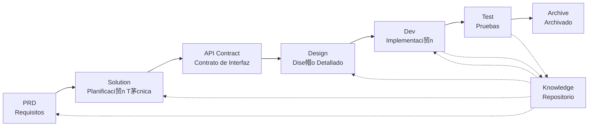

# DevCrew - Framework de Ingenier铆a de Software Impulsado por IA

<p align="center">
  <a href="./README.md">涓����</a> |
  <a href="./README.en.md">English</a> |
  <a href="./README.ar.md">丕��毓乇亘��丞</a> |
  <a href="./README.es.md">Espa帽ol</a>
</p>

> Un equipo de desarrollo virtual de IA que permite la implementaci贸n de ingenier铆a r谩pida para cualquier proyecto de software

## 驴Qu茅 es DevCrew?

DevCrew es un framework de equipo de desarrollo virtual de IA integrado, construido sobre [Qoder](https://qoder.com/). Transforma flujos de trabajo profesionales de ingenier铆a de software (PRD ��?Solution ��?Design ��?Dev ��?Test) en flujos de trabajo de Agentes reutilizables, ayudando a los equipos de desarrollo a lograr el Desarrollo Impulsado por Especificaciones (SDD).

Al integrar Agentes y Skills en proyectos existentes mediante CLI o copia, los equipos pueden inicializar r谩pidamente sistemas de documentaci贸n de proyectos y equipos de software virtuales, implementando nuevas funciones y modificaciones siguiendo flujos de trabajo de ingenier铆a est谩ndar.

---

## 8 Problemas Principales Resueltos

### 1. La IA Ignora la Documentaci贸n Existente del Proyecto (Brecha de Conocimiento)
**Problema**: Los m茅todos existentes de SDD o Vibe Coding dependen de que la IA resuma los proyectos en tiempo real, lo que f谩cilmente omite contexto cr铆tico y causa que los resultados del desarrollo se desv铆en de las expectativas.

**Soluci贸n**: El repositorio `knowledge/` sirve como la "煤nica fuente de verdad" del proyecto, acumulando dise帽o de arquitectura, m贸dulos funcionales y procesos de negocio para asegurar que los requisitos se mantengan en el camino correcto desde la fuente.

### 2. PRD Directo a Documentaci贸n T茅cnica (Omisi贸n de Contenido)
**Problema**: Saltar directamente del PRD al dise帽o detallado omite f谩cilmente detalles de los requisitos, causando que las funciones implementadas se desv铆en de los requisitos.

**Soluci贸n**: Introducir la fase de **documento Solution**, enfoc谩ndose solo en el esqueleto de requisitos sin detalles t茅cnicos:
- Qu茅 p谩ginas y componentes est谩n incluidos
- Flujos de operaci贸n de p谩ginas
- L贸gica de procesamiento backend
- Estructura de almacenamiento de datos

El desarrollo solo necesita "llenar la carne" bas谩ndose en el stack t茅cnico espec铆fico, asegurando que las funciones crezcan "cerca del hueso (requisitos)."

### 3. Alcance de B煤squeda Incierto del Agente (Incertidumbre)
**Problema**: En proyectos complejos, la b煤squeda amplia de la IA en c贸digo y documentos produce resultados inciertos, haciendo dif铆cil garantizar la consistencia.

**Soluci贸n**: Estructuras claras de directorios de documentos y plantillas, dise帽adas bas谩ndose en las necesidades de cada Agente, implementando **revelaci贸n progresiva y carga bajo demanda** para asegurar determinismo.

### 4. Pasos y Tareas Faltantes (Ruptura de Proceso)
**Problema**: La falta de cobertura completa del flujo de trabajo de ingenier铆a omite f谩cilmente pasos cr铆ticos, haciendo dif铆cil garantizar la calidad.

**Soluci贸n**: Cubrir el ciclo de vida completo de ingenier铆a de software:
```
PRD (Requisitos) ��?Solution (Planificaci贸n) ��?API Contract
    ��?Design ��?Dev (Desarrollo) ��?Test (Pruebas)
```
- La salida de cada fase es la entrada de la siguiente fase
- Cada paso requiere confirmaci贸n humana antes de proceder
- Todas las ejecuciones de Agentes tienen listas de tareas con autoverificaci贸n despu茅s de la finalizaci贸n

### 5. Baja Eficiencia de Colaboraci贸n del Equipo (Silos de Conocimiento)
**Problema**: La experiencia de programaci贸n con IA es dif铆cil de compartir entre equipos, llevando a errores repetidos.

**Soluci贸n**: Todos los Agentes, Skills y documentos relacionados est谩n bajo control de versi贸n con el c贸digo fuente:
- Optimizaci贸n de una persona, compartida por el equipo
- Acumulaci贸n de conocimiento en la base de c贸digo
- Mejora de la eficiencia de colaboraci贸n del equipo

### 7. Contexto de Agente ��nico Demasiado Largo (Cuello de Botella de Rendimiento)
**Problema**: Las tareas grandes y complejas exceden las ventanas de contexto de un solo Agente, causando desviaci贸n en la comprensi贸n y disminuci贸n de la calidad de salida.

**Soluci贸n**: **Mecanismo de Despacho Autom谩tico de Sub-Agentes**:
- Las tareas complejas se identifican y dividen autom谩ticamente en subtareas
- Cada subtarea es ejecutada por un Sub-Agente independiente con contexto aislado
- El Agente padre coordina y agrega para asegurar la consistencia general
- Evita la inflaci贸n del contexto de un solo Agente, asegurando la calidad de salida

### 8. Caos de Iteraci贸n de Requisitos (Dificultad de Gesti贸n)
**Problema**: M煤ltiples requisitos mezclados en la misma rama se afectan entre s铆, haciendo dif铆cil el seguimiento y la reversi贸n.

**Soluci贸n**: **Cada Requisito como Proyecto Independiente**:
- Cada requisito crea un directorio de iteraci贸n independiente `projects/pXXX-[nombre-requisito]/`
- Aislamiento completo: documentos, dise帽o, c贸digo y pruebas gestionados independientemente
- Iteraci贸n r谩pida: entrega de peque帽a granularidad, verificaci贸n r谩pida, despliegue r谩pido
- Archivado flexible: despu茅s de la finalizaci贸n, archivado a `archive/` con trazabilidad hist贸rica clara

### 6. Retraso en Actualizaci贸n de Documentos (Decadencia del Conocimiento)
**Problema**: Los documentos se vuelven obsoletos a medida que evolucionan los proyectos, causando que la IA trabaje con informaci贸n incorrecta.

**Soluci贸n**: Los Agentes tienen capacidades de actualizaci贸n autom谩tica de documentos, sincronizando los cambios del proyecto en tiempo real para mantener la precisi贸n de la base de conocimiento.

---

## Flujo de Trabajo Principal



### Descripciones de Fases

| Fase | Agente | Entrada | Salida | Confirmaci贸n Humana |
|------|--------|---------|--------|---------------------|
| PRD | PM | Requisitos del Usuario | Documento de Requisitos del Producto | ��?Requerido |
| Solution | Planner | PRD | Soluci贸n T茅cnica + Contrato API | ��?Requerido |
| Design | Designer | Solution | Documentos de Dise帽o Frontend/Backend | ��?Requerido |
| Dev | Dev | Design | C贸digo + Registros de Tareas | ��?Requerido |
| Test | Test | Salida Dev + Criterios de Aceptaci贸n PRD | Reporte de Pruebas | ��?Requerido |

---

## Comparaci贸n con Soluciones Existentes

| Dimensi贸n | Vibe Coding | Ralph Loop | **DevCrew** |
|-----------|-------------|------------|-------------|
| Dependencia de Documentos | Ignora documentos existentes | Depende de AGENTS.md | **Base de conocimiento estructurada** |
| Transferencia de Requisitos | Codificaci贸n directa | PRD ��?Code | **PRD ��?Solution ��?Design ��?Code** |
| Participaci贸n Humana | M铆nima | Al inicio | **En cada fase** |
| Completitud del Proceso | D茅bil | Media | **Flujo de trabajo de ingenier铆a completo** |
| Colaboraci贸n en Equipo | Dif铆cil de compartir | Eficiencia personal | **Compartir conocimiento en equipo** |
| Gesti贸n de Contexto | Instancia 煤nica | Bucle de instancia 煤nica | **Despacho autom谩tico de sub-agentes** |
| Gesti贸n de Iteraci贸n | Mezclada | Lista de tareas | **Requisito como proyecto, iteraci贸n independiente** |
| Determinismo | Bajo | Medio | **Alto (revelaci贸n progresiva)** |

---

## Inicio R谩pido

### 1. Instalar DevCrew

**M茅todo 1: Script de Instalaci贸n con Un Clic (Recomendado)**

```bash
# macOS / Linux / WSL - Instalar desde GitHub
curl -fsSL https://raw.githubusercontent.com/charlesmu99/devcrew/main/install.sh | bash

# macOS / Linux / WSL - Instalar desde Gitee (Espejo de China)
curl -fsSL https://gitee.com/amutek/devcrew/raw/main/install.sh | bash
```

```powershell
# Windows - Instalar desde GitHub
Invoke-Expression (Invoke-WebRequest -Uri "https://raw.githubusercontent.com/charlesmu99/devcrew/main/install.ps1").Content

# Windows - Instalar desde Gitee (Espejo de China)
Invoke-Expression (Invoke-WebRequest -Uri "https://gitee.com/amutek/devcrew/raw/main/install.ps1").Content
```

**M茅todo 2: Copia Manual**

```bash
# Clonar repositorio y copiar a proyecto existente
git clone https://github.com/charlesmu99/devcrew.git
# o: git clone https://gitee.com/amutek/devcrew.git

cp -r devcrew/.qoder devcrew/devcrew-workspace /path/to/your-project/
```

### 2. Inicializar Proyecto

```bash
# Ejecutar Skill de inicializaci贸n para generar autom谩ticamente base de conocimiento y estructura del proyecto
# Ejecutado autom谩ticamente por el Skill devcrew-project-init
```

### 3. Iniciar Flujo de Trabajo de Desarrollo

```bash
# 1. Crear PRD
# 2. Generar Solution
# 3. Confirmar Contrato API
# 4. Dise帽o Detallado
# 5. Implementaci贸n de Desarrollo
# 6. Pruebas
```

---

## Estructura de Directorios

```
your-project/
��������� .qoder/                          # Configuraci贸n DevCrew (tiempo de ejecuci贸n)
��?  ��������� agents/                      # 6 Agentes de rol
��?  ��������� skills/                      # 16 Skills
��?
��������� devcrew-workspace/              # Espacio de trabajo (generado durante inicializaci贸n)
    ��������� docs/                        # Documentos administrativos
    ��?  ��������� agent-knowledge-map.md   # Mapa de conocimiento del Agente
    ��������� knowledge/                   # Base de conocimiento del proyecto (generada din谩micamente)
    ��?  ��������� README.md
    ��?  ��������� constitution.md
    ��?  ��������� architecture/
    ��?  ��������� bizs/
    ��?  ��������� domain/
    ��������� projects/                    # Proyectos de iteraci贸n (generados din谩micamente)
        ��������� p001-user-auth/          # Requisito como proyecto, iteraci贸n independiente
        ��������� archive/                 # Archivado de iteraciones completadas
```

---

## Principios de Dise帽o Principales

1. **Impulsado por Especificaciones**: Escribir especificaciones primero, luego dejar que el c贸digo "crezca" de ellas
2. **Revelaci贸n Progresiva**: Los Agentes comienzan desde puntos de entrada m铆nimos, cargando informaci贸n bajo demanda
3. **Confirmaci贸n Humana**: La salida de cada fase requiere confirmaci贸n humana para prevenir desviaci贸n de la IA
4. **Aislamiento de Contexto**: Las tareas grandes se dividen en subtareas peque帽as de contexto aislado
5. **Colaboraci贸n de Sub-Agentes**: Las tareas complejas despachan autom谩ticamente sub-agentes para evitar la inflaci贸n del contexto de un solo agente
6. **Iteraci贸n R谩pida**: Cada requisito como proyecto independiente para entrega y verificaci贸n r谩pida
7. **Compartir Conocimiento**: Todas las configuraciones est谩n bajo control de versi贸n con el c贸digo fuente

---

## Casos de Uso

### ��?Recomendado Para
- Proyectos medianos a grandes que requieren flujos de trabajo estandarizados
- Desarrollo de software colaborativo en equipo
- Transformaci贸n de ingenier铆a de proyectos heredados
- Productos que requieren mantenimiento a largo plazo

### ��?No Adecuado Para
- Validaci贸n r谩pida de prototipos personales
- Proyectos exploratorios con requisitos altamente inciertos
- Scripts o herramientas de una sola vez

---

## M谩s Informaci贸n

- **Mapa de Conocimiento del Agente**: [devcrew-workspace/docs/agent-knowledge-map.md](./devcrew-workspace/docs/agent-knowledge-map.md)
- **GitHub**: https://github.com/charlesmu99/devcrew
- **Gitee**: https://gitee.com/amutek/devcrew
- **Qoder IDE**: https://qoder.com/

---

> **DevCrew no se trata de reemplazar a los desarrolladores, sino de automatizar las partes tediosas para que los equipos puedan enfocarse en trabajo m谩s valioso.**

---


