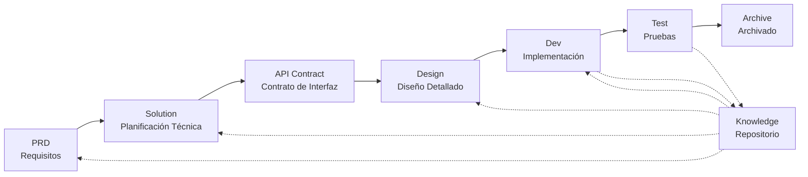

# DevCrew - Framework de Ingeniería de Software Impulsado por IA

> Un equipo de desarrollo virtual de IA que permite la implementación de ingeniería rápida para cualquier proyecto de software

## ¿Qué es DevCrew?

DevCrew es un framework de equipo de desarrollo virtual de IA integrado, construido sobre [Qoder](https://github.com/GeekRover/qoder). Transforma flujos de trabajo profesionales de ingeniería de software (PRD → Solution → Design → Dev → Test) en flujos de trabajo de Agentes reutilizables, ayudando a los equipos de desarrollo a lograr el Desarrollo Impulsado por Especificaciones (SDD).

Al integrar Agentes y Skills en proyectos existentes mediante CLI o copia, los equipos pueden inicializar rápidamente sistemas de documentación de proyectos y equipos de software virtuales, implementando nuevas funciones y modificaciones siguiendo flujos de trabajo de ingeniería estándar.

---

## 8 Problemas Principales Resueltos

### 1. La IA Ignora la Documentación Existente del Proyecto (Brecha de Conocimiento)
**Problema**: Los métodos existentes de SDD o Vibe Coding dependen de que la IA resuma los proyectos en tiempo real, lo que fácilmente omite contexto crítico y causa que los resultados del desarrollo se desvíen de las expectativas.

**Solución**: El repositorio `knowledge/` sirve como la "única fuente de verdad" del proyecto, acumulando diseño de arquitectura, módulos funcionales y procesos de negocio para asegurar que los requisitos se mantengan en el camino correcto desde la fuente.

### 2. PRD Directo a Documentación Técnica (Omisión de Contenido)
**Problema**: Saltar directamente del PRD al diseño detallado omite fácilmente detalles de los requisitos, causando que las funciones implementadas se desvíen de los requisitos.

**Solución**: Introducir la fase de **documento Solution**, enfocándose solo en el esqueleto de requisitos sin detalles técnicos:
- Qué páginas y componentes están incluidos
- Flujos de operación de páginas
- Lógica de procesamiento backend
- Estructura de almacenamiento de datos

El desarrollo solo necesita "llenar la carne" basándose en el stack técnico específico, asegurando que las funciones crezcan "cerca del hueso (requisitos)."

### 3. Alcance de Búsqueda Incierto del Agente (Incertidumbre)
**Problema**: En proyectos complejos, la búsqueda amplia de la IA en código y documentos produce resultados inciertos, haciendo difícil garantizar la consistencia.

**Solución**: Estructuras claras de directorios de documentos y plantillas, diseñadas basándose en las necesidades de cada Agente, implementando **revelación progresiva y carga bajo demanda** para asegurar determinismo.

### 4. Pasos y Tareas Faltantes (Ruptura de Proceso)
**Problema**: La falta de cobertura completa del flujo de trabajo de ingeniería omite fácilmente pasos críticos, haciendo difícil garantizar la calidad.

**Solución**: Cubrir el ciclo de vida completo de ingeniería de software:
```
PRD (Requisitos) → Solution (Planificación) → API Contract
    → Design → Dev (Desarrollo) → Test (Pruebas)
```
- La salida de cada fase es la entrada de la siguiente fase
- Cada paso requiere confirmación humana antes de proceder
- Todas las ejecuciones de Agentes tienen listas de tareas con autoverificación después de la finalización

### 5. Baja Eficiencia de Colaboración del Equipo (Silos de Conocimiento)
**Problema**: La experiencia de programación con IA es difícil de compartir entre equipos, llevando a errores repetidos.

**Solución**: Todos los Agentes, Skills y documentos relacionados están bajo control de versión con el código fuente:
- Optimización de una persona, compartida por el equipo
- Acumulación de conocimiento en la base de código
- Mejora de la eficiencia de colaboración del equipo

### 7. Contexto de Agente Único Demasiado Largo (Cuello de Botella de Rendimiento)
**Problema**: Las tareas grandes y complejas exceden las ventanas de contexto de un solo Agente, causando desviación en la comprensión y disminución de la calidad de salida.

**Solución**: **Mecanismo de Despacho Automático de Sub-Agentes**:
- Las tareas complejas se identifican y dividen automáticamente en subtareas
- Cada subtarea es ejecutada por un Sub-Agente independiente con contexto aislado
- El Agente padre coordina y agrega para asegurar la consistencia general
- Evita la inflación del contexto de un solo Agente, asegurando la calidad de salida

### 8. Caos de Iteración de Requisitos (Dificultad de Gestión)
**Problema**: Múltiples requisitos mezclados en la misma rama se afectan entre sí, haciendo difícil el seguimiento y la reversión.

**Solución**: **Cada Requisito como Proyecto Independiente**:
- Cada requisito crea un directorio de iteración independiente `projects/pXXX-[nombre-requisito]/`
- Aislamiento completo: documentos, diseño, código y pruebas gestionados independientemente
- Iteración rápida: entrega de pequeña granularidad, verificación rápida, despliegue rápido
- Archivado flexible: después de la finalización, archivado a `archive/` con trazabilidad histórica clara

### 6. Retraso en Actualización de Documentos (Decadencia del Conocimiento)
**Problema**: Los documentos se vuelven obsoletos a medida que evolucionan los proyectos, causando que la IA trabaje con información incorrecta.

**Solución**: Los Agentes tienen capacidades de actualización automática de documentos, sincronizando los cambios del proyecto en tiempo real para mantener la precisión de la base de conocimiento.

---

## Flujo de Trabajo Principal



### Descripciones de Fases

| Fase | Agente | Entrada | Salida | Confirmación Humana |
|------|--------|---------|--------|---------------------|
| PRD | PM | Requisitos del Usuario | Documento de Requisitos del Producto | ✅ Requerido |
| Solution | Planner | PRD | Solución Técnica + Contrato API | ✅ Requerido |
| Design | Designer | Solution | Documentos de Diseño Frontend/Backend | ✅ Requerido |
| Dev | Dev | Design | Código + Registros de Tareas | ✅ Requerido |
| Test | Test | Salida Dev + Criterios de Aceptación PRD | Reporte de Pruebas | ✅ Requerido |

---

## Comparación con Soluciones Existentes

| Dimensión | Vibe Coding | Ralph Loop | **DevCrew** |
|-----------|-------------|------------|-------------|
| Dependencia de Documentos | Ignora documentos existentes | Depende de AGENTS.md | **Base de conocimiento estructurada** |
| Transferencia de Requisitos | Codificación directa | PRD → Code | **PRD → Solution → Design → Code** |
| Participación Humana | Mínima | Al inicio | **En cada fase** |
| Completitud del Proceso | Débil | Media | **Flujo de trabajo de ingeniería completo** |
| Colaboración en Equipo | Difícil de compartir | Eficiencia personal | **Compartir conocimiento en equipo** |
| Gestión de Contexto | Instancia única | Bucle de instancia única | **Despacho automático de sub-agentes** |
| Gestión de Iteración | Mezclada | Lista de tareas | **Requisito como proyecto, iteración independiente** |
| Determinismo | Bajo | Medio | **Alto (revelación progresiva)** |

---

## Inicio Rápido

### 1. Instalar DevCrew

```bash
# Método 1: Copiar a proyecto existente
cp -r .qoder .devcrew-workspace /path/to/your-project/

# Método 2: Instalación CLI (soporte futuro)
npm install -g @devcrew/cli
devcrew init
```

### 2. Inicializar Proyecto

```bash
# Ejecutar Skill de inicialización para generar automáticamente base de conocimiento y estructura del proyecto
# Ejecutado automáticamente por el Skill devcrew-project-init
```

### 3. Iniciar Flujo de Trabajo de Desarrollo

```bash
# 1. Crear PRD
# 2. Generar Solution
# 3. Confirmar Contrato API
# 4. Diseño Detallado
# 5. Implementación de Desarrollo
# 6. Pruebas
```

---

## Estructura de Directorios

```
your-project/
├── .qoder/                          # Configuración DevCrew (tiempo de ejecución)
│   ├── agents/                      # 6 Agentes de rol
│   └── skills/                      # 13 Skills + plantillas
│
└── .devcrew-workspace/              # Espacio de trabajo (generado durante inicialización)
    ├── docs/                        # Documentos administrativos
    │   └── agent-knowledge-map.md   # Mapa de conocimiento del Agente
    ├── knowledge/                   # Base de conocimiento del proyecto (generada dinámicamente)
    │   ├── README.md
    │   ├── constitution.md
    │   ├── architecture/
    │   ├── bizs/
    │   └── domain/
    └── projects/                    # Proyectos de iteración (generados dinámicamente)
        ├── p001-user-auth/          # Requisito como proyecto, iteración independiente
        └── archive/                 # Archivado de iteraciones completadas
```

---

## Principios de Diseño Principales

1. **Impulsado por Especificaciones**: Escribir especificaciones primero, luego dejar que el código "crezca" de ellas
2. **Revelación Progresiva**: Los Agentes comienzan desde puntos de entrada mínimos, cargando información bajo demanda
3. **Confirmación Humana**: La salida de cada fase requiere confirmación humana para prevenir desviación de la IA
4. **Aislamiento de Contexto**: Las tareas grandes se dividen en subtareas pequeñas de contexto aislado
5. **Colaboración de Sub-Agentes**: Las tareas complejas despachan automáticamente sub-agentes para evitar la inflación del contexto de un solo agente
6. **Iteración Rápida**: Cada requisito como proyecto independiente para entrega y verificación rápida
7. **Compartir Conocimiento**: Todas las configuraciones están bajo control de versión con el código fuente

---

## Casos de Uso

### ✅ Recomendado Para
- Proyectos medianos a grandes que requieren flujos de trabajo estandarizados
- Desarrollo de software colaborativo en equipo
- Transformación de ingeniería de proyectos heredados
- Productos que requieren mantenimiento a largo plazo

### ❌ No Adecuado Para
- Validación rápida de prototipos personales
- Proyectos exploratorios con requisitos altamente inciertos
- Scripts o herramientas de una sola vez

---

## Más Información

- **Mapa de Conocimiento del Agente**: [.devcrew-workspace/docs/agent-knowledge-map.md](./.devcrew-workspace/docs/agent-knowledge-map.md)
- **GitHub**: https://github.com/your-org/devcrew
- **Documentación**: https://devcrew.dev/docs

---

> **DevCrew no se trata de reemplazar a los desarrolladores, sino de automatizar las partes tediosas para que los equipos puedan enfocarse en trabajo más valioso.**

---

## Versiones de Idioma

- [中文](./README.md)
- [English](./README.en.md)
- [العربية](./README.ar.md)
- [Español](./README.es.md)
