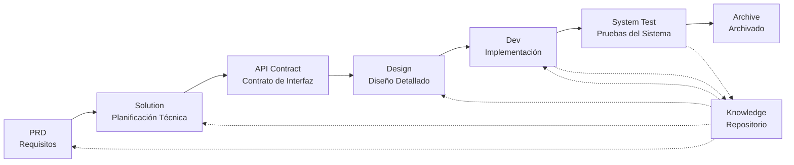

# SpecCrew - Framework de Ingeniería de Software Impulsado por IA

<p align="center">
  <a href="./README.md">简体中文</a> |
  <a href="./README.zh-TW.md">繁體中文</a> |
  <a href="./README.en.md">English</a> |
  <a href="./README.ko.md">한국어</a> |
  <a href="./README.de.md">Deutsch</a> |
  <a href="./README.es.md">Español</a> |
  <a href="./README.fr.md">Français</a> |
  <a href="./README.it.md">Italiano</a> |
  <a href="./README.da.md">Dansk</a> |
  <a href="./README.ja.md">日本語</a> |
  <a href="./README.pl.md">Polski</a> |
  <a href="./README.ru.md">Русский</a> |
  <a href="./README.bs.md">Bosanski</a> |
  <a href="./README.ar.md">العربية</a> |
  <a href="./README.no.md">Norsk</a> |
  <a href="./README.pt-BR.md">Português (Brasil)</a> |
  <a href="./README.th.md">ไทย</a> |
  <a href="./README.tr.md">Türkçe</a> |
  <a href="./README.uk.md">Українська</a> |
  <a href="./README.bn.md">বাংলা</a> |
  <a href="./README.el.md">Ελληνικά</a> |
  <a href="./README.vi.md">Tiếng Việt</a>
</p>

<p align="center">
  <a href="https://www.npmjs.com/package/speccrew"></a>
  <a href="https://www.npmjs.com/package/speccrew"></a>
  <a href="https://github.com/charlesmu99/speccrew/blob/main/LICENSE"></a>
</p>

> Un equipo de desarrollo virtual de IA que permite la implementación de ingeniería rápida para cualquier proyecto de software

## ¿Qué es SpecCrew?

SpecCrew es un framework de equipo de desarrollo virtual de IA integrado. Transforma flujos de trabajo profesionales de ingeniería de software (PRD → Feature Design → System Design → Dev → Test) en flujos de trabajo de Agentes reutilizables, ayudando a los equipos de desarrollo a lograr el Desarrollo Impulsado por Especificaciones (SDD), especialmente adecuado para proyectos existentes.

Al integrar Agentes y Skills en proyectos existentes, los equipos pueden inicializar rápidamente sistemas de documentación de proyectos y equipos de software virtuales, implementando nuevas funciones y modificaciones siguiendo flujos de trabajo de ingeniería estándar.

---

## 8 Problemas Principales Resueltos

### 1. La IA Ignora la Documentación Existente del Proyecto (Brecha de Conocimiento)
**Problema**: Los métodos existentes de SDD o Vibe Coding dependen de que la IA resuma los proyectos en tiempo real, lo que fácilmente omite contexto crítico y causa que los resultados del desarrollo se desvíen de las expectativas.

**Solución**: El repositorio `knowledge/` sirve como la "única fuente de verdad" del proyecto, acumulando diseño de arquitectura, módulos funcionales y procesos de negocio para asegurar que los requisitos se mantengan en el camino correcto desde la fuente.

### 2. PRD Directo a Documentación Técnica (Omisión de Contenido)
**Problema**: Saltar directamente del PRD al diseño detallado omite fácilmente detalles de los requisitos, causando que las funciones implementadas se desvíen de los requisitos.

**Solución**: Introducir la fase de **documento Solution**, enfocándose solo en el esqueleto de requisitos sin detalles técnicos:
- Qué páginas y componentes están incluidos
- Flujos de operación de páginas
- Lógica de procesamiento backend
- Estructura de almacenamiento de datos

El desarrollo solo necesita "llenar la carne" basándose en el stack técnico específico, asegurando que las funciones crezcan "cerca del hueso (requisitos)."

### 3. Alcance de Búsqueda Incierto del Agente (Incertidumbre)
**Problema**: En proyectos complejos, la búsqueda amplia de la IA en código y documentos produce resultados inciertos, haciendo difícil garantizar la consistencia.

**Solución**: Estructuras claras de directorios de documentos y plantillas, diseñadas basándose en las necesidades de cada Agente, implementando **revelación progresiva y carga bajo demanda** para asegurar determinismo.

### 4. Pasos y Tareas Faltantes (Ruptura de Proceso)
**Problema**: La falta de cobertura completa del flujo de trabajo de ingeniería omite fácilmente pasos críticos, haciendo difícil garantizar la calidad.

**Solución**: Cubrir el ciclo de vida completo de ingeniería de software:
```
PRD (Requisitos) → Solution (Planificación) → API Contract
    → Design → Dev (Desarrollo) → Test (Pruebas)
```
- La salida de cada fase es la entrada de la siguiente fase
- Cada paso requiere confirmación humana antes de proceder
- Todas las ejecuciones de Agentes tienen listas de tareas con autoverificación después de la finalización

### 5. Baja Eficiencia de Colaboración del Equipo (Silos de Conocimiento)
**Problema**: La experiencia de programación con IA es difícil de compartir entre equipos, llevando a errores repetidos.

**Solución**: Todos los Agentes, Skills y documentos relacionados están bajo control de versión con el código fuente:
- Optimización de una persona, compartida por el equipo
- Acumulación de conocimiento en la base de código
- Mejora de la eficiencia de colaboración del equipo

### 7. Contexto de Agente Único Demasiado Largo (Cuello de Botella de Rendimiento)
**Problema**: Las tareas grandes y complejas exceden las ventanas de contexto de un solo Agente, causando desviación en la comprensión y disminución de la calidad de salida.

**Solución**: **Mecanismo de Despacho Automático de Sub-Agentes**:
- Las tareas complejas se identifican y dividen automáticamente en subtareas
- Cada subtarea es ejecutada por un Sub-Agente independiente con contexto aislado
- El Agente padre coordina y agrega para asegurar la consistencia general
- Evita la inflación del contexto de un solo Agente, asegurando la calidad de salida

### 8. Caos de Iteración de Requisitos (Dificultad de Gestión)
**Problema**: Múltiples requisitos mezclados en la misma rama se afectan entre sí, haciendo difícil el seguimiento y la reversión.

**Solución**: **Cada Requisito como Proyecto Independiente**:
- Cada requisito crea un directorio de iteración independiente `iterations/iXXX-[nombre-requisito]/`
- Aislamiento completo: documentos, diseño, código y pruebas gestionados independientemente
- Iteración rápida: entrega de pequeña granularidad, verificación rápida, despliegue rápido
- Archivado flexible: después de la finalización, archivado a `archive/` con trazabilidad histórica clara

### 6. Retraso en Actualización de Documentos (Decadencia del Conocimiento)
**Problema**: Los documentos se vuelven obsoletos a medida que evolucionan los proyectos, causando que la IA trabaje con información incorrecta.

**Solución**: Los Agentes tienen capacidades de actualización automática de documentos, sincronizando los cambios del proyecto en tiempo real para mantener la precisión de la base de conocimiento.

---

## Flujo de Trabajo Principal



### Descripciones de Fases

| Fase | Agente | Entrada | Salida | Confirmación Humana |
|------|--------|---------|--------|---------------------|
| PRD | PM | Requisitos del Usuario | Documento de Requisitos del Producto | ✅ Requerido |
| Solution | Planner | PRD | Solución Técnica + Contrato API | ✅ Requerido |
| Design | Designer | Solution | Documentos de Diseño Frontend/Backend | ✅ Requerido |
| Dev | Dev | Design | Código + Registros de Tareas | ✅ Requerido |
| System Test | Test Manager | Salida Dev + Feature Spec | Casos de Prueba + Código de Prueba + Reporte de Pruebas + Reporte de Bugs | ✅ Requerido |

---

## Comparación con Soluciones Existentes

| Dimensión | Vibe Coding | Ralph Loop | **SpecCrew** |
|-----------|-------------|------------|-------------|
| Dependencia de Documentos | Ignora documentos existentes | Depende de AGENTS.md | **Base de conocimiento estructurada** |
| Transferencia de Requisitos | Codificación directa | PRD → Code | **PRD → Feature Design → System Design → Code** |
| Participación Humana | Mínima | Al inicio | **En cada fase** |
| Completitud del Proceso | Débil | Media | **Flujo de trabajo de ingeniería completo** |
| Colaboración en Equipo | Difícil de compartir | Eficiencia personal | **Compartir conocimiento en equipo** |
| Gestión de Contexto | Instancia única | Bucle de instancia única | **Despacho automático de sub-agentes** |
| Gestión de Iteración | Mezclada | Lista de tareas | **Requisito como proyecto, iteración independiente** |
| Determinismo | Bajo | Medio | **Alto (revelación progresiva)** |

---

## Inicio Rápido

### Requisitos Previos

- Node.js >= 16.0.0
- IDEs compatibles: Qoder (predeterminado), Cursor, Claude Code

> **Nota**: Los adaptadores para Cursor y Claude Code aún no han sido probados en entornos IDE reales (implementados a nivel de código y verificados mediante pruebas E2E, pero aún no probados en Cursor/Claude Code real).

### 1. Instalar SpecCrew

```bash
npm install -g speccrew
```

### 2. Inicializar Proyecto

Navegue al directorio raíz de su proyecto y ejecute el comando de inicialización:

```bash
cd /ruta/a/su-proyecto

# Predeterminado usa Qoder
speccrew init

# O especificar IDE
speccrew init --ide qoder
speccrew init --ide cursor
speccrew init --ide claude
```

Después de la inicialización, se generarán en su proyecto:
- `.qoder/agents/` / `.cursor/agents/` / `.claude/agents/` — 7 definiciones de roles Agent
- `.qoder/skills/` / `.cursor/skills/` / `.claude/skills/` — 38 flujos de trabajo Skill
- `speccrew-workspace/` — Espacio de trabajo (directorios de iteración, base de conocimientos, plantillas de documentos)
- `.speccrewrc` — Archivo de configuración de SpecCrew

Para actualizar Agents y Skills para un IDE específico más tarde:

```bash
speccrew update --ide cursor
speccrew update --ide claude
```

### 3. Iniciar Flujo de Trabajo de Desarrollo

Siga el flujo de trabajo de ingeniería estándar paso a paso:

1. **PRD**: El Agent Product Manager analiza los requisitos y genera el documento de requisitos del producto
2. **Feature Design**: El Agent Feature Designer genera el documento de diseño de funcionalidades + contrato API
3. **System Design**: El Agent System Designer genera documentos de diseño del sistema por plataforma (frontend/backend/móvil/escritorio)
4. **Dev**: El Agent System Developer implementa el desarrollo por plataforma en paralelo
5. **System Test**: El Agent Test Manager coordina las pruebas de tres fases (diseño de casos → generación de código → reporte de ejecución)
6. **Archive**: Archivar iteración

> Los entregables de cada fase requieren confirmación humana antes de proceder a la siguiente fase.

### 4. Otros Comandos CLI

```bash
speccrew list       # Listar agents y skills instalados
speccrew doctor     # Diagnosticar entorno y estado de instalación
speccrew update     # Actualizar agents y skills a la última versión
speccrew uninstall  # Desinstalar SpecCrew (--all también elimina el workspace)
```

📖 **Guía Detallada**: Después de la instalación, consulta la [Guía de Inicio Rápido](docs/GETTING-STARTED.es.md) para el flujo de trabajo completo y la guía de conversación con agentes.

---

## Estructura de Directorios

```
your-project/
├── .qoder/                          # Directorio de configuración IDE (ejemplo Qoder)
│   ├── agents/                      # 7 Agents de roles
│   │   ├── speccrew-team-leader.md       # Líder de Equipo: Programación global y gestión de iteraciones
│   │   ├── speccrew-product-manager.md   # Product Manager: Análisis de requisitos y PRD
│   │   ├── speccrew-feature-designer.md  # Feature Designer: Feature Design + Contrato API
│   │   ├── speccrew-system-designer.md   # System Designer: Diseño de sistema por plataforma
│   │   ├── speccrew-system-developer.md  # System Developer: Desarrollo paralelo por plataforma
│   │   ├── speccrew-test-manager.md      # Test Manager: Coordinación de pruebas de tres fases
│   │   └── speccrew-task-worker.md       # Task Worker: Ejecución paralela de subtareas
│   └── skills/                      # 38 Skills (agrupados por función)
│       ├── speccrew-pm-*/                # Gestión de Producto (análisis de requisitos, evaluación)
│       ├── speccrew-fd-*/                # Feature Design (Feature Design, Contrato API)
│       ├── speccrew-sd-*/                # System Design (frontend/backend/móvil/escritorio)
│       ├── speccrew-dev-*/               # Desarrollo (frontend/backend/móvil/escritorio)
│       ├── speccrew-test-*/              # Pruebas (diseño de casos/generación de código/reporte de ejecución)
│       ├── speccrew-knowledge-bizs-*/    # Conocimiento de Negocio (análisis API/análisis UI/clasificación de módulos, etc.)
│       ├── speccrew-knowledge-techs-*/   # Conocimiento Técnico (generación de stack/convenciones/índice, etc.)
│       ├── speccrew-knowledge-graph-*/   # Grafo de Conocimiento (leer/escribir/consultar)
│       └── speccrew-*/                   # Utilidades (diagnósticos/marcas de tiempo/flujo de trabajo, etc.)
│
└── speccrew-workspace/              # Espacio de trabajo (generado durante inicialización)
    ├── docs/                        # Documentos administrativos
    │   ├── configs/                 # Archivos de configuración (mapeo de plataforma, mapeo de stack técnico, etc.)
    │   ├── rules/                   # Configuraciones de reglas
    │   └── solutions/               # Documentos de soluciones
    │
    ├── iterations/                  # Proyectos de iteración (generados dinámicamente)
    │   └── {número}-{tipo}-{nombre}/
    │       ├── 00.docs/             # Requisitos originales
    │       ├── 01.product-requirement/ # Requisitos del producto
    │       ├── 02.feature-design/   # Diseño de características
    │       ├── 03.system-design/    # Diseño del sistema
    │       ├── 04.development/      # Fase de desarrollo
    │       ├── 05.system-test/      # Pruebas del sistema
    │       └── 06.delivery/         # Fase de entrega
    │
    ├── iteration-archives/          # Archivos de iteración
    │
    └── knowledges/                  # Base de conocimiento
        ├── base/                    # Base/metadatos
        │   ├── diagnosis-reports/   # Informes de diagnóstico
        │   ├── sync-state/          # Estado de sincronización
        │   └── tech-debts/          # Deudas técnicas
        ├── bizs/                    # Conocimiento de negocio
        │   └── {tipo-de-plataforma}/{nombre-del-módulo}/
        └── techs/                   # Conocimiento técnico
            └── {id-de-plataforma}/
```

---

## Principios de Diseño Principales

1. **Impulsado por Especificaciones**: Escribir especificaciones primero, luego dejar que el código "crezca" de ellas
2. **Revelación Progresiva**: Los Agentes comienzan desde puntos de entrada mínimos, cargando información bajo demanda
3. **Confirmación Humana**: La salida de cada fase requiere confirmación humana para prevenir desviación de la IA
4. **Aislamiento de Contexto**: Las tareas grandes se dividen en subtareas pequeñas de contexto aislado
5. **Colaboración de Sub-Agentes**: Las tareas complejas despachan automáticamente sub-agentes para evitar la inflación del contexto de un solo agente
6. **Iteración Rápida**: Cada requisito como proyecto independiente para entrega y verificación rápida
7. **Compartir Conocimiento**: Todas las configuraciones están bajo control de versión con el código fuente

---

## Casos de Uso

### ✅ Recomendado Para
- Proyectos medianos a grandes que requieren flujos de trabajo estandarizados
- Desarrollo de software colaborativo en equipo
- Transformación de ingeniería de proyectos heredados
- Productos que requieren mantenimiento a largo plazo

### ❌ No Adecuado Para
- Validación rápida de prototipos personales
- Proyectos exploratorios con requisitos altamente inciertos
- Scripts o herramientas de una sola vez

---

## Más Información

- **Mapa de Conocimiento del Agente**: [speccrew-workspace/docs/agent-knowledge-map.md](./speccrew-workspace/docs/agent-knowledge-map.md)
- **npm**: https://www.npmjs.com/package/speccrew
- **GitHub**: https://github.com/charlesmu99/speccrew
- **Gitee**: https://gitee.com/amutek/speccrew
- **Qoder IDE**: https://qoder.com/

---

> **SpecCrew no se trata de reemplazar a los desarrolladores, sino de automatizar las partes tediosas para que los equipos puedan enfocarse en trabajo más valioso.**

---


