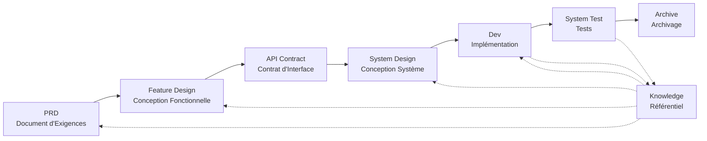

# SpecCrew - Framework d'Ingénierie Logicielle Piloté par l'IA

<p align="center">
  <a href="./README.md">简体中文</a> |
  <a href="./README.zh-TW.md">繁體中文</a> |
  <a href="./README.en.md">English</a> |
  <a href="./README.ko.md">한국어</a> |
  <a href="./README.de.md">Deutsch</a> |
  <a href="./README.es.md">Español</a> |
  <a href="./README.fr.md">Français</a> |
  <a href="./README.it.md">Italiano</a> |
  <a href="./README.da.md">Dansk</a> |
  <a href="./README.ja.md">日本語</a> |
  <a href="./README.pl.md">Polski</a> |
  <a href="./README.ru.md">Русский</a> |
  <a href="./README.bs.md">Bosanski</a> |
  <a href="./README.ar.md">العربية</a> |
  <a href="./README.no.md">Norsk</a> |
  <a href="./README.pt-BR.md">Português (Brasil)</a> |
  <a href="./README.th.md">ไทย</a> |
  <a href="./README.tr.md">Türkçe</a> |
  <a href="./README.uk.md">Українська</a> |
  <a href="./README.bn.md">বাংলা</a> |
  <a href="./README.el.md">Ελληνικά</a> |
  <a href="./README.vi.md">Tiếng Việt</a>
</p>

<p align="center">
  <a href="https://www.npmjs.com/package/speccrew"></a>
  <a href="https://www.npmjs.com/package/speccrew"></a>
  <a href="https://github.com/charlesmu99/speccrew/blob/main/LICENSE"></a>
</p>

> Une équipe de développement IA virtuelle permettant une implémentation d'ingénierie rapide pour tout projet logiciel

## Qu'est-ce que SpecCrew ?

SpecCrew est un framework d'équipe de développement IA virtuelle intégré. Il transforme les flux de travail d'ingénierie logicielle professionnels (PRD → Feature Design → System Design → Dev → Test) en flux de travail Agent réutilisables, aidant les équipes de développement à réaliser le Development piloté par les spécifications (SDD), particulièrement adapté aux projets existants.

En intégrant des Agents et des Skills dans des projets existants, les équipes peuvent rapidement initialiser les systèmes de documentation de projet et les équipes logicielles virtuelles, en implémentant de nouvelles fonctionnalités et modifications selon des flux de travail d'ingénierie standard.

---

## ✨ Caractéristiques Principales

### 🏭 Équipe Logicielle Virtuelle
Génération en un clic de **7 rôles d'Agents professionnels** + **30+ flux de travail de Skills**, construisant une équipe logicielle virtuelle complète :
- **Team Leader** - Planification globale et gestion des itérations
- **Product Manager** - Analyse des exigences et génération de PRD
- **Feature Designer** - Conception de fonctionnalités + contrats API
- **System Designer** - Conception de systèmes Frontend/Backend/Mobile/Desktop
- **System Developer** - Développement parallèle multi-plateforme
- **Test Manager** - Coordination des tests en trois phases
- **Task Worker** - Exécution parallèle de sous-tâches

### 📐 Modélisation ISA-95 en Six Étapes
Basé sur la méthodologie de modélisation **ISA-95** standard international, standardisant la transformation des exigences métier en systèmes logiciels :
```
Domain Descriptions → Functions in Domains → Functions of Interest
     ↓                       ↓                      ↓
Information Flows → Categories of Information → Information Descriptions
```
- Chaque étape correspond à des diagrammes UML spécifiques (cas d'utilisation, séquence, classes)
- Les exigences métier sont "affinées étape par étape", sans perte d'information
- Les sorties sont directement utilisables pour le développement

### 📚 Système de Base de Connaissances
Architecture de base de connaissances à trois niveaux garantissant que l'IA travaille toujours basée sur la "source unique de vérité" :

| Niveau | Répertoire | Contenu | Objectif |
|--------|------------|---------|----------|
| L1 Connaissance Système | `knowledge/techs/` | Stack technique, architecture, conventions | L'IA comprend les limites techniques du projet |
| L2 Connaissance Métier | `knowledge/bizs/` | Fonctionnalités des modules, flux métier, entités | L'IA comprend la logique métier |
| L3 Artefacts d'Itération | `iterations/iXXX/` | PRD, documents de conception, rapports de test | Chaîne complète de traçabilité pour les exigences actuelles |

### 🔄 Pipeline de Connaissances en Quatre Étapes
**Architecture de génération automatisée de connaissances**, générant automatiquement la documentation métier/technique à partir du code source :
```
Étape 1 : Analyser le code source → Générer la liste des modules
Étape 2 : Analyse parallèle → Extraire les fonctionnalités (multi-Worker parallèle)
Étape 3 : Résumé parallèle → Compléter les aperçus des modules (multi-Worker parallèle)
Étape 4 : Agrégation système → Générer le panorama du système
```
- Supporte **synchronisation complète** et **synchronisation incrémentielle** (basé sur Git diff)
- Une personne optimise, l'équipe partage

### 🔧 Harness Cadre de Mise en Œuvre Pratique
**Cadre d'exécution standardisé**, garantit que les documents de conception se transforment avec précision en instructions de développement exécutables :
- **Principe du manuel d'opération** : Skill comme SOP, étapes claires, continues et autonomes
- **Contrat d'entrée/sortie** : Définition claire des interfaces, exécution rigoureuse comme pseudocode
- **Architecture de divulgation progressive** : Chargement des informations par couches, éviter la surcharge de contexte
- **Délégation de Sous-Agent** : Division automatique des tâches complexes, exécution parallèle pour garantir la qualité

---

## 8 Problèmes Principaux Résolus

### 1. L'IA Ignore la Documentation de Projet Existante (Lacune de Connaissances)
**Problème** : Les méthodes SDD ou Vibe Coding existantes s'appuient sur l'IA pour résumer les projets en temps réel, manquant facilement le contexte critique et causant des résultats de développement qui s'écartent des attentes.

**Solution** : Le référentiel `knowledge/` sert de "source unique de vérité" du projet, accumulant la conception d'architecture, les modules fonctionnels et les processus métier pour garantir que les exigences restent sur la bonne voie depuis la source.

### 2. Documentation Technique Directe depuis le PRD (Omission de Contenu)
**Problème** : Passer directement du PRD à la conception détaillée manque facilement les détails des exigences, causant des fonctionnalités implémentées qui s'écartent des exigences.

**Solution** : Introduire la phase de **Document Feature Design**, se concentrant uniquement sur le squelette des exigences sans détails techniques :
- Quelles pages et composants sont inclus ?
- Flux d'opérations de page
- Logique de traitement backend
- Structure de stockage de données

Le développement doit seulement "remplir la chair" basé sur la pile technologique spécifique, garantissant que les fonctionnalités grandissent "près de l'os (exigences)".

### 3. Portée de Recherche Agent Incertaine (Incertitude)
**Problème** : Dans les projets complexes, la recherche large de code et de documents par l'IA donne des résultats incertains, rendant la cohérence difficile à garantir.

**Solution** : Des structures de répertoires de documents claires et des modèles, conçus selon les besoins de chaque Agent, implémentant **la divulgation progressive et le chargement à la demande** pour garantir le déterminisme.

### 4. Étapes et Tâches Manquantes (Rupture de Processus)
**Problème** : Le manque de couverture complète du processus d'ingénierie manque facilement des étapes critiques, rendant la qualité difficile à garantir.

**Solution** : Couvrir tout le cycle de vie de l'ingénierie logicielle :
```
PRD (Exigences) → Feature Design (Conception Fonctionnelle) → API Contract (Contrat)
    → System Design (Conception Système) → Dev (Développement) → Test (Tests)
```
- La sortie de chaque phase est l'entrée de la phase suivante
- Chaque étape nécessite une confirmation humaine avant de procéder
- Toutes les exécutions d'Agent ont des listes todo avec auto-vérification après achèvement

### 5. Faible Efficacité de Collaboration d'Équipe (Silos de Connaissances)
**Problème** : L'expérience de programmation IA est difficile à partager entre les équipes, entraînant des erreurs répétées.

**Solution** : Tous les Agents, Skills et documents associés sont versionnés avec le code source :
- L'optimisation d'une personne est partagée par l'équipe
- Les connaissances s'accumulent dans la base de code
- Amélioration de l'efficacité de collaboration d'équipe

### 7. Contexte d'Agent Unique Trop Long (Goulot d'Étranglement de Performance)
**Problème** : Les tâches complexes importantes dépassent les fenêtres de contexte d'Agent unique, causant des déviations de compréhension et une diminution de la qualité de sortie.

**Solution** : **Mécanisme d'Auto-Répartition de Sous-Agent** :
- Les tâches complexes sont automatiquement identifiées et divisées en sous-tâches
- Chaque sous-tâche est exécutée par un sous-Agent indépendant avec un contexte isolé
- L'Agent parent coordonne et agrège pour assurer la cohérence globale
- Évite l'expansion du contexte d'Agent unique, garantissant la qualité de sortie

### 8. Chaos d'Itération d'Exigences (Difficulté de Gestion)
**Problème** : Plusieurs exigences mélangées dans la même branche s'affectent mutuellement, rendant le suivi et la restauration difficiles.

**Solution** : **Chaque Exigence comme Projet Indépendant** :
- Chaque exigence crée un répertoire d'itération indépendant `iterations/iXXX-[nom-exigence]/`
- Isolation complète : documents, conception, code et tests gérés indépendamment
- Itération rapide : livraison à petite granularité, vérification rapide, déploiement rapide
- Archivage flexible : après achèvement, archivage dans `archive/` avec traçabilité historique claire

### 6. Retard de Mise à Jour des Documents (Décomposition des Connaissances)
**Problème** : Les documents deviennent obsolètes à mesure que les projets évoluent, faisant travailler l'IA avec des informations incorrectes.

**Solution** : Les Agents ont des capacités de mise à jour automatique des documents, synchronisant les changements de projet en temps réel pour maintenir la base de connaissances précise.

---

## Flux de Travail Principal



### Descriptions des Phases

| Phase | Agent | Entrée | Sortie | Confirmation Humaine |
|-------|-------|--------|--------|---------------------|
| PRD | PM | Exigences Utilisateur | Document d'Exigences Produit | ✅ Requise |
| Feature Design | Feature Designer | PRD | Document Feature Design + Contrat API | ✅ Requise |
| System Design | System Designer | Feature Spec | Documents de Conception Frontend/Backend | ✅ Requise |
| Dev | Dev | Design | Code + Enregistrements de Tâches | ✅ Requise |
| System Test | Test Manager | Sortie Dev + Feature Spec | Cas de Test + Code de Test + Rapport de Test + Rapport de Bug | ✅ Requise |

---

## Comparaison avec les Solutions Existantes

| Dimension | Vibe Coding | Ralph Loop | **SpecCrew** |
|-----------|-------------|------------|-------------|
| Dépendance aux Documents | Ignore les docs existants | S'appuie sur AGENTS.md | **Base de Connaissances Structurée** |
| Transfert d'Exigences | Codage direct | PRD → Code | **PRD → Feature Design → System Design → Code** |
| Implication Humaine | Minimale | Au démarrage | **À chaque phase** |
| Complétude du Processus | Faible | Moyenne | **Flux de travail d'ingénierie complet** |
| Collaboration d'Équipe | Difficile à partager | Efficacité personnelle | **Partage de connaissances d'équipe** |
| Gestion du Contexte | Instance unique | Boucle d'instance unique | **Auto-répartition de sous-Agent** |
| Gestion d'Itération | Mélangée | Liste de tâches | **Exigence comme projet, itération indépendante** |
| Déterminisme | Faible | Moyen | **Élevé (divulgation progressive)** |

---

## Démarrage Rapide

### Prérequis

- Node.js >= 16.0.0
- IDEs supportés : Qoder (par défaut), Cursor, Claude Code

> **Note** : Les adaptateurs pour Cursor et Claude Code n'ont pas été testés dans des environnements IDE réels (implémentés au niveau du code et vérifiés par des tests E2E, mais pas encore testés dans Cursor/Claude Code réel).

### 1. Installer SpecCrew

```bash
npm install -g speccrew
```

### 2. Initialiser le Projet

Naviguez vers le répertoire racine de votre projet et exécutez la commande d'initialisation :

```bash
cd /path/to/your-project

# Utilise Qoder par défaut
speccrew init

# Ou spécifier l'IDE
speccrew init --ide qoder
speccrew init --ide cursor
speccrew init --ide claude
```

Après l'initialisation, les éléments suivants seront générés dans votre projet :
- `.qoder/agents/` / `.cursor/agents/` / `.claude/agents/` — 7 définitions de rôles Agent
- `.qoder/skills/` / `.cursor/skills/` / `.claude/skills/` — 30+ flux de travail Skill
- `speccrew-workspace/` — Espace de travail (répertoires d'itération, base de connaissances, modèles de documents)
- `.speccrewrc` — Fichier de configuration SpecCrew

Pour mettre à jour les Agents et Skills pour un IDE spécifique ultérieurement :

```bash
speccrew update --ide cursor
speccrew update --ide claude
```

### 3. Démarrer le Flux de Travail de Développement

Suivez le flux de travail d'ingénierie standard étape par étape :

1. **PRD** : L'Agent Product Manager analyse les exigences et génère le document d'exigences produit
2. **Feature Design** : L'Agent Feature Designer génère le document de conception fonctionnelle + contrat API
3. **System Design** : L'Agent System Designer génère les documents de conception système par plateforme (frontend/backend/mobile/desktop)
4. **Dev** : L'Agent System Developer implémente le développement par plateforme en parallèle
5. **System Test** : L'Agent Test Manager coordonne les tests en trois phases (conception de cas → génération de code → rapport d'exécution)
6. **Archive** : Archiver l'itération

> Les livrables de chaque phase nécessitent une confirmation humaine avant de passer à la phase suivante.

### 4. Mettre à Jour SpecCrew

Lorsque SpecCrew publie une nouvelle version, deux étapes sont nécessaires pour terminer la mise à jour :

```bash
# Step 1: 更新全局 CLI 工具到最新版本
npm install -g speccrew@latest

# Step 2: 同步项目中的 Agents 和 Skills 到最新版本
cd /path/to/your-project
speccrew update
```

> **Note** : `npm install -g speccrew@latest` met à jour l'outil CLI lui-même, tandis que `speccrew update` met à jour les fichiers de définition des Agents et Skills dans le projet. Les deux étapes doivent être exécutées pour terminer la mise à jour complète.

### 5. Autres Commandes CLI

```bash
speccrew list       # Lister les agents et skills installés
speccrew doctor     # Diagnostiquer l'environnement et l'état d'installation
speccrew update     # Mettre à jour les agents et skills vers la dernière version
speccrew uninstall  # Désinstaller SpecCrew (--all supprime aussi l'espace de travail)
```

📖 **Guide Détaillé** : Après l'installation, consultez le [Guide de Démarrage](docs/GETTING-STARTED.fr.md) pour le flux de travail complet et le guide de conversation Agent.

---

## Structure de Répertoire

```
your-project/
├── .qoder/                          # Répertoire de configuration IDE (exemple Qoder)
│   ├── agents/                      # 7 Agents de rôles
│   │   ├── speccrew-team-leader.md       # Chef d'équipe : Planification globale et gestion d'itération
│   │   ├── speccrew-product-manager.md   # Product Manager : Analyse des exigences et PRD
│   │   ├── speccrew-feature-designer.md  # Feature Designer : Feature Design + Contrat API
│   │   ├── speccrew-system-designer.md   # System Designer : Conception système par plateforme
│   │   ├── speccrew-system-developer.md  # System Developer : Développement parallèle par plateforme
│   │   ├── speccrew-test-manager.md      # Test Manager : Coordination de test en trois phases
│   │   └── speccrew-task-worker.md       # Task Worker : Exécution parallèle de sous-tâches
│   └── skills/                      # 30+ Skills (groupés par fonction)
│       ├── speccrew-pm-*/                # Gestion Produit (analyse d'exigences, évaluation)
│       ├── speccrew-fd-*/                # Feature Design (Feature Design, Contrat API)
│       ├── speccrew-sd-*/                # System Design (frontend/backend/mobile/desktop)
│       ├── speccrew-dev-*/               # Développement (frontend/backend/mobile/desktop)
│       ├── speccrew-test-*/              # Test (conception de cas/génération de code/rapport d'exécution)
│       ├── speccrew-knowledge-bizs-*/    # Connaissances Métier (analyse API/analyse UI/classification module etc.)
│       ├── speccrew-knowledge-techs-*/   # Connaissances Techniques (génération stack tech/conventions/index etc.)
│       ├── speccrew-knowledge-graph-*/   # Graphe de Connaissances (lecture/écriture/requête)
│       └── speccrew-*/                   # Utilitaires (diagnostic/horodatage/workflow etc.)
│
└── speccrew-workspace/              # Espace de travail (généré lors de l'initialisation)
    ├── docs/                        # Documents de gestion
    │   ├── configs/                 # Fichiers de configuration (mappage plateforme, mappage stack tech etc.)
    │   ├── rules/                   # Configurations de règles
    │   └── solutions/               # Documents de solutions
    │
    ├── iterations/                  # Projets d'itération (générés dynamiquement)
    │   └── {numéro}-{type}-{nom}/
    │       ├── 00.docs/             # Exigences originales
    │       ├── 01.product-requirement/ # Exigences produit
    │       ├── 02.feature-design/   # Conception fonctionnelle
    │       ├── 03.system-design/    # Conception système
    │       ├── 04.development/      # Phase de développement
    │       ├── 05.system-test/      # Test système
    │       └── 06.delivery/         # Phase de livraison
    │
    ├── iteration-archives/          # Archives d'itération
    │
    └── knowledges/                  # Base de connaissances
        ├── base/                    # Base/métadonnées
        │   ├── diagnosis-reports/   # Rapports de diagnostic
        │   ├── sync-state/          # État de synchronisation
        │   └── tech-debts/          # Dettes techniques
        ├── bizs/                    # Connaissances métier
        │   └── {platform-type}/{module-name}/
        └── techs/                   # Connaissances techniques
            └── {platform-id}/
```

---

## Principes de Conception Principaux

1. **Piloté par les Spécifications** : Écrire les spécifications d'abord, puis laisser le code "grandir" depuis elles
2. **Divulgation Progressive** : Les Agents commencent à partir de points d'entrée minimaux, chargeant les informations à la demande
3. **Confirmation Humaine** : La sortie de chaque phase nécessite une confirmation humaine pour prévenir la déviation de l'IA
4. **Isolation du Contexte** : Les grandes tâches sont divisées en sous-tâches petites et isolées par le contexte
5. **Collaboration de Sous-Agent** : Les tâches complexes répartissent automatiquement des sous-Agents pour éviter l'expansion du contexte d'Agent unique
6. **Itération Rapide** : Chaque exigence comme projet indépendant pour livraison et vérification rapides
7. **Partage de Connaissances** : Toutes les configurations sont versionnées avec le code source

---

## Cas d'Utilisation

### ✅ Recommandé Pour
- Projets moyens à grands nécessitant des flux de travail standardisés
- Développement logiciel en collaboration d'équipe
- Transformation d'ingénierie de projet hérité
- Produits nécessitant une maintenance à long terme

### ❌ Non Adapté Pour
- Validation de prototype rapide personnelle
- Projets exploratoires avec des exigences très incertaines
- Scripts ou outils à usage unique

---

## Plus d'Informations

- **Carte de Connaissances Agent** : [speccrew-workspace/docs/agent-knowledge-map.md](./speccrew-workspace/docs/agent-knowledge-map.md)
- **npm** : https://www.npmjs.com/package/speccrew
- **GitHub** : https://github.com/charlesmu99/speccrew
- **Gitee** : https://gitee.com/amutek/speccrew
- **Qoder IDE** : https://qoder.com/

---

> **SpecCrew ne vise pas à remplacer les développeurs, mais à automatiser les parties fastidieuses pour que les équipes puissent se concentrer sur un travail plus précieux.**
