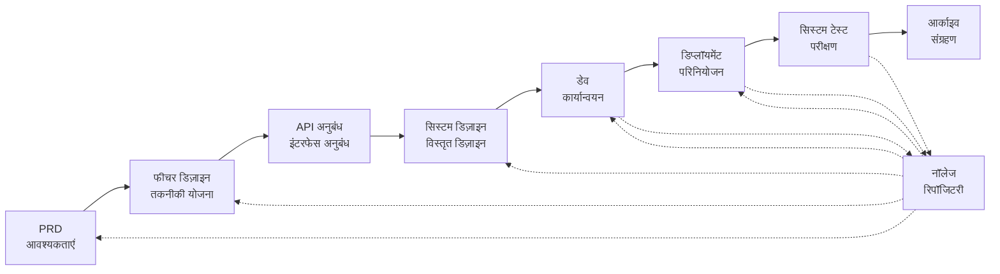

# SpecCrew - AI-संचालित सॉफ्टवेयर इंजीनियरिंग फ्रेमवर्क

<p align="center">
  <a href="./README.md">简体中文</a> |
  <a href="./README.en.md">English</a> |
  <a href="./README.ja.md">日本語</a> |
  <a href="./README.ru.md">Русский</a> |
  <a href="./README.es.md">Español</a> |
  <a href="./README.de.md">Deutsch</a> |
  <a href="./README.fr.md">Français</a> |
  <a href="./README.pt-BR.md">Português (Brasil)</a> |
  <a href="./README.ar.md">العربية</a> |
  <a href="./README.hi.md">हिन्दी</a>
</p>

<p align="center">
  <a href="https://www.npmjs.com/package/speccrew"></a>
  <a href="https://www.npmjs.com/package/speccrew"></a>
  <a href="https://github.com/charlesmu99/speccrew/blob/main/LICENSE"></a>
</p>

> एक आभासी AI विकास टीम जो किसी भी सॉफ्टवेयर परियोजना के लिए त्वरित इंजीनियरिंग कार्यान्वयन सक्षम बनाती है

## SpecCrew क्या है?

SpecCrew एक एम्बेडेड आभासी AI विकास टीम फ्रेमवर्क है। यह पेशेवर सॉफ्टवेयर इंजीनियरिंग वर्कफ्लो (PRD → फीचर डिज़ाइन → सिस्टम डिज़ाइन → डेव → डिप्लॉयमेंट → टेस्ट) को पुन: उपयोग योग्य Agent वर्कफ्लो में परिवर्तित करता है, जिससे विकास टीमों को स्पेसिफिकेशन-ड्रिवन डेवलपमेंट (SDD) प्राप्त करने में मदद मिलती है, विशेष रूप से मौजूदा परियोजनाओं के लिए उपयुक्त।

मौजूदा परियोजनाओं में Agents और Skills को एकीकृत करके, टीमें त्वरित रूप से परियोजना दस्तावेज़ीकरण प्रणाली और आभासी सॉफ्टवेयर टीमों को प्रारंभ कर सकती हैं, मानक इंजीनियरिंग वर्कफ्लो का पालन करते हुए नई सुविधाओं और संशोधनों को लागू कर सकती हैं।

---

## ✨ मुख्य विशेषताएँ

### 🏭 आभासी सॉफ्टवेयर टीम
एक-क्लिक में **7 पेशेवर Agent भूमिकाएँ** + **30+ Skill वर्कफ्लो** उत्पन्न करें, एक पूर्ण आभासी सॉफ्टवेयर टीम का निर्माण:
- **टीम लीडर** - वैश्विक शेड्यूलिंग और पुनरावृत्ति प्रबंधन
- **प्रोडक्ट मैनेजर** - आवश्यकताओं का विश्लेषण और PRD आउटपुट
- **फीचर डिज़ाइनर** - फीचर डिज़ाइन + API अनुबंध
- **सिस्टम डिज़ाइनर** - फ्रंटएंड/बैकएंड/मोबाइल/डेस्कटॉप सिस्टम डिज़ाइन
- **सिस्टम डेवलपर** - मल्टी-प्लेटफॉर्म समानांतर विकास
- **टेस्ट मैनेजर** - तीन-चरणीय टेस्ट समन्वय
- **टास्क वर्कर** - समानांतर उप-कार्य निष्पादन

### 📐 ISA-95 छह-चरणीय मॉडलिंग
अंतर्राष्ट्रीय **ISA-95** मॉडलिंग कार्यप्रणाली पर आधारित, व्यावसायिक आवश्यकताओं से सॉफ्टवेयर सिस्टम तक परिवर्तन को मानकीकृत करना:
```
डोमेन विवरण → डोमेन में कार्य → रुचि के कार्य
     ↓                       ↓                      ↓
सूचना प्रवाह → सूचना की श्रेणियाँ → सूचना विवरण
```
- प्रत्येक चरण के लिए विशिष्ट UML आरेख (यूज़ केस, सिक्वेंस, क्लास आरेख)
- व्यावसायिक आवश्यकताएँ "चरण दर चरण परिष्कृत" होती हैं, कोई सूचना हानि नहीं
- आउटपुट सीधे विकास के लिए उपयोग योग्य

### 📚 नॉलेज बेस सिस्टम
तीन-स्तरीय नॉलेज बेस आर्किटेक्चर ensuring AI हमेशा "एकल सत्य स्रोत" पर आधारित काम करता है:

| स्तर | निर्देशिका | सामग्री | उद्देश्य |
|-------|-----------|---------|----------|
| L1 सिस्टम नॉलेज | `knowledge/techs/` | टेक स्टैक, आर्किटेक्चर, कन्वेंशन | AI परियोजना की तकनीकी सीमाओं को समझता है |
| L2 बिज़नेस नॉलेज | `knowledge/bizs/` | मॉड्यूल सुविधाएँ, बिज़नेस प्रवाह, इकाइयाँ | AI बिज़नेस लॉजिक को समझता है |
| L3 पुनरावृत्ति कलाकृतियाँ | `iterations/iXXX/` | PRD, डिज़ाइन दस्तावेज़, टेस्ट रिपोर्ट | वर्तमान आवश्यकताओं के लिए पूर्ण ट्रेसेबिलिटी चेन |

### 🔄 चार-चरणीय नॉलेज पाइपलाइन
**स्वचालित ज्ञान निर्माण आर्किटेक्चर**, स्रोत कोड से स्वचालित रूप से व्यावसायिक/तकनीकी दस्तावेज़ उत्पन्न करना:
```
चरण 1: स्रोत कोड स्कैन करें → मॉड्यूल सूची उत्पन्न करें
चरण 2: समानांतर विश्लेषण → सुविधाएँ निकालें (मल्टी-वर्कर समानांतर)
चरण 3: समानांतर सारांश → मॉड्यूल अवलोकन पूर्ण करें (मल्टी-वर्कर समानांतर)
चरण 4: सिस्टम एकत्रीकरण → सिस्टम पैनोरमा उत्पन्न करें
```
- **पूर्ण सिंक** और **इंक्रिमेंटल सिंक** (Git diff पर आधारित) का समर्थन करता है
- एक व्यक्ति अनुकूलित करता है, टीम साझा करती है

### 🔧 हार्नेस निष्पादन फ्रेमवर्क
**मानकीकृत निष्पादन फ्रेमवर्क** ensuring डिज़ाइन दस्तावेज़ सटीक रूप से निष्पादन योग्य विकास निर्देशों में परिवर्तित होते हैं:
- **SOP सिद्धांत**: Skills मानक संचालन प्रक्रियाओं के रूप में—स्पष्ट, निरंतर, स्वयं-समावेशी चरण
- **इनपुट/आउटपुट अनुबंध**: कठोर, स्यूडोकोड-जैसे निष्पादन के लिए अच्छी तरह परिभाषित इंटरफेस
- **प्रगतिशील प्रकटीकरण**: स्तरित सूचना आर्किटेक्चर जो संदर्भ ओवरलोड को रोकता है
- **सब-एजेंट डिस्पैच**: गुणवत्ता आश्वासन के लिए समानांतर निष्पादन के साथ स्वचालित कार्य विभाजन

---

## 8 कोर समस्याएँ हल की गईं

### 1. AI मौजूदा परियोजना दस्तावेज़ों को नज़रअंदाज़ करता है (नॉलेज गैप)
**समस्या**: मौजूदा SDD या Vibe Coding विधियाँ AI पर परियोजनाओं का वास्तविक समय में सारांश प्रस्तुत करने पर निर्भर करती हैं, आसानी से महत्वपूर्ण संदर्भ को याद करती हैं और विकास परिणामों को अपेक्षाओं से विचलित करती हैं।

**समाधान**: `knowledge/` रिपॉजिटरी परियोजना का "एकल सत्य स्रोत" के रूप में कार्य करती है, आर्किटेक्चर डिज़ाइन, कार्यात्मक मॉड्यूल और व्यावसायिक प्रक्रियाओं को जमा करती है ताकि आवश्यकताएँ स्रोत से ही सही राह पर रहें।

### 2. सीधे PRD से तकनीकी दस्तावेज़ (सामग्री छूट)
**समस्या**: सीधे PRD से विस्तृत डिज़ाइन में जाना आसानी से आवश्यकता के विवरणों को याद कर देता है, जिससे लागू की गई सुविधाएँ आवश्यकताओं से विचलित हो जाती हैं।

**समाधान**: **समाधान दस्तावेज़** चरण प्रस्तुत करें, जो केवल तकनीकी विवरणों के बिना आवश्यकता के स्केलेटन पर ध्यान केंद्रित करता है:
- कौन से पेज और कंपोनेंट शामिल हैं
- पेज ऑपरेशन प्रवाह
- बैकएंड प्रोसेसिंग लॉजिक
- डेटा स्टोरेज संरचना

विकास को केवल विशिष्ट टेक स्टैक के आधार पर "मांस भरना" होता है, ensuring सुविधाएँ "हड्डी (आवश्यकताओं) के करीब" विकसित होती हैं।

### 3. अनिश्चित Agent खोज सीमा (अनिश्चितता)
**समस्या**: जटिल परियोजनाओं में, AI का कोड और दस्तावेज़ों का व्यापक खोज अनिश्चित परिणाम देता है, जिससे संगतता सुनिश्चित करना कठिन होता है।

**समाधान**: प्रत्येक Agent की आवश्यकताओं के आधार पर डिज़ाइन की गई स्पष्ट दस्तावेज़ निर्देशिका संरचना और टेम्पलेट, **प्रगतिशील प्रकटीकरण और ऑन-डिमांड लोडिंग** को लागू करना ensuring निर्धारण।

### 4. चूकी हुई चरण और कार्य (प्रक्रिया टूटना)
**समस्या**: पूर्ण इंजीनियरिंग प्रक्रिया कवरेज की कमी से महत्वपूर्ण चरण आसानी से छूट जाते हैं, जिससे गुणवत्ता सुनिश्चित करना कठिन होता है।

**समाधान**: पूर्ण सॉफ्टवेयर इंजीनियरिंग जीवनचक्र को कवर करें:
```
PRD (आवश्यकताएँ) → फीचर डिज़ाइन (योजना) → API अनुबंध
    → सिस्टम डिज़ाइन → डेव (विकास) → डिप्लॉयमेंट → टेस्ट (परीक्षण)
```
- प्रत्येक चरण का आउटपुट अगले चरण का इनपुट है
- प्रत्येक चरण को आगे बढ़ने से पहले मानवीय पुष्टि की आवश्यकता होती है
- सभी Agent निष्पादनों में टूडू सूचियाँ होती हैं जिन्हें पूरा होने पर स्व-जाँच की आवश्यकता होती है

### 5. कम टीम सहयोग दक्षता (नॉलेज सायलो)
**समस्या**: AI प्रोग्रामिंग अनुभव टीमों में साझा करना कठिन है, जिससे दोहराई गई गलतियाँ होती हैं।

**समाधान**: सभी Agents, Skills और संबंधित दस्तावेज़ स्रोत कोड के साथ संस्करण-नियंत्रित होते हैं:
- एक व्यक्ति का अनुकूलन, टीम द्वारा साझा किया जाता है
- ज्ञान कोडबेस में जमा होता है
- टीम सहयोग दक्षता में सुधार

### 7. एकल Agent संदर्भ बहुत लंबा (प्रदर्शन बाधा)
**समस्या**: बड़े जटिल कार्य एकल Agent संदर्भ विंडो से अधिक हो जाते हैं, जिससे समझ में विचलन और आउटपुट गुणवत्ता में कमी आती है।

**समाधान**: **सब-एजेंट ऑटो-डिस्पैच मैकेनिज़्म**:
- जटिल कार्य स्वचालित रूप से पहचाने जाते हैं और उप-कार्यों में विभाजित होते हैं
- प्रत्येक उप-कार्य एक स्वतंत्र सब-Agent द्वारा निष्पादित होता है, अलग संदर्भ के साथ
- पैरेंट Agent समन्वय और एकत्रीकरण करता है ensuring समग्र संगतता
- एकल Agent संदर्भ विस्तार से बचता है, आउटपुट गुणवत्ता सुनिश्चित करता है

### 8. आवश्यकता पुनरावृत्ति अराजकता (प्रबंधन कठिनाई)
**समस्या**: एक ही शाखा में मिली हुई कई आवश्यकताएँ एक-दूसरे को प्रभावित करती हैं, जिससे ट्रैकिंग और रोलबैक कठिन होता है।

**समाधान**: **प्रत्येक आवश्यकता एक स्वतंत्र परियोजना**:
- प्रत्येक आवश्यकता एक स्वतंत्र पुनरावृत्ति निर्देशिका `iterations/iXXX-[requirement-name]/` बनाती है
- पूर्ण पृथक्करण: दस्तावेज़, डिज़ाइन, कोड और परीक्षण स्वतंत्र रूप से प्रबंधित
- त्वरित पुनरावृत्ति: छोटी दानादारता वितरण, त्वरित सत्यापन, त्वरित परिनियोजन
- लचीला संग्रहण: पूरा होने पर, `archive/` में संग्रहीत, स्पष्ट ऐतिहासिक ट्रेसेबिलिटी के साथ

### 6. दस्तावेज़ अपडेट अंतराल (ज्ञान क्षय)
**समस्या**: परियोजनाओं के विकसित होने के साथ दस्तावेज़ पुराने हो जाते हैं, जिससे AI गलत जानकारी के साथ काम करता है।

**समाधान**: Agents में स्वचालित दस्तावेज़ अपडेट क्षमताएँ होती हैं, परियोजना परिवर्तनों को वास्तविक समय में सिंक्रनाइज़ करती हैं ताकि नॉलेज बेस सटीक रहे।

---

## कोर वर्कफ्लो



### चरण विवरण

| चरण | Agent | इनपुट | आउटपुट | मानवीय पुष्टि |
|-------|-------|-------|--------|-------------------|
| PRD | PM | उपयोगकर्ता आवश्यकताएँ | उत्पाद आवश्यकता दस्तावेज़ | ✅ आवश्यक |
| फीचर डिज़ाइन | फीचर डिज़ाइनर | PRD | फीचर डिज़ाइन दस्तावेज़ + API अनुबंध | ✅ आवश्यक |
| सिस्टम डिज़ाइन | सिस्टम डिज़ाइनर | फीचर स्पेस | फ्रंटएंड/बैकएंड डिज़ाइन दस्तावेज़ | ✅ आवश्यक |
| डेव | डेव | डिज़ाइन | कोड + कार्य रिकॉर्ड | ✅ आवश्यक |
| डिप्लॉयमेंट | सिस्टम डिप्लॉयर | डेव आउटपुट | डिप्लॉयमेंट रिपोर्ट + चल रहा एप्लिकेशन | ✅ आवश्यक |
| सिस्टम टेस्ट | टेस्ट मैनेजर | डिप्लॉयमेंट आउटपुट + फीचर स्पेस | टेस्ट केस + टेस्ट कोड + टेस्ट रिपोर्ट + बग रिपोर्ट | ✅ आवश्यक |

---

## मौजूदा समाधानों के साथ तुलना

| आयाम | Vibe Coding | Ralph Loop | **SpecCrew** |
|-----------|-------------|------------|-------------|
| दस्तावेज़ निर्भरता | मौजूदा दस्तावेज़ों को नज़रअंदाज़ करता है | AGENTS.md पर निर्भर | **संरचित नॉलेज बेस** |
| आवश्यकता स्थानांतरण | सीधे कोडिंग | PRD → कोड | **PRD → फीचर डिज़ाइन → सिस्टम डिज़ाइन → कोड** |
| मानवीय भागीदारी | न्यूनतम | प्रारंभ में | **प्रत्येक चरण में** |
| प्रक्रिया पूर्णता | कमज़ोर | मध्यम | **पूर्ण इंजीनियरिंग वर्कफ्लो** |
| टीम सहयोग | साझा करना कठिन | व्यक्तिगत दक्षता | **टीम ज्ञान साझाकरण** |
| संदर्भ प्रबंधन | एकल इंस्टेंस | एकल इंस्टेंस लूप | **सब-एजेंट ऑटो-डिस्पैच** |
| पुनरावृत्ति प्रबंधन | मिश्रित | टास्क सूची | **आवश्यकता परियोजना के रूप में, स्वतंत्र पुनरावृत्ति** |
| निर्धारण | कम | मध्यम | **उच्च (प्रगतिशील प्रकटीकरण)** |

---

## त्वरित प्रारंभ

### पूर्वापेक्षाएँ

- Node.js >= 16.0.0
- समर्थित IDE: Qoder (डिफ़ॉल्ट), Cursor, Claude Code

> **नोट**: Cursor और Claude Code के एडेप्टर वास्तविक IDE वातावरण में परीक्षण नहीं किए गए हैं (कोड स्तर पर लागू और E2E परीक्षणों के माध्यम से सत्यापित, लेकिन अभी तक वास्तविक Cursor/Claude Code में परीक्षण नहीं किया गया)।

### 1. SpecCrew इंस्टॉल करें

```bash
npm install -g speccrew
```

### 2. परियोजना प्रारंभ करें

अपनी परियोजना की रूट निर्देशिका में नेविगेट करें और प्रारंभिकरण कमांड चलाएँ:

```bash
cd /path/to/your-project

# डिफ़ॉल्ट Qoder का उपयोग करता है
speccrew init

# या IDE निर्दिष्ट करें
speccrew init --ide qoder
speccrew init --ide cursor
speccrew init --ide claude
```

प्रारंभिकरण के बाद, निम्नलिखित आपकी परियोजना में उत्पन्न होंगे:
- `.qoder/agents/` / `.cursor/agents/` / `.claude/agents/` — 7 Agent भूमिका परिभाषाएँ
- `.qoder/skills/` / `.cursor/skills/` / `.claude/skills/` — 30+ Skill वर्कफ्लो
- `speccrew-workspace/` — वर्कस्पेस (पुनरावृत्ति निर्देशिकाएँ, नॉलेज बेस, दस्तावेज़ टेम्पलेट)
- `.speccrewrc` — SpecCrew कॉन्फ़िगरेशन फ़ाइल

बाद में किसी विशिष्ट IDE के लिए Agents और Skills अपडेट करने के लिए:

```bash
speccrew update --ide cursor
speccrew update --ide claude
```

### 3. विकास वर्कफ्लो प्रारंभ करें

मानक इंजीनियरिंग वर्कफ्लो का चरणबद्ध तरीके से पालन करें:

1. **PRD**: प्रोडक्ट मैनेजर Agent आवश्यकताओं का विश्लेषण करता है और उत्पाद आवश्यकता दस्तावेज़ उत्पन्न करता है
2. **फीचर डिज़ाइन**: फीचर डिज़ाइनर Agent फीचर डिज़ाइन दस्तावेज़ + API अनुबंध उत्पन्न करता है
3. **सिस्टम डिज़ाइन**: सिस्टम डिज़ाइनर Agent प्लेटफॉर्म के अनुसार (फ्रंटएंड/बैकएंड/मोबाइल/डेस्कटॉप) सिस्टम डिज़ाइन दस्तावेज़ उत्पन्न करता है
4. **डेव**: सिस्टम डेवलपर Agent प्लेटफॉर्म के अनुसार समानांतर में विकास लागू करता है
5. **डिप्लॉयमेंट**: सिस्टम डिप्लॉयर Agent बिल्ड, डेटाबेस माइग्रेशन, सेवा प्रारंभ और स्मोक टेस्ट निष्पादित करता है
6. **सिस्टम टेस्ट**: टेस्ट मैनेजर Agent तीन-चरणीय परीक्षण (केस डिज़ाइन → कोड जनरेशन → निष्पादन रिपोर्ट) का समन्वय करता है
7. **आर्काइव**: पुनरावृत्ति संग्रहीत करें

> प्रत्येक चरण के वितरित योग्य आगे बढ़ने से पहले मानवीय पुष्टि की आवश्यकता होती है।

### 4. SpecCrew अपडेट करें

जब SpecCrew का नया संस्करण जारी होता है, तो दो चरणों में अपडेट पूर्ण करें:

```bash
# चरण 1: वैश्विक CLI टूल को नवीनतम संस्करण पर अपडेट करें
npm install -g speccrew@latest

# चरण 2: अपनी परियोजना में Agents और Skills को नवीनतम संस्करण पर सिंक्रनाइज़ करें
cd /path/to/your-project
speccrew update
```

> **नोट**: `npm install -g speccrew@latest` CLI टूल को स्वयं अपडेट करता है, जबकि `speccrew update` आपकी परियोजना में Agent और Skill परिभाषा फ़ाइलों को अपडेट करता है। पूर्ण अपडेट के लिए दोनों चरण आवश्यक हैं।

### 5. अन्य CLI कमांड

```bash
speccrew list       # इंस्टॉल किए गए agents और skills सूचीबद्ध करें
speccrew doctor     # पर्यावरण और इंस्टॉलेशन स्थिति का निदान करें
speccrew update     # agents और skills को नवीनतम संस्करण पर अपडेट करें
speccrew uninstall  # SpecCrew अनइंस्टॉल करें (--all वर्कस्पेस भी हटाता है)
```

📖 **विस्तृत मार्गदर्शिका**: इंस्टॉलेशन के बाद, पूर्ण वर्कफ्लो और Agent संवाद मार्गदर्शिका के लिए [Getting Started Guide](docs/GETTING-STARTED.en.md) देखें।

---

## निर्देशिका संरचना

```
your-project/
├── .qoder/                          # IDE कॉन्फ़िगरेशन निर्देशिका (Qoder उदाहरण)
│   ├── agents/                      # 7 भूमिका Agents
│   │   ├── speccrew-team-leader.md       # टीम लीडर: वैश्विक शेड्यूलिंग और पुनरावृत्ति प्रबंधन
│   │   ├── speccrew-product-manager.md   # प्रोडक्ट मैनेजर: आवश्यकताओं का विश्लेषण और PRD
│   │   ├── speccrew-feature-designer.md  # फीचर डिज़ाइनर: फीचर डिज़ाइन + API अनुबंध
│   │   ├── speccrew-system-designer.md   # सिस्टम डिज़ाइनर: प्लेटफॉर्म के अनुसार सिस्टम डिज़ाइन
│   │   ├── speccrew-system-developer.md  # सिस्टम डेवलपर: प्लेटफॉर्म के अनुसार समानांतर विकास
│   │   ├── speccrew-test-manager.md      # टेस्ट मैनेजर: तीन-चरणीय परीक्षण समन्वय
│   │   └── speccrew-task-worker.md       # टास्क वर्कर: समानांतर उप-कार्य निष्पादन
│   └── skills/                      # 38 Skills (कार्यक्षमता के अनुसार समूहित)
│       ├── speccrew-pm-*/                # प्रोडक्ट मैनेजमेंट (आवश्यकताओं का विश्लेषण, मूल्यांकन)
│       ├── speccrew-fd-*/                # फीचर डिज़ाइन (फीचर डिज़ाइन, API अनुबंध)
│       ├── speccrew-sd-*/                # सिस्टम डिज़ाइन (फ्रंटएंड/बैकएंड/मोबाइल/डेस्कटॉप)
│       ├── speccrew-dev-*/               # विकास (फ्रंटएंड/बैकएंड/मोबाइल/डेस्कटॉप)
│       ├── speccrew-test-*/              # परीक्षण (केस डिज़ाइन/कोड जनरेशन/निष्पादन रिपोर्ट)
│       ├── speccrew-knowledge-bizs-*/    # बिज़नेस नॉलेज (API विश्लेषण/UI विश्लेषण/मॉड्यूल वर्गीकरण, आदि)
│       ├── speccrew-knowledge-techs-*/   # तकनीकी नॉलेज (टेक स्टैक जनरेशन/कन्वेंशन/इंडेक्स, आदि)
│       ├── speccrew-knowledge-graph-*/   # नॉलेज ग्राफ़ (पढ़ना/लिखना/क्वेरी)
│       └── speccrew-*/                   # उपयोगिताएँ (निदान/टाइमस्टैम्प/वर्कफ्लो, आदि)
│
└── speccrew-workspace/              # वर्कस्पेस (प्रारंभिकरण के दौरान उत्पन्न)
    ├── docs/                        # प्रबंधन दस्तावेज़
    │   ├── configs/                 # कॉन्फ़िगरेशन फ़ाइलें (प्लेटफॉर्म मैपिंग, टेक स्टैक मैपिंग, आदि)
    │   ├── rules/                   # नियम कॉन्फ़िगरेशन
    │   └── solutions/               # समाधान दस्तावेज़
    │
    ├── iterations/                  # पुनरावृत्ति परियोजनाएँ (गतिशील रूप से उत्पन्न)
    │   └── {number}-{type}-{name}/
    │       ├── 00.docs/             # मूल आवश्यकताएँ
    │       ├── 01.product-requirement/ # उत्पाद आवश्यकताएँ
    │       ├── 02.feature-design/   # फीचर डिज़ाइन
    │       ├── 03.system-design/    # सिस्टम डिज़ाइन
    │       ├── 04.development/      # विकास चरण
    │       ├── 05.deployment/       # परिनियोजन चरण
    │       ├── 06.system-test/      # सिस्टम परीक्षण
    │       └── 07.delivery/         # वितरण चरण
    │
    ├── iteration-archives/          # पुनरावृत्ति अभिलेखागार
    │
    └── knowledges/                  # नॉलेज बेस
        ├── base/                    # बेस/मेटाडेटा
        │   ├── diagnosis-reports/   # निदान रिपोर्ट
        │   ├── sync-state/          # सिंक स्थिति
        │   └── tech-debts/          # तकनीकी ऋण
        ├── bizs/                    # व्यावसायिक ज्ञान
        │   └── {platform-type}/{module-name}/
        └── techs/                   # तकनीकी ज्ञान
            └── {platform-id}/
```

---

## कोर डिज़ाइन सिद्धांत

1. **स्पेसिफिकेशन-ड्रिवन**: पहले स्पेसिफिकेशन लिखें, फिर कोड को उनसे "बढ़ने" दें
2. **प्रगतिशील प्रकटीकरण**: Agents न्यूनतम प्रवेश बिंदुओं से शुरू होते हैं, मांग पर सूचना लोड करते हैं
3. **मानवीय पुष्टि**: प्रत्येक चरण का आउटपुट AI विचलन को रोकने के लिए मानवीय पुष्टि की आवश्यकता होती है
4. **संदर्भ पृथक्करण**: बड़े कार्य छोटे, संदर्भ-पृथक्कृत उप-कार्यों में विभाजित होते हैं
5. **सब-एजेंट सहयोग**: जटिल कार्य स्वचालित रूप से सब-Agents को डिस्पैच करते हैं ताकि एकल Agent संदर्भ विस्तार से बचा जा सके
6. **त्वरित पुनरावृत्ति**: प्रत्येक आवश्यकता एक स्वतंत्र परियोजना के रूप में त्वरित वितरण और सत्यापन के लिए
7. **ज्ञान साझाकरण**: सभी कॉन्फ़िगरेशन स्रोत कोड के साथ संस्करण-नियंत्रित होते हैं

---

## उपयोग के मामले

### ✅ अनुशंसित
- मध्यम से बड़ी परियोजनाएँ जिन्हें मानकीकृत वर्कफ्लो की आवश्यकता होती है
- टीम सहयोग सॉफ्टवेयर विकास
- विरासत परियोजना इंजीनियरिंग परिवर्तन
- दीर्घकालिक रखरखाव की आवश्यकता वाले उत्पाद

### ❌ उपयुक्त नहीं
- व्यक्तिगत त्वरित प्रोटोटाइप सत्यापन
- अत्यधिक अनिश्चित आवश्यकताओं वाली अन्वेषणात्मक परियोजनाएँ
- एक-बार स्क्रिप्ट या टूल

---

## अधिक जानकारी

- **Agent नॉलेज मैप**: [speccrew-workspace/docs/agent-knowledge-map.md](./speccrew-workspace/docs/agent-knowledge-map.md)
- **npm**: https://www.npmjs.com/package/speccrew
- **GitHub**: https://github.com/charlesmu99/speccrew
- **Gitee**: https://gitee.com/amutek/speccrew
- **Qoder IDE**: https://qoder.com/

---

> **SpecCrew डेवलपर्स को प्रतिस्थापित करने के बारे में नहीं है, बल्कि थकाऊ हिस्सों को स्वचालित करने के बारे में है ताकि टीमें अधिक मूल्यवान काम पर ध्यान केंद्रित कर सकें।**

---
