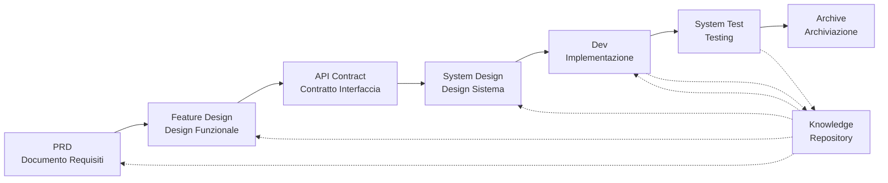

# SpecCrew - Framework di Ingegneria del Software Basato sull'IA

<p align="center">
  <a href="./README.md">简体中文</a> |
  <a href="./README.zh-TW.md">繁體中文</a> |
  <a href="./README.en.md">English</a> |
  <a href="./README.ko.md">한국어</a> |
  <a href="./README.de.md">Deutsch</a> |
  <a href="./README.es.md">Español</a> |
  <a href="./README.fr.md">Français</a> |
  <a href="./README.it.md">Italiano</a> |
  <a href="./README.da.md">Dansk</a> |
  <a href="./README.ja.md">日本語</a> |
  <a href="./README.pl.md">Polski</a> |
  <a href="./README.ru.md">Русский</a> |
  <a href="./README.bs.md">Bosanski</a> |
  <a href="./README.ar.md">العربية</a> |
  <a href="./README.no.md">Norsk</a> |
  <a href="./README.pt-BR.md">Português (Brasil)</a> |
  <a href="./README.th.md">ไทย</a> |
  <a href="./README.tr.md">Türkçe</a> |
  <a href="./README.uk.md">Українська</a> |
  <a href="./README.bn.md">বাংলা</a> |
  <a href="./README.el.md">Ελληνικά</a> |
  <a href="./README.vi.md">Tiếng Việt</a>
</p>

<p align="center">
  <a href="https://www.npmjs.com/package/speccrew"></a>
  <a href="https://www.npmjs.com/package/speccrew"></a>
  <a href="https://github.com/charlesmu99/speccrew/blob/main/LICENSE"></a>
</p>

> Un team di sviluppo IA virtuale che consente una rapida implementazione ingegneristica per qualsiasi progetto software

## Cos'è SpecCrew?

SpecCrew è un framework di team di sviluppo IA virtuale integrato. Trasforma i workflow di ingegneria software professionale (PRD → Feature Design → System Design → Dev → Test) in workflow Agent riutilizzabili, aiutando i team di sviluppo a raggiungere lo Specification-Driven Development (SDD), particolarmente adatto per progetti esistenti.

Integrando Agent e Skill nei progetti esistenti, i team possono rapidamente inizializzare i sistemi di documentazione del progetto e i team software virtuali, implementando nuove funzionalità e modifiche seguendo i workflow di ingegneria standard.

---

## ✨ Caratteristiche Principali

### 🏭 Team Software Virtuale
Generazione con un clic di **7 ruoli di Agent professionali** + **30+ workflow di Skill**, costruendo un team software virtuale completo:
- **Team Leader** - Pianificazione globale e gestione iterazioni
- **Product Manager** - Analisi requisiti e generazione PRD
- **Feature Designer** - Design funzionalità + contratti API
- **System Designer** - Design sistemi Frontend/Backend/Mobile/Desktop
- **System Developer** - Sviluppo parallelo multi-piattaforma
- **Test Manager** - Coordinamento test in tre fasi
- **Task Worker** - Esecuzione parallela sotto-attività

### 📐 Modellazione ISA-95 a Sei Fasi
Basato sulla metodologia di modellazione **ISA-95** standard internazionale, standardizzando la trasformazione dei requisiti di business in sistemi software:
```
Domain Descriptions → Functions in Domains → Functions of Interest
     ↓                       ↓                      ↓
Information Flows → Categories of Information → Information Descriptions
```
- Ogni fase corrisponde a diagrammi UML specifici (casi d'uso, sequenza, classi)
- I requisiti di business sono "raffinati passo dopo passo", senza perdita di informazioni
- Gli output sono direttamente utilizzabili per lo sviluppo

### 📚 Sistema di Knowledge Base
Architettura di knowledge base a tre livelli che assicura che l'IA lavori sempre basata sulla "singola fonte di verità":

| Livello | Directory | Contenuto | Scopo |
|---------|-----------|-----------|-------|
| L1 Conoscenza Sistema | `knowledge/techs/` | Stack tecnologico, architettura, convenzioni | IA comprende confini tecnici del progetto |
| L2 Conoscenza Business | `knowledge/bizs/` | Funzionalità moduli, flussi business, entità | IA comprende logica business |
| L3 Artefatti Iterazione | `iterations/iXXX/` | PRD, documenti design, report test | Catena completa di tracciabilità per requisiti attuali |

### 🔄 Pipeline di Conoscenze a Quattro Fasi
**Architettura di generazione automatizzata delle conoscenze**, generazione automatica di documentazione business/tecnica dal codice sorgente:
```
Fase 1: Scansione codice sorgente → Genera lista moduli
Fase 2: Analisi parallela → Estrai funzionalità (multi-Worker parallelo)
Fase 3: Riepilogo parallelo → Completa panoramica moduli (multi-Worker parallelo)
Fase 4: Aggregazione sistema → Genera panorama sistema
```
- Supporta **sincronizzazione completa** e **sincronizzazione incrementale** (basato su Git diff)
- Una persona ottimizza, il team condivide

### 🔧 Harness Framework di Implementazione Pratica
**Framework di esecuzione standardizzato**, garantisce che i documenti di design si trasformino con precisione in istruzioni di sviluppo eseguibili:
- **Principio del manuale di operazione**: Skill come SOP, passaggi chiari, continui e autocontenuti
- **Contratto di input/output**: Definizione chiara delle interfacce, esecuzione rigorosa come pseudocodice
- **Architettura di divulgazione progressiva**: Caricamento delle informazioni a livelli, evitare sovraccarico di contesto
- **Delega di Sub-Agent**: Divisione automatica di attività complesse, esecuzione parallela per garantire qualità

---

## 8 Problemi Principali Risolti

### 1. L'IA Ignora la Documentazione del Progetto Esistente (Lacuna di Conoscenza)
**Problema**: I metodi SDD o Vibe Coding esistenti si affidano all'IA per riassumere i progetti in tempo reale, mancando facilmente il contesto critico e causando risultati di sviluppo che si discostano dalle aspettative.

**Soluzione**: Il repository `knowledge/` funge da "fonte unica di verità" del progetto, accumulando design architetturale, moduli funzionali e processi aziendali per garantire che i requisiti rimangano in pista dalla fonte.

### 2. Documentazione Tecnica Diretta da PRD (Omissione di Contenuto)
**Problema**: Passare direttamente dal PRD al design dettagliato manca facilmente i dettagli dei requisiti, causando funzionalità implementate che si discostano dai requisiti.

**Soluzione**: Introdurre la fase di **Documento Feature Design**, concentrandosi solo sullo scheletro dei requisiti senza dettagli tecnici:
- Quali pagine e componenti sono inclusi?
- Flussi di operazioni delle pagine
- Logica di elaborazione backend
- Struttura di archiviazione dati

Lo sviluppo deve solo "riempire la carne" basandosi sullo stack tecnologico specifico, garantendo che le funzionalità crescano "vicino all'osso (requisiti)".

### 3. Portata di Ricerca Agent Incerta (Incertezza)
**Problema**: Nei progetti complessi, la ricerca ampia di codice e documenti da parte dell'IA produce risultati incerti, rendendo la coerenza difficile da garantire.

**Soluzione**: Strutture di directory documenti chiare e template, progettate in base alle esigenze di ogni Agent, implementando **divulgazione progressiva e caricamento su richiesta** per garantire determinismo.

### 4. Fasi e Attività Mancanti (Rottura del Processo)
**Problema**: La mancanza di copertura completa del processo di ingegneria manca facilmente le fasi critiche, rendendo la qualità difficile da garantire.

**Soluzione**: Coprire l'intero ciclo di vita dell'ingegneria software:
```
PRD (Requisiti) → Feature Design (Design Funzionale) → API Contract (Contratto)
    → System Design (Design Sistema) → Dev (Sviluppo) → Test (Testing)
```
- L'output di ogni fase è l'input della fase successiva
- Ogni passaggio richiede conferma umana prima di procedere
- Tutte le esecuzioni Agent hanno liste todo con auto-controllo dopo il completamento

### 5. Bassa Efficienza di Collaborazione del Team (Silos di Conoscenza)
**Problema**: L'esperienza di programmazione IA è difficile da condividere tra i team, portando a errori ripetuti.

**Soluzione**: Tutti gli Agent, Skill e documenti correlati sono versionati con il codice sorgente:
- L'ottimizzazione di una persona è condivisa dal team
- La conoscenza si accumula nella base di codice
- Migliorata l'efficienza di collaborazione del team

### 7. Contesto Singolo Agent Troppo Lungo (Collo di Bottiglia di Performance)
**Problema**: Attività complesse di grandi dimensioni superano le finestre di contesto del singolo Agent, causando deviazioni di comprensione e diminuzione della qualità dell'output.

**Soluzione**: **Meccanismo di Auto-Dispatch Sotto-Agent**:
- Le attività complesse vengono identificate automaticamente e divise in sotto-attività
- Ogni sotto-attività è eseguita da un sotto-Agent indipendente con contesto isolato
- L'Agent genitore coordina e aggrega per garantire la coerenza globale
- Evita l'espansione del contesto del singolo Agent, garantendo la qualità dell'output

### 8. Caos di Iterazione dei Requisiti (Difficoltà di Gestione)
**Problema**: Requisiti multipli mescolati nello stesso branch si influenzano a vicenda, rendendo il tracciamento e il rollback difficili.

**Soluzione**: **Ogni Requisito come Progetto Indipendente**:
- Ogni requisito crea una directory di iterazione indipendente `iterations/iXXX-[nome-requisito]/`
- Isolamento completo: documenti, design, codice e test gestiti indipendentemente
- Iterazione rapida: consegna a piccola granularità, verifica rapida, distribuzione rapida
- Archiviazione flessibile: dopo il completamento, archiviazione in `archive/` con chiara tracciabilità storica

### 6. Ritardo nell'Aggiornamento dei Documenti (Decadimento della Conoscenza)
**Problema**: I documenti diventano obsoleti man mano che i progetti evolvono, facendo lavorare l'IA con informazioni errate.

**Soluzione**: Gli Agent hanno capacità di aggiornamento automatico dei documenti, sincronizzando le modifiche del progetto in tempo reale per mantenere la base di conoscenza accurata.

---

## Workflow Principale



### Descrizioni delle Fasi

| Fase | Agent | Input | Output | Conferma Umana |
|------|-------|-------|--------|----------------|
| PRD | PM | Requisiti Utente | Documento Requisiti Prodotto | ✅ Richiesta |
| Feature Design | Feature Designer | PRD | Documento Feature Design + Contratto API | ✅ Richiesta |
| System Design | System Designer | Feature Spec | Documenti Design Frontend/Backend | ✅ Richiesta |
| Dev | Dev | Design | Codice + Registrazioni Attività | ✅ Richiesta |
| System Test | Test Manager | Output Dev + Feature Spec | Casi di Test + Codice Test + Rapporto Test + Rapporto Bug | ✅ Richiesta |

---

## Confronto con Soluzioni Esistenti

| Dimensione | Vibe Coding | Ralph Loop | **SpecCrew** |
|------------|-------------|------------|-------------|
| Dipendenza Documenti | Ignora doc esistenti | Si affida a AGENTS.md | **Base di Conoscenza Strutturata** |
| Trasferimento Requisiti | Codifica diretta | PRD → Codice | **PRD → Feature Design → System Design → Codice** |
| Coinvolgimento Umano | Minimale | All'avvio | **In ogni fase** |
| Completezza Processo | Debole | Media | **Workflow ingegneristico completo** |
| Collaborazione Team | Difficile da condividere | Efficienza personale | **Condivisione conoscenza team** |
| Gestione Contesto | Istanza singola | Ciclo istanza singola | **Auto-dispatch sotto-Agent** |
| Gestione Iterazione | Mista | Lista attività | **Requisito come progetto, iterazione indipendente** |
| Determinismo | Basso | Medio | **Alto (divulgazione progressiva)** |

---

## Avvio Rapido

### Prerequisiti

- Node.js >= 16.0.0
- IDE supportati: Qoder (predefinito), Cursor, Claude Code

> **Nota**: Gli adattatori per Cursor e Claude Code non sono stati testati in ambienti IDE reali (implementati a livello di codice e verificati attraverso test E2E, ma non ancora testati in Cursor/Claude Code reali).

### 1. Installare SpecCrew

```bash
npm install -g speccrew
```

### 2. Inizializzare il Progetto

Navigare nella directory radice del progetto ed eseguire il comando di inizializzazione:

```bash
cd /path/to/your-project

# Usa Qoder per impostazione predefinita
speccrew init

# O specificare l'IDE
speccrew init --ide qoder
speccrew init --ide cursor
speccrew init --ide claude
```

Dopo l'inizializzazione, saranno generati nel progetto:
- `.qoder/agents/` / `.cursor/agents/` / `.claude/agents/` — 7 definizioni di ruoli Agent
- `.qoder/skills/` / `.cursor/skills/` / `.claude/skills/` — 30+ workflow Skill
- `speccrew-workspace/` — Workspace (directory iterazione, base di conoscenza, template documenti)
- `.speccrewrc` — File di configurazione SpecCrew

Per aggiornare Agent e Skill per un IDE specifico successivamente:

```bash
speccrew update --ide cursor
speccrew update --ide claude
```

### 3. Avviare il Workflow di Sviluppo

Seguire il workflow di ingegneria standard passo dopo passo:

1. **PRD**: L'Agent Product Manager analizza i requisiti e genera il documento requisiti prodotto
2. **Feature Design**: L'Agent Feature Designer genera il documento feature design + contratto API
3. **System Design**: L'Agent System Designer genera documenti system design per piattaforma (frontend/backend/mobile/desktop)
4. **Dev**: L'Agent System Developer implementa lo sviluppo per piattaforma in parallelo
5. **System Test**: L'Agent Test Manager coordina il testing in tre fasi (design casi → generazione codice → rapporto esecuzione)
6. **Archive**: Archiviare l'iterazione

> I deliverable di ogni fase richiedono conferma umana prima di procedere alla fase successiva.

### 4. Aggiornare SpecCrew

Quando SpecCrew rilascia una nuova versione, sono necessari due passaggi per completare l'aggiornamento:

```bash
# Step 1: 更新全局 CLI 工具到最新版本
npm install -g speccrew@latest

# Step 2: 同步项目中的 Agents 和 Skills 到最新版本
cd /path/to/your-project
speccrew update
```

> **Nota**: `npm install -g speccrew@latest` aggiorna lo strumento CLI stesso, mentre `speccrew update` aggiorna i file di definizione degli Agent e degli Skill nel progetto. Entrambi i passaggi devono essere eseguiti per completare l'aggiornamento completo.

### 5. Altri Comandi CLI

```bash
speccrew list       # Elenca agent e skill installati
speccrew doctor     # Diagnostica ambiente e stato installazione
speccrew update     # Aggiorna agent e skill all'ultima versione
speccrew uninstall  # Disinstalla SpecCrew (--all rimuove anche il workspace)
```

📖 **Guida Dettagliata**: Dopo l'installazione, consulta la [Guida Introduttiva](docs/GETTING-STARTED.it.md) per il workflow completo e la guida conversazione Agent.

---

## Struttura Directory

```
your-project/
├── .qoder/                          # Directory configurazione IDE (esempio Qoder)
│   ├── agents/                      # 7 Agent di ruoli
│   │   ├── speccrew-team-leader.md       # Team Leader: Pianificazione globale e gestione iterazione
│   │   ├── speccrew-product-manager.md   # Product Manager: Analisi requisiti e PRD
│   │   ├── speccrew-feature-designer.md  # Feature Designer: Feature Design + Contratto API
│   │   ├── speccrew-system-designer.md   # System Designer: System design per piattaforma
│   │   ├── speccrew-system-developer.md  # System Developer: Sviluppo parallelo per piattaforma
│   │   ├── speccrew-test-manager.md      # Test Manager: Coordinamento testing in tre fasi
│   │   └── speccrew-task-worker.md       # Task Worker: Esecuzione parallela sotto-attività
│   └── skills/                      # 30+ Skill (raggruppate per funzione)
│       ├── speccrew-pm-*/                # Gestione Prodotto (analisi requisiti, valutazione)
│       ├── speccrew-fd-*/                # Feature Design (Feature Design, Contratto API)
│       ├── speccrew-sd-*/                # System Design (frontend/backend/mobile/desktop)
│       ├── speccrew-dev-*/               # Sviluppo (frontend/backend/mobile/desktop)
│       ├── speccrew-test-*/              # Testing (design casi/generazione codice/rapporto esecuzione)
│       ├── speccrew-knowledge-bizs-*/    # Conoscenza Business (analisi API/analisi UI/classificazione moduli ecc.)
│       ├── speccrew-knowledge-techs-*/   # Conoscenza Tecnica (generazione stack tech/convenzioni/indice ecc.)
│       ├── speccrew-knowledge-graph-*/   # Grafo Conoscenza (lettura/scrittura/query)
│       └── speccrew-*/                   # Utilità (diagnostica/timestamp/workflow ecc.)
│
└── speccrew-workspace/              # Workspace (generato durante inizializzazione)
    ├── docs/                        # Documenti di gestione
    │   ├── configs/                 # File di configurazione (mappatura piattaforma, mappatura stack tech ecc.)
    │   ├── rules/                   # Configurazioni regole
    │   └── solutions/               # Documenti soluzioni
    │
    ├── iterations/                  # Progetti iterazione (generati dinamicamente)
    │   └── {numero}-{tipo}-{nome}/
    │       ├── 00.docs/             # Requisiti originali
    │       ├── 01.product-requirement/ # Requisiti prodotto
    │       ├── 02.feature-design/   # Feature design
    │       ├── 03.system-design/    # System design
    │       ├── 04.development/      # Fase sviluppo
    │       ├── 05.system-test/      # Test sistema
    │       └── 06.delivery/         # Fase consegna
    │
    ├── iteration-archives/          # Archivi iterazione
    │
    └── knowledges/                  # Base di conoscenza
        ├── base/                    # Base/metadati
        │   ├── diagnosis-reports/   # Rapporti diagnostica
        │   ├── sync-state/          # Stato sincronizzazione
        │   └── tech-debts/          # Debito tecnico
        ├── bizs/                    # Conoscenza business
        │   └── {platform-type}/{module-name}/
        └── techs/                   # Conoscenza tecnica
            └── {platform-id}/
```

---

## Principi di Design Principali

1. **Specification-Driven**: Scrivere prima le specifiche, poi lasciare che il codice "cresca" da esse
2. **Divulgazione Progressiva**: Gli Agent iniziano da punti di ingresso minimi, caricando informazioni su richiesta
3. **Conferma Umana**: L'output di ogni fase richiede conferma umana per prevenire deviazioni dell'IA
4. **Isolamento Contesto**: Attività grandi sono divise in sotto-attività piccole e isolate per contesto
5. **Collaborazione Sotto-Agent**: Attività complesse inviano automaticamente sotto-Agent per evitare l'espansione del contesto del singolo Agent
6. **Iterazione Rapida**: Ogni requisito come progetto indipendente per consegna e verifica rapide
7. **Condivisione Conoscenza**: Tutte le configurazioni sono versionate con il codice sorgente

---

## Casi d'Uso

### ✅ Raccomandato Per
- Progetti da medi a grandi che richiedono workflow standardizzati
- Sviluppo software in collaborazione di team
- Trasformazione ingegneristica di progetti legacy
- Prodotti che richiedono manutenzione a lungo termine

### ❌ Non Adatto Per
- Validazione rapida di prototipi personali
- Progetti esplorativi con requisiti molto incerti
- Script o strumenti monouso

---

## Ulteriori Informazioni

- **Mappa Conoscenza Agent**: [speccrew-workspace/docs/agent-knowledge-map.md](./speccrew-workspace/docs/agent-knowledge-map.md)
- **npm**: https://www.npmjs.com/package/speccrew
- **GitHub**: https://github.com/charlesmu99/speccrew
- **Gitee**: https://gitee.com/amutek/speccrew
- **Qoder IDE**: https://qoder.com/

---

> **SpecCrew non mira a sostituire gli sviluppatori, ma ad automatizzare le parti noiose così che i team possano concentrarsi su lavori più preziosi.**
