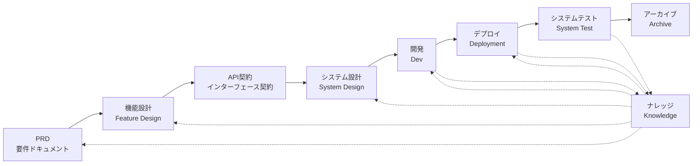

# SpecCrew - AI駆動ソフトウェアエンジニアリングフレームワーク

<p align="center">
  <a href="./README.md">简体中文</a> |
  <a href="./README.en.md">English</a> |
  <a href="./README.ja.md">日本語</a> |
  <a href="./README.ru.md">Русский</a> |
  <a href="./README.es.md">Español</a> |
  <a href="./README.de.md">Deutsch</a> |
  <a href="./README.fr.md">Français</a> |
  <a href="./README.pt-BR.md">Português (Brasil)</a> |
  <a href="./README.ar.md">العربية</a> |
  <a href="./README.hi.md">हिन्दी</a>
</p>

<p align="center">
  <a href="https://www.npmjs.com/package/speccrew"></a>
  <a href="https://www.npmjs.com/package/speccrew"></a>
  <a href="https://github.com/charlesmu99/speccrew/blob/main/LICENSE"></a>
</p>

> あらゆるソフトウェアプロジェクトに迅速なエンジニアリング実装を実現する仮想AI開発チーム

## SpecCrewとは？

SpecCrewは組み込み型の仮想AI開発チームフレームワークです。専門的なソフトウェアエンジニアリングワークフロー（PRD → 機能設計 → システム設計 → 開発 → デプロイ → テスト）を再利用可能なエージェントワークフローに変換し、開発チームが仕様駆動開発（SDD）を実現するのを支援します。特に既存プロジェクトに適しています。

エージェントとスキルを既存プロジェクトに統合することで、プロジェクトドキュメント体系と仮想ソフトウェアチームを迅速に初期化し、標準的なエンジニアリングワークフローに従って新機能の追加や変更を段階的に実装できます。

---

## ✨ 主な特徴

### 🏭 仮想ソフトウェアチーム
**7つの専門エージェントロール** + **30+のスキルワークフロー**をワンクリックで生成し、完全な仮想ソフトウェアチームを構築：
- **Team Leader** - 全局スケジューリングとイテレーション管理
- **Product Manager** - 要件分析とPRD出力
- **Feature Designer** - 機能設計 + API契約
- **System Designer** - フロントエンド/バックエンド/モバイル/デスクトップシステム設計
- **System Developer** - マルチプラットフォーム並列開発
- **Test Manager** - 3段階テスト調整
- **Task Worker** - サブタスク並列実行

### 📐 ISA-95 六段階モデリング
国際標準 **ISA-95** モデリング方法論に基づき、ビジネス要件からソフトウェアシステムへの標準化された変換：
```
Domain Descriptions → Functions in Domains → Functions of Interest
     ↓                       ↓                      ↓
Information Flows → Categories of Information → Information Descriptions
```
- 各段階は明確なUML図（ユースケース図、シーケンス図、クラス図など）に対応
- ビジネス要件は「段階的に詳細化」され、情報損失なし
- 出力物は開発に直接使用可能

### 📚 ナレッジベースシステム
AIが常に「単一の信頼できる情報源」に基づいて作業することを保証する3層ナレッジベースアーキテクチャ：

| レイヤー | ディレクトリ | コンテンツ | 目的 |
|----------|-------------|-----------|------|
| L1 システム知識 | `knowledge/techs/` | 技術スタック、アーキテクチャ、規約 | AIがプロジェクトの技術的境界を理解 |
| L2 ビジネス知識 | `knowledge/bizs/` | モジュール機能、ビジネスフロー、エンティティ | AIがビジネスロジックを理解 |
| L3 イテレーション成果物 | `iterations/iXXX/` | PRD、設計ドキュメント、テストレポート | 現在の要件の完全なトレーサビリティチェーン |

### 🔄 四段階ナレッジパイプライン
ソースコードからビジネステクニカルドキュメントを自動生成する**自動ナレッジ生成アーキテクチャ**：
```
Stage 1: ソースコードスキャン → モジュールリスト生成
Stage 2: 並列分析 → 機能抽出（マルチWorker並列）
Stage 3: 並列要約 → モジュール概要完成（マルチWorker並列）
Stage 4: システム集約 → システムパノラマ生成
```
- **フル同期**と**増分同期**（Git diffベース）をサポート
- 一人が最適化、チームが共有

### 🔧 Harness 実践的実装フレームワーク
**標準化された実行フレームワーク**、設計ドキュメントを正確に実行可能な開発指示に変換：
- **操作マニュアル原則**：SkillはSOP、明確で連続的かつ自己完結的なステップ
- **入出力契約**：明確なインターフェース定義、擬似コードのように厳密な実行
- **段階的開示アーキテクチャ**：情報を階層的に読み込み、コンテキスト過多を回避
- **サブエージェント委譲**：複雑なタスクを自動分割、並列実行で品質を確保

---

## 解決する8つのコア問題

### 1. AIが既存プロジェクトドキュメントを無視する（知識の断絶）
**問題**: 既存のSDDやVibe Codingメソッドは、AIがリアルタイムでプロジェクトを要約することに依存しており、重要なコンテキストを見落としやすく、開発結果が期待から逸れる原因となります。

**解決**: `knowledge/`リポジトリがプロジェクトの「唯一の信頼できる情報源」として機能し、アーキテクチャ設計、機能モジュール、ビジネスプロセスを蓄積し、要件が源から逸れないことを保証します。

### 2. 要件ドキュメントから技術ドキュメントへの直接変換（内容の欠落）
**問題**: PRDから詳細設計へ直接進むと、要件の詳細を見落としやすく、実装された機能が要件から逸れる原因となります。

**解決**: **機能設計ドキュメント**フェーズを導入し、技術的詳細を考慮せず、要件の骨組みにのみ焦点を当てます：
- どのページとコンポーネントが含まれるか？
- ページ操作フロー
- バックエンド処理ロジック
- データ保存構造

開発段階では、特定のテックスタックに基づいて「肉を埋める」だけでよく、機能が「骨（要件）に近く」成長することを保証します。

### 3. エージェントの検索範囲が不確定（不確実性）
**問題**: 複雑なプロジェクトでは、AIの広範なコードとドキュメント検索が不確実な結果をもたらし、一貫性の保証が困難です。

**解決**: 各エージェントのニーズに基づいて設計された明確なドキュメントディレクトリ構造とテンプレートにより、**段階的な開示とオンデマンドロード**を実装し、決定論を保証します。

### 4. フェーズとタスクの欠落（プロセスの断絶）
**問題**: 完全なエンジニアリングプロセスカバレッジの欠如により、重要なステップを見落としやすく、品質の保証が困難です。

**解決**: ソフトウェアエンジニアリングライフサイクル全体をカバー：
```
PRD（要件）→ 機能設計 → API契約（コントラクト）
    → システム設計 → 開発 → デプロイ → テスト
```
- 各フェーズの出力は次のフェーズの入力
- 各ステップは進行前に人間の確認が必要
- すべてのエージェント実行にはtodoリストがあり、完了後に自己チェック

### 5. チームコラボレーション効率の低さ（知識のサイロ）
**問題**: AIプログラミング経験はチーム間で共有しにくく、繰り返しのミスにつながります。

**解決**: すべてのエージェント、スキル、関連ドキュメントがソースコードと共にバージョン管理：
- 一人の最適化をチームが共有
- 知識がコードベースに蓄積
- チームコラボレーション効率の向上

### 7. 単一エージェントのコンテキスト過多（パフォーマンスのボトルネック）
**問題**: 大規模で複雑なタスクは単一エージェントのコンテキストウィンドウを超え、理解のズレや出力品質の低下を引き起こします。

**解決**: **サブエージェント自動ディスパッチメカニズム**：
- 複雑なタスクが自動的に識別され、サブタスクに分割
- 各サブタスクは分離されたコンテキストを持つ独立したサブエージェントによって実行
- 親エージェントが調整・集約し、全体的な一貫性を保証
- 単一エージェントのコンテキスト拡張を回避し、出力品質を保証

### 8. 要件反復の混乱（管理の困難さ）
**問題**: 複数の要件が同じブランチに混在し、互いに影響し合い、追跡とロールバックが困難です。

**解決**: **各要件を独立したプロジェクトとして**：
- 各要件が独立した反復ディレクトリ`iterations/iXXX-[要件名]/`を作成
- 完全な分離：ドキュメント、設計、コード、テストが独立して管理
- 迅速な反復：小粒度の納品、迅速な検証、迅速なデプロイ
- 柔軟なアーカイブ：完了後、`archive/`にアーカイブし、明確な履歴追跡

### 6. ドキュメント更新の遅れ（知識の劣化）
**問題**: プロジェクトが進化するにつれてドキュメントが古くなり、AIが誤った情報で作業します。

**解決**: エージェントは自動ドキュメント更新機能を持ち、プロジェクトの変更をリアルタイムで同期し、ナレッジベースの正確性を維持します。

---

## コアワークフロー



### 各フェーズの説明

| フェーズ | エージェント | 入力 | 出力 | 人間の確認 |
|----------|-------------|------|------|------------|
| PRD | PM | ユーザー要件 | 製品要件ドキュメント | ✅ 必須 |
| 機能設計 | 機能デザイナー | PRD | 機能設計ドキュメント + API契約 | ✅ 必須 |
| システム設計 | システムデザイナー | 機能仕様 | フロントエンド/バックエンド設計ドキュメント | ✅ 必須 |
| 開発 | 開発者 | 設計 | コード + タスク記録 | ✅ 必須 |
| デプロイ | システムデプロイヤー | 開発成果物 | デプロイレポート + 実行中のアプリケーション | ✅ 必須 |
| システムテスト | テストマネージャー | デプロイ成果物 + 機能仕様 | テストケース + テストコード + テストレポート + バグレポート | ✅ 必須 |

---

## 既存ソリューションとの比較

| 次元 | Vibe Coding | Ralphループ | **SpecCrew** |
|------|-------------|-------------|-------------|
| ドキュメント依存 | 既存ドキュメントを無視 | AGENTS.mdに依存 | **構造化ナレッジベース** |
| 要件転送 | 直接コーディング | PRD → コード | **PRD → 機能設計 → システム設計 → コード** |
| 人間の介入 | 最小 | 起動時 | **各フェーズで** |
| プロセス完全性 | 弱い | 中程度 | **完全なエンジニアリングワークフロー** |
| チームコラボレーション | 共有困難 | 個人効率 | **チーム知識共有** |
| コンテキスト管理 | 単一インスタンス | 単一インスタンスループ | **サブエージェント自動ディスパッチ** |
| 反復管理 | 混在 | タスクリスト | **要件をプロジェクトとして、独立した反復** |
| 決定性 | なし | 中程度 | **高い（段階的開示）** |

---

## クイックスタート

### 前提条件

- Node.js >= 16.0.0
- サポートされるIDE：Qoder（デフォルト）、Cursor、Claude Code

> **注意**: CursorとClaude Code用のアダプタは実際のIDE環境でテストされていません（コードレベルで実装されE2Eテストで検証済みですが、実際のCursor/Claude Codeではまだテストされていません）。

### 1. SpecCrewのインストール

```bash
npm install -g speccrew
```

### 2. プロジェクトの初期化

プロジェクトのルートディレクトリに移動し、初期化コマンドを実行：

```bash
cd /path/to/your-project

# デフォルトでQoderを使用
speccrew init

# またはIDEを指定
speccrew init --ide qoder
speccrew init --ide cursor
speccrew init --ide claude
```

初期化後、プロジェクトに以下が生成されます：
- `.qoder/agents/` / `.cursor/agents/` / `.claude/agents/` — 7つのエージェント役割定義
- `.qoder/skills/` / `.cursor/skills/` / `.claude/skills/` — 30+のスキルワークフロー
- `speccrew-workspace/` — ワークスペース（反復ディレクトリ、ナレッジベース、ドキュメントテンプレート）
- `.speccrewrc` — SpecCrew設定ファイル

後で特定のIDEのエージェントとスキルを更新するには：

```bash
speccrew update --ide cursor
speccrew update --ide claude
```

### 3. 開発ワークフローの開始

標準的なエンジニアリングワークフローに従って段階的に進行：

1. **PRD**: プロダクトマネージャーエージェントが要件を分析し、製品要件ドキュメントを生成
2. **機能設計**: 機能デザイナーエージェントが機能設計ドキュメント + API契約を生成
3. **システム設計**: システムデザイナーエージェントがプラットフォーム別にシステム設計ドキュメントを生成（フロントエンド/バックエンド/モバイル/デスクトップ）
4. **開発**: システム開発者エージェントがプラットフォーム別に並行開発を実装
5. **デプロイ**: システムデプロイヤーエージェントがビルド、データベースマイグレーション、サービス起動、スモークテストを実行
6. **システムテスト**: テストマネージャーエージェントが3フェーズのテストを調整（ケース設計 → コード生成 → 実行レポート）
7. **アーカイブ**: 反復をアーカイブ

> 各フェーズの成果物は次のフェーズに進む前に人間の確認が必要です。

### 4. SpecCrewの更新

SpecCrewが新バージョンをリリースした場合、更新を完了するには2つのステップが必要です：

```bash
# Step 1: 更新全局 CLI 工具到最新版本
npm install -g speccrew@latest

# Step 2: 同步项目中的 Agents 和 Skills 到最新版本
cd /path/to/your-project
speccrew update
```

> **注意**: `npm install -g speccrew@latest` はCLIツール自体を更新し、`speccrew update` はプロジェクト内のAgentとSkill定義ファイルを更新します。完全な更新を完了するには、両方のステップを実行する必要があります。

### 5. その他のCLIコマンド

```bash
speccrew list       # インストール済みのエージェントとスキルを一覧表示
speccrew doctor     # 環境とインストール状態を診断
speccrew update     # エージェントとスキルを最新版に更新
speccrew uninstall  # SpecCrewをアンインストール（--allでワークスペースも削除）
```

📖 **詳細ガイド**: インストール後、[スタートガイド](docs/GETTING-STARTED.ja.md)で完全なワークフローとエージェント会話ガイドを確認してください。

---

## ディレクトリ構造

```
your-project/
├── .qoder/                          # IDE設定ディレクトリ（Qoder例）
│   ├── agents/                      # 7つのロールエージェント
│   │   ├── speccrew-team-leader.md       # チームリーダー：全体スケジューリングと反復管理
│   │   ├── speccrew-product-manager.md   # プロダクトマネージャー：要件分析とPRD
│   │   ├── speccrew-feature-designer.md  # 機能デザイナー：機能設計 + API契約
│   │   ├── speccrew-system-designer.md   # システムデザイナー：プラットフォーム別システム設計生成
│   │   ├── speccrew-system-developer.md  # システム開発者：プラットフォーム別並行開発
│   │   ├── speccrew-test-manager.md      # テストマネージャー：3フェーズテスト調整
│   │   └── speccrew-task-worker.md       # タスクワーカー：並行サブタスク実行
│   └── skills/                      # 30+のスキル（機能別グループ化）
│       ├── speccrew-pm-*/                # プロダクト管理（要件分析、評価）
│       ├── speccrew-fd-*/                # 機能設計（機能設計、API契約）
│       ├── speccrew-sd-*/                # システム設計（フロントエンド/バックエンド/モバイル/デスクトップ）
│       ├── speccrew-dev-*/               # 開発（フロントエンド/バックエンド/モバイル/デスクトップ）
│       ├── speccrew-test-*/              # テスト（ケース設計/コード生成/実行レポート）
│       ├── speccrew-knowledge-bizs-*/    # ビジネス知識（API分析/UI分析/モジュール分類等）
│       ├── speccrew-knowledge-techs-*/   # 技術知識（テックスタック生成/規約/インデックス等）
│       ├── speccrew-knowledge-graph-*/   # ナレッジグラフ（読み取り/書き込み/クエリ）
│       └── speccrew-*/                   # ユーティリティ（診断/タイムスタンプ/ワークフロー等）
│
└── speccrew-workspace/              # ワークスペース（初期化時に生成）
    ├── docs/                        # 管理ドキュメント
    │   ├── configs/                 # 設定ファイル（プラットフォームマッピング、テックスタックマッピング等）
    │   ├── rules/                   # ルール設定
    │   └── solutions/               # ソリューションドキュメント
    │
    ├── iterations/                  # 反復プロジェクト（動的生成）
    │   └── {番号}-{タイプ}-{名前}/
    │       ├── 00.docs/             # 元の要件
    │       ├── 01.product-requirement/ # 製品要件
    │       ├── 02.feature-design/   # 機能設計
    │       ├── 03.system-design/    # システム設計
    │       ├── 04.development/      # 開発フェーズ
    │       ├── 05.deployment/       # デプロイフェーズ
    │       ├── 06.system-test/      # システムテスト
    │       └── 07.delivery/         # 納品フェーズ
    │
    ├── iteration-archives/          # 反復アーカイブ
    │
    └── knowledges/                  # ナレッジベース
        ├── base/                    # ベース/メタデータ
        │   ├── diagnosis-reports/   # 診断レポート
        │   ├── sync-state/          # 同期状態
        │   └── tech-debts/          # 技術的負債
        ├── bizs/                    # ビジネス知識
        │   └── {platform-type}/{module-name}/
        └── techs/                   # 技術知識
            └── {platform-id}/
```

---

## コア設計原則

1. **仕様駆動**: 仕様を先に書き、そこからコードを「成長」させる
2. **段階的開示**: エージェントは最小のエントリーポイントから開始し、オンデマンドで情報をロード
3. **人間の確認**: 各フェーズの出力は人間の確認を必要とし、AIの逸脱を防ぐ
4. **コンテキスト分離**: 大きなタスクを小さく、コンテキスト分離されたサブタスクに分割
5. **サブエージェントコラボレーション**: 複雑なタスクは自動的にサブエージェントをディスパッチし、単一エージェントのコンテキスト拡張を回避
6. **迅速な反復**: 各要件を独立したプロジェクトとして迅速な納品と検証
7. **知識共有**: すべての設定をソースコードと共にバージョン管理

---

## 適用シナリオ

### ✅ 推奨
- 標準化されたワークフローが必要な中規模から大規模プロジェクト
- チームコラボレーションのソフトウェア開発
- レガシープロジェクトのエンジニアリング変換
- 長期メンテナンスが必要な製品

### ❌ 不向き
- 個人的な迅速なプロトタイプ検証
- 要件が極めて不確実な探索的プロジェクト
- 一回限りのスクリプトやツール

---

## 詳細情報

- **エージェント知識マップ**: [speccrew-workspace/docs/agent-knowledge-map.md](./speccrew-workspace/docs/agent-knowledge-map.md)
- **npm**: https://www.npmjs.com/package/speccrew
- **GitHub**: https://github.com/charlesmu99/speccrew
- **Gitee**: https://gitee.com/amutek/speccrew
- **Qoder IDE**: https://qoder.com/

---

> **SpecCrewは開発者を置き換えるものではなく、退屈な部分を自動化し、チームがより価値のある作業に集中できるようにします。**
