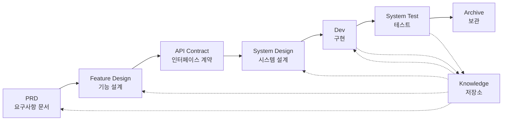

# SpecCrew - AI 기반 소프트웨어 엔지니어링 프레임워크

<p align="center">
  <a href="./README.md">简体中文</a> |
  <a href="./README.zh-TW.md">繁體中文</a> |
  <a href="./README.en.md">English</a> |
  <a href="./README.ko.md">한국어</a> |
  <a href="./README.de.md">Deutsch</a> |
  <a href="./README.es.md">Español</a> |
  <a href="./README.fr.md">Français</a> |
  <a href="./README.it.md">Italiano</a> |
  <a href="./README.da.md">Dansk</a> |
  <a href="./README.ja.md">日本語</a> |
  <a href="./README.pl.md">Polski</a> |
  <a href="./README.ru.md">Русский</a> |
  <a href="./README.bs.md">Bosanski</a> |
  <a href="./README.ar.md">العربية</a> |
  <a href="./README.no.md">Norsk</a> |
  <a href="./README.pt-BR.md">Português (Brasil)</a> |
  <a href="./README.th.md">ไทย</a> |
  <a href="./README.tr.md">Türkçe</a> |
  <a href="./README.uk.md">Українська</a> |
  <a href="./README.bn.md">বাংলা</a> |
  <a href="./README.el.md">Ελληνικά</a> |
  <a href="./README.vi.md">Tiếng Việt</a>
</p>

<p align="center">
  <a href="https://www.npmjs.com/package/speccrew"></a>
  <a href="https://www.npmjs.com/package/speccrew"></a>
  <a href="https://github.com/charlesmu99/speccrew/blob/main/LICENSE"></a>
</p>

> 모든 소프트웨어 프로젝트에 빠른 엔지니어링 구현을 가능하게 하는 가상 AI 개발 팀

## SpecCrew란 무엇인가요?

SpecCrew는 임베디드 가상 AI 개발 팀 프레임워크입니다. 전문 소프트웨어 엔지니어링 워크플로우(PRD → Feature Design → System Design → Dev → Test)를 재사용 가능한 Agent 워크플로우로 변환하여, 개발 팀이 명세 기반 개발(SDD)을 달성할 수 있도록 도와주며, 특히 기존 프로젝트에 적합합니다.

Agent와 Skill을 기존 프로젝트에 통합함으로써 프로젝트 문서 시스템과 가상 소프트웨어 팀을 빠르게 초기화하고, 표준 엔지니어링 프로세스에 따라 기능 추가 및 수정을 단계별로 구현할 수 있습니다.

---

## ✨ 주요 특징

### 🏭 가상 소프트웨어 팀
**7개 전문 Agent 역할** + **30+개 Skill 워크플로우**를 원클릭으로 생성하여 완전한 가상 소프트웨어 팀 구축:
- **Team Leader** - 전역 스케줄링 및 이터레이션 관리
- **Product Manager** - 요구사항 분석 및 PRD 출력
- **Feature Designer** - 기능 설계 + API 계약
- **System Designer** - 프론트엔드/백엔드/모바일/데스크톱 시스템 설계
- **System Developer** - 멀티플랫폼 병렬 개발
- **Test Manager** - 3단계 테스트 조정
- **Task Worker** - 하위 작업 병렬 실행

### 📐 ISA-95 6단계 모델링
국제 표준 **ISA-95** 모델링 방법론을 기반으로 비즈니스 요구사항에서 소프트웨어 시스템으로의 표준화된 전환:
```
Domain Descriptions → Functions in Domains → Functions of Interest
     ↓                       ↓                      ↓
Information Flows → Categories of Information → Information Descriptions
```
- 각 단계는 명확한 UML 다이어그램(유스 케이스, 시퀀스, 클래스 다이어그램 등)에 대응
- 비즈니스 요구사항 "단계별 정제", 정보 손실 없음
- 출력물은 개발에 직접 사용 가능

### 📚 지식 베이스 시스템
AI가 항상 "단일 진실 공급원"을 기반으로 작업하도록 보장하는 3계층 지식 베이스 아키텍처:

| 계층 | 디렉토리 | 내용 | 목적 |
|------|----------|------|------|
| L1 시스템 지식 | `knowledge/techs/` | 기술 스택, 아키텍처, 규약 | AI가 프로젝트 기술 경계 이해 |
| L2 비즈니스 지식 | `knowledge/bizs/` | 모듈 기능, 비즈니스 흐름, 엔티티 | AI가 비즈니스 로직 이해 |
| L3 이터레이션 산출물 | `iterations/iXXX/` | PRD, 설계 문서, 테스트 보고서 | 현재 요구사항 완전 추적성 체인 |

### 🔄 4단계 지식 파이프라인
소스 코드에서 비즈니스/기술 문서를 자동 생성하는 **자동화된 지식 생성 아키텍처**:
```
Stage 1: 소스 코드 스캔 → 모듈 목록 생성
Stage 2: 병렬 분석 → 기능 추출 (다중 Worker 병렬)
Stage 3: 병렬 요약 → 모듈 개요 완성 (다중 Worker 병렬)
Stage 4: 시스템 집계 → 시스템 파노라마 생성
```
- **전체 동기화** 및 **증분 동기화** 지원 (Git diff 기반)
- 한 사람이 최적화하면 팀이 공유

### 🔧 Harness 실전 적용 프레임워크
**표준화된 실행 프레임워크**, 설계 문서가 실행 가능한 개발 지시사항으로 정확하게 변환되도록 보장:
- **운영 매뉴얼 원칙**: Skill은 SOP, 단계가 명확하고 연속적이며 자체 포함
- **입출력 계약**: 인터페이스를 명확히 정의, 의사코드처럼 엄격하게 실행
- **단계별 공개 아키텍처**: 정보를 계층적으로 로드, 일회성 컨텍스트 과부하 방지
- **하위 Agent 위임**: 복잡한 작업 자동 분할, 병렬 실행으로 품질 보장

---

## 8가지 핵심 문제 해결

### 1. AI가 기존 프로젝트 문서를 무시함 (지식 단절)
**문제**: 기존 SDD 또는 Vibe Coding 방식은 AI가 실시간으로 프로젝트를 요약하는 데 의존하여, 중요한 컨텍스트를 쉽게 놓치고 개발 결과가 기대에서 벗어날 수 있습니다.

**해결**: `knowledge/` 저장소가 프로젝트의 "단일 진실 공급원" 역할을 하여, 아키텍처 설계, 기능 모듈, 비즈니스 프로세스를 축적하고 요구사항이 원천에서 벗어나지 않도록 보장합니다.

### 2. PRD에서 기술 문서로 직접 변환 (내용 누락)
**문제**: PRD에서 상세 설계로 바로 건너뛰면 요구사항 세부 사항을 쉽게 놓치게 되어, 구현된 기능이 요구사항에서 벗어날 수 있습니다.

**해결**: **Feature Design 문서** 단계를 도입하여 기술적 세부사항 없이 요구사항 골격에만 집중:
- 어떤 페이지와 컴포넌트가 포함되는가?
- 페이지 운영 흐름
- 백엔드 처리 로직
- 데이터 저장 구조

개발 단계에서는 특정 기술 스택을 기반으로 "내용을 채우기만" 하면 되어, 기능이 "뼈대(요구사항)에 밀착"하여 성장하도록 보장합니다.

### 3. 불확실한 Agent 검색 범위 (불확실성)
**문제**: 복잡한 프로젝트에서 AI의 광범위한 코드 및 문서 검색은 불확실한 결과를 초래하여 일관성을 보장하기 어렵습니다.

**해결**: 각 Agent의 필요에 따라 설계된 명확한 문서 디렉토리 구조와 템플릿으로, **점진적 공개와 주문형 로딩**을 구현하여 결정론을 보장합니다.

### 4. 단계 누락 및 작업 누락 (프로세스 붕괴)
**문제**: 완전한 엔지니어링 프로세스 커버리지가 부족하여 중요한 단계를 쉽게 놓치고 품질을 보장하기 어렵습니다.

**해결**: 전체 소프트웨어 엔지니어링 수명주기를 커버:
```
PRD (요구사항) → Feature Design (기능 설계) → API Contract (계약)
    → System Design (시스템 설계) → Dev (개발) → Test (테스트)
```
- 각 단계의 산출물은 다음 단계의 입력
- 각 단계는 진행 전 사용자 확인 필요
- 모든 Agent 실행에 todo 목록이 있으며 완료 후 자체 점검

### 5. 낮은 팀 협업 효율성 (지식 사일로)
**문제**: AI 프로그래밍 경험을 팀 간에 공유하기 어려워 반복된 실수가 발생합니다.

**해결**: 모든 Agent, Skill 및 관련 문서가 소스 코드와 함께 버전 관리됨:
- 한 사람의 최적화를 팀이 공유
- 지식이 코드베이스에 축적
- 팀 협업 효율성 향상

### 7. 단일 Agent 컨텍스트 과다 (성능 병목)
**문제**: 대규모 복잡한 작업은 단일 Agent 컨텍스트 윈도우를 초과하여 이해 편차와 출력 품질 저하를 초래합니다.

**해결**: **하위 Agent 자동 디스패치 메커니즘**:
- 복잡한 작업이 자동으로 식별되어 하위 작업으로 분할
- 각 하위 작업은 격리된 컨텍스트로 독립적인 하위 Agent가 실행
- 상위 Agent가 조정 및 집계하여 전체 일관성 보장
- 단일 Agent 컨텍스트 확장을 방지하여 출력 품질 보장

### 8. 요구사항 반복 혼란 (관리 어려움)
**문제**: 여러 요구사항이 동일한 브랜치에 섞여 서로 영향을 미치며 추적 및 롤백이 어렵습니다.

**해결**: **각 요구사항을 독립적인 프로젝트로**:
- 각 요구사항이 독립적인 반복 디렉토리 생성 `iterations/iXXX-[요구사항-이름]/`
- 완전한 격리: 문서, 설계, 코드, 테스트가 독립적으로 관리
- 빠른 반복: 작은 단위 전달, 빠른 검증, 빠른 배포
- 유연한 보관: 완료 후 `archive/`에 보관하며 명확한 이력 추적 가능

### 6. 문서 업데이트 지연 (지식 부패)
**문제**: 프로젝트가 발전함에 따라 문서가 구식이 되어 AI가 잘못된 정보로 작업합니다.

**해결**: Agent가 자동 문서 업데이트 기능을 갖추어 프로젝트 변경 사항을 실시간으로 동기화하고 지식 기반의 정확성을 유지합니다.

---

## 핵심 워크플로우



### 각 단계 설명

| 단계 | Agent | 입력 | 출력 | 사용자 확인 |
|------|-------|------|------|-------------|
| PRD | PM | 사용자 요구사항 | 제품 요구사항 문서 | ✅ 필수 |
| Feature Design | Feature Designer | PRD | 기능 설계 문서 + API 계약 | ✅ 필수 |
| System Design | System Designer | Feature Spec | 프론트엔드/백엔드 설계 문서 | ✅ 필수 |
| Dev | Dev | Design | 코드 + 작업 기록 | ✅ 필수 |
| System Test | Test Manager | Dev 산출물 + Feature Spec | 테스트 케이스 + 테스트 코드 + 테스트 보고서 + 버그 보고서 | ✅ 필수 |

---

## 기존 솔루션과의 비교

| 차원 | Vibe Coding | Ralph Loop | **SpecCrew** |
|------|-------------|------------|-------------|
| 문서 의존성 | 기존 문서 무시 | AGENTS.md 의존 | **구조화된 지식 기반** |
| 요구사항 전달 | 직접 코딩 | PRD → 코드 | **PRD → Feature Design → System Design → 코드** |
| 사용자 개입 | 최소화 | 시작 시 | **모든 단계에서** |
| 프로세스 완전성 | 약함 | 중간 | **완전한 엔지니어링 워크플로우** |
| 팀 협업 | 공유 어려움 | 개인 효율성 | **팀 지식 공유** |
| 컨텍스트 관리 | 단일 인스턴스 | 단일 인스턴스 루프 | **하위 Agent 자동 디스패치** |
| 반복 관리 | 혼합 | 작업 목록 | **요구사항을 프로젝트로, 독립적인 반복** |
| 결정론 | 낮음 | 중간 | **높음 (점진적 공개)** |

---

## 빠른 시작

### 전제 조건

- Node.js >= 16.0.0
- 지원되는 IDE: Qoder (기본값), Cursor, Claude Code

> **참고**: Cursor와 Claude Code용 어댑터는 실제 IDE 환경에서 테스트되지 않았습니다 (코드 수준에서 구현되어 E2E 테스트를 통과했지만 실제 Cursor/Claude Code에서는 아직 테스트되지 않음).

### 1. SpecCrew 설치

```bash
npm install -g speccrew
```

### 2. 프로젝트 초기화

프로젝트 루트 디렉토리로 이동하여 초기화 명령을 실행:

```bash
cd /path/to/your-project

# 기본적으로 Qoder 사용
speccrew init

# 또는 IDE 지정
speccrew init --ide qoder
speccrew init --ide cursor
speccrew init --ide claude
```

초기화 후 프로젝트에 다음이 생성됩니다:
- `.qoder/agents/` / `.cursor/agents/` / `.claude/agents/` — 7개 Agent 역할 정의
- `.qoder/skills/` / `.cursor/skills/` / `.claude/skills/` — 30+개 Skill 워크플로우
- `speccrew-workspace/` — 작업 공간 (반복 디렉토리, 지식 기반, 문서 템플릿)
- `.speccrewrc` — SpecCrew 구성 파일

나중에 특정 IDE의 Agent와 Skill을 업데이트하려면:

```bash
speccrew update --ide cursor
speccrew update --ide claude
```

### 3. 개발 워크플로우 시작

표준 엔지니어링 워크플로우에 따라 단계별로 진행:

1. **PRD**: 제품 관리자 Agent가 요구사항을 분석하고 제품 요구사항 문서 생성
2. **Feature Design**: 기능 설계자 Agent가 기능 설계 문서 + API 계약 생성
3. **System Design**: 시스템 설계자 Agent가 플랫폼별(프론트엔드/백엔드/모바일/데스크톱) 시스템 설계 문서 생성
4. **Dev**: 시스템 개발자 Agent가 플랫폼별 병렬 개발 구현
5. **System Test**: 테스트 관리자 Agent가 3단계 테스트 조정 (케이스 설계 → 코드 생성 → 실행 보고서)
6. **Archive**: 반복 보관

> 각 단계의 산출물은 다음 단계로 진행하기 전 사용자 확인이 필요합니다.

### 4. SpecCrew 업데이트

새로운 버전의 SpecCrew가 출시되면 다음 두 단계를 완료하여 업데이트하세요:

```bash
# Step 1: Update the global CLI tool to the latest version
npm install -g speccrew@latest

# Step 2: Sync Agents and Skills in your project to the latest version
cd /path/to/your-project
speccrew update
```

> **참고**: `npm install -g speccrew@latest`는 CLI 도구 자체를 업데이트하고, `speccrew update`는 프로젝트의 Agent와 Skill 정의 파일을 업데이트합니다. 완전한 업데이트를 위해서는 두 단계 모두 필요합니다.

### 5. 기타 CLI 명령

```bash
speccrew list       # 설치된 agent와 skill 나열
speccrew doctor     # 환경 및 설치 상태 진단
speccrew update     # agent와 skill을 최신 버전으로 업데이트
speccrew uninstall  # SpecCrew 제거 (--all은 작업 공간도 삭제)
```

📖 **상세 가이드**: 설치 후 [시작 가이드](docs/GETTING-STARTED.ko.md)에서 전체 워크플로우와 Agent 대화 가이드를 확인하세요.

---

## 디렉토리 구조

```
your-project/
├── .qoder/                          # IDE 구성 디렉토리 (Qoder 예시)
│   ├── agents/                      # 7개 역할 Agent
│   │   ├── speccrew-team-leader.md       # 팀 리더: 전역 스케줄링 및 반복 관리
│   │   ├── speccrew-product-manager.md   # 제품 관리자: 요구사항 분석 및 PRD
│   │   ├── speccrew-feature-designer.md  # 기능 설계자: Feature Design + API 계약
│   │   ├── speccrew-system-designer.md   # 시스템 설계자: 플랫폼별 시스템 설계 생성
│   │   ├── speccrew-system-developer.md  # 시스템 개발자: 플랫폼별 병렬 개발
│   │   ├── speccrew-test-manager.md      # 테스트 관리자: 3단계 테스트 조정
│   │   └── speccrew-task-worker.md       # 작업자: 병렬 하위 작업 실행
│   └── skills/                      # 30+개 Skill (기능별 그룹화)
│       ├── speccrew-pm-*/                # 제품 관리 (요구사항 분석, 평가)
│       ├── speccrew-fd-*/                # 기능 설계 (Feature Design, API 계약)
│       ├── speccrew-sd-*/                # 시스템 설계 (프론트엔드/백엔드/모바일/데스크톱)
│       ├── speccrew-dev-*/               # 개발 (프론트엔드/백엔드/모바일/데스크톱)
│       ├── speccrew-test-*/              # 테스트 (케이스 설계/코드 생성/실행 보고서)
│       ├── speccrew-knowledge-bizs-*/    # 비즈니스 지식 (API 분석/UI 분석/모듈 분류 등)
│       ├── speccrew-knowledge-techs-*/   # 기술 지식 (기술 스택 생성/규약/인덱스 등)
│       ├── speccrew-knowledge-graph-*/   # 지식 그래프 (읽기/쓰기/쿼리)
│       └── speccrew-*/                   # 유틸리티 (진단/타임스탬프/워크플로우 등)
│
└── speccrew-workspace/              # 작업 공간 (초기화 시 생성)
    ├── docs/                        # 관리 문서
    │   ├── configs/                 # 구성 파일 (플랫폼 매핑, 기술 스택 매핑 등)
    │   ├── rules/                   # 규칙 구성
    │   └── solutions/               # 솔루션 문서
    │
    ├── iterations/                  # 반복 프로젝트 (동적 생성)
    │   └── {번호}-{유형}-{이름}/
    │       ├── 00.docs/             # 원본 요구사항
    │       ├── 01.product-requirement/ # 제품 요구사항
    │       ├── 02.feature-design/   # 기능 설계
    │       ├── 03.system-design/    # 시스템 설계
    │       ├── 04.development/      # 개발 단계
    │       ├── 05.system-test/      # 시스템 테스트
    │       └── 06.delivery/         # 전달 단계
    │
    ├── iteration-archives/          # 반복 보관
    │
    └── knowledges/                  # 지식 기반
        ├── base/                    # 기본/메타데이터
        │   ├── diagnosis-reports/   # 진단 보고서
        │   ├── sync-state/          # 동기화 상태
        │   └── tech-debts/          # 기술 부채
        ├── bizs/                    # 비즈니스 지식
        │   └── {platform-type}/{module-name}/
        └── techs/                   # 기술 지식
            └── {platform-id}/
```

---

## 핵심 설계 원칙

1. **명세 기반**: 명세를 먼저 작성하고 코드가 그로부터 "성장"
2. **점진적 공개**: Agent가 최소 진입점에서 시작하여 주문형으로 정보 로딩
3. **사용자 확인**: 각 단계의 출력은 AI 이탈을 방지하기 위해 사용자 확인 필요
4. **컨텍스트 격리**: 큰 작업을 작고 컨텍스트 격리된 하위 작업으로 분할
5. **하위 Agent 협업**: 복잡한 작업이 자동으로 하위 Agent를 디스패치하여 단일 Agent 컨텍스트 확장 방지
6. **빠른 반복**: 각 요구사항을 독립적인 프로젝트로 빠른 전달 및 검증
7. **지식 공유**: 모든 구성이 소스 코드와 함께 버전 관리됨

---

## 사용 사례

### ✅ 권장 대상
- 표준화된 워크플로우가 필요한 중대형 프로젝트
- 팀 협업 소프트웨어 개발
- 레거시 프로젝트 엔지니어링 변환
- 장기 유지보수가 필요한 제품

### ❌ 적합하지 않은 대상
- 개인용 빠른 프로토타입 검증
- 요구사항이 매우 불확실한 탐색적 프로젝트
- 일회성 스크립트나 도구

---

## 추가 정보

- **Agent 지식 맵**: [speccrew-workspace/docs/agent-knowledge-map.md](./speccrew-workspace/docs/agent-knowledge-map.md)
- **npm**: https://www.npmjs.com/package/speccrew
- **GitHub**: https://github.com/charlesmu99/speccrew
- **Gitee**: https://gitee.com/amutek/speccrew
- **Qoder IDE**: https://qoder.com/

---

> **SpecCrew는 개발자를 대체하는 것이 아니라 지루한 부분을 자동화하여 팀이 더 가치 있는 작업에 집중할 수 있도록 합니다.**
