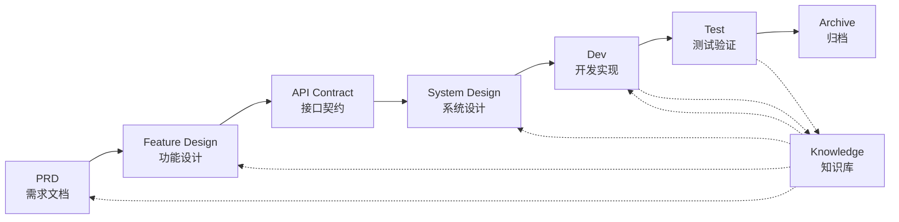

# SpecCrew - AI 驱动的软件工程化框架

<p align="center">
  <a href="./README.md">中文</a> |
  <a href="./README.en.md">English</a> |
  <a href="./README.ar.md">العربية</a> |
  <a href="./README.es.md">Español</a>
</p>

> 让任何软件项目快速实现工程化落地的虚拟 AI 开发团队

## 什么是 SpecCrew？

SpecCrew 是一套嵌入式的虚拟 AI 开发团队框架。它将专业的软件工程流程（PRD → Feature Design → System Design → Dev → Test）转化为可复用的 Agent 工作流，帮助开发团队实现规范驱动开发（SDD），特别适合已有项目。

通过将 Agent 和 Skill 集成到现有项目，即可快速初始化项目文档体系和虚拟软件团队，按照标准工程流程分步实现功能的新增和修改。

---

## 解决 8 个核心问题

### 1. AI 忽略现有项目文档（知识断层）
**问题**：现有 SDD 或 Vibe Coding 方法依赖 AI 实时总结项目，容易遗漏关键上下文，导致开发结果偏离预期。

**解决**：`knowledge/` 知识库作为项目的"事实来源"，沉淀架构设计、功能模块、业务流程等核心信息，确保需求源头不偏差。

### 2. 需求文档直接转技术文档（内容遗漏）
**问题**：从 PRD 直接跳到详细设计，容易遗漏需求细节，开发出的功能与需求脱节。

**解决**：增加 **Feature Design 文档**环节，不考虑技术细节，只聚焦需求骨架：
- 包含哪些页面和组件？
- 页面操作流程
- 后端处理逻辑
- 数据存储结构

开发阶段只需基于特定技术栈"填肉"，确保功能"贴着骨头（需求）"生长。

### 3. Agent 搜索范围不确定（不确定性）
**问题**：复杂项目中，AI 大范围搜索代码和文档，结果不确定，难以保证一致性。

**解决**：明确的文档目录结构和模板，基于每个 Agent 所需内容设计，实现 **逐级披露、按需加载**，确保确定性。

### 4. 环节缺失、任务遗漏（流程断裂）
**问题**：缺乏完整的工程流程覆盖，容易遗漏关键步骤，质量难以保证。

**解决**：覆盖软件工程全环节：
```
PRD（需求）→ Feature Design（功能设计）→ API Contract（契约）
    → System Design（系统设计）→ Dev（开发）→ Test（测试）
```
- 每个环节产出物是下一环节的输入
- 每步需人工确认后方可执行
- 所有 Agent 执行都有 todo 清单，完成后自检

### 5. 团队协作效率低（知识孤岛）
**问题**：AI 编程经验难以在团队间共享，重复踩坑。

**解决**：所有 Agents、Skills 和相关文档与源码一起进入 Git 版本管控：
- 一人优化，团队共享
- 知识沉淀在代码库中
- 提升团队协同效率

### 7. 单 Agent 上下文过长（性能瓶颈）
**问题**：大型复杂任务超出单 Agent 上下文窗口，导致理解偏差、输出质量下降。

**解决**：**子 Agent 自动调派机制**：
- 复杂任务自动识别并拆分为子任务
- 每个子任务由独立子 Agent 执行，上下文隔离
- 父 Agent 协调汇总，确保整体一致性
- 避免单 Agent 上下文膨胀，保障输出质量

### 8. 需求迭代混乱（管理困难）
**问题**：多个需求混杂在同一分支，相互影响，难以追踪和回滚。

**解决**：**每个需求作为独立项目**：
- 每个需求创建独立迭代目录 `iterations/iXXX-[需求名]/`
- 完整隔离：文档、设计、代码、测试独立管理
- 快速迭代：小粒度交付，快速验证，快速上线
- 灵活归档：完成后归档至 `archive/`，历史清晰可追溯

### 6. 文档更新滞后（知识腐化）
**问题**：项目演进后文档过时，AI 基于错误信息工作。

**解决**：Agent 具有自动更新文档的能力，及时同步项目变化，保持知识库实时准确。

---

## 核心工作流程



### 各阶段说明

| 阶段 | Agent | 输入 | 输出 | 人工确认 |
|------|-------|------|------|----------|
| PRD | PM | 用户需求 | 产品需求文档 | ✅ 必需 |
| Feature Design | Feature Designer | PRD | 功能设计文档 + 接口契约 | ✅ 必需 |
| System Design | System Designer | Feature Spec | 前端/后端设计文档 | ✅ 必需 |
| Dev | Dev | Design | 代码 + 任务记录 | ✅ 必需 |
| Test | Test | Dev 产出 + PRD 验收标准 | 测试报告 | ✅ 必需 |

---

## 与现有方案对比

| 维度 | Vibe Coding | Ralph 循环 | **SpecCrew** |
|------|-------------|------------|-------------|
| 文档依赖 | 忽略现有文档 | 依赖 AGENTS.md | **结构化知识库** |
| 需求传递 | 直接编码 | PRD → 代码 | **PRD → Feature Design → System Design → 代码** |
| 人工介入 | ❌ | 启动时 | **每阶段确认** |
| 流程完整性 | ❌ | 中等 | **完整工程流程** |
| 团队协作 | 难共享 | 个人效率 | **团队知识共享** |
| 上下文管理 | 单实例 | 单实例循环 | **子 Agent 自动调派** |
| 迭代管理 | 混杂 | 任务列表 | **需求即项目，独立迭代** |
| 确定性 | ❌ | 中等 | **高（逐级披露）** |

---

## 快速开始

### 1. 安装 SpecCrew

**方式一：一键安装脚本（推荐，仅适用于 Qoder IDE）**

```bash
# macOS / Linux / WSL - 从 GitHub 安装
curl -fsSL https://raw.githubusercontent.com/charlesmu99/SpecCrew/main/scripts/install-qoder.sh | bash

# macOS / Linux / WSL - 从 Gitee 安装（中国镜像）
curl -fsSL https://gitee.com/amutek/speccrew/raw/main/scripts/install-qoder.sh | bash
```

```powershell
# Windows - 从 GitHub 安装
Invoke-Expression (Invoke-WebRequest -Uri "https://raw.githubusercontent.com/charlesmu99/SpecCrew/main/scripts/install-qoder.ps1").Content

# Windows - 从 Gitee 安装（中国镜像）
Invoke-Expression (Invoke-WebRequest -Uri "https://gitee.com/amutek/speccrew/raw/main/scripts/install-qoder.ps1").Content
```

> **注意**：一键安装脚本目前仅支持 Qoder IDE。对于其他 IDE（如 VS Code、Cursor 等），请使用下方手动复制方式。

**方式二：手动复制（适用于所有 IDE）**

```bash
# 克隆仓库后复制到现有项目
git clone https://github.com/charlesmu99/SpecCrew.git
# 或：git clone https://gitee.com/amutek/SpecCrew.git

# 复制到目标项目（根据你的 IDE 配置目录调整）
cp -r SpecCrew/.speccrew /path/to/your-project/
cp -r SpecCrew/SpecCrew-workspace /path/to/your-project/

# 对于 Qoder IDE，还需复制到 .qoder/ 目录
cp -r SpecCrew/.speccrew/agents/* /path/to/your-project/.qoder/agents/
cp -r SpecCrew/.speccrew/skills/* /path/to/your-project/.qoder/skills/
```

### 2. 初始化项目

```bash
# 运行初始化 Skill，自动生成知识库和项目结构
# 由 speccrew-project-init Skill 自动执行
```

### 3. 开始开发流程

```bash
# 1. 创建 PRD
# 2. 生成 Solution
# 3. 确认 API Contract
# 4. 详细设计
# 5. 开发实现
# 6. 测试验证
```

### 4. 卸载 SpecCrew

**方式一：一键卸载脚本（推荐，仅适用于 Qoder IDE）**

```bash
# macOS / Linux / WSL - 从 GitHub 卸载
curl -fsSL https://raw.githubusercontent.com/charlesmu99/SpecCrew/main/scripts/uninstall-qoder.sh | bash

# macOS / Linux / WSL - 从 Gitee 卸载（中国镜像）
curl -fsSL https://gitee.com/amutek/speccrew/raw/main/scripts/uninstall-qoder.sh | bash
```

```powershell
# Windows - 从 GitHub 卸载
Invoke-Expression (Invoke-WebRequest -Uri "https://raw.githubusercontent.com/charlesmu99/SpecCrew/main/scripts/uninstall-qoder.ps1").Content

# Windows - 从 Gitee 卸载（中国镜像）
Invoke-Expression (Invoke-WebRequest -Uri "https://gitee.com/amutek/speccrew/raw/main/scripts/uninstall-qoder.ps1").Content
```

> **注意**：一键卸载脚本目前仅支持 Qoder IDE。

**方式二：手动卸载（适用于所有 IDE）**

```bash
# 删除 speccrew-workspace 目录
rm -rf speccrew-workspace/

# 删除 .speccrew/ 中的 SpecCrew 前缀文件（保留自定义内容）
rm -rf .speccrew/agents/SpecCrew-*.md
rm -rf .speccrew/skills/SpecCrew-*/

# 对于 Qoder IDE，还需清理 .qoder/ 目录
rm -rf .qoder/agents/SpecCrew-*.md
rm -rf .qoder/skills/SpecCrew-*/
```

> **注意**：卸载会保留你在 `.speccrew/` 目录中的源文件和自定义内容。如需完全删除 IDE 配置，请手动删除对应的 IDE 配置目录（如 `.qoder/`）。

---

## 目录结构

```
your-project/
├── .speccrew/                       # SpecCrew 源文件（可版本控制）
├── .qoder/                          # Qoder IDE 配置（运行时）
│   ├── agents/                      # 6 个角色 Agent
│   │   ├── speccrew-pm.md
│   │   ├── speccrew-planner.md
│   │   ├── speccrew-system-designer.md
│   │   ├── speccrew-dev-[framework].md
│   │   └── speccrew-test-[framework].md
│   └── skills/                      # 16 个 Skill
│       ├── speccrew-pm-requirement-analysis/
│       ├── speccrew-fd-feature-design/
│       ├── speccrew-fd-api-contract/
│       ├── speccrew-sd-frontend/
│       ├── speccrew-sd-backend/
│       ├── speccrew-sd-mobile/
│       ├── speccrew-sd-desktop/
│       ├── speccrew-dev-task/
│       ├── speccrew-test-report/
│       ├── speccrew-knowledge-dispatch/
│       ├── speccrew-knowledge-bizs-init/
│       ├── speccrew-knowledge-bizs-sync/
│       ├── speccrew-workflow-diagnose/
│       ├── speccrew-create-se-infrastructure/
│       ├── speccrew-skill-develop/
│       └── speccrew-agent-optimize/
│
└── speccrew-workspace/              # 工作区（初始化时生成）
    ├── docs/                        # 管理性文档
    │   ├── rules/                   # 规则配置
    │   └── solutions/               # 解决方案文档
    │       └── agent-knowledge-map.md
    │
    ├── iterations/                  # 迭代项目（动态生成）
    │   └── {序号}-{类型}-{名称}/     # 如 001-feature-order
    │       ├── 00.docs/             # 原始需求文档
    │       ├── 01.product-requirement/ # 产品需求文档
    │       ├── 02.feature-design/   # 特性设计
    │       ├── 03.system-design/    # 系统设计
    │       ├── 04.dev/              # 开发阶段
    │       ├── 05.test/             # 测试阶段
    │       └── 06.delivery/         # 交付阶段
    │
    ├── iteration-archives/          # 迭代归档
    │   └── {序号}-{类型}-{名称}-{日期}/
    │
    └── knowledges/                  # 知识库
        ├── base/                    # 基础/元数据
        │   ├── diagnosis-reports/   # 诊断报告
        │   ├── sync-state/          # 同步状态
        │   └── tech-debts/          # 技术债
        │
        ├── bizs/                    # 业务知识
        │   └── {platform-type}/
        │       └── {module-name}/
        │
        └── techs/                   # 技术知识
            └── {platform-id}/
```

---

## 核心设计原则

1. **规范驱动**：先写规范，再由规范"长出"代码
2. **逐级披露**：Agent 从最小入口开始，按需获取信息
3. **人工确认**：每阶段产出需人工确认，避免 AI 跑偏
4. **上下文隔离**：大任务拆分为小粒度、上下文隔离的子任务
5. **子 Agent 协作**：复杂任务自动调派子 Agent，避免单 Agent 上下文膨胀
6. **快速迭代**：每个需求作为独立项目，快速交付、快速验证
7. **知识共享**：所有配置与源码一起 Git 管控

---

## 适用场景

### ✅ 推荐使用
- 需要规范流程的中大型项目
- 团队协作的软件开发
- 遗留项目的工程化改造
- 需要长期维护的产品

### ❌ 不太适合
- 个人快速原型验证
- 探索性、需求极不确定的项目
- 一次性脚本或工具

---

---

## 更多信息

- **Agent 知识地图**: [speccrew-workspace/docs/agent-knowledge-map.md](./speccrew-workspace/docs/agent-knowledge-map.md)
- **GitHub**: https://github.com/charlesmu99/speccrew
- **Gitee**: https://gitee.com/amutek/speccrew
- **Qoder IDE**: https://qoder.com/

---

> **SpecCrew 不是取代开发者，而是自动化那些枯燥的部分，让团队能专注于更有价值的工作。**
